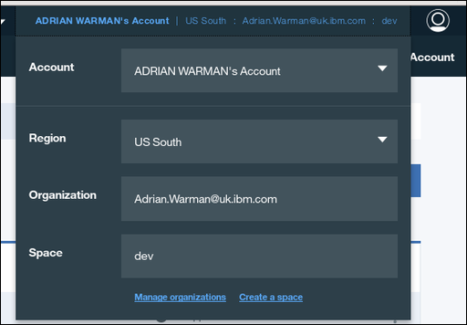
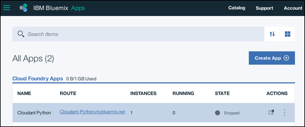
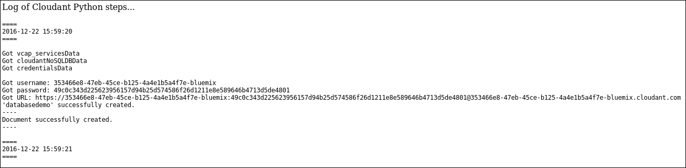
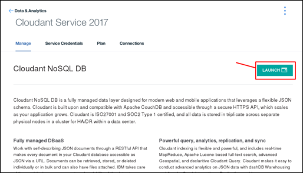
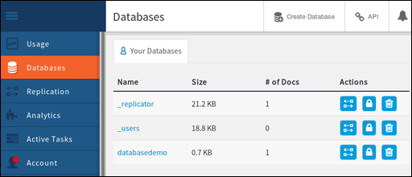
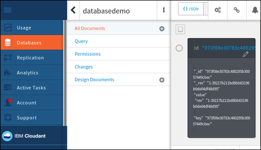
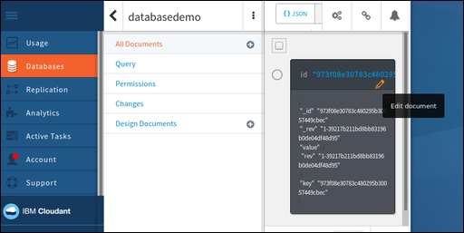
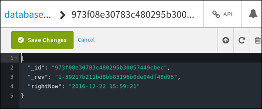

---

copyright:
  years: 2017
lastupdated: "2017-01-11"

---

{:new_window: target="_blank"}
{:shortdesc: .shortdesc}
{:screen: .screen}
{:codeblock: .codeblock}
{:pre: .pre}

<!-- Acrolinx: 2017-01-11 -->

# Creating a simple Bluemix application to access a Cloudant database: uploading the application

This section of the tutorial describes how to upload an
{{site.data.keyword.Bluemix}} application.
{:shortdesc}

<div id="uploading"></div>

## Connecting to Bluemix

The first task is to connect to {{site.data.keyword.Bluemix_notm}}.

The [{{site.data.keyword.Bluemix_notm}} toolkit](create_bmxapp_appenv.html#toolkits) helps you to make the connection.

Cloud Foundry needs to know the URL to use for making API calls,
for example when you upload an application.
The {{site.data.keyword.Bluemix_notm}} toolkit uses the '`cf api`' command to manage the API endpoint.
More information about the '`cf api`' command is
[available ](https://console.ng.bluemix.net/docs/cli/reference/cfcommands/index.html#cf_api){:new_window}.

Use the following command to tell Cloud Foundry the URL to use:

```sh
bluemix api https://api.ng.bluemix.net
```
{:pre}

Expect a result similar to the following output:

```
Invoking 'cf api https://api.ng.bluemix.net'...

Setting api endpoint to https://api.ng.bluemix.net...
OK

API endpoint:   https://api.ng.bluemix.net
API version:    2.54.0
Not logged in. Use 'bluemix login' to log in.
```
{:codeblock}

Cloud Foundry now knows where to send API calls for managing applications.

The next step is to log in to your {{site.data.keyword.Bluemix_notm}} application environment.
You must supply the following account details:

-   Your user name, which is specified as the '`-u`' parameter.
-   Your organization name, which is specified as the '`-o`' parameter.
-   Your space, which is specified as the '`-s`' parameter.

>   **Note**: The account details are available on your {{site.data.keyword.Bluemix_notm}} dashboard,
    when you log in through a web browser,
    as shown in the following example:<br/>
    

Use a command similar to the following example to log in to your
{{site.data.keyword.Bluemix_notm}} application environment.
Notice that you are asked to enter your account password.

```sh
bluemix login -u Adrian.Warman@uk.ibm.com -o Adrian.Warman@uk.ibm.com -s dev
```
{:pre}

Expect a result similar to the following output:

```
Invoking 'cf login -u Adrian.Warman@uk.ibm.com -o Adrian.Warman@uk.ibm.com -s dev'...

API endpoint: https://api.ng.bluemix.net

Password> 
Authenticating...
OK

Targeted org Adrian.Warman@uk.ibm.com

Targeted space dev
                
API endpoint:   https://api.ng.bluemix.net (API version: 2.54.0)
User:           adrian.warman@uk.ibm.com
Org:            Adrian.Warman@uk.ibm.com
Space:          dev
```
{:codeblock}

## Uploading the application

The Cloudant Foundry toolkit now knows how to connect to the {{site.data.keyword.Bluemix_notm}} environment.

The next step is to upload the application itself.
Details of a {{site.data.keyword.Bluemix_notm}} application
are provided in the [manifest file](create_bmxapp_appenv.html#manifest).

The manifest file for the tutorial application was updated
as described [here](create_bmxapp_createapp.html#essential-files)

Use a command similar to the following example to log in to upload your
{{site.data.keyword.Bluemix_notm}} application.

```sh
cf push "Cloudant Python"
```
{:pre}

A sequence of result messages is displayed.

```
Using manifest file /..../BMXDemo/manifest.yml

Updating app Cloudant Python in org Adrian.Warman@uk.ibm.com / space dev as Adrian.Warman@uk.ibm.com...
OK
```
{:codeblock}

The Cloud Foundry toolkit located the manifest file,
and is preparing to upload the application by using the connection
and identification details you provided [earlier](#uploading).

```
Using route Cloudant-Python.mybluemix.net
Uploading Cloudant Python...
Uploading app files from: /..../BMXDemo
Uploading 1.5K, 3 files
Done uploading               
OK
Binding service Cloudant Service 2017 to app Cloudant Python in org Adrian.Warman@uk.ibm.com / space dev as Adrian.Warman@uk.ibm.com...
OK
```
{:codeblock}

The application was uploaded successfully,
and a connection made with the {{site.data.keyword.cloudant_short_notm}} database instance.

```
Starting app Cloudant Python in org Adrian.Warman@uk.ibm.com / space dev as Adrian.Warman@uk.ibm.com...
-----> Downloaded app package (4.0K)
-----> Downloaded app buildpack cache (29M)
-------> Buildpack version 1.5.5
     $ pip install -r requirements.txt
DEPRECATION: --allow-all-external has been deprecated and will be removed in the future. Due to changes in the repository protocol, it no longer has any effect.
       Collecting cloudant==2.3.1 (from -r requirements.txt (line 1))
         Downloading cloudant-2.3.1-py2-none-any.whl (63kB)
       Collecting requests<3.0.0,>=2.7.0 (from cloudant==2.3.1->-r requirements.txt (line 1))
         Downloading requests-2.12.4-py2.py3-none-any.whl (576kB)
       Installing collected packages: requests, cloudant
       Successfully installed cloudant-2.3.1 requests-2.12.4
You are using pip version 8.1.1, however version 9.0.1 is available.
You should consider upgrading via the 'pip install --upgrade pip' command.
You are using pip version 8.1.1, however version 9.0.1 is available.
You should consider upgrading via the 'pip install --upgrade pip' command.
-----> Uploading droplet (30M)

0 of 1 instances running, 1 starting
1 of 1 instances running

App started


OK

App Cloudant Python was started using this command `python server.py`
```
{:codeblock}

The application starts automatically.
As part of the startup,
a check is made to ensure that all requirements are met,
by evaluating the contents of the [requirements.txt file](create_bmxapp_appenv.html#requirements).
The application requires access to the {{site.data.keyword.cloudant_short_notm}} library,
which was [specified](create_bmxapp_createapp.html#essential-files) when the application was created.

After you upload and start the application,
some simple system checks are run to confirm that the application is running correctly
as far as {{site.data.keyword.Bluemix_notm}} is concerned.

```
Showing health and status for app Cloudant Python in org Adrian.Warman@uk.ibm.com / space dev as Adrian.Warman@uk.ibm.com...
OK

requested state: started
instances: 1/1
usage: 128M x 1 instances
urls: Cloudant-Python.mybluemix.net
last uploaded: Thu Dec 22 15:58:18 UTC 2016
stack: cflinuxfs2
buildpack: python 1.5.5

     state     since                    cpu    memory          disk           details
#0   running   2016-12-22 03:59:21 PM   0.0%   49.9M of 128M   110.6M of 1G
```
{:codeblock}

## Testing the sample application

When the {{site.data.keyword.Bluemix_notm}} Application environment was first created,
the dashboard included a link in the `Route` column for the application:<br/>


Clicking the link opens a browser window,
requesting some data from the application that is listening at the corresponding port.
The application responds by returning the contents of
the log file that was generated as the application was starting:<br/>


The contents of this log file are interesting.
The start and end times are clearly displayed.
In between,
the log records each of the details as the connection information
for the {{site.data.keyword.cloudant_short_notm}} was retrieved.
The actual values of the connection are not important.
The log shows that the tutorial application was able to locate,
retrieve,
and use those values to create a new document in the 
{{site.data.keyword.cloudant_short_notm}} database.

### Confirming the database details

Start by opening the {{site.data.keyword.cloudant_short_notm}} Dashboard.
Click the `Launch` icon on the `Manage` tab of the 
{{site.data.keyword.cloudant_short_notm}} service page:<br/>


> **Note**: To find your {{site.data.keyword.cloudant_short_notm}} service page,
  refer to the details in the
  ['Creating a {{site.data.keyword.cloudant_short_notm}} instance' tutorial](create_service.html#locating-your-service-credentials).

When the dashboard opens,
you can see that the application
created the '`databasedemo`' database:<br/>


The database contains a single document,
created by the application.
To verify the presence of the document,
click the database name within the dashboard.
A list of options for the database appears.
When you select the `All documents` tab,
details for a single document appear:<br/>


To see the contents of the document,
click the `Edit` icon,
which appears as an image of a pencil:<br/>


When the contents of the document appear,
you can see each of the fields that were created by the tutorial application.<br/>
<br/>
In particular,
the `rightNow` field has the date and time the document was created.
This value corresponds to the time that was recorded within the
[application log file](#testing-the-sample-application).

## The next step

The next step in the tutorial is to [operate and maintain the application](create_bmxapp_maintain.html),
for example when you start,
stop,
and debug the application.