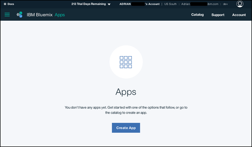
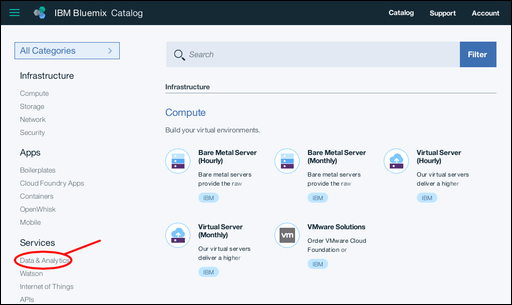
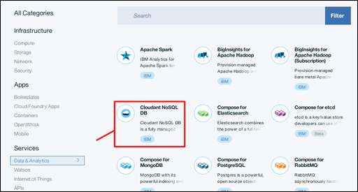
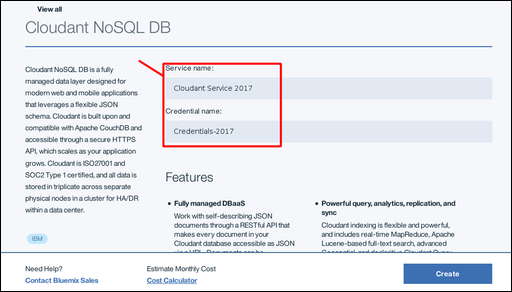
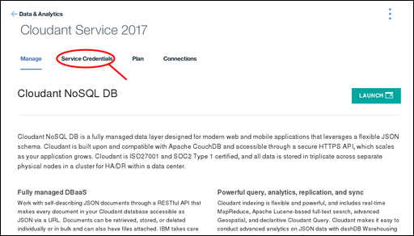
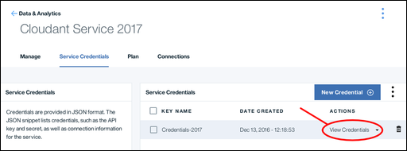
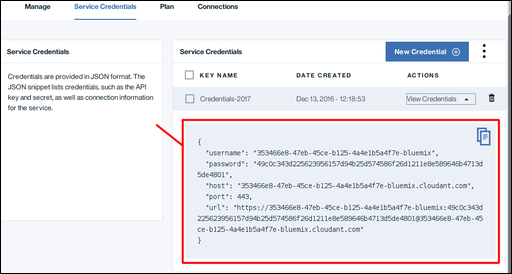
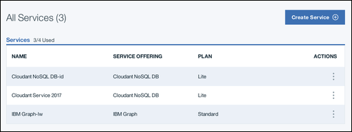
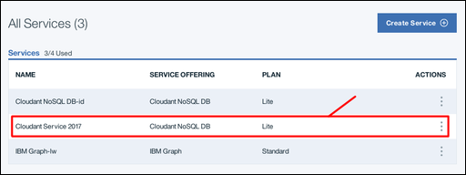

---

copyright:
  years: 2017
lastupdated: "2017-01-06"

---

{:new_window: target="_blank"}
{:shortdesc: .shortdesc}
{:screen: .screen}
{:codeblock: .codeblock}
{:pre: .pre}

# Creating a Cloudant instance on Bluemix

This tutorial shows you how to create an {{site.data.keyword.cloudantfull}}
service instance on {{site.data.keyword.Bluemix_notm}},
and shows you where to find the essential information to enable your applications
to work with the database.
{:shortdesc}

To access a {{site.data.keyword.cloudant_short_notm}} service instance,
you require a set of [Service Credentials](#the-service-credentials).
The credentials are generated as part of the process when you create a service instance.

You can also find these credentials at any time,
by accessing your {{site.data.keyword.cloudant_short_notm}} account.

## Creating a service instance

1.  Log in to your {{site.data.keyword.Bluemix_notm}} account. 
    The {{site.data.keyword.Bluemix_notm}} dashboard can be found at:
    [http://bluemix.net ](http://bluemix.net){:new_window}.
    After authenticating with your user name and password,
    you are presented with the {{site.data.keyword.Bluemix_notm}} dashboard: 
    

2.  Click the `Catalog` link: 
     
    A list of the services available on {{site.data.keyword.Bluemix_notm}} appears.

3.  Click the `Data & Analytics` entry under the `Services` heading: 
     
    A list of the Data & Analytics services
    available on {{site.data.keyword.Bluemix_notm}} appears.

4.  Click the {{site.data.keyword.cloudant_short_notm}} service: 
    

5.  In the service configuration window,
    enter a service name and a credential name.
    In this example,
    the service name is `Cloudant Service 2017`,
    and the credential name is `Credentials-2017`: 
    

6.  By default,
    the service is created by using the 'Lite' pricing plan,
    which is free but offers limited capacity.
    Other pricing plans,
    with greater capacity,
    [are available](../offerings/bluemix.html). 
    To create the service,
    click the `Create` button: 
    

7.  A service page appears,
    confirming that your new {{site.data.keyword.cloudant_short_notm}} service is available.
    To access the connection information that your application needs to connect to the service,
    click the `Service Credentials` tab: 
    

8.  The Service Credentials window appears.
    To see the credentials that are required to access the service,
    click the `View Credentials` dropdown: 
    

9.  The Service Credentials details appear: 
    

>   **Note**: The service credentials in these examples
    were defined when a demonstration Cloudant service was created on Bluemix.
    The credentials are reproduced here to show how they would appear in the dashboard.
    However,
    the demonstration Cloudant service was removed,
    so these credentials are no longer valid;
    you _must_ supply and use your own service credentials.

## The service credentials

>   **Note**: Service credentials are valuable.
    If anyone or any application has access to the credentials,
    they can effectively do whatever they want with the service instance,
    for example they might create spurious data,
    or delete valuable information.
    Protect these credentials carefully.

The service credentials consist of five fields:

Field      | Purpose
-----------|--------
`host`     | The host name that is used by applications to locate the service instance.
`username` | The user name that is required for applications to access the service instance.
`password` | The password that is required for applications to access the service instance.
`port`     | The HTTP port number for accessing the service instance on the host. Normally 443 to force HTTPS access.
`url`      | A string aggregating the other credential information into a single URL, suitable for use by applications.

To create an application that can access your service instance,
you need these credentials.

## Locating your service credentials

At any time,
you can find the credentials for a service that is associated with your account.

1.  Begin by logging in to Bluemix.
    The {{site.data.keyword.Bluemix}} dashboard can be found at:
    [http://bluemix.net ](http://bluemix.net){:new_window}.
    After authenticating with your user name and password,
    you are presented with the {{site.data.keyword.Bluemix_notm}} dashboard: 
    

2.  Scroll down the Dashboard,
    until you reach the section that lists all your services: 
    

3.  In this example,
    we want to find the service credentials for the {{site.data.keyword.cloudant_short_notm}}
    service instance that was created earlier in the tutorial,
    called `Cloudant Service 2017`.
    Click the corresponding row: 
    

3.  The Service Credentials window appears.
    To see the credentials that are required to access the service,
    click the `View Credentials` dropdown: 
    

4.  The Service Credentials details appear: 
    

>   **Note**: The service credentials in these examples
    were defined when a demonstration Cloudant service was created on Bluemix.
    The credentials are reproduced here to show how they would appear in the dashboard.
    However,
    the demonstration Cloudant service was removed,
    so these credentials are no longer valid;
    you _must_ supply and use your own service credentials.
