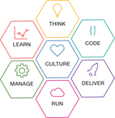

---

copyright:
  years: 2017
lastupdated: "2017-1-27"
---
<!-- Copyright info at top of file: REQUIRED
    The copyright info is YAML content that must occur at the top of the MD file, before attributes are listed.
    It must be surrounded by 3 dashes.
    The value "years" can contain just one year or a two years separated by a comma. (years: 2014, 2016)
    Indentation as per the previous template must be preserved.
-->

{:new_window: target="_blank"}
{:shortdesc: .shortdesc}
{:screen:.screen}
{:codeblock:.codeblock}

# Learn continuous delivery practices by adopting the IBM Bluemix Garage Method
{: #gm_cd_best}

  The [IBM&reg; Bluemix&reg; Garage Method ](https://www.ibm.com/devops/method){:new_window} is the IBM approach to rapidly deliver engaging applications. It combines continuous delivery with IBM Design Thinking, lean, DevOps, and agile practices. Those practices are focused on the cloud, but can benefit any software development effort.

# Adopting continuous delivery practices
{: #gm_cd_adopt}

To learn how to adopt a continuous delivery approach in your organization, use these Bluemix Garage Method articles, tutorials and online courses, which are arranged from basic to advanced. 

## Continuous delivery articles
{: #gm_cd_articles}

These articles provide conceptual overviews of continuous delivery.

<a href="https://www.ibm.com/devops/method/content/deliver/tool_continuous_delivery/" target="_blank">Continuous delivery</a> is a practice by which you build and deploy your software so that it can be released into production at any time. One of the hallmarks of computer science is the shortening of various cycle times in the development and operations process.

With <a href="https://www.ibm.com/devops/method/content/deliver/tool_delivery_pipeline/" target="_blank">Delivery Pipeline</a>, which is included in IBM Bluemix Continuous Delivery, you can achieve continuous delivery in a consistent and reliable way by dividing the software delivery process into stages. The goal is for code to progress through each stage automatically with minimal human intervention.

## Continuous delivery tutorials
{: #gm_cd_tutorials}

[Create and use your first toolchain](https://www.ibm.com/devops/method/tutorials/tutorial_toolchain_flow). Learn how to create a toolchain from a template and use the toolchain to continuously deliver a "Hello World" app.

[Create and use a microservices toolchain](https://www.ibm.com/devops/method/tutorials/tutorial_toolchain_microservices). Learn how to create a toolchain from a template with three microservices and use the toolchain to continuously deliver a "Hello World" app.

## Continuous delivery courses
{: #gm_cd_courses}

[Get started with agile development and continuous delivery](https://www.ibm.com/devops/method/content/course/get_started_agile_cd). Learn how to create a toolchain from a template and use the toolchain to continuously deliver a "Hello World" app.

[Become an IBM Bluemix Garage Method advocate](https://www.ibm.com/devops/method/content/course/gm_advocate). Take this advanced course to get experience with the practices and tools from the Bluemix Garage Method.

To see all of the Bluemix Garage Method learning materials, see the [Bluemix Garage Method Learning Lab](https://www.ibm.com/devops/method/category/courses).
