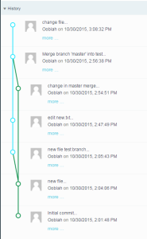
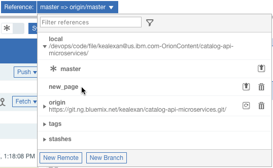

---

copyright:
  years: 2017
lastupdated: "2017-5-8"
---

{:new_window: target="_blank"}
{:shortdesc: .shortdesc}
{:screen:.screen}
{:codeblock:.codeblock}
{:pre: .pre}

# Working with Git in the Eclipse Orion Web IDE
{: #git_web_ide}

When you use the Eclipse Orion {{site.data.keyword.webide}}, you don't need the Git terminal: you can run many common Git commands in the Web IDE.

No matter where you code, you can use this quick reference to do common tasks.

## Create a local branch
{: #create_branch}

### Eclipse Orion Web IDE
1. Click the **Reference** list.

1. Click **New Branch**.

2. Type your branch name, and then click **Submit**.

### Git terminal
1. Type `git branch <branchname>` and press Enter.

## Work on a local branch
{: #start_working_on_branch}

### Eclipse Orion Web IDE
1. Click the **Reference** list and expand **local**.

2. Next to the branch to modify, click the checkout icon .

1. Make sure that your selected branch is shown in the **Reference** list.

### Git terminal
1. To view your local branches, type `git branch -l` and press Enter.

2. Type `git checkout <branchname>` and press Enter.

## Update a local branch to include changes from the remote branch
{: #update_branch}

### Eclipse Orion Web IDE
1. Click **Sync**.

1. If you encounter conflicts, [resolve them](#resolve_a_rebase_conflict).

### Git terminal
1. Type `git pull` and press Enter.

## Delete a local branch
{: #delete_branch}

### Eclipse Orion Web IDE
1. Make sure that the branch to delete is not checked out. If that branch is checked out, [check out another branch](#start_working_on_branch).

1. Click the **Reference** list and expand **local**.

2. Next to the local branch to remove, click **Delete** .

### Git terminal
1. Type `git branch -d <branchname>` and press Enter.

##Force push local changes to a remote branch
{: #force_push}

Overwrite the contents of a referenced remote branch with the contents of your active local branch.

**Important:** When you force push a local branch to a remote one, you might lose commits on the remote branch.

### Eclipse Orion Web IDE

1. In the Working Directory Changes section, in the Outgoing section, click the arrow next to **Push**.
2. Click **Force Push Branch**.
3. Confirm the warning.

### Git terminal

1. Type `git push <origin> <remote branch> -f` and press Enter.

## Discard unstaged changes from the active local branch
{: #discard_changes}

### Eclipse Orion Web IDE
1. In the Working Directory Changes section, select the check box for each modified file that has changes you want to discard.
2. Click the checkout icon .

### Git terminal
1. Type `git checkout -- path/to/file/filename` to discard changes to a file.

## Commit files and push to the remote branch
{: #commit}

### Eclipse Orion Web IDE
1. In the Working Directory Changes section, select the check box for each file to commit.

3. In the **Enter the commit message** field, type a message that describes your changes.

  **Tip**: Provide a detailed commit message. Your message should provide enough details for someone to understand why the change was necessary without more information. You can include a link to an item in your team's issue tracker to help. The first line of the commit message should contain fewer than 50 characters. Add a blank line before you add other text.

4. Click **Commit**.

5. Click **Push**.

### Git terminal
1. Type `git status` and press Enter.

2. Review the changes to be committed. If all of your files are listed to be committed, proceed. To commit unstaged files, stage them first.

3. Type `git commit` and press Enter.

4. Enter the commit summary, add a blank line, and add the commit description.

  **Tip**: The commit summary should be fewer than 50 characters. The commit description should provide enough details for someone to understand why the change was necessary without more information. You can include a link to an item in your team's issue tracker to help.

5. Save the commit message.

  **Note:** To save your commit message and close Vim, which might be your default text editor, press Esc, type `:wq`, and press Enter.

4. Type `git push` and press Enter.

## View the commit history
{: #view_commit_history}

### Eclipse Orion Web IDE
1. In the Active Branch section, expand **History** to see the commit history for that branch.

  The commit history can also be viewed as a connected visual graph.

1. Click the **graphical representation toggle** icon .

  Once toggled, the commit history and any incoming or outgoing changes for the active branch are drawn as a connected graph.  The visual representation shows all of the commits and the branches they were made on.

  

### Git terminal
1. Type `git log` and press Enter.

2. Navigate through the committer's commits.
 * To view more entries, press Page Down.
 * To view previous entries, press Page Up.

3. To stop viewing entries, press  Q.

## Compare changes that a commit introduced
{: #compare_changes}

### Eclipse Orion Web IDE
1. View your commit history and locate the commit. For more information, see [ View the commit history](#view_commit_history).

2. View the details of the commit by clicking it.

3. Next to a file, click the **>** and review the file's changes.

  **Note:** If a commit introduced a change to a line, the original line is shaded pink and the new line is shaded green.  Similarly, lines that were added by a commit are shaded green and lines that were removed by a commit are shaded pink.

### Git terminal
1. Type `git log -p` and press Enter.

  **Note:** To view only a certain number of commits, type `git log -p -<number_of_commits_to_view>`.

2. Navigate through the commits.
 * To view more entries, press Page Down.
 * To view previous entries, press Page Up.

3. Review the changes.

  **Note:** If a commit introduced a change to a line, the original line is in red text and starts with a minus sign (-). The new line is in green text and starts with a plus sign (+).  Similarly, lines that were added by a commit are in green text and start with a +. Lines that were removed by a commit are in red text and start with a -.

1. To stop viewing entries, press  Q.

## Modify the last commit
{: #modify_last_commit}

  **Note:** When you modify the last commit after you push it to a remote repo, you rewrite the commit history. This might cause commit failures and other problems for the other contributors in your project. Be sure that you know what you're doing before you modify a commit that you pushed to a remote repo.

### Eclipse Orion Web IDE
1. Select the check boxes for the items to add to the commit.

1. Select the **Amend previous commit** check box.

2. If necessary, enter a new commit message.

3. Click **Commit**.

### Git terminal
1. Check your status. As necessary, stage or unstage files.

2. Type `git commit --amend` and press Enter.

3. In your text editor, accept or modify the commit message.

  **Note:** To save your commit message and close Vim, which might be your default text editor, press Esc, type `:wq`, and press Enter.

## Tag a commit
{: #tag_commit}

### Eclipse Orion Web IDE
1. View your commit history and locate the commit. For more information, see [ View the commit history](#view_commit_history).

2. View the details of the commit by clicking it.

2. In the commit pane, click **Create a tag for the commit** .

3. In the name field, type your tag text. Click **Submit**.

### Git terminal
1. View the commit history and obtain the ID of the commit to tag. For more information, see [ View the commit history](#view_commit_history).

2. Type `git tag -a <tag_text> <commit_id>` and press Enter.

## Change the committer name and email address
{: #change_the_committer_name_and_email_address}

### Eclipse Orion Web IDE
1. Click the configuration icon .

3. Change the user email address and name by updating the user.email and user.name values. Click **Submit** to save each change.

### Git terminal
To update your name and email address for a single repo:

1. Type `git config user.email "<your@email.com>"` and press Enter.

2. Type `git config user.name "<Your Name>"` and press Enter.

To update your name and email address for all repos:

1. Type `git config --global user.email "<your@email.com>"` and press Enter.

2. Type `git config --global user.name "<Your Name>"` and press Enter.

##Revert a commit
{: #revert}

Revert the changes that a commit has introduced into your active branch.

### Eclipse Orion Web IDE

1. Under History, select a commit.

2. On the right side of the page, above the commit summary, click the revert icon .

### Git terminal

1. Type `git revert <commit ID>` and press Enter.

## Merge changes
{: #merge_changes}

When you need to deliver changes from a source branch to a destination branch, you must first merge. Typically, the source branch is the branch you made changes in, and the destination branch is your master branch.

### Eclipse Orion Web IDE
1. Decide which branches to merge.

2. Check out the destination branch. For more information, see [ Work on a local branch](#start_working_on_branch).

 

1. Click the **Reference** list, expand **local**, and click the name of the source branch. The changes from the source branch are shown in the Incoming section.

  

1. In the Incoming section, click the **Merge** icon 

1. In the **Reference** list, click the checkout icon next to the branch that you just merged the changes into.

1. If you want to deliver the changes, click **Push**. Otherwise, at this point, you can create a test deployment to make sure that everything is working as expected.

### Git terminal
1. Decide which branches to merge.

2. Check out the destination branch. For more information, see [ Work on a local branch](#start_working_on_branch).

3. Type `git merge <source_name>` and press Enter.

## Resolve a merge conflict
{: #resolve_a_merge_conflict}

### Eclipse Orion Web IDE
1. In the Changed Files pane, review the list of files that contain conflicts.

2. In the Web IDE, open each file that contains conflicts.

3. Resolve each conflicting change.

  **Note:** Delete all of the text that you do not want to keep. Each conflict is in this format:

		<<<<<<< HEAD
		Text in checked out branch.
		=======
		Text in merged branch.
		>>>>>>> commit_ID_from_merged_branch
4. For each conflicting file, select the check box. Type a merge commit message, and click **Commit**.

### Git terminal
1. For the files that contain conflicts, review the Git message for the names.

2. In a text editor, open a file that contains conflicts.

3. Resolve each conflicting change, and then save the file.

  **Note:** Delete all of the text that you do not want to keep. Each conflict is in this format:

		<<<<<<< HEAD
		Text in checked out branch.
		=======
		Text in merged branch.
		>>>>>>> merged_branch
4. Stage each file that you modified, and then commit the merge.

## Rebase branches
{: #rebase_branches}

### Eclipse Orion Web IDE
1. Decide which branches to rebase. You will rebase the contents of the source branch into the destination branch.

2. Check out the destination branch. For more information, see [ Work on a local branch](#start_working_on_branch).

1. Click the **Reference** list.

1. Click the name of the source branch.

1. In the Incoming section, click the rebase icon .

5. If you encounter conflicts, [resolve them](#resolve_a_rebase_conflict).

6. Repeat the previous step as many times as necessary to complete the rebase operation.

1. Click the **Reference** list, expand **origin**, and click the name of the source branch.

1. Click **Push**.

### Git terminal
1. Check out the branch to update by typing `git checkout <destination_branchname>` and pressing Enter.

2. Type `git rebase <source_branchname>` and press Enter.

3. If you encounter conflicts, [resolve them](#resolve_a_rebase_conflict).

5. Repeat the previous step as many times as necessary to complete the rebase operation.

  **Note:** To stop the rebase operation, type `git rebase --abort` and press Enter.

## Resolve a rebase conflict
{: #resolve_a_rebase_conflict}

### Eclipse Orion Web IDE
1. In the Working Directory Changes section, review the list of conflicting files.

2. In the Web IDE, open each file that contains conflicts.

3. Resolve each conflicting change.

  **Note:** Delete all of the text that you do not want to retain. Each conflict is in this format:

		<<<<<<< HEAD
		Text in checked out branch.
		=======
		Text in merged branch.
		>>>>>>> commit_ID_from_merged_branch
4. In the rebase pane, select the check box for each corrected file and click **Continue**.

### Git terminal
1. For the files that contain conflicts, review the Git message for the names.

2. In a text editor, open a file that contains conflicts.

3. Resolve each conflicting change, and then save the file.

  **Note:** Delete all of the text that you do not want to retain. Each conflict is in this format:

		<<<<<<< HEAD
		Text in checked out branch.
		=======
		Text in merged branch.
		>>>>>>> merged_branch
4. Stage each file that you modified.

5. Resume the rebase operation by typing `git rebase --continue` and pressing Enter.
