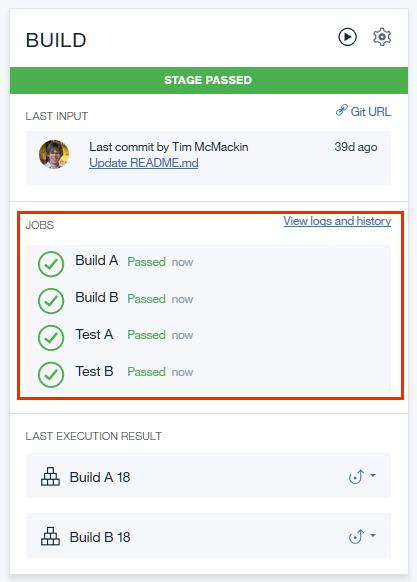
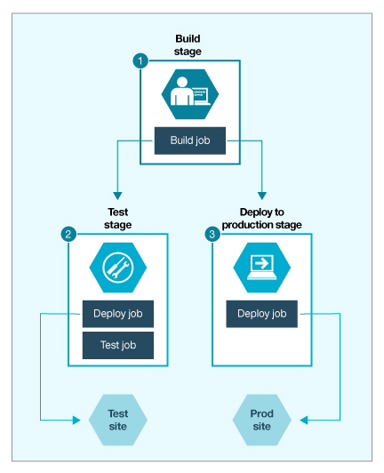

---

copyright:
  years: 2016, 2017
lastupdated: "2017-4-4"
---

{:new_window: target="_blank"}
{:shortdesc: .shortdesc}
{:screen:.screen}
{:codeblock:.codeblock}

# About Delivery Pipeline
{: #deliverypipeline_about}

The IBM&reg; Bluemix&reg; {{site.data.keyword.deliverypipeline}} service, also known as pipeline, automates the continuous deployment of your Bluemix projects. In a pipeline, sequences of stages retrieve input and run jobs, such as builds, tests, and deployments.
{:shortdesc}

The following sections describe the conceptual details behind pipelines.

## Stages
{: #deliverypipeline_stages}

Stages organize input and jobs as your code is built, deployed, and tested. Stages accept input from either source control repositories (SCM repositories) or build jobs (build artifacts) in other stages. When you create your first stage, the default settings are set for you on the **INPUT** tab.

A stage's input is passed to the jobs the stage contains, and each job is given a clean container to run in. The jobs in a stage can't pass artifacts to each other.

You can define stage environment properties that can be used in all jobs. For example, you could define a `TEST_URL` property that passes a single URL to deploy and test jobs in a single stage. The deploy job would deploy to that URL, and the test job would test the running app at the URL.

By default in a stage, builds and deployments are run automatically every time changes are delivered to a project's SCM  repository. Stages and jobs run serially; they enable flow control for your work. For example, you might place a test stage before a deployment stage. If the tests in the test stage fail, the deployment stage won't run.

You might want tighter control of a specific stage. If you do not want a stage to run every time that a change occurs at its input, you can disable the capability. On the **INPUT** tab, in the Stage Trigger section, click **Run jobs only when this stage is run manually**.

## Jobs
{: #deliverypipeline_jobs}

A job is an execution unit within a stage. A stage can contain multiple jobs, and the jobs in a stage run sequentially. By default, if a job fails, subsequent jobs in the stage do not run.

Jobs run in discrete working directories within Docker containers that are created for each pipeline run. Before a job is run, its working directory is populated with input that is defined at the stage level. For example, you might have a stage that contains a test job and a deploy job. If you install dependencies on one job, they are not available to the other job. However, if you make the dependencies available in the stage's input, they are available to both jobs.

Except for Simple-type build jobs, when you configure a job, you can include UNIX shell scripts that include build, test, or deployment commands. Because jobs are run in ad hoc containers, the actions of one job cannot affect the run environments of other jobs, even if those jobs are part of the same stage.

Additionally, pipeline jobs can run only the following commands as `sudo`:
  * `/usr/sbin/service`
  * `/usr/bin/apt-get`
  * `/usr/bin/apt-key`
  * `/usr/bin/dpkg`
  * `/usr/bin/add-apt-repository`
  * `/opt/IBM/node-v0.10.40-linux-x64/npm`
  * `/opt/IBM/node-v0.12.7-linux-x64/npm`
  * `/opt/IBM/node-v4.2.2-linux-x64/npm`
  * `/usr/bin/Xvfb`
  * `/usr/bin/pip`

After a job runs, the container that was created for it is discarded. The results of a job run can persist, but the environment in which it ran does not.

**Note**: Jobs can run for up to 60 minutes. When jobs exceed that limit, they fail. If a job is exceeding the limit, break it into multiple jobs. For example, if a job performs three tasks, you might break it into three jobs: one for each task.

To learn how to add a job to a stage, see [Adding a job to a stage](/docs/services/ContinuousDelivery/pipeline_build_deploy.html#deliverypipeline_add_job){: new_window}.

### Build jobs

Build jobs compile your project in preparation for deployment. They generate artifacts that can be sent to a build archive directory, although by default, the artifacts are placed in the project's root directory.

Jobs that take input from build jobs must reference build artifacts in the same structure that they were created in. For example, if a build job archives build artifacts to an `output` directory, a deploy script would refer to the `output` directory rather than the project root directory to deploy the compiled project. You can specify the directory to archive by entering the directory name in the  **Build Archive Directory** field. Leaving the field blank archives the root directory.

**Note**: If you select the **Simple** builder type for a build job, you skip the build process. In that case, your code is not compiled, but is sent to the deployment stage as is. To both build and deploy, select a builder type other than **Simple**.

#### Environment properties for build scripts
You can include environment properties within a build job's build shell commands. The properties provide access to information about the job's execution environment. For more information, see [Environment properties and resources for the {{site.data.keyword.deliverypipeline}} service](/docs/services/ContinuousDelivery/pipeline_deploy_var.html).

### Deploy jobs

Deploy jobs upload your project to Bluemix as an app and are accessible from a URL. After a project is deployed, you can find the deployed app on your Bluemix dashboard.

Deploy jobs can deploy new apps or update existing apps. Even if you first deployed an app by using another method, such as the Cloud Foundry command line interface or the run bar in the Web IDE, you can update the app by using a deploy job. To update an app, in the deploy job, use that app's name.

You can deploy to one or many regions and services. For example, you can set up your {{site.data.keyword.deliverypipeline}} to use one or more services, test in one region, and deploy to production in multiple regions. For more information, see [Regions](/docs/overview/whatisbluemix.html#ov_intro_reg){: new_window}.

#### Environment properties for deployment scripts

You can include environment properties within a deploy job's deployment script. These properties provide access to information about the job's execution environment. For more information, see [Environment properties and resources for the {{site.data.keyword.deliverypipeline}} service](/docs/services/ContinuousDelivery/pipeline_deploy_var.html).

### Test jobs
If you want to require that conditions are met, include test jobs before or after your build and deploy jobs. You can customize test jobs to be as simple or complex as you need. For example, you might issue a cURL command and expect a particular response. You might also run a suite of unit tests or run functional tests with third-party test services, such as Sauce Labs.

If your tests produce result files in JUnit XML format, a report that is based on the result files is shown on the **Tests** tab of every test result page. If a test fails, the job also fails.

#### Environment properties for test scripts

You can include environment properties in the script of a test job. The properties provide access to information about the job's run environment. For more information, see [Environment properties and resources for the {{site.data.keyword.deliverypipeline}} service](/docs/services/ContinuousDelivery/pipeline_deploy_var.html).

## Manifest files
{: #deliverypipeline_manifest}

Manifest files, which are named `manifest.yml` and stored in a project's root directory, control how your project is deployed to Bluemix. For information about creating manifest files for a project, see the [Bluemix documentation about application manifests](/docs/manageapps/depapps.html#appmanifest). To integrate with Bluemix, your project must have a manifest file in its root directory. However, you are not required to deploy based on the information in the file.

In the pipeline, you can specify everything that a manifest file can by using `cf push` command arguments. The `cf push` command arguments are helpful in projects that have multiple deployment targets. If multiple deploy jobs all try to use the route that is specified in the project manifest file, a conflict occurs.

To avoid conflicts, you can specify a route by using `cf push` followed by the host name argument, `-n`, and a route name. By modifying the deployment script for individual stages, you can avoid route conflicts when you deploy to multiple targets.

To use the `cf push` command arguments, open the configuration settings for a deploy job and modify the **Deploy Script** field. For more information, see the [Cloud Foundry Push documentation ](http://docs.cloudfoundry.org/devguide/installcf/whats-new-v6.html#push){: new_window}.

## An example pipeline
{: #deliverypipeline_example}

A simple pipeline might contain three stages:

1. A Build stage that compiles and runs build processes on an app.
2. A Test stage that deploys a instance of the app and then runs tests on it.
3. A Prod stage that deploys a production instance of the tested app.

This pipeline is shown in the following conceptual diagram:

*A conceptual model of a three-stage pipeline*

Stages take their input from repositories and build jobs, and jobs within a stage run sequentially and independently of each other. In the example pipeline, the stages will run sequentially, even though the Test and Prod stages both take the Build stage's output as their input.
