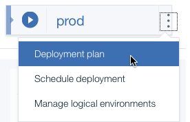

---

copyright:
  years: 2017
lastupdated: "2017-3-16"
---
<!-- Copyright info at top of file: REQUIRED
    The copyright info is YAML content that must occur at the top of the MD file, before attributes are listed.
    It must be surrounded by 3 dashes.
    The value "years" can contain just one year or a two years separated by a comma. (years: 2014, 2016)
    Indentation as per the previous template must be preserved.
-->

{:new_window: target="_blank"}
{:shortdesc: .shortdesc}
{:screen:.screen}
{:codeblock:.codeblock}

# Creating composite pipelines (Experimental)
{: #deliverypipeline_create_composite}

With the composite pipeline feature for {{site.data.keyword.deliverypipeline}}, you can manage repeatable continuous integration and continuous delivery processes for related software applications.
{:shortdesc}

## Creating a composite pipeline
{: #compositepipeline_create_for_toolchain}

1. From the menu near the Bluemix logo, click **Services > DevOps**

1. From the left navigation, click **Pipelines**.

2. Enable the composite pipeline feature by clicking **Learn more** and then clicking **Enable**. The composite pipeline is enabled for each user, so only the members of your organization who opt in to the experimental feature see the composite pipelines that you create.

2. Click **Create** > **Composite Pipeline**.

3. Type a name for the composite pipeline. You can also modify the pipeline description.

4. From the **Toolchain** list, select a toolchain.

    1. To create an empty toolchain and composite pipeline, select **New**.

    2. To create a composite pipeline for one of your toolchains, select its name.

5. If you create an empty toolchain, select **Add default environments**. You use these default logical environments to control process execution through the composite pipeline.

6. Click **Create**.

The stages that you configured are automatically mapped to the appropriate space in your organization and a deployment plan is created for the composite pipeline.

If you created the composite pipeline for a toolchain that contains delivery pipelines, apps for all of the pipelines in the toolchain are added to the composite pipeline. The stages that you configured in the delivery pipelines are automatically mapped to the appropriate spaces in your organization, and their status is displayed.
To view the status of each job in an app, expand the app.

A deployment plan is also created for the composite pipeline. By default, the jobs for all apps run in parallel for a space, but you can change the deployment order in the plan.

If you created the composite pipeline for a new toolchain, a deployment plan is created for you to customize.

## Modifying the deployment plan
{: #compositepipeline_modify_dp}

By default, a deployment plan is created for a composite pipeline. This deployment plan captures all of the information about the stages in any Delivery Pipelines in the toolchain. You can view and modify the deployment plan for each stage.

In the stage that you want to modify the deployment plan for, click the menu and click **Deployment plan**.

The list of deployment tasks for your environment is displayed.

For more information about modifying the deployment plan, see [Customizing deployment plans for composite pipelines](/docs/services/ContinuousDelivery/pipeline_deployment_plan.html).

## Using IBM Bluemix DevOps Connect to integrate with IBM UrbanCode Deploy
{: #compositepipeline_devops_connect}

IBM Bluemix DevOps Connect coordinates communication between your on-premises IBM&reg; UrbanCode&reg; Deploy  installation and {{site.data.keyword.contdelivery_short}}. After you install DevOps Connect, you can create integrations that enable you to manage UrbanCode Deploy applications with composite pipelines.

**Prerequisites**

* To register DevOps Connect, you must have an IBMid.

* You must have [Java™ Runtime Environment version 8 update 121 or later](https://java.com/en/download/){:new_window}  on the host system and set the system PATH variable to its location.

* You need an admin authorization token from UrbanCode Deploy.

1. Install DevOps Connect and use it to integrate your org with UrbanCode Deploy.

  1.  From within a composite pipeline, click **Add app** and from the **Managed by** list, select **IBM UrbanCode Deploy**.

  1. Display the integration steps.

  1.  In the Configure UrbanCode Deploy Integration dialog box, click **Download** to download DevOps Connect. Place the JAR file on a computer that has access to UrbanCode Deploy.

  1.  Using the dialog box, copy the DevOps Connect installation script. The script contains the command to start DevOps Connect and the credentials that are required to identify your {{site.data.keyword.contdelivery_short}} Bluemix service.

  1.  On the computer where you placed DevOps Connect, open a command shell and paste the copied script into it.

  1.  Run the script.  DevOps Connect displays startup messages.

2. Register DevOps Connect.

  1.  On the computer where you placed DevOps Connect, use a web browser to open the DevOps Connect dashboard. The default URL is `https://localhost:8443`. To change the URL and learn about other startup options, see the [DevOps Connect documentation](https://developer.ibm.com/urbancode/plugindoc/urbancode-sync/ibm-urbancode-sync-utility/1-2/){:new_window} 

  <!-- 1.  On the registration page, specify a name for the DevOps Connect installation.

  1.  Click **Register**. The first time that you access DevOps Connect, you are prompted to register it with your IBMid. -->

  1.  On the **Sign-in to IBM** page, enter your IBMid and password, and then click **Sign In**. You sign in each time you start DevOps Connect.

3. With DevOps Connect, use the IBM UrbanCode Deploy for DevOps Connect plug-in to create an integration between your org and UrbanCode Deploy.

    1.  From the Integrations page, click **Add New**.

    1.  In the **Name** field, enter a name for the integration.

    1.  From the **Integration Type** list, select **IBM UrbanCode Deploy for DevOps Connect**.

    1.  In the **Server URI** field, enter the public URL of the UrbanCode Deploy server. For example, `https://my_UCD.example.com:8443`.

    1.  In the **Authentication Token** field, enter or paste the authentication token that was generated by UrbanCode Deploy.

    1.  In the **Admin User Email** field, enter your email address.

    1.  Click **Save**.

4.  Run the integration to confirm that it works.

    1. To open the integration, click **Edit**.

    1. On the integration page, click **Run Integration**. DevOps Connect connects to the UrbanCode Deploy instance specified in the **Server URI** field. DevOps Connect is authorized by the token that is pasted in the **Authentication Token** field.

If your integration succeeded, you can add UrbanCode Deploy applications to your composite pipelines. See [Customizing deployment plans for composite pipelines](/docs/services/ContinuousDelivery/pipeline_composites.html#compositepipeline_add_apps)

## Adding apps from IBM UrbanCode Deploy
{: #compositepipeline_add_apps}

If you integrate with IBM UrbanCode Deploy by using IBM Bluemix DevOps Connect, you can add applications from UrbanCode Deploy to the composite pipeline. For detailed installation instructions, see [Installing and configuring DevOps Connect](/docs/services/UCCR/index.html#gs_install_dc).

After you connect your organization to UrbanCode Deploy, you can add its applications to composite pipelines, select the application processes to include in the deployment plan, and customize the deployment of the apps.

1. From the composite pipeline, click **Add app**.

2. From the **Managed by** list, select **IBM UrbanCode Deploy**.

3. Select the apps to add and click **Continue**. All of the application processes available to UrbanCode Deploy applications are shown. Entries to run the processes that you selected are added to the deployment plan.

4. Select all the application processes to use for all of the apps. Use the search and filter options to locate processes.

5. Click **Save**. Each UrbanCode Deploy application that you selected is displayed as an app in the composite pipeline.

6. Map environments from the UrbanCode Deploy applications to the composite pipeline's logical environments.

    1. From the menu near a logical environment name, select **Manage logical environments**.

    2. For each app in the composite pipeline, select the UrbanCode Deploy environments to run the process that you selected in.

    3. Click **Save**.

    4. Repeat these steps for each logical environment that you use.

## Modifying individual pipelines
{: #compositepipeline_add_job}

You can modify individual pipelines from the composite pipeline.

1. Expand the app.

2. From the menu on the stage, click **Configure**.

3. Add, modify, or delete jobs from the stage. For detailed instructions, see [Adding a job to a stage](pipeline_build_deploy.html#deliverypipeline_add_job).

## Running jobs in a composite pipeline
{: #compositepipeline_run_jobs}

After you expand an app to display its jobs, you can manually run all of its jobs in a stage. Click the **Deploy to *stage*** icon in the space for an app.

To run all of the jobs in all of the apps that are in a space, click the **Deploy to *space*** icon in the space for the composite pipeline. The jobs run according to the composite blueprint's deployment plan.

## Viewing logs
{: #compositepipeline_view_logs}

To view the logs for a job, expand the app that contains the job and click the job.
