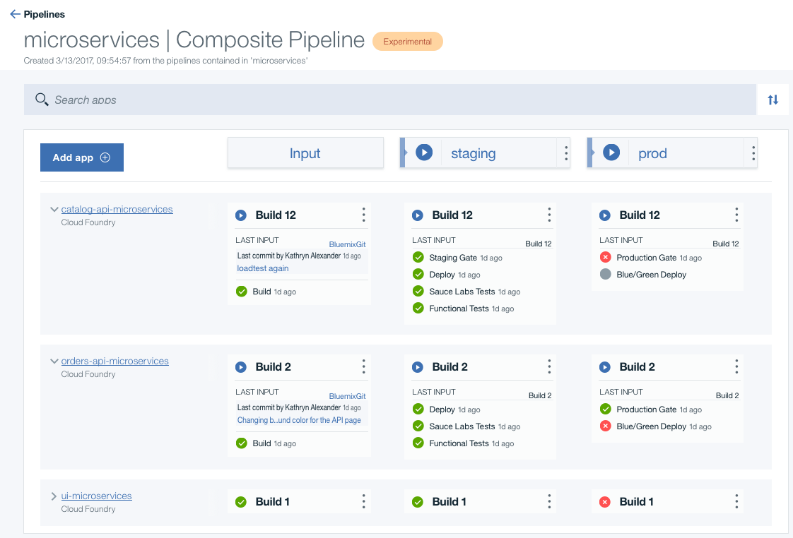
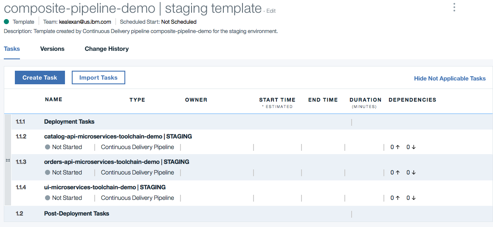
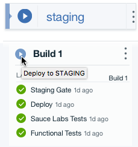
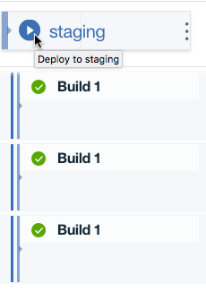

---

copyright:
  years: 2017
lastupdated: "2017-3-7"
---
<!-- Copyright info at top of file: REQUIRED
    The copyright info is YAML content that must occur at the top of the MD file, before attributes are listed.
    It must be surrounded by 3 dashes.
    The value "years" can contain just one year or a two years separated by a comma. (years: 2014, 2016)
    Indentation as per the previous template must be preserved.
-->

{:new_window: target="_blank"}
{:shortdesc: .shortdesc}
{:screen:.screen}
{:codeblock:.codeblock}

# Creating composite pipelines (Experimental)
{: #deliverypipeline_create_composite}

The composite pipeline feature for the IBM&reg; Bluemix&reg; {{site.data.keyword.deliverypipeline}} service allows you to manage repeatable continuous integration and continuous delivery process for related software applications.
{:shortdesc}

## Creating a composite pipeline for a toolchain
{: #compositepipeline_create_for_toolchain}

1. From the menu by the Bluemix logo, click **Services** > **DevOps**

1. From main page for Bluemix DevOps, click **Pipelines**.

2. Enable the composite pipeline feature by clicking **Learn more** and then clicking **Enable**. The composite pipeline is enabled per user, so only the members of your organization who opt into the experimental feature see the composite pipelines that you create.

2. Click **Create** > **Composite pipeline**.

3. Specify a name for the composite pipeline. You can also modify the pipeline description.

4. From the **Toolchain** list, select your toolchain.

6. Click **Create**. Apps for all of the pipelines in the toolchain that you selected are added to the composite pipeline.

The stages that you configured are automatically mapped to the appropriate space in your organization, and their status is displayed. A deployment plan is also created for the composite pipeline.

To view the status of each job in an app, expand the app.

## Modifying the deployment plan
{: #compositepipeline_modify_dp}

By default, a deployment plan that captures all of the information about the stages in all of your component pipelines is created for a composite pipeline. You can view and modify the deployment plan for a stage.

In the stage that you want to modify the deployment plan for, click the kebab menu and then click **Deployment plan**. The list of deployment tasks for your environment are displayed.

For more information about modifying the deployment plan, see [Customizing deployment plans for composite pipelines](/docs/services/ContinuousDelivery/pipeline_deployment_plan.html).

<!-- ## Creating a new composite pipeline -->

## Modifying individual pipelines
{: #compositepipeline_add_job}

You can modify individual pipelines from the composite pipeline.

1. Expand the app.
2. From the menu on the stage, click **Configure**.
3. Add, modify, or delete jobs from the stage. See [Adding a job to a stage](pipeline_build_deploy.html#deliverypipeline_add_job).

## Running jobs in a composite pipeline
{: #compositepipeline_run_jobs}

After you expand an app to display its jobs, you can manually run all of its jobs in a stage. Click the **Deploy to *stage*** icon in the space for an app.

To run all the jobs in all apps in a space, click the **Deploy to *space*** icon in the space for the composite pipeline. The jobs run according to the composite blueprint's deployment plan.

## Viewing logs
{: #compositepipeline_view_logs}

To view the logs for a job, expand the app that contains the job and click the job.
