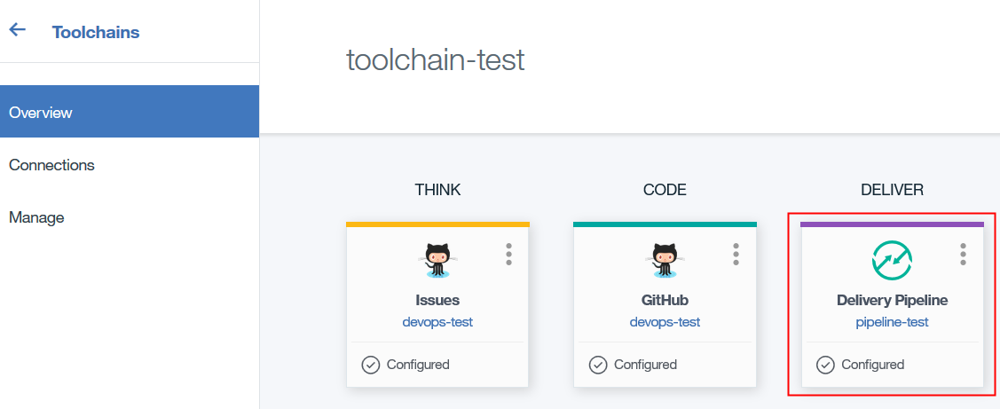

---

copyright:
  years: 2015, 2017
lastupdated: "2017-5-25"

---

{:screen: .screen}
{:new_window: target="_blank"}
{:codeblock: .codeblock}
{:shortdesc: .shortdesc}

# Working with {{site.data.keyword.deliverypipeline}} {: #pipeline-working}

To automate your builds and deployments to {{site.data.keyword.Bluemix}}, use {{site.data.keyword.deliverypipeline}} for {{site.data.keyword.Bluemix_notm}}.
{: shortdesc}

With {{site.data.keyword.deliverypipeline}}, you can choose from several build types. You provide the build script, and {{site.data.keyword.Bluemix_notm}} {{site.data.keyword.jazzhub_short}} runs it; you don't need to set up build systems. Then, with one click, you can automatically deploy your app to one or many {{site.data.keyword.Bluemix_notm}} spaces, public Cloud Foundry servers, or Docker containers on IBM Containers for {{site.data.keyword.Bluemix_notm}}.

Build jobs compile and package your app source code from Git repositories. The build jobs produce deployable artifacts, such as WAR files or Docker containers for IBM Containers. In addition, you can run unit tests within your build automatically. You can set up your build jobs so that each time a commit is pushed, a build is triggered.

A deployment job takes output from a build job and deploys it to either IBM Containers or Cloud Foundry servers such as {{site.data.keyword.Bluemix_notm}}.

You can deploy to one or many regions and services. For example, you can set up your {{site.data.keyword.deliverypipeline}} to use one or more services, test in one region, and deploy to production in multiple regions. For more information, see [Regions](/docs/overview/whatisbluemix.html#ov_intro_reg){: new_window}.

If you use multiple pipelines in an open toolchain, you can create a composite pipeline to manage the deployment of all pipelines from a single location.

There are several ways to create a pipeline, including adding a pipeline to an existing application and creating a pipeline without an existing application. If you do not already have a {{site.data.keyword.deliverypipeline}} service in your organization, you can go to the catalog, click {{site.data.keyword.deliverypipeline}}, and click Create.

Complete these steps to set up a {{site.data.keyword.deliverypipeline}} for an existing application:

1. On the {{site.data.keyword.Bluemix_notm}} app Dashboard, click your app.
1. From the menu on the {{site.data.keyword.Bluemix_notm}} menu bar, click **Services**, and then click **DevOps**.
1. Click **Pipelines**, and then click **Create a Pipeline**.

To [create a pipeline ](https://console.bluemix.net/devops/pipelines/dashboard/create){: new_window} that is configured to deploy a Cloud Foundry application, follow these steps:

1. Click **Cloud Foundry**.
1. If you want to use a different name for the pipeline, change its default name.
1. If you want to use a different name for the application, change its default name. This name is the application that the pipeline deploys to.
1. If you don't have a toolchain, a toolchain with a default name is created for you. If you want to use a different name for the toolchain, change its name. With the toolchain, you can extend the capabilities of your pipeline by integrating with other tools and services. For more information about toolchains, see [Creating toolchains](/docs/services/ContinuousDelivery/toolchains_working.html){: new_window}.

 **Tip**: Pipelines and toolchains belong to organizations (orgs). If you belong to an org that has toolchains, you can be added to the access control list for any of its associated toolchains. After you are added to the access control list for a toolchain, you can view that toolchain and any associated pipelines, even if you didn't create them. If you are granted admin privileges, you can also modify and delete the toolchain. For more information about access control for toolchains, see [Managing access](/docs/services/ContinuousDelivery/toolchains_using.html#managing_access){: new_window}.

1. Either select the toolchain that you want to use or type a name for the new toolchain that you want to create.
1. Select your Git provider.

 **Tip**: If you have not authorized {{site.data.keyword.Bluemix_notm}} to access GitHub, you are prompted to click **Authorize** to go to the GitHub website. If you don't have an active GitHub session, you are prompted to log in. Click **Authorize Application** to allow {{site.data.keyword.Bluemix_notm}} to access your GitHub account. If you have an active GitHub session but you haven't entered your password recently, you might be prompted to enter your GitHub password to confirm.

   * If you have a repo and want to use it, for the repository type, select **Link**. Search for the location of the repo or select the repo from the list of available repos.

   * If you want to create an empty repo, for the repository type, select **New**. Type a name for the repo.

   * If you want to create a clone of a repo, for the repository type, select **Copy**. Search for the location of the repo or select the repo from the list of available repos.

   * If you want to fork a repo so that you can contribute changes through pull requests, select **Fork**. Search for the location of the repo or select the repo from the list of available repos.

1. Select a repo or enter a repo URL.
1. Click **Create**. The pipeline is created, configured, and displayed on the toolchain's Overview page.
 
1. If you created a pipeline in toolchain that contains a composite pipeline, the new pipeline is added to the composite pipeline. Modify the deployment plan to include deployment tasks for the new pipeline. See [Creating Delivery Pipeline tasks](/docs/services/ContinuousDelivery/pipeline_deployment_plan.html#tasks_pipelineCD){: new_window}.

To create an [empty pipeline ](https://console.bluemix.net/devops/pipelines/dashboard/create){: new_window} without any preconfigured stages:

1. Click **Custom**.
1. If you want to use a different name for the pipeline, change its default name.
1. If you don't have a toolchain, a toolchain with a default name is created for you. If you want to use a different name for the toolchain, change its name. With the toolchain, you can extend the capabilities of your pipeline by integrating with other tools and services.
1. Either select the toolchain that you want to use or type a name for the new toolchain that you want to create.
1. Click **Create**. An empty pipeline is created and represented as a card on the toolchain's Overview page.

From your {{site.data.keyword.deliverypipeline}}, change your configuration; check the status of builds, the deployed app, and recent deployments; see the most recent logs and deployment details; or delete your pipeline.

##Take a tutorial: {{site.data.keyword.deliverypipeline}}
{: #pipeline-tutorial}

Check out this tutorial on the [IBM&reg; Cloud Garage Method ](https://www.ibm.com/devops/method){:new_window}:
  * [Create a pipeline ](https://www.ibm.com/devops/method/tutorials/tutorial_first_pipeline?task=1){:new_window}
