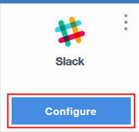

---

copyright:
  years: 2015, 2017
lastupdated: "2017-3-23"

---

{:shortdesc: .shortdesc}
{:new_window: target="_blank"}

# Using toolchains
{: #toolchains-using}

Toolchains are available in the Public and Dedicated environments on {{site.data.keyword.Bluemix}}. You can use a toolchain to be productive in your daily development, deployment, and operations work. After you set up a toolchain, you can add, delete, or configure tool integrations and manage access to the toolchain. On {{site.data.keyword.Bluemix_notm}} Public, toolchains are available in the US South region only.
{: shortdesc}

## Configuring a tool integration
{: #configuring_a_tool_integration}

If you deferred the configuration of a tool integration when you created a toolchain, a **Configure** button is shown on its card. If you configured a tool integration when you created a toolchain, you can update the configuration settings.

1. On the DevOps dashboard, on the **Toolchains** page, click a toolchain to open its Overview page. Alternatively, on the app's Overview page, on the Continuous delivery card, click **View Toolchain**, and then click **Overview**.
1. If you need to configure a tool integration for the first time, on its card, click **Configure**.

  

 When you are finished configuring the tool integration, click **Save Integration**.

1. If you need to update a tool integration's configuration, on its card, click the menu to access the configuration options.

  

 **Tip**: A few of the tool integrations are preconfigured and don't require any configuration parameters. You can update the configuration settings for only the tool integrations that you configured.

 When you are finished updating the settings, click **Save Integration**.

## Adding a tool integration
{: #adding_a_tool_integration}

You can add and configure tool integrations for your toolchain. The available tool integrations differ depending on whether you use {{site.data.keyword.Bluemix_notm}} Public or {{site.data.keyword.Bluemix_notm}} Dedicated.

1. On the DevOps dashboard, on the **Toolchains** page, click a toolchain to open its Overview page. Alternatively, on the app's Overview page, on the Continuous delivery card, click **View Toolchain**, and then click **Overview**.
1. To see a list of tool integrations to add, click **Add a Tool**.
1. Click a tool integration that you want to add.
1. Enter any required information to configure the tool integration.
1. Click **Create Integration** to add the tool integration to your toolchain.

## Deleting a tool integration
{: #deleting_a_tool_integration}

If you delete a tool integration from your toolchain, the deletion cannot be undone.

1. On the DevOps dashboard, on the **Toolchains** page, click a toolchain to open its Overview page. Alternatively, on the app's Overview page, on the Continuous delivery card, click **View Toolchain**, and then click **Overview**.
1. On the card for the tool integration that you want to delete, click the menu to access the configuration options.
1. To delete the tool integration from your toolchain, click **Delete**.
1. Confirm by clicking **Delete**.  

## Managing access
{: #managing_access}

You can grant users access to a toolchain by adding them to both the organization (org) that the toolchain is associated with and the access control list for the toolchain. Each toolchain is associated with a specific org, and any user that is a member of that org can be added to the access control list for any of the associated toolchains. The org that you are currently working in is displayed on the menu bar. To access a different set of toolchains, switch to a different org.

If you are using {{site.data.keyword.Bluemix_notm}} Dedicated for {{site.data.keyword.ghe_short}}, when you add users to your {{site.data.keyword.Bluemix_notm}} org and spaces, the users can log in to {{site.data.keyword.ghe_short}} by using their {{site.data.keyword.Bluemix_notm}} ID and password. When the users log in, accounts are created for them. When you add users to your {{site.data.keyword.Bluemix_notm}} org and spaces, they are not automatically added to the {{site.data.keyword.ghe_short}} repo. Someone who has admin privileges for the repo must add them. For more information, see [Using Dedicated GitHub Enterprise](/docs/services/ghededicated/index.html){: new_window}. If you are using your own managed version of {{site.data.keyword.ghe_short}}, follow your internal procedures.

###Tips for managing access to a toolchain

* To manage toolchain access, on the DevOps dashboard, on the **Toolchains** page, click the toolchain to manage and then click **Manage**. Alternatively, on the app's Overview page, on the Continuous delivery card, click **View Toolchain** and then click **Manage**.

* To grant access to all of the members of the toolchain's org, click **Add org**. All of the members of that org can view the toolchain.

* You can grant admin privileges to an org or a user. Admins can modify and delete the toolchain. To grant admin privileges, select the **ADMIN** check box for the org or user.

* If you select the **ADMIN** check box for an org, all of the members of that org become admins. If you add members to the org after you grant admin privileges to the org, those members are given the same access as the rest of the org.

* To grant access to a user who is a member of the toolchain's org, enter the user's ID and click **Add user**. The user can view the toolchain.

* To grant access to a user who is not a member of the toolchain's org, follow these steps:

   a. From the menu bar, click **Manage > Account > Organizations**.

   b. Click **Invite Team Members**.
   
   c. Select the org that you want to invite the user to and click **Next**.
   
   d. Select the spaces that you want to allow the user to access.
   
   e. Select the role to assign for the selected spaces in the org. 
   
     **Note**: By default, org managers have full admin privileges for all of the toolchains that are associated with the org. To grant full admin privileges to the user, select the **Manager** role. The Billing Manager and Auditor roles do not affect toolchain access. You can change the roles later on the Team Directory page. For more information, see [Managing team members and roles](/docs/admin/users_roles.html){: new_window}.
   
   f. Select the option to confirm that you take financial responsibility for all charges that are incurred on the account.
   
   g. Enter the email address of the user that you want to invite and click **Send**.

   h. After the user is a member of the org, return to the toolchain's Manage page and add the user to the toolchain.  

## Deleting a toolchain
{: #deleting_a_toolchain}

You can delete a toolchain and specify which of the associated tool integrations you want to delete. When you delete a toolchain, the deletion cannot be undone.

1. On the DevOps dashboard, on the **Toolchains** page, click the toolchain to delete. Alternatively, on the app's Overview page, on the Continuous delivery card, click **View Toolchain**.
1. Click the **More Actions** menu, which is next to **View app**.
1. Click **Delete** and review or adjust the tool integrations that you are deleting.
1. Confirm the deletion by typing the name of the toolchain and clicking **Delete**.  

 **Tip**: When you delete a GitHub, {{site.data.keyword.ghe_short}}, or Git Repos and Issue Tracking tool integration, the associated repo is not deleted from GitHub, {{site.data.keyword.ghe_short}}, or Git Repos and Issue Tracking. You must manually remove the repo.

# Related Links
{: #rellinks}

## Tutorials and Samples
{: #samples}

* [Learning Lab](https://www.ibm.com/devops/method/category/courses){:new_window}

## Related Links
{: #general}

* [{{site.data.keyword.contdelivery_full}}](https://www.ibm.com/devops/method/content/deliver/tool_continuous_delivery/){:new_window}
* [IBM Cloud Garage Method](https://www.ibm.com/devops/method){:new_window}
