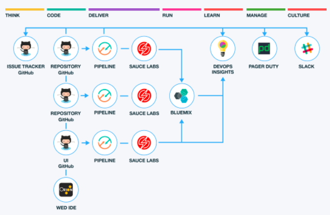

---

copyright:
  years: 2015, 2017
lastupdated: "2017-3-14"

---

{:shortdesc: .shortdesc}
{:new_window: target="_blank"}

# Working with toolchains
{: #toolchains_getting_started}

A *toolchain* is a set of tool integrations that support development, deployment, and operations tasks. The collective power of a toolchain is greater than the sum of its individual tool integrations.
{: shortdesc}

Toolchains are available in the Public and Dedicated environments on {{site.data.keyword.Bluemix}}. You can create a toolchain in two ways: use a template to create a toolchain or create a toolchain from an app. On {{site.data.keyword.Bluemix_notm}} Public, toolchains are available in the US South region only.

Each toolchain is associated with a specific organization (org), and any user that is a member of that org can be added to the access control list for any of its associated toolchains. For more information about access control for toolchains, see [Managing access](/docs/services/ContinuousDelivery/toolchains_using.html#managing_access){: new_window}. Before you create a toolchain, make sure that you are working in the org where you want to create the toolchain. The org that you are working in is displayed on the menu bar. To switch to another org, click the org in the menu bar and select the org that you want to switch to.

##Creating a toolchain from a template   
{: #creating_a_toolchain_from_a_template}

You can use a template as a starting point to [create a toolchain](https://console.ng.bluemix.net/devops/create){: new_window} that includes a specific set of tool integrations. Learn more about how to use the templates from the [IBM Bluemix Garage Method](https://www.ibm.com/devops/method/category/tools){:new_window}.

1. If you use {{site.data.keyword.Bluemix_notm}} Public, log in to [{{site.data.keyword.Bluemix_notm}}](http://console.ng.bluemix.net){:new_window}.
1. If you use {{site.data.keyword.Bluemix_notm}} Dedicated, log in to your Dedicated environment on {{site.data.keyword.Bluemix_notm}}.
1. From the hamburger menu, click **Services** and then click **DevOps**.
1. On the DevOps dashboard, on the **Toolchains** page, click **Create a Toolchain**.
1. On the **Create a Toolchain** page, click a toolchain template.
1. Review the diagram of the toolchain that you are about to create. The diagram shows each tool integration in its lifecycle phase in the toolchain.

 **Tip**: A few of the toolchain templates have multiple instances of a tool integration. For example, the Microservices toolchain template on {{site.data.keyword.Bluemix_notm}} Public contains three instances of GitHub and three instances of Delivery Pipeline, one for each of the three microservices.

 The diagram in the following image is an example. When you create a toolchain, the diagram shows each tool integration that is part of the toolchain.

1. Review the default information for the toolchain settings. The toolchain's name identifies it in {{site.data.keyword.Bluemix_notm}}. If you want to use a different name, change the toolchain's name.  
1. In the Configurable Integrations section, select each tool integration that you want to configure for your toolchain. A few of the tool integrations do not require configuration. For information about configuring the tool integrations, see [Configuring tool integrations](/docs/services/ContinuousDelivery/toolchains_integrations.html){: new_window}.
1. Click **Create**. Several steps run automatically to set up your toolchain. The tool integrations that are set up are different depending on which toolchain template you selected and whether you are using {{site.data.keyword.Bluemix_notm}} Public or {{site.data.keyword.Bluemix_notm}} Dedicated. For example, when you create a Microservices toolchain on {{site.data.keyword.Bluemix_notm}} Public, these steps are run:

 * The toolchain is created.
 * If you configured Delivery Pipeline, the pipelines are created and triggered.
 * If you configured Sauce Labs, the toolchain is set up to add Sauce Labs test jobs to the pipelines.
 * If you configured PagerDuty, the toolchain is set up to send alert notifications to the PagerDuty service that you specified.
 * If you configured Slack, the toolchain is set up to send notifications about deployment status to the Slack channel that you specified.
 * If you configured GitHub, the sample GitHub repo is cloned into your GitHub account.

##Creating a toolchain from an app
{: #creating_a_toolchain_from_an_app}

You can create a toolchain from your app. The toolchain can support continuous development, deployment, monitoring, and more, and it is associated with your app. Each app can be associated with a toolchain. When you push changes to the toolchain's GitHub or {{site.data.keyword.ghe_short}} repo, the pipeline automatically builds and deploys the app.  

1. On your app's Overview page, on the Continuous delivery card, click **Enable**. If you use {{site.data.keyword.Bluemix_notm}} Public, your app is configured for continuous delivery from a new GitHub repo that is populated with the app starter code. If you use {{site.data.keyword.Bluemix_notm}} Dedicated, your app is configured for continuous delivery from a new GitHub or {{site.data.keyword.ghe_short}} repo that is populated with the app starter code.
1. On the toolchain creation page, review the diagram of the toolchain that you are about to create. The diagram shows each tool integration in its lifecycle phase in the toolchain.
1. Review the default information for the toolchain settings. The toolchain's name identifies it in {{site.data.keyword.Bluemix_notm}}. If you want to use a different name, change the toolchain's name.
1. In the Configurable Integrations section, select each tool integration that you want to configure for your toolchain. A few of the tool integrations do not require configuration. For information about configuring the tool integrations, see [Configuring tool integrations](/docs/services/ContinuousDelivery/toolchains_integrations.html){: new_window}.
1. Click **Create**.  Several steps run automatically to set up your toolchain. The tool integrations that are set up are different depending on whether you are using toolchains on {{site.data.keyword.Bluemix_notm}} Public or {{site.data.keyword.Bluemix_notm}} Dedicated. For example, when you create a toolchain from an app on {{site.data.keyword.Bluemix_notm}} Public, these steps are run:

 * The toolchain is created.
 * If you configured Delivery Pipeline, the pipelines are created and triggered.
 * If you configured GitHub, the sample GitHub repo is cloned into your GitHub account.

##Viewing a toolchain
{: #viewing_a_toolchain}

After you configure the toolchain and its tool integrations, you can view a visual representation of the toolchain.

1. On the DevOps dashboard, on the **Toolchains** page, click the toolchain to open its Overview page. Alternatively, on the app's Overview page, on the Continuous delivery card, click **View Toolchain**. Then, click **Overview**.
2. To access a tool integration that is in your toolchain, click the tool.

 **Tip**: If you have more than one GitHub or {{site.data.keyword.ghe_short}} repo, you might have multiple cards for the same tool integration because each repo is represented by its own card. If you have more than one pipeline, you might have multiple cards for the same tool integration because each pipeline is represented by its own card. For example, when you create a Microservices toolchain, each of the three microservices has its own GitHub or {{site.data.keyword.ghe_short}} repo and its own pipeline.

# Related Links
{: #rellinks}

## Tutorials and Samples
{: #samples}

* [Learning Lab](https://www.ibm.com/devops/method/category/courses){:new_window}

## Related Links
{: #general}

* [{{site.data.keyword.contdelivery_full}}](https://www.ibm.com/devops/method/content/deliver/tool_continuous_delivery/){:new_window}
* [IBM Cloud Garage Method](https://www.ibm.com/devops/method){:new_window}
