---

copyright:
  years: 2015, 2017
lastupdated: "2017-4-24"

---
 
{:shortdesc: .shortdesc}
{:new_window: target="_blank"}

# Upgrade your {{site.data.keyword.jazzhub_short}} project to a toolchain
{: #upgrade_projects}

{{site.data.keyword.jazzhub}} is evolving into {{site.data.keyword.contdelivery_full}}. As part of that change, projects will be upgraded to toolchains. 

You can upgrade your project or wait for it to be automatically upgraded. For the best experience, make sure that you meet the [prerequisites](#upgrade_prereqs) and upgrade your project as soon as possible so that you can control what your toolchain's name is and which organization it is created in. 
{: shortdesc}

## Toolchains
{: #compare_toolchains}

Toolchains are like projects, with a few important differences:

- Projects can have only one repository (repo) and pipeline. Toolchains can have as many repos and pipelines as you need.
- Toolchains can include tools that aren't available in projects, such as Slack, Sauce Labs, PagerDuty, and {{site.data.keyword.DRA_full}}.
- Access to toolchains is managed through standard Bluemix organizations. Membership is maintained at the organization level, unlike projects, where membership was maintained at the project level.

You can learn about toolchains on [YouTube ](https://youtu.be/2SIPE1e7NJ4){: new_window} or from [Getting started with {{site.data.keyword.contdelivery_short}}](/docs/services/ContinuousDelivery/index.html).
[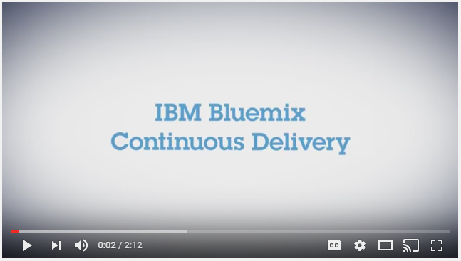](https://youtu.be/2SIPE1e7NJ4){: new_window}    

## Prerequisites
{: #upgrade_prereqs}    

- To acess your upgraded project's toolchain, you need a Bluemix ID. Before you upgrade, you must verify that you have an active Bluemix ID. If you don't have one, [sign up](https://console.ng.bluemix.net/registration/).
- Make sure that your DevOps Services project owner is correct. The toolchain that is created from your project will be part of that owner's Bluemix organization.

**Important:** 
- If you're planning to start the upgrade, make sure that you're a member of every org and space that the pipeline deploys to. Any project admin can start the upgrade. However, if the admin who starts the upgrade is not a member of every org and space that the pipeline deploys to, the pipeline cannot be created.
- The Eclipse Orion {{site.data.keyword.webide}} in the toolchain is separate from the {{site.data.keyword.webide}} that is associated with your project. If you use the {{site.data.keyword.webide}} and you have uncommitted changes, commit them before you upgrade.  

## Upgrading from a project to a toolchain
{: #project_to_toolchain}

When your project is ready to be upgraded, a message is displayed on the project's card and Overview page.

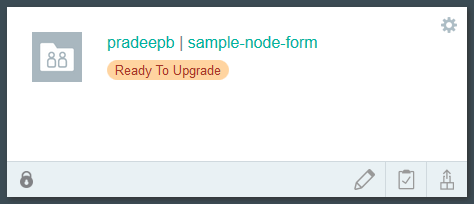

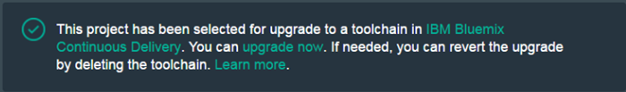

**Tip:** You can find projects that are ready to upgrade from the menu on the My Projects page: 

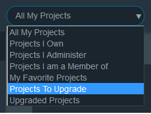

## Starting the upgrade process
{: #start_upgrade}

Before you start the upgrade process, you can watch it in action on [YouTube ](https://youtu.be/LSr2e3uvyLs){: new_window}. 
[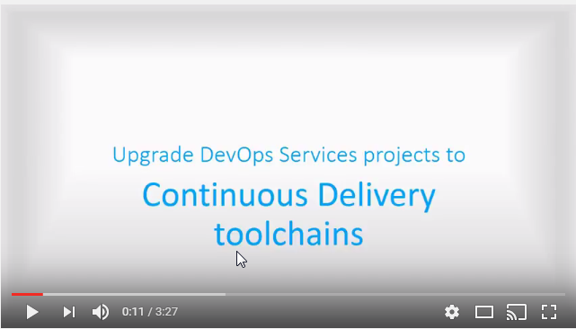](https://youtu.be/LSr2e3uvyLs){: new_window}    
To upgrade your project to a toolchain, follow these steps:

1. To start the upgrade process, on the banner message, click **upgrade now**. The "Project upgrade toolchain" page opens. 

   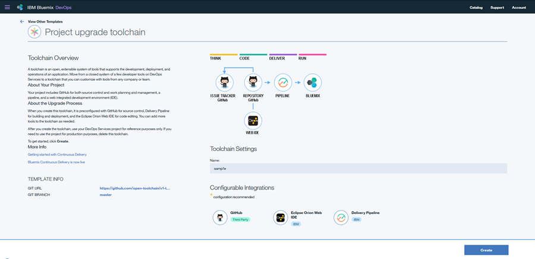

   For an overview of the upgrade process, read the description on that page. In this case, because the project used a repo at GitHub.com, the toolchain will be connected to the same GitHub repo. If your project used a Git repo that was hosted on JazzHub, the toolchain will clone its contents to a new repo in Git Repos and Issue Tracking, which is part of {{site.data.keyword.contdelivery_short}}. If your project used a private Git repo that was hosted on JazzHub, the new repo in Git Repos and Issue Tracking will be private.
   
   The toolchain will include a new pipeline that contains the same stages and jobs as the project's pipeline. In addition, the toolchain will contain a pointer to the Eclipse Orion {{site.data.keyword.webide}} that runs in {{site.data.keyword.contdelivery_short}}.

2. To customize the toolchain, you can configure a few settings:

   - To change the name of the toolchain, edit the **Name** field.

      

   - To change which {{site.data.keyword.Bluemix_notm}} organization to create the toolchain in, select the organization from your account menu:

      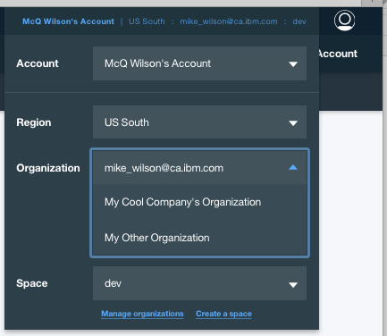

   Because toolchains are managed at the organization level, be sure to select an organization where the project members that need to access the toolchain already exist, or can be added. 

3. If you used Track & Plan in your project, you can transfer your Track & Plan data to GitHub Issues.

   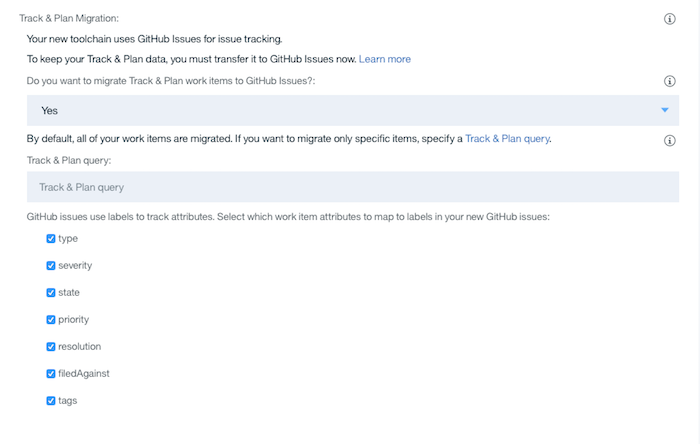

   - Indicate whether you want to migrate your Track & Plan data. 
   - By default, all of your Track & Plan data is migrated. If you prefer to migrate only the work items that are part of a specific query, specify that query.
   - Select any work item attributes that you want to map to labels in GitHub Issues.
  
4. Click **Create**. The new toolchain is created, and its Overview page is displayed.

   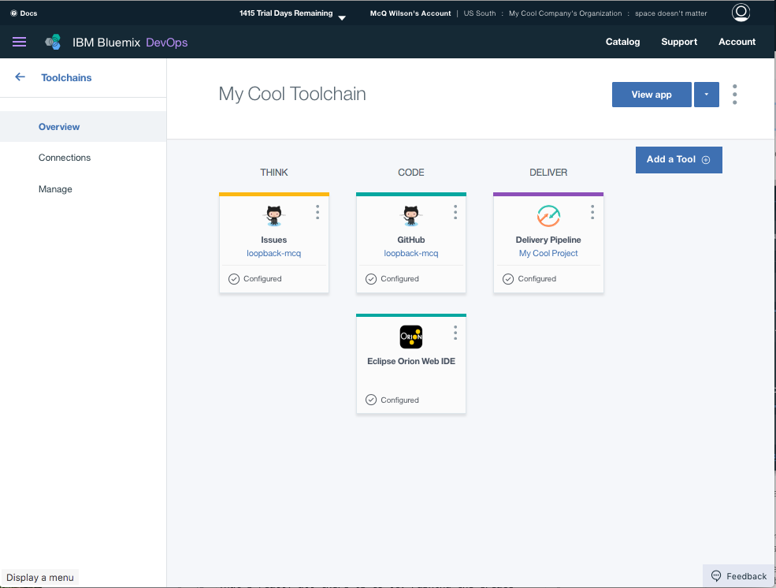
   
   - To access your GitHub repo or the associated issue tracker, click **GitHub** or **Issues**.
   - To access your pipeline, click **Delivery Pipeline**.  
   - To access the {{site.data.keyword.webide}}, which contains the contents of your repo that were checked out into the workspace, click **Eclipse Orion {{site.data.keyword.webide}}**. 
   
   If you return to your project during the upgrade, the banner message might state that the upgrade is in progress, especially if the upgrade process involves importing source code to a new repo or importing Track &amp; Plan work items as issues. 
   
   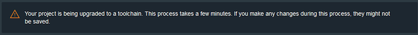

## Revisiting your project
{: #revisit_projects}

You are ready to use your new toolchain. Your project is now labeled as "Upgraded," and on the Overview page, a confirmation message is displayed.

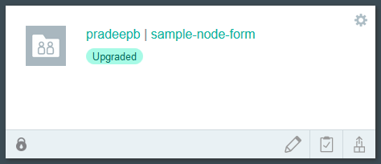

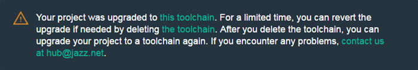

You can see which projects are upgraded by selecting **Upgraded Projects** from the menu on the My Projects page:

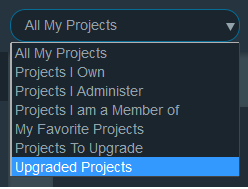

If you need to revert the upgrade, delete your toolchain. Then, when you return to the project's Overview page, the upgrade message is displayed again, and you can upgrade again when you are ready.

## Next steps
{: #upgrade_next_steps}   

1. Confirm that the upgrade is complete by refreshing your browser and checking for the message that your project was "upgraded to this toolchain" on the project Overview page:    

    
   
   **Note:** If the message says "upgrade now," your upgrade failed. Click the **upgrade now** link to try again. 
   
   

2. Give your team members access to the toolchain.    
    - Each team member must have a valid Bluemix account. Team members who don't have accounts must [sign up ](https://console.ng.bluemix.net/registration){:new_window}.
    - Grant organization (org) members access to the toolchain from the toolchain Manage page. For more information about access control for toolchains, see [Managing access ](/docs/services/ContinuousDelivery/toolchains_using.html#managing_access){:new_window}.
    - If a user is not a member of the org that the toolchain belongs to, add them to the org from the Manage Organizations page.
      For more information about managing organizations, see [Managing organizations and spaces ](/docs/admin/orgs_spaces.html#orgsspacesusers){:new_window}.
    
3. Use the tools from your toolchain instead of the tools from your {{site.data.keyword.jazzhub_short}} project. For example, to edit code from a browser, use the Web IDE from your toolchain.    

## Troubleshooting
{: #upgrade_troubleshoot}    

If you have questions or problems, send an email to [hub@jazz.net](mailto:hub@jazz.net). In your email, include the URLs to your {{site.data.keyword.jazzhub_short}} project and your {{site.data.keyword.contdelivery_short}} toolchain.
