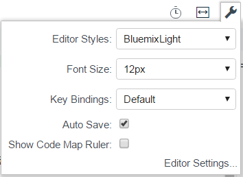
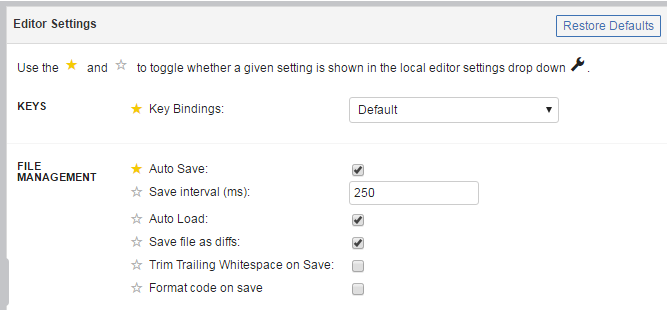
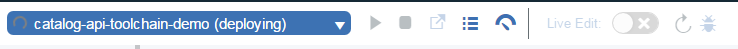

---

copyright:
  years: 2015, 2017
lastupdated: "2017-3-31"
---

{:new_window: target="_blank"}
{:shortdesc: .shortdesc}
{:screen:.screen}
{:codeblock:.codeblock}
{:pre: .pre}

# Editing code with the Eclipse Orion {{site.data.keyword.webide}}
{: #web_ide}

The Eclipse Orion {{site.data.keyword.webide}} is a browser-based development environment where you can develop for the web. You can develop in JavaScript, HTML, and CSS with the help of content assist, code completion, and error checking. The {{site.data.keyword.webide}} works with nearly any language and offers syntax highlighting for most file types. Source control is built in, and you can deploy code locally to test and debug your apps.
{:shortdesc}

Best of all, the {{site.data.keyword.webide}} is powered by the web. You have nothing to install, nothing to maintain, and nothing to scale. You can develop anywhere that you have an internet connection.

## Setting up the editor
{: #editorsetup}

The {{site.data.keyword.webide}} is customizable so that you can choose the color schemes, technical tools, and settings that meet your development needs. To view and modify the settings, from the menu on the left, click the **Settings** icon .

If you often need to change certain settings while you edit, you can access those settings quickly from the **Local Editor Settings** icon . 



By default, the settings for the editor style and font size are always shown. To include other editor settings in the menu, follow these steps:

1. Click the **Local Editor Settings** icon .

2. Click **Editor Settings**.

3. To include or exclude a setting from the **Local Editor Settings** menu, click the star next to each setting.




## Editing code
{: #editcode}

The {{site.data.keyword.webide}} has two main sections. The first section is the file navigator, which shows your project files in a tree structure. From the file navigator, you can create, rename, delete, and manage your files and folders.

**Tip:** To upload files to the file navigator, drag them from your computer to the file navigator.

The second section is the editor pane. The editor provides several coding features, including content assist and syntax validation.


### Working with multiple files
1. To work with two files at the same time, click the **Change split editor mode** icon .
2. From the menu that opens, select a view.

 After you select a view, if a file was already open in the editor, it is shown in both editor views.

 To open or change a file that is shown in one of the editor views:
 1. Move the cursor to the editor view that you want to change.
 2. In the file navigator, click a file.

### Keyboard shortcuts
Most of the commands in the {{site.data.keyword.webide}} are accessible only through keyboard shortcuts.

To see a list of the keyboard shortcuts in the editor, press Alt+Shift+?. If you're using a Mac OS, press Ctrl+Shift+?.

## Managing source code
{: #sourcecontrol}

The {{site.data.keyword.webide}} is integrated with source code management tools. To work with your Git repository, click the **Git Repository** icon . 

 **Tip**: If you are using the {{site.data.keyword.webide}} with open toolchains, your workspace is pre-populated with your GitHub,  {{site.data.keyword.ghe_short}}, or Git Repos and  Issue Tracking repos. The repos that are associated with your current toolchain are highlighted.


## Deploying an app from your workspace
{: #deploy}

1. To deploy your app, from the run bar, either select or create a launch configuration.
1. Click the deploy icon . An instance of your app is deployed by using the current contents of your workspace and the environment that is defined in your launch configuration. 
2. After your app is deployed, you can use the run bar to stop, restart, or debug your app, view logs, and more.
    

<!-- 3/6/2016: bl commands don't work with V2/CD 
## Editing outside of the {{site.data.keyword.webide}}
{: #editlocal}

To use an editor besides the {{site.data.keyword.webide}}, set up {{site.data.keyword.Bluemix_live}} so that you can work directly with your project files in any tool. {{site.data.keyword.Bluemix_live_notm}} is a command-line application that synchronizes the changes in your local file system with your cloud workspace in {{site.data.keyword.jazzhub}}. 

### Before you begin 

Download and install the [{{site.data.keyword.Bluemix_live_notm}} command-line interface](http://livesyncdownload.ng.bluemix.net){: new_window}.

### Synchronizing your local environment with {{site.data.keyword.Bluemix_notm}}
{: #edit_local_download}

1. Open a command-line window.
2. Sign in to {{site.data.keyword.Bluemix_notm}}:

	```
	bl login
	```
	{: pre}

3. When you are prompted, enter your IBMid and password.
4. View a list of your {{site.data.keyword.Bluemix_notm}} projects: 

	```
	bl projects
	```
	{: pre}

4. Synchronize your local environment with your project on {{site.data.keyword.Bluemix_notm}}:

	```
	bl sync projectName
	```
	{: pre}

where `projectName` is your {{site.data.keyword.Bluemix_notm}} app's name.

When you are finished editing, enter `q` to end synchronization.

### Enabling the Desktop Sync feature to edit code locally

The Desktop Sync feature is like Live Edit mode for the command line. You need the Desktop Sync feature to debug on the command line.
1. In another command-line window, enable the Desktop Sync feature:

	```
	cd localDirectory
	bl start
	```
	{: codeblock}

2. Use the launch configuration that you created in the {{site.data.keyword.webide}}. After you select the launch configuration, the Desktop Sync feature is enabled in your local environment. In the command-line window that you just opened, you can view the app's URL, the debug URL, the manage URL, and view the {{site.data.keyword.Bluemix_live_notm}} state.

3. Refresh the browser and verify that you can see the changes that you saved to static files in the local workspace. 

### Disabling the Desktop Sync feature

1. In the second command-line window, enter `bl stop`.
2. In the first command-line window, enter `q`.

--> 
