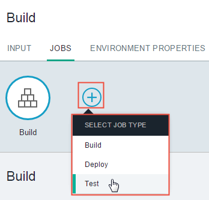
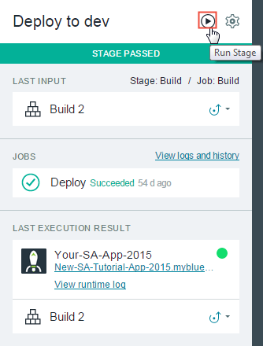
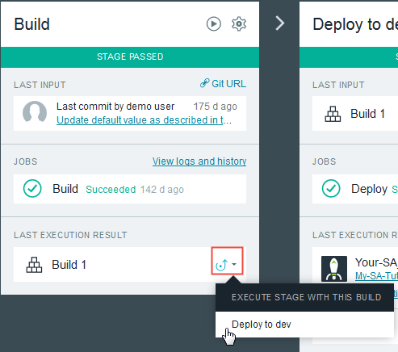
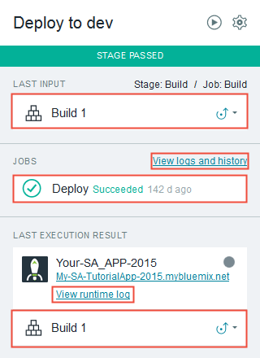
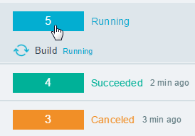

---

copyright:
  years: 2016

---
<!-- Copyright info at top of file: REQUIRED
    The copyright info is YAML content that must occur at the top of the MD file, before attributes are listed.
    It must be --- surrounded by 3 dashes ---
    The value "years" can contain just one year or a two years separated by a comma. (years: 2014, 2016)
    Indentation as per the previous template must be preserved.
-->

{:new_window: target="_blank"}
{:shortdesc: .shortdesc}
{:screen:.screen}
{:codeblock:.codeblock}

# Building and deploying from pipelines
{: #deliverypipeline_build_deploy}
*Last updated: 13 May 2016*

The IBM&reg; Bluemix&reg; {{site.data.keyword.deliverypipeline}} service allows you to implement a repeatable continuous integration and continuous delivery process.
{:shortdesc}

Complete the following tasks to create and configure a pipeline.

## Adding a stage
{: #deliverypipeline_add_stage}

1. On the Pipeline: All Stages page, click **ADD STAGE**. The Stage Configuration page opens.
2. Configure the stage.
  1. On the **INPUT** tab, select an input for the stage.
  2. On the **JOBS** tab, add and configure at least one job. The first stage usually has at least a build job.
3. Click **SAVE**.

## Adding a job to a stage
{: #deliverypipeline_add_job}

1. On the stage, click the **Stage Configuration** icon, and then click **Configure Stage**.
2. Click the **JOBS** tab.
3. Click **ADD JOB**. Select the type of job to add.
4. Configure the job.
5. Click **SAVE**.

## Running a stage
{: #deliverypipeline_run_stage}

You can manually run a stage by clicking the **Run Stage** icon on the Pipeline: All Stages page.

You can also request on-demand builds and deployments from the build history page in one of two ways:
* Drag a build to the box that is under a configured stage.
* Next to a build, click the **Send to** icon and then select a space to deploy to.
  

To cancel a running stage, on the stage, click **View logs and history**. In the list on the left, click the running job's number and then click **CANCEL**. You can also cancel jobs individually by clicking a job and then clicking **CANCEL**, or by clicking the **Stop** icon next to a job on its stage.

## Deploying an app
{: #deliverypipeline_deploy}

A properly configured deploy job deploys your app to your target whenever the job is run. To manually run a deploy job, click the **Run Stage** icon of the stage that the job is in.

###Input revisions
When you run a stage manually, or if it runs because the stage before it is completed, the running stage selects its input revision. Usually, the input revision is a build number. To select the input revision, the stage follows this process:

1. If a specific revision is selected, use it.
2. If a specific revision is not specified, search previous stages until a stage is found that uses the same input. Find and use the last successfully run revision of that input.
3. If a specific revision is not specified and no other stages use the specified source as input, use the latest revision of the input.

**Tip:** You can deploy a previous build. On the stage that contains the build, click **View logs and history**. On the page that opens, select the build. Click **SEND TO**, and select a target.

###Adding services to apps
You can add services to your apps and manage those services from your Bluemix Dashboard or the Cloud Foundry command line interface (CLI). You can also issue Cloud Foundry CLI commands in scripts for DevOps Services pipeline jobs. For example, you can add a service to an app in the script of a deploy job. For more information about adding services, [see Adding a service to your application](https://www.ng.bluemix.net/docs/services/reqnsi.html#add_service).

## Viewing logs
{: #deliverypipeline_view_logs}

You can view the logs for jobs and view stages as they are running on the Stage History page.

To view a job's log, click the job. Alternatively, on a stage, click **View logs and history**.

To view the runtime log, click **View runtime log**.

In addition to job logs, you can view unit test results, generated artifacts, and code changes for any build job.

You can also run, cancel, or configure a stage from the Stage History page. At the top of the page, click **RUN** to run a stage or **CONFIGURE** to configure a stage. While a stage is running, you can cancel it by clicking the run number and then clicking CANCEL.

<!--
[1]: https://www.ng.bluemix.net/docs/manageapps/deployingapps.html#appmanifest
[2]: https://www.ng.bluemix.net/docs/#services/DeliveryPipeline/index.html#getstartwithCD
[3]: http://docs.cloudfoundry.org/devguide/installcf/whats-new-v6.html#push
[4]: https://console.ng.bluemix.net/?ace_base=true/#/pricing/cloudOEPaneId=pricing
[5]: ./images/open_logs.png
[6]: #manifests
[7]: ./images/runbar-annotated-dark.png
[8]: ./images/input_tab_only_execute.png
[9]: ./images/deploy_to.png
[10]: ./images/view_logs_and_history.png
[11]: ./images/play_button.png
[12]: ./images/basicAnimate.gif
[13]: ./images/AddStage.png
[14]: ./images/AddJob.png
[15]: ./images/jobs.png
[16]: ./images/RunStage.png
[17]: https://www.ng.bluemix.net/docs/starters/container_pipeline.html#container_pipeline
[18]: ../../../tutorials/basicbuild
[19]: #add_stage
[20]: #add_job
[21]: ../deploy_ext
[22]: ./images/pipeline_settings_icon.png
[23]: ./images/pipeline_settings.png
[24]: https://www.ng.bluemix.net/docs/services/reqnsi.html#add_service
[25]: ../deploy_var
[26]: ./images/click_stage_run_number.png
[27]: ./images/diagram.jpg

-->
