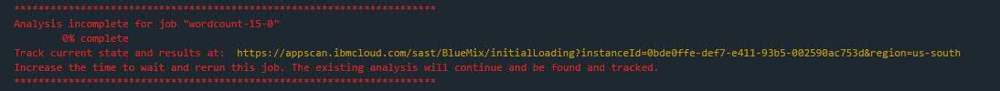

---

copyright:
  years: 2015, 2016

---

<!-- Copyright info at top of file: REQUIRED
    The copyright info is YAML content that must occur at the top of the MD file, before attributes are listed.
    It must be --- surrounded by 3 dashes ---
    The value "years" can contain just one year or a two years separated by a comma. (years: 2014, 2016)
    Indentation as per the previous template must be preserved.
-->

{:new_window: target="_blank"}
{:shortdesc: .shortdesc}
{:screen:.screen}
{:codeblock:.codeblock}

# Extending the {{site.data.keyword.deliverypipeline}} service

{: #deliverypipeline_extending}

*Last updated: 29 April 2016*

You can extend the capabilities of the {{site.data.keyword.deliverypipeline}} service by configuring your jobs to use supported services. For example, test jobs can run static code scans and build jobs can globalize strings.
{:shortdesc}

<!-- Include a sentence to briefly introduce the steps/subtopics. Example: -->

The following tasks describe how to integrate selected tools with a Delivery Pipeline.

## Running static code scans by using the pipeline

{: #deliverypipeline_scan}

Want to find security issues in your code before you deploy it? When you use the IBM® Static Analyzer for Bluemix™ as part of your pipeline, you can run automated checks against your Java™ app's static `.war`, `.ear`, `.jar`, or `.class` build binary files.

A pipeline that uses the Static Analyzer service typically includes these stages:

+ A build stage to build the source files
+ A processing stage that includes these jobs:
  + A build job to run the Static Analyzer service
  + A build job to run a container build
+ A deploy stage to deploy the container


### Creating a static code scan

Before you begin, [review the Terms of Use for the service](http://www-03.ibm.com/software/sla/sladb.nsf/sla/bm-6814-01).

<!-- Use ordered list markup for the step section. Include code examples as needed. -->

1. Create a processing stage.

  a. Click **ADD STAGE**.

  b. Name the stage, for example, `Processing`.

  c. For the input type, select **Build Artifacts**.

  d. For the stage and job, verify the values and update them if needed.

2. In the processing stage, add a build job to run the code scan.

  a. On the **JOBS** tab, click **ADD JOB**.

  b. For the job type, select the **Test**.

  c. For the tester type, select **IBM Security Static Analyzer**.

  d. For the organization and space, verify the values and update them if needed.

  e. Select or clear the **Set up service and space for me** check box as needed.

    * If you want the pipeline to check your Bluemix space for the service and an app that binds the service to the container, select the check box. If the service or bound app does not exist, the pipeline adds the free plan of the service to your space. The bound app that is created is named `pipeline_bridge_app`. Then, the pipeline uses the credentials from pipeline_bridge_app to access the bound services.

    * If you already configured the service and bound app in your Bluemix space already, or if you want to [configure these requirements manually](https://www.ng.bluemix.net/docs/containers/container_group_pipeline_ov.html#container_binding_pipeline), leave the check box cleared.

  f. In the **Minutes to wait for analysis to complete** field, type a value of 0 - 59 minutes. The default value is 5 minutes. A URL to the Static Analyzer dashboard is in the console logs at the end of the job.

     If the Static Analyzer scan is not complete before the time that you specified, the job fails. However, the scan analysis continues to run and you can view it on the Static Analyzer dashboard. After the Static Analyzer scan is complete, if you rerun the job, the scan request is not resubmitted and the pipeline job can be completed. Alternatively, you can configure the pipeline not to be blocked on a successful scan result. For instructions, see the next step.

  g. Select or clear the **Stop stage execution on job failure** check box depending on what you want to happen if this job fails or times out. Jobs can fail when vulnerabilities are high.

    * If you select the check box and the job fails, later jobs in the stage and later stages do not run.

    * If you clear the check box and the job fails, the stage continues without blocking later jobs and stages. For example, if you know that the report includes many issues to process, you might configure the stage to continue because the scan can take a long time. In this scenario, you might not want the rest of your jobs and stages to stop only because the scan is taking too long.

  h. Click **SAVE**.

3. When the job finishes, view the results by clicking **View logs and history**. If the analysis succeeds or times out, a URL is shown in the scan results. If the scan status is pending, wait until the scan is complete to see the full results.

4. If you need to run the processing stage again before the analysis is finished, you can. In the following situations, a new analysis is not resubmitted and the previous results are used:
  * The processing stage was still running when you started a new analysis
  * A scan was already submitted for the build
  * A new source build hasn't run yet

5. To start a new analysis, complete one of these steps:
  * Run the build stage that inputs into the processing stage, and then run the processing stage again.
  * Open the URL for the scan results and click the **Trash** icon. Then, run the processing stage again.

Console output examples:

**Successful scan**


**Pending scan**


For more information about using the Static Analyzer service, [see the Static Analyzer service docs](https://console.ng.bluemix.net/docs/services/ApplicationSecurityonCloud/index.html).

<!--

## Globalizing strings by using the pipeline
{: #deliverypipeline_globalize}

You can translate strings automatically into other languages when you use the IBM Globalization Pipeline service with your pipeline. IBM Globalization Pipeline uses machine translation to translate your source files as part of the pipeline's build and deployment process.

You can also update the machine-translated strings within the globalization project. A translator or native speaker of the language can then review the machine-translated strings to ensure that they are of a high quality.

To see an example of a typical pipeline that uses the Globalization Pipeline service, watch this video:

<iframe width="640" height="360" src="https://www.youtube.com/embed/UToj7FIomCg?feature=player_embedded" frameborder="0" allowfullscreen></iframe>

### Creating a globalization stage and job
Before you begin:

1. All English-translatable strings should be included in one or more `filename_en.properties` or `filename_en.json` files that all use the same name. For example: `messages_en.properties`.

2. If your messages are in `.json` files, remove the depth from the structure by removing any subkeys. To remove the subkeys, change instances of `{key: {subkey: value, subkey:value}}` to `{key:value, key:value}`.

To create the globalization stage and job:

1. Create a globalization stage.

  a. Click **ADD STAGE**.

  b. Name the stage; for example, `Globalization`.

  c. For the input type, select **SCM repository**.

2. In the globalization stage, add a job to translate the source files.

  a. On the **JOBS** tab, click **ADD JOB**.

  b. For the job type, select **Build**.

  c. For the builder type, select **IBM Globalization Pipeline**.

  d. For the organization and space, verify the values and update them if needed.

  e. In the **Source file name** field, type the name and extension of the `.properties` or `.json` input file. If you have files in different subdirectories, but they all have the same name, you need to type the file name once only. For example, if you have a `messages_en.properties` file in three directories, type `messages_en.properties` for the source file name, and all files with that name will be translated.

  f. Determine whether to select the **Set up service and space for me** check box.

    * If you want the pipeline to check your Bluemix space for the service and an app that binds the service to the container, select this check box. If the service or bound app does not exist, the pipeline adds the free plan of the service to your space for you. The bound app that is created is named `pipeline_bridge_app`. Then, the pipeline uses the credentials from pipeline_bridge_app to access the bound services.

    * If you configured the service and bound app in your Bluemix space already or if you want to [configure these requirements manually](https://www.ng.bluemix.net/docs/containers/container_group_pipeline_ov.html#container_binding_pipeline), leave this check box cleared.

  g. For the Globalization bundle prefix, enter a prefix for the bundle name, which is structured in this format: `<globalization_bundle_prefix>.path.to.source.file`. The pipeline job creates this Globalization bundle for you in the Globalization Pipeline service.

    **Tip:** Use the DevOps Services project name in the prefix so that the project can be identified easily in the Globalization Pipeline service.

  h. Click **SAVE**.

3. Create another stage to package your app. For the input of the job in this stage, use the IBM Globalization Pipeline job from the previous stage. Do not use the source as the input. The Globalization Pipeline job augments the source files with the machine-translated strings.

4. To ensure that the machine-translated content is included in the packaged app, create another stage to package the app in. For the input to that stage, include the Globalization Pipeline job.

The machine translated files are placed in the same directory as the source `.properties` or `.json` file. To view the files, click **Job > Artifacts**.

After the stage is completed, you can review the translated files from the console output. You can also direct translators to the files so that they can review the machine-translation output and provide revisions to improve quality. The revisions are stored in a Cloudant™ database and take precedence over any future machine translations of the same strings.

For more information about using the Globalization Pipeline service from the Bluemix Dashboard, [see the Globalization Pipeline service documentation](https://www.ng.bluemix.net/docs/services/GlobalizationPipeline/index.html).

-->

## Creating Slack notifications for builds in the pipeline
{: #deliverypipeline_slack}

You can send notifications about IBM Container Service, IBM Security Static Analyzer, and IBM Globalization build results from your Delivery Pipeline to your Slack channels.

Before you begin, create or copy a Slack WebHook URL:

1. Open the Slack Integration page for your team: `https://_project_name_.slack.com/services`
2. In the list of integrations, locate **Incoming WebHooks** and click **Add**.
3. Select a channel and click **Add Incoming WebHooks Integration**.
4. Add a **WebHook URL** or copy an existing one.

For more information, [see Incoming WebHooks in the Slack documentation](https://api.slack.com/incoming-webhooks).

To create Slack notifications:

1. In the pipeline, open the configuration for a stage.
2. In the **ENVIRONMENT PROPERTIES** tab, click **ADD PROPERTY**.
3. Select **Text property**.
4. Enter the name and a value for the environment property. Repeat to create multiple environment properties.

  _Table 1. Environment properties for configuring Slack notifications_

  <table>
  <tr>
  <th>Name</th>
  <th>Value</th>
  <th>Description</th>
  <tr/>
  <tr>
    <td><code>SLACK_WEBHOOK_PATH</code></td>
    <td>A URL</td>
    <td>Required. The WebHook URL that is saved in the settings for your Slack Project.</td>
  </tr>
  <tr>
    <td><code>SLACK_COLOR</code></td>
    <td>You can enter one of the following values:
      <ul><li><code>good</code></li>
      <li><code>warning</code></li>
      <li><code>danger</code></li>
      <li>Any hexadecimal color, such as #439FEO</li></ul></td>
    <td>Optional. The color of the border that is displayed along the left side of the message in Slack. The default colors are green for good messages, red for bad messages, and gray for informational messages.</td>
  </tr>
  <tr>
    <td><code>NOTIFY_FILTER</code></td>
    <td>To receive only a subset of the message types, enter one of the following values:
      <ul>
      <li><code>good</code>: Get unknown, good and info messages only. Bad messages are not sent.</li>
      <li><code>bad</code>: Get all messages.</li>
      <li><code>info</code>: Get info messages only. Good, bad, and unknown messages are not sent.</li>
      <li><code>unknown</code>: Get all messages.</li></ul>
      Example: If you set <code>NOTIFY_FILTER = bad</code>, error notifications are only  displayed in the Slack Channel.</td>
    <td>Optional. Decide which type of messages to send notifications for. By default, good and bad messages are sent, but not informational messages.
      <ul><li><code>good</code>: Successful build results.</li>
      <li><code>bad</code>: Unsuccessful build results.</li>
      <li><code>info</code>: Informational messages about the build process.</li>
      <li><code>unknown</code>: Unknown messages are not assigned a type.</li></ul></td>
   </table>

5. Click **Save**.

6. Repeat these steps to send Slack notifications for other stages that include IBM Container Service, IBM Security Analyzer, and IBM Globalization jobs.

The build notification that is displayed in Slack includes a link to the DevOps Services project and sometimes to the project's dashboard. For a Slack user to open these links, the user must be registered with DevOps Services and be a member of the project that the pipeline is configured in.

## Creating HipChat notifications for builds in the pipeline
{: #deliverypipeline_hipchat}

You can send notifications about IBM Container Service, IBM Security Static Analyzer, and IBM Globalization build results from your Delivery Pipeline to your HipChat rooms.

Before you begin, create or copy and existing HipChat token:

1. Go to your HipChat Account page for your team: `https://_project_name_.hipchat.com/account/api`
2. Create a new token, or use an existing one.

To create HipChat notifications:

1. In the pipeline, open the configuration for a stage.
2. In the **ENVIRONMENT PROPERTIES** tab, click **ADD PROPERTY**.
3. Select **Text Property**.
4. Enter the name and a value for the environment property. Repeat to create multiple environment properties.

  _Table 2. Environment Properties for configuring HipChat notifications_

  <table>
  <tr>
  <th>Name</th>
  <th>Value</th>
  <th>Description</th>
  </tr>
  <tr>
    <td><code>HIP_CHAT_TOKEN</code></td>
    <td>Alphanumeric String</td>
    <td>Required. See above "Before you begin" for instructions on creating or copying an existing HipChat token.</td>
  </tr>
  <tr>
    <td><code>HIP_CHAT_ROOM_NAME</code></td>
    <td>Room name</td>
    <td>Required.</td>
  </tr>
  <tr>
    <td><code>HIP_CHAT_COLOR</code></td>
    <td>Enter one of the following values:
      <ul><li><code>yellow</code></li>
      <li><code>red</code></li>
      <li><code>green</code></li>
      <li><code>purple</code></li>
      <li><code>gray</code></li>
      <li><code>random</code></li></ul>
    </td>
    <td>Optional: Specify the background color and the left-side border color of HipChat notifications. If you set <code>HIP_CHAT_COLOR</code>, you do not need to specify when you call the script below.
     <p><code>-l notification_level</code></p> </td>
  </tr>
  <tr>
    <td><code>NOTIFICATION_COLOR</code></td>
    <td>Enter one of the following values:
      <ul><li><code>good</code></li>
      <li><code>danger</code></li>
      <li><code>info</code></li></ul>
    This variable applies to both HipChat and Clack notification colors. If you specify <code>NOTIFICATION_COLOR</code>, you do not need to specify <code>HIP_CHAT_COLOR</code> or <code>SLACK_COLOR</code>.</td>
    <td>Optional: Specify the background color and the left-side border color of both HipChat and Slack notifications. If you set <code>NOTIFICATION_COLOR</code>, you do not need to specify when you call the script below.
     <p><code>-l notification_level</code></p> </td>
  </tr>
  <tr>
    <td><code>NOTIFICATION_LEVEL</code></td>
    <td>Enter one of the following values:
      <ul><li><code>good</code></li>
      <li><code>info</code></li>
      <li><code>bad</code></li></ul></td>
    <td>Optional: Specify the notification level. See <code>NOTIFICATION_FILTER</code> for more detail on what triggers the notification.</td>
  </tr>
  <tr>
    <td><code>NOTIFICATION_FILTER</code></td>
    <td>Enter one of the following values:
      <ul><li><code>good</code></li>
      <li><code>info</code></li>
      <li><code>bad</code></li></ul>
    <td>Optional: Specify the notification filter level. Notifications are sent when the following parameters are met:
      <ul><li><code>NOTIFICATION_FILTER = good</code> and <code>NOTIFICATION_LEVEL = bad</code>, <code>good</code>, or <code>unknown</code></li>
      <li><code>NOTIFICATION_FILTER = info</code> and <code>NOTIFICATION_LEVEL = bad</code>, <code>good</code>, <code>info</code>, or <code>unknown</code></li>
      <li><code>NOTIFICATION_FILTER = bad</code> and <code>NOTIFICATION_LEVEL = bad</code> or <code>unknown</code></li>
      <li><code>NOTIFICATION_FILTER = unknown</code> and <code>NOTIFICATION_LEVEL = bad</code>, <code>good</code>, or <code>unknown</code></li></ul></td>
    </tr>
  </table>

5. Click **Save**.

6. Repeat these steps to send HipChat notifications for other stages that include IBM Container Service, IBM Security Static Analyzer, and IBM Globalization jobs.

## Using Active Deploy for zero downtime deployment in the pipeline
{: #deliverypipeline_activedeploy}

You can update running apps with zero downtime when you use the IBM Active Deploy service in your pipeline. Active Deploy provides you a continual update process where the new version of your app is finalized only when it proves to work properly in production. You can automate Active Deploy by integrating the service into your pipeline, which enables faster continuous delivery.

A pipeline that uses Active Deploy would typically include these stages:

  - A **Build** stage where you compile your project.
  - A **Test** stage where you would evaluate the newly built app.
  - A **Deploy** stage that includes these jobs:
    - A **Cloud Foundry** build job that deploys a single, un-routed instance of the new version of the app.
    - The **Active Deploy-Begin** job that contains a script that starts the deployment process and increases the instances of your new app until both versions of your app are live in production.
    - **Test** jobs that you can use to test your new app in production.
    - The **Active Deploy-Complete** job that ends the deployment process and decreases the original version of your app if the test phase was successful. Otherwise, a rollback will occur and your app will revert to the original version.

### Creating the Active Deploy stage of the pipeline
To set up Active Deploy in your pipeline, configure the jobs and environmental variables of the **Deploy** stage.

Before you begin:
- You will need a running application with an existing pipeline.
  - For information on how to get started with the pipeline, [see the Build &amp; deploy documentation](https://hub.jazz.net/docs/deploy/).

To add jobs:

1. Click **ADD STAGE** and name the stage **Active Deploy**.
2. Go to the **JOBS** tab and click **ADD JOB**. Select **Cloud Foundry** as the job type and name it **Deploy Single Instance**.
  - You must edit the default command script to export either *NAME* or *CF_APP_NAME* and deploy as a single instance with no mapped routes. *NAME* should be the equivalent to the name of the deployed app and should be unique each time the job is run. For example:
  ```
    #!/bin/bash
    NAME="${CF_APP}_${BUILD_NUMBER}"
    cf push "${NAME}" --no-route -i 1
    export NAME
  ```
3. Add another job and select **Active Deploy - Begin** from the **Deployer type** menu.
4. Click **ADD JOB** and select **Test**.
5. In the **Test Command** section, insert the code for any tests you want to run.
 - In order for the test to complete successfully the result must be 0. A return code of anything else causes the job to fail and a rollback occurs.
 - You must uncheck **Stop running this stage if this job fails** in all test jobs to allow the **Active Deploy - Complete** job to run. If **Active Deploy - Begin** runs successfully, the **Active Deploy - Complete** job must execute to avoid a scenario in which an update of the original app remains in progress preventing alternative updates.
6. Click **ADD JOB** and select **Active Deploy - Complete** from the **Deployer type** menu.


To configure your environmental variables:

1. In the **ENVIRONMENTAL PROPERTIES** tab, click **ADD PROPERTY**.
2. Select **TEXT PROPERTY**.
3. Enter the name and value for each of the variables below. Repeat to add more variables and then click **SAVE** to complete your stage.

| **Name** | **Required** | **Default** | **Description** |
|:--------:|:------------:|:-----------:|:---------------:|
| NAME or CF_APP_NAME | Yes | Leave blank, this will be filled out in the **Deploy Single Instance** job | The name of the new version of the app and takes the form *AppName_BuildNumber*, with the build number increasing |
| GROUP_SIZE | Yes | 1 | The desired number of instances of an app |
| TEST_RESULT_FOR_AD | Yes | Leave blank, this will be set in your **Test** jobs | All test jobs need to be set to return a 0 for a successful execution |
| ROUTE_HOSTNAME | No | The name of your app | The host name in the route, that is mapped to the current version of the app |
| ROUTE_DOMAIN | No | *.mybluemix.net | The domain in the route, that is mapped to the current version of the app |
| CONCURRENT_VERSIONS | No | 2 | The number of versions kept of the app, including at least one successful deploy |

**Important:**
- The first time the pipeline is run, the Active Deploy service will not be invoked. When the pipeline runs, the **Deploy Single Instance** job exports the *NAME* of the new version of the app. The **Active Deploy-Begin** job uses the *NAME* to find the *App_Name* and then searches the space for any earlier versions of the app with a route. If an original app can't be found, **Active Deploy-Begin** will scale the app to *GROUP_SIZE* instances and map the route to *ROUTE_HOSTNAME.ROUTE_DOMAIN*.


### Viewing updates

While the pipeline is running, you can view real-time updates in several ways:

 * To see the code as it is updated, click **View logs and history**.
 * To track progress by using the activity log on your app's Dashboard, click below the **LAST EXECUTION RESULT** heading.
 * To see a history of your updates, including the current deployment, go to the Active Deploy dashboard.


For more information about the Active Deploy service, see the [Bluemix documentation](https://www.ng.bluemix.net/docs/services/ActiveDeploy/index.html).
