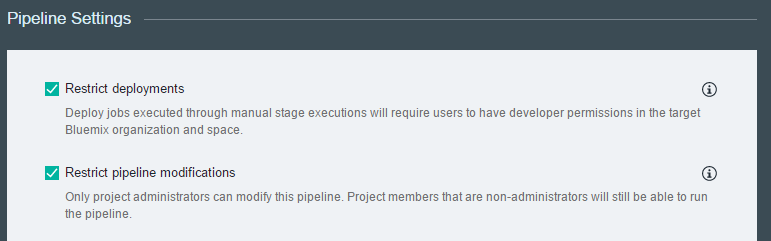

---

copyright:
  years: 2016

---
<!-- Copyright info at top of file: REQUIRED
    The copyright info is YAML content that must occur at the top of the MD file, before attributes are listed.
    It must be --- surrounded by 3 dashes ---
    The value "years" can contain just one year or a two years separated by a comma. (years: 2014, 2016)
    Indentation as per the previous template must be preserved.
-->

{:new_window: target="_blank"}
{:shortdesc: .shortdesc}
{:screen:.screen}
{:codeblock:.codeblock}

# Managing pipelines
{: #deliverypipeline_managing}
*Last updated: 29 April 2016*

You can administer, configure, and extend IBM&reg; Bluemix&reg; {{site.data.keyword.deliverypipeline}} integrations.
{:shortdesc}

Complete the following tasks to administer, configure, and extend a pipeline.

## Controlling access
{: #deliverypipeline_access}

You can restrict who is able to run stages or modify a pipeline. To do so, go to the Pipeline Settings page, which you can reach by clicking the **Stage Configuration** icon on the Pipeline: All Stages page.

## Environment properties and resources
{: #deliverypipeline_envprop}

You can use environment properties and pre-installed resources to interact with the {{site.data.keyword.deliverypipeline}} service. For example, you might incorporate them into a job script or test command. For more information, [see Environment properties and resources for the {{site.data.keyword.deliverypipeline}} service](./deploy_var.html).

You can add your own environment properties to a stage from its **ENVIRONMENT PROPERTIES** tab. Environment properties are available to every job in a stage.

You can add four types of properties from the Environment Properties tab:
* **Text**: A property key with a single-line value.
* **Text Area**: A property key with a multi-line value.
* **Secure**: A property key with a single-line value. The value is displayed as asterisks.
* **Properties**: A file in the project's repository. This file can contain multiple properties. Each property must be on its own line. To separate key-value pairs, use the equals sign (=).

## Extending the capabilities of your pipeline
{: #deliverypipeline_extend}

You can extend the capabilities of your Build & Deploy pipeline by configuring your jobs to use supported services. For example, test jobs can run static code scans and build jobs can globalize strings.

For more information on extending pipeline capabilities, [see Extending the {{site.data.keyword.deliverypipeline}} service's capabilities](./deliverypipeline_extension.html).

<!-- [1]: https://www.ng.bluemix.net/docs/manageapps/deployingapps.html#appmanifest
[2]: https://www.ng.bluemix.net/docs/#services/DeliveryPipeline/index.html#getstartwithCD
[3]: http://docs.cloudfoundry.org/devguide/installcf/whats-new-v6.html#push
[4]: https://console.ng.bluemix.net/?ace_base=true/#/pricing/cloudOEPaneId=pricing
[5]: ./images/open_logs.png
[6]: #manifests
[7]: ./images/runbar-annotated-dark.png
[8]: ./images/input_tab_only_execute.png
[9]: ./images/deploy_to.png
[10]: ./images/view_logs_and_history.png
[11]: ./images/play_button.png
[12]: ./images/basicAnimate.gif
[13]: ./images/AddStage.png
[14]: ./images/AddJob.png
[15]: ./images/jobs.png
[16]: ./images/RunStage.png
[17]: https://www.ng.bluemix.net/docs/starters/container_pipeline.html#container_pipeline
[18]: ../../../tutorials/basicbuild
[19]: #add_stage
[20]: #add_job
[21]: ../deploy_ext
[22]: ./images/pipeline_settings_icon.png
[23]: ./images/pipeline_settings.png
[24]: https://www.ng.bluemix.net/docs/services/reqnsi.html#add_service
[25]: ../deploy_var
[26]: ./images/click_stage_run_number.png
[27]: ./images/diagram.jpg -->
