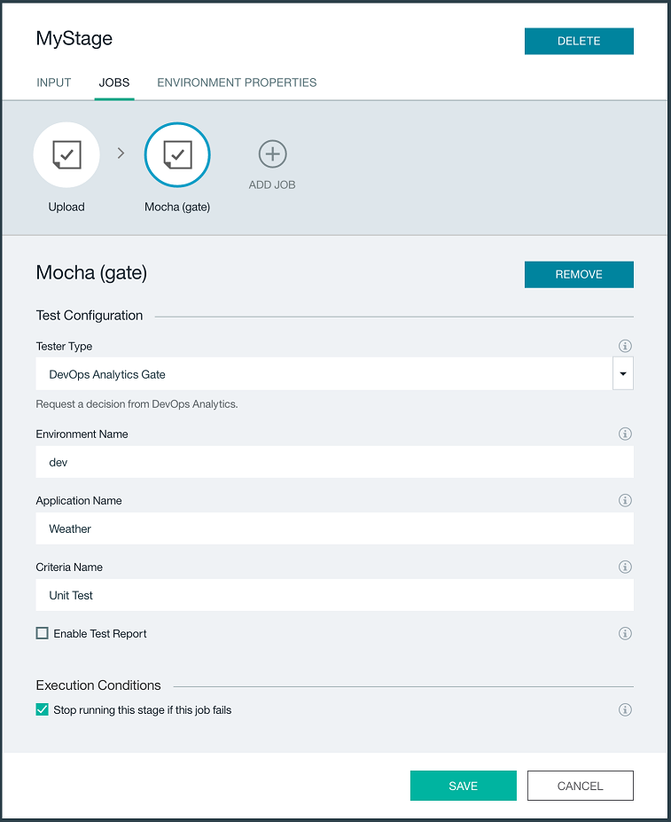

---

copyright:
  years: 2016

---

{:new_window: target="_blank"}
{:shortdesc: .shortdesc}
{:screen: .screen}
{:codeblock: .codeblock}
{:pre: .pre}

# Configuring the {{site.data.keyword.deliverypipeline}}
{: #DRA_toolchain_configure_pipeline}

*Last updated: 31 May 2016*

After you define the criteria for {{site.data.keyword.DRA_short}} to monitor, the next step is to add {{site.data.keyword.DRA_short}} to a toolchain and then configure the {{site.data.keyword.deliverypipeline}}.
{:shortdesc}

{: #DRA_toolchain_integration}
To use {{site.data.keyword.DRA_short}}, add it to any toolchain that uses the {{site.data.keyword.deliverypipeline}}.

1. On the {{site.data.keyword.Bluemix_notm}} DevOps dashboard, on the **Toolchains** tab, click the toolchain to open its Tool Integrations page.

2. Click the add (+) button.

3. In the Tool Integrations section, select **{{site.data.keyword.DRA_short}}**

4. Click **Create Integration**.

5. In your toolchain, click the {{site.data.keyword.deliverypipeline}} tile that you want to configure.  {{site.data.keyword.DRA_short}} can be configured in any number of pipelines.

## Updating test jobs for {{site.data.keyword.DRA_short}}
{: #DRA_toolchain_pipeline_upload}

To get started, retrieve the setup information from a test job.

1. On the stage that contains a test job, click the **Stage Configuration** icon . Click **Configure Stage**. 
2. Create a job. For the job type, select **Test**. 
3. Select a test job that uses the Simple tester type and copy the information that is in the **Test Command** and **Working Directory** fields to an editor. You need that information later in the configuration.
4. From the same Simple test job, change the tester type by selecting **Upload Results to DevOps Analytics**.
5. In the **Test Command** field, paste the commands that you copied from the **Test Command** field of the Simple test job.
6. In the **Working Directory** field, paste the path that you copied from the **Working Directory** field of the Simple test job.
7. Complete the remaining fields to upload test results for a particular test type. If you want to upload results for a second test type in the same job, also complete the fields that are prefixed with *Additional*.

 * Environment Name
 * Application Name
 * Type of Metric
 * Format
 * Result File Location
 
   **Note:** The values for the **Type of Metric** and **Result File Location** fields must match the correct format.

   | Type of metric | Supported formats |
   |----------------|-------------------|
   | Functional Verification Test | Mocha, JUnit |
   | Unit Test | Mocha, JUnit, Karma/Mocha |
   | Code Coverage | Istanbul, Blanket.js |

8. Click **Save** to return to the pipeline.

*Figure 1* shows a test job that is configured to run unit tests, upload the results in Mocha format, and upload the code coverage results in Istanbul format."

*Figure 1. Upload results to DevOps Analytics*

## Defining {{site.data.keyword.DRA_short}} gates in the pipeline.
{: #DRA_toolchain_pipeline_gates}

{{site.data.keyword.DRA_short}} gates check whether your test results comply with the defined criteria. If the criteria is not met, the {{site.data.keyword.DRA_short}} gate fails.  Usually, gates are placed at the end of each stage of your pipeline. This location is ideal to check the quality of the build against your criteria to ensure that it is safe to promote from one environment to another. However, you can put gates anywhere in the pipeline where you want a specific criterion to be checked.

1. On a stage, click the **Stage Configuration** icon  and click **Configure Stage**.
2. Click **Add Job**. For the job type, select **Test**.
3. Enter a name for the new job, such as *Gate (Unit Test)*.
4. For tester type, select **DevOps Analytics Gate**.
5. Specify the environment name and application name. Make sure that these values match what was defined in your [testing jobs](#DRA_toolchain_pipeline_upload).
6. Define the criteria name that is to be checked at this gate.

 **Note:** This name must exactly match one of the criteria names that you defined. You can specify only criteria that are defined in the same {{site.data.keyword.Bluemix_notm}} organization as your toolchain. 

7. Optional: To make a gate function in advisory mode, clear the **Stop running this stage if this job fails** check box. In advisory mode, {{site.data.keyword.DRA_short}} completes the same criteria analysis at the gate and generates reports, but if a failure occurs, the pipeline is not stopped.
8. Click **Save** to return to the pipeline.
9. Repeat these steps to set up gates for all of your {{site.data.keyword.DRA_short}} criteria.

*Figure 2. DevOps Analytics gate*

After your pipeline is configured, see [Running the Delivery Pipeline](./pipeline_decision_reports.html#DRA_toolchain_reports) to start using {{site.data.keyword.DRA_short}}.
