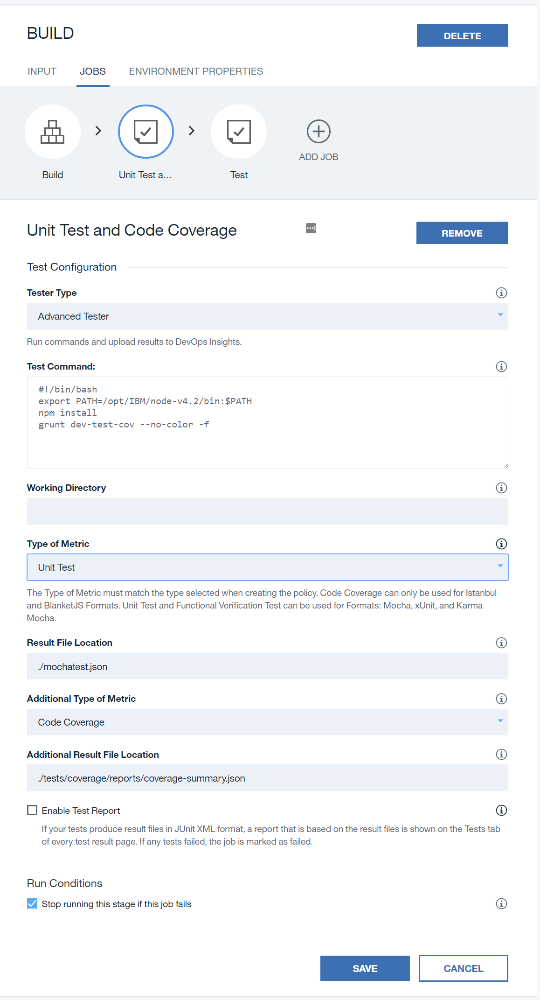
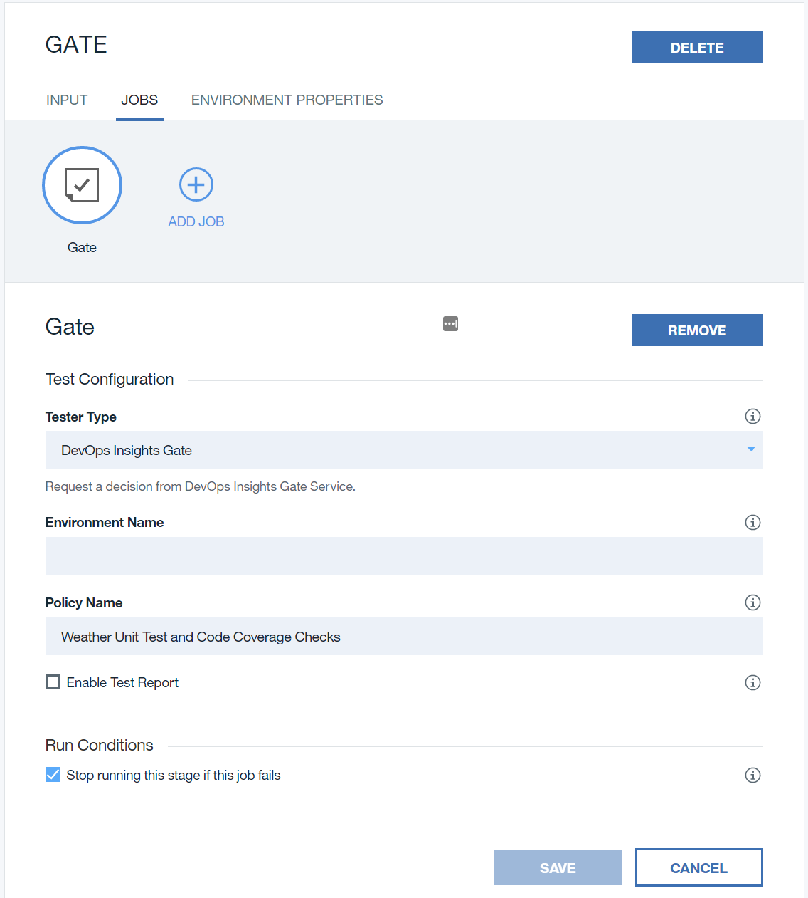
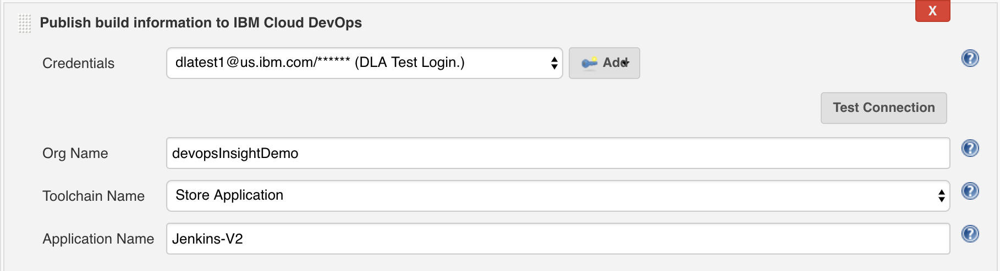
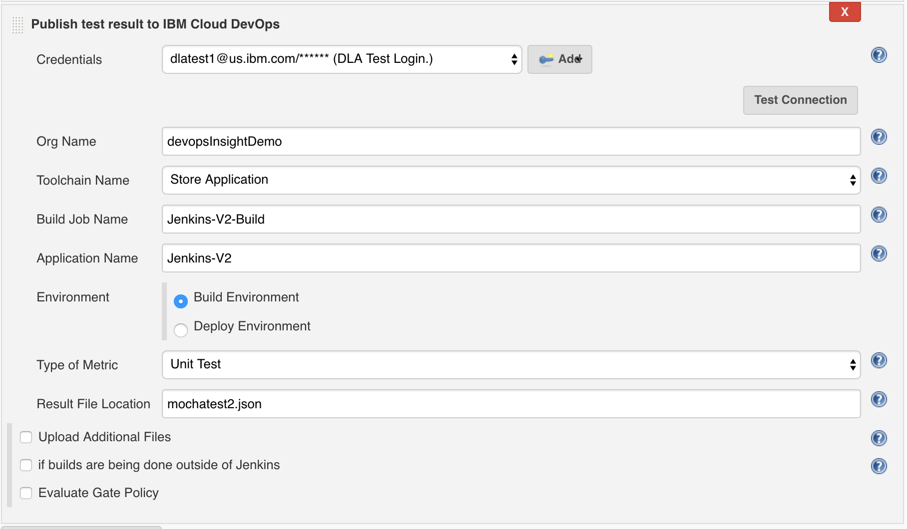
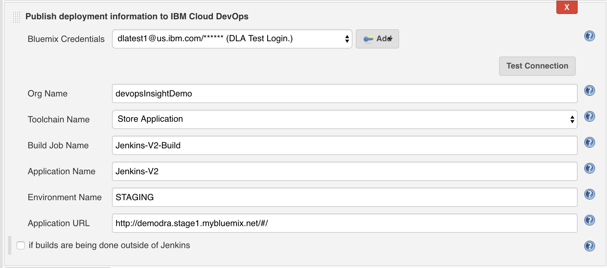
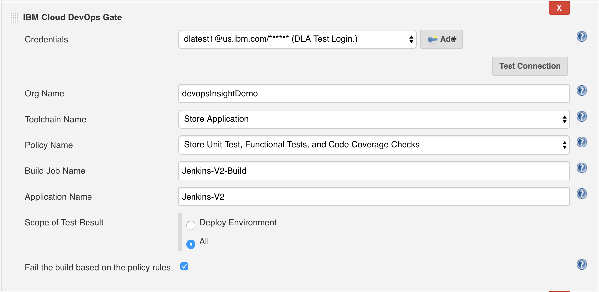
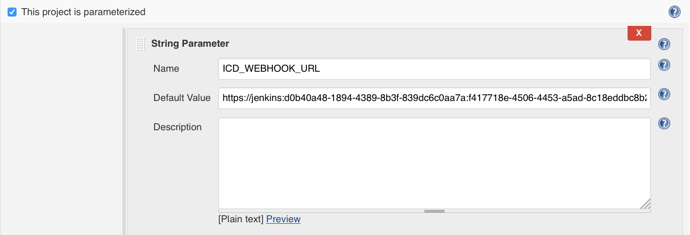
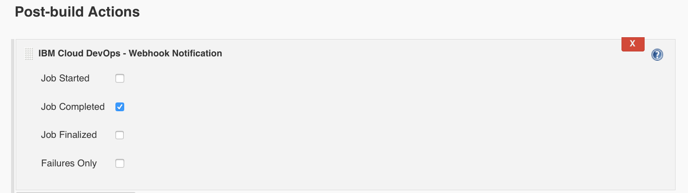

---

copyright:
  years: 2016, 2017
lastupdated: "2017-03-31"

---

{:new_window: target="_blank"}
{:shortdesc: .shortdesc}
{:screen: .screen}
{:codeblock: .codeblock}
{:pre: .pre}

# Deployment Risk (Beta)
{: #gettingstarted}

{{site.data.keyword.DRA_short}} provides a wealth of information about your deployments, particularly risk. You can use it to automate quality protection in your delivery pipeline by using policies and gates. 
{:shortdesc}

After you open {{site.data.keyword.DRA_short}} from your toolchain, click **Deployment Risk**. From there, you can get an overview of the applications in your staging and production environments and drill down to understand code coverage, test performance, and security reports. The dashboards are automatically populated with the most recent information from your pipelines' {{site.data.keyword.DRA_short}} tests.

## About Deployment Risk
{: #about}

You can use Deployment Risk to enforce quality standards in your toolchain through policies and gates. Policies comprise sets of rules; gates enforce policies. For example, you might create a "Unit Testing and Test Coverage" policy that requires builds to meet unit testing and test coverage standards. You then add a gate that refers to the policy to your continuous delivery process. Builds that do not satisfy the policy are stopped at that gate. 

Deployment Risk works with {{site.data.keyword.deliverypipeline}}, which is part of {{site.data.keyword.contdelivery_full}}, and with Jenkins projects. At a high level, the instructions for using either are similar.  

If you are using {{site.data.keyword.deliverypipeline}}, follow these steps:

1. [Create policies and rules](#policies_and_rules) for {{site.data.keyword.DRA_short}} to manage.
2. [Prepare your pipeline's stages](#integrate_pipeline) for integration with {{site.data.keyword.DRA_short}}.

3. [Create or edit test jobs](#configure_pipeline_jobs) in the pipeline that upload results to {{site.data.keyword.DRA_short}}.
4. [Add gates](#configure_pipeline_gates) to the pipeline that makes promotion decisions based on those results and your policies.
5. Run the pipeline and [view the results](#view_results).

If you are using Jenkins, follow these steps:

1. [Create policies and rules](#policies_and_rules) for {{site.data.keyword.DRA_short}} to manage.
2. [Install and configure the Jenkins plugin](#integrate_jenkins).
3. [Create test jobs and gates as described in the plugin instructions](#integrate_jenkins). The tests upload results to {{site.data.keyword.DRA_short}} for analysis and the gates use those results to make promotion decisions.
4. Run the project and [view the results](#view_results). 

No matter how you build and deploy your code, the results are the same: the builds that meet standards will move past the Deployment Risk gates, and builds that don't meet standards are stopped. 

## Prerequisites
{: #prerequisites}

Deployment Risk requires some configuration beyond what is described in [Getting Started with {{site.data.keyword.DRA_short}}](/docs/services/DevOpsInsights/index.html).

To use Deployment Risk, you need two things:

* An instance of {{site.data.keyword.deliverypipeline}} or a Jenkins project
* Tests that you want to use to evaluate your project

## Creating policies and rules
{: #policies_and_rules}

Policies are sets of rules that control the gates in your delivery pipeline. If your code does not meet or exceed a policy that is enacted at a particular gate, the deployment is halted to prevent risky changes from being released.

You define policies in {{site.data.keyword.DRA_short}}. Policies are created in the {{site.data.keyword.Bluemix_notm}} organization (org) that contains {{site.data.keyword.DRA_short}}. Any applications that are in the same org can use the policy. 

### Creating policies
{: #create_policies}

To create a policy:

1. From the left navigation, click **Settings**.

2. Click **Policies**.

3. Click **Create Policy** and then type a name and description for the new policy.

4. Click **Next**.

4. Add at least one rule to the policy:
  1. Click **Add Rule to Policy**.
  2. Select the rule type.
  3. Enter details and conditions for the rule.
  4. Click **Save**.

5. When you're finished adding rules to the policy, click **Complete**.

### Creating rules
{: #creating_rules}

Rules define the criteria that your policies use to judge success or failure. You might create a "Unit Testing and Test Coverage" policy that contains a unit test rule that requires 80% unit test success and a test coverage rule that requires 100% code coverage. If you add a gate that refers to this rule in a pipeline, the gate prevents any builds that don't satisfy both of the rules from proceeding. 

You can require success no matter what by marking tests as critical. To create a rule, select a policy and then click **Add Rule to Policy**. 

#### Creating functional verification test rules
{: #criteria_fvt}

1. Type a description and select a format.

2. Specify the percentage of test cases that must pass to be declared successful.

3. Define any test cases that are critical.

4. To monitor for test case regressions, select the **Monitor for test case regression** check box.

5. Click **Save**.

#### Creating unit test rules
{: #criteria_ut}

1. Type a description and select a format.

2. Specify the percentage of test cases that must pass to be declared successful.

3. Define any test cases that are critical.

4. To monitor for test case regressions, select the **Monitor for test case regression** check box.

5. Click **Save**.

#### Creating code coverage rules
{: #criteria_codecoverage}

1. Type a description and select a format.

2. Specify the percentage of code coverage that is required to be declared successful.

3. To monitor for code coverage regressions, select the **Monitor for test case regression** check box.

4. Click **Save**.

#### Creating static security scan rules
{: #criteria_static}

You can integrate {{site.data.keyword.DRA_short}} with IBM Application Security on Cloud to run static-code and dynamic-app scans. For more information about Application Security on Cloud, see [the official documentation](/docs/services/ApplicationSecurityonCloud/index.html).

1. Type a description.

2. Specify the maximum numbers of high-, medium-, and low-severity issues that are allowed by the rule. 

3. Click **Save**.

#### Creating dynamic security scan rules
{: #criteria_dynamic}

You can integrate {{site.data.keyword.DRA_short}} with {{site.data.keyword.appseccloudfull}} to run dynamic-app scans. For more information about Application Security on Cloud, see [the official documentation](/docs/services/ApplicationSecurityonCloud/index.html).

1. Type a description.

2. Specify the maximum numbers of high-, medium-, and low-severity issues that are allowed by the rule. 

3. Click **Save**.

## Configuring {{site.data.keyword.deliverypipeline}} 
{: #configuration}

After you add {{site.data.keyword.DRA_short}} to a toolchain and define the policies that it monitors, integrate it with {{site.data.keyword.deliverypipeline}}. For more information about pipelines, see [the official documentation](/docs/services/ContinuousDelivery/pipeline_working.html).

### Preparing pipeline stages
{: #integrate_pipeline}

For Deployment Risk to analyze your project, you must define staging and production stages in your pipeline. You define stages by using text environment properties, which you can find in each stage's configuration menu  under **Environment Properties**.

1. On the staging stage, set the `LOGICAL_ENV_NAME` property to `STAGING`. 

2. On the production stage, set the `LOGICAL_ENV_NAME` property to `PRODUCTION`. 

You can also add the following properties to stages that build or deploy your app:

* `LOGICAL_APP_NAME`, which defines the app's name on the dashboard.
* `BUILD_PREFIX`, which defines text that is prepended to the stage's builds. This text is also shown on the dashboard. 

### Adding test jobs
{: #configure_pipeline_jobs}

You integrate {{site.data.keyword.DRA_short}} into your pipeline by using two kinds of test jobs: ones that upload results to {{site.data.keyword.DRA_short}} for analysis, and gates that act on that analysis. 

First, you add Advanced Tester jobs to your pipeline to run tests and upload the results. 

**Note:** If you want to update a test job to upload results to {{site.data.keyword.DRA_short}}, save its configurations in a convenient place before you proceed. Then, open its job configuration menu and skip to step 3. 

1. On the stage where you want to add the job that uploads results, click the **Stage Configuration** icon . Click **Configure Stage**.
2. Create a test job and type a name for it. 
3. For the job type, select **Advanced Tester**.
4. Complete the **Test Command** and **Working Directory** fields as you would for a normal pipeline test job. 
5. Complete the remaining fields to upload the test results for a particular test type. 

 1. Choose the type of metric that matches what you defined in the {{site.data.keyword.DRA_short}} policy that you want to use.
 2. Type a result file location. This location is relative to the working directory. 

6. If you want to upload results for a second test type in the same job, complete the fields that are prefixed with *Additional*.
7. Click **Save** to return to the pipeline.

The values for the **Type of Metric** and **Result File Location** fields must match the correct format:

<table><thead>
<tr>
<th>Type of metric</th>
<th>Supported formats</th>
</tr>
</thead><tbody>
<tr>
<td>Functional Verification Test</td>
<td>Mocha, xUnit</td>
</tr>
<tr>
<td>Unit Test</td>
<td>Mocha, xUnit, Karma/Mocha</td>
</tr>
<tr>
<td>Code Coverage</td>
<td>Istanbul, Blanket.js</td>
</tr>
</tbody></table>

Figure 1 shows a test job that is configured to run unit tests, upload the results in Mocha format, and upload the code coverage results in Istanbul format.

*Figure 1. Upload results to DevOps Insights*

### Defining gates
{: #configure_pipeline_gates}

{{site.data.keyword.DRA_short}} gates check whether your test results comply with a defined policy. If the policy is not met, the {{site.data.keyword.DRA_short}} gate fails by default. You can also configure gates to act in an advisory role to permit pipeline progression even after failure.

The Deployment Risk dashboard relies on the presence of a gate after a staging deployment job. If you want to use the dashboard, make sure that you have a gate after you deploy to the staging environment, but before you deploy to a production environment.

Usually, gates are placed before build promotion in your pipeline. These locations are ideal to check the quality of the build against your policies to ensure that it is safe to promote from one environment to another. However, you can put gates anywhere in the pipeline where you want a specific criterion to be checked. Gates that are placed before you deploy to a staging environment will still enforce policies, but they will not appear on the Deployment Risk dashboard.

1. On a stage, click the **Stage Configuration** icon  and click **Configure Stage**.
2. Click **Add Job**. For the job type, select **Test**.
3. For tester type, select **{{site.data.keyword.DRA_short}} Gate**.
4. Specify the environment name. Make sure that this value matches what was defined in your [environment properties](#toolchain_pipeline_props).
5. Enter the policy name to check at this gate.

 This name must exactly match one of the policy names that you defined. You can specify only policies that are defined in the same {{site.data.keyword.Bluemix_notm}} organization as your toolchain.

6. Optional: To make a gate function in advisory mode, clear the **Stop running this stage if this job fails** check box. In advisory mode, {{site.data.keyword.DRA_short}} completes the same policy analysis at the gate and generates reports, but if a failure occurs, the pipeline is not stopped.
7. Click **Save** to return to the pipeline.
8. Set up gates for all of your {{site.data.keyword.DRA_short}} policies by repeating these steps.

*Figure 2. DevOps Insights gate*

After your pipeline is configured, start to use {{site.data.keyword.DRA_short}}. For instructions, see [Running the Delivery Pipeline](/docs/services/DevOpsInsights/pipeline_decision_reports.html#toolchain_reports).

## Configuring a Jenkins project
{: #integrate_jenkins}

After you add {{site.data.keyword.DRA_full}} to an open toolchain and define the policies that it monitors, you can integrate it with your Jenkins project. 

The IBM Cloud DevOps plugin for Jenkins integrates Jenkins projects with toolchains. A _toolchain_ is a set of tool integrations that support development, deployment, and operations tasks. The collective power of a toolchain is greater than the sum of its individual tool integrations. Open toolchains are part of the {{site.data.keyword.contdelivery_full}} service. To learn more about the {{site.data.keyword.contdelivery_short}} service, see [its documentation](https://console.ng.bluemix.net/docs/services/ContinuousDelivery/cd_about.html).

After you install the IBM Cloud DevOps plugin, you can publish test results to {{site.data.keyword.DRA_short}}, add automated quality gates, and track your deployment risk. You can also send job notifications to other tools in your toolchain, such as Slack and PagerDuty. To help you track deployments, the toolchain can add deployment messages to Git commits and their related Git or JIRA issues. You can also view your deployments on the toolchain's Connections page. 

The plugin provides post-build actions and CLIs to support the integration. {{site.data.keyword.DRA_short}} aggregates and analyzes the results from unit tests, functional tests, code coverage tools, static security code scans, and dynamic security code scans to determine whether your code meets predefined policies at gates in your deployment process. If your code does not meet or exceed a policy, the deployment is halted, preventing risky changes from being released. You can use {{site.data.keyword.DRA_short}} as a safety net for your continuous delivery environment, a way to implement and improve quality standards over time, and a data visualization tool to help you understand your project's health.

### Prerequisites
{: #jenkins_prerequisites}

You must have access to a server that is running a Jenkins project.

### Creating a toolchain
{: #jenkins_create}

Before you can integrate {{site.data.keyword.DRA_short}} with a Jenkins project, you must create a toolchain. 

1. To create a toolchain, go to the [Create a Toolchain page](https://console.ng.bluemix.net/devops/create) and follow the instructions on that page. 

2. After you create the toolchain, add {{site.data.keyword.DRA_short}} to it. For instructions, see the [{{site.data.keyword.DRA_short}} documentation](https://console.ng.bluemix.net/docs/services/DevOpsInsights/index.html). 

### Installing the plugin
{: #jenkins_install}

First, download the plugin from {{site.data.keyword.DRA_short}}.  

1. From the toolchain's Overview page, click **DevOps Insights**.
2. Click **Settings**, then **Jenkins Plugin Setup**.
3. Follow the instructions on the page to download the plugin.

Then, on your Jenkins server, install the plugin.

1. Click **Manage Jenkins &gt; Manage Plugins** and click the **Advanced** tab.
2. Click **Choose File** and select the IBM Cloud DevOps plugin installation file. 
3. Click **Upload**.
4. Restart Jenkins and verify that the plugin was installed.

### Configuring Jenkins jobs for the Deployment Risk dashboard
{: #jenkins_configure}

After the plugin is installed, you can integrate {{site.data.keyword.DRA_short}} into your Jenkins project. 

Follow these steps to use Deployment Risk's gates and dashboard with your project.

1. Open the configuration of any jobs that you have, such as build, test, or deployment.

2. Add a post-build action for the corresponding type:

   * For build jobs, use **Publish build information to IBM Cloud DevOps**.
   
   * For test jobs, use **Publish test result to IBM Cloud DevOps**.
   
   * For deployment jobs, use **Publish deployment information to IBM Cloud DevOps**.
   
3. Complete the required fields. These will vary depending on job type. 

   * From the **Credentials** list, select your {{site.data.keyword.Bluemix_notm}} ID and password. If they are not saved in Jenkins, click **Add** to add and save them. Test your connection with {{site.data.keyword.Bluemix_notm}} by clicking **Test Connection**.
   
   * In the **Build Job Name** field, specify your build job's name exactly as it is in Jenkins. If the build occurs with the test job, leave this field empty. If the build job occurs outside of Jenkins, select the **Builds are being done outside of Jenkins** check box and specify the build number and build URL.
   
   * For the environment, if the tests are running in build stage, select only the build environment. If the tests are running in the deployment stage, select the deploy environment and specify the environment name. Two values are supported: `STAGING` and `PRODUCTION`.
   
   * For the **Result File Location** field, specify the result file's location. If the test doesn't generate a result file, leave this field empty. The plugin uploads a default result file that is based on the status of current test job.

   These images show example configurations:
   
   
   _Publish build information_
   
   
   _Publish test result_
   
   
   _Publish deployment information_

4. If you want to use {{site.data.keyword.DRA_short}} policy gates to control a downstream deployment job, add a post-build action, **IBM Cloud DevOps Gate**. Choose a policy and specify the scope of the test results. To allow the policy gates to prevent downstream deployments, select the **Fail the build based on the policy rules** check box. The following image shows an example configuration:

    

5. Run your Jenkins Build job.

6. View the Deployment Risk dashboard by going to [IBM Bluemix DevOps](https://console.ng.bluemix.net/devops), selecting your toolchain, and clicking **DevOps Insights**.

The Deployment Risk dashboard relies on the presence of a gate after a staging deployment job. If you want to use the dashboard, make sure that you have a gate after you deploy to the staging environment, but before you deploy to a production environment.
    
### Configuring notifications
{: #jenkins_notifications}

You can configure your Jenkins jobs to send notifications to tools like Slack or PagerDuty by following the instructions in the [Bluemix Docs](https://console.ng.bluemix.net/docs/services/ContinuousDelivery/toolchains_integrations.html#jenkins).

This example shows how to configure `ICD_WEBHOOK_URL` for job configurations: 

This example shows how to configure post-build actions for job notifications: 

## Viewing results
{: #view_results}

After a pipeline runs, {{site.data.keyword.DRA_short}} starts to collect and analyze the test results from it to establish a baseline. Data from every subsequent run is collected and compared against previous results. Decision gates use this data to determine when to stop a deployment. 

You can see your deployment and gate evaluation data from the Deployment Risk dashboard. To open the dashboard, open {{site.data.keyword.DRA_short}} and from the side menu, click **Deployment Risk**.

If you are using a {{site.data.keyword.contdelivery_short}} pipeline, you can view individual gate execution reports from the pipeline itself. To view the decision report for a gate from the pipeline:

1. On the stage that contains the gate to check, click **View logs and history**.

2. From the job that contains the gate, click the gate's name.

3. In the log view, find the `Check {{site.data.keyword.DRA_short}} report here` message and click the link to open the report.

