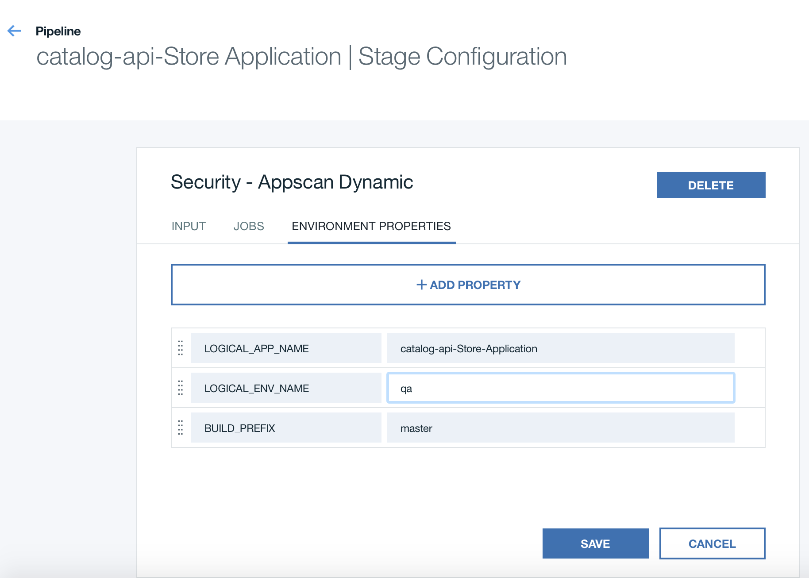

---

copyright:
  years: 2016, 2017
lastupdated: "2017-02-24"

---

{:new_window: target="_blank"}
{:shortdesc: .shortdesc}
{:screen: .screen}
{:codeblock: .codeblock}
{:pre: .pre}

# Integrating {{site.data.keyword.DRA_short}} with {{site.data.keyword.deliverypipeline}} (Experimental)
{: #toolchain_configure_pipeline}

After you add {{site.data.keyword.DRA_full}} to a toolchain and define the policies that it monitors, integrate it with your pipeline.
{:shortdesc}

## Preparing pipeline stages
{: #toolchain_pipeline_props}

In each pipeline stage that contains build or deploy jobs, create several environment properties:

1. Click **Stage Configuration** and then click **Configure stage**.

2. Click **ENVIRONMENT PROPERTIES**.

3. Add these text properties and then save the changes to the stage:

<table><thead>
<tr>
<th>Environment property</th>
<th>Description</th>
</tr>
</thead><tbody>
<tr>
<td><code>LOGICAL_APP_NAME</code></td>
<td>The name of the app as it is shown on {{site.data.keyword.DRA_short}} dashboards. </td>
</tr>
<tr>
<td><code>LOGICAL_ENV_NAME</code></td>
<td>The name of the environment that the app is running in. This property is used to categorize the app on {{site.data.keyword.DRA_short}} dashboards.  <em>This property is required in stages that deploy to staging or production environments, and is optional in all others.</em> Set it to <code>STAGING</code> for stages that deploy to staging and to <code>PRODUCTION</code> for stages that deploy to production.</td>
</tr>
<tr>
<td><code>BUILD_PREFIX</code></td>
<td>A prefix that is added to builds as shown on {{site.data.keyword.DRA_short}} dashboards.</td>
</tr>
</tbody></table>

## Adding test jobs
{: #toolchain_pipeline_upload}

Integrate {{site.data.keyword.DRA_short}} into your pipeline by using two kinds of test jobs: ones that upload results to {{site.data.keyword.DRA_short}} for analysis and gates that act on that analysis. 

**Note:** If you want to update test jobs to upload results to {{site.data.keyword.DRA_short}}, save their configurations in a convenient place before you proceed. Then, open the job configuration menu and skip to step 3. 

1. On the stage where you want to add the job that uploads results, click the **Stage Configuration** icon . Click **Configure Stage**.
2. Create a test job and type a name for it. 
3. For the job type, select **Advanced Tester**.
4. Complete the **Test Command** and **Working Directory** fields as you would for a normal pipeline test job. 
5. Complete the remaining fields to upload the test results for a particular test type. 

 1. Choose the type of metric that matches what you defined in the {{site.data.keyword.DRA_short}} policy that you want to use.
 2. Type a result file location. This location is relative to the working directory. 

6. If you want to upload results for a second test type in the same job, complete the fields that are prefixed with *Additional*.
7. Click **Save** to return to the pipeline.

The values for the **Type of Metric** and **Result File Location** fields must match the correct format:

<table><thead>
<tr>
<th>Type of metric</th>
<th>Supported formats</th>
</tr>
</thead><tbody>
<tr>
<td>Functional Verification Test</td>
<td>Mocha, xUnit</td>
</tr>
<tr>
<td>Unit Test</td>
<td>Mocha, xUnit, Karma/Mocha</td>
</tr>
<tr>
<td>Code Coverage</td>
<td>Istanbul, Blanket.js</td>
</tr>
</tbody></table>

Figure 1 shows a test job that is configured to run unit tests, upload the results in Mocha format, and upload the code-coverage results in Istanbul format.

*Figure 1. Upload results to DevOps Insights*

## Defining gates in the pipeline
{: #toolchain_pipeline_gates}

{{site.data.keyword.DRA_short}} gates check whether your test results comply with a defined policy. If the policy is not met, the {{site.data.keyword.DRA_short}} gate fails by default. You can also configure gates to act in an advisory role to permit pipeline progression even after failure.

Usually, gates are placed before build promotion in your pipeline. This location is ideal to check the quality of the build against your policy to ensure that it is safe to promote from one environment to another. However, you can put gates anywhere in the pipeline where you want a specific criterion to be checked.

1. On a stage, click the **Stage Configuration** icon  and click **Configure Stage**.
2. Click **Add Job**. For the job type, select **Test**.
3. For tester type, select **{{site.data.keyword.DRA_short}} Gate**.
4. Specify the environment name. Make sure that this value matches what was defined in your [environment properties](#toolchain_pipeline_props).
5. Define the policy name that is to be checked at this gate.

 This name must exactly match one of the policy names that you defined. You can specify only policies that are defined in the same {{site.data.keyword.Bluemix_notm}} organization as your toolchain.

6. Optional: To make a gate function in advisory mode, clear the **Stop running this stage if this job fails** check box. In advisory mode, {{site.data.keyword.DRA_short}} completes the same policy analysis at the gate and generates reports, but if a failure occurs, the pipeline is not stopped.
7. Click **Save** to return to the pipeline.
8. Set up gates for all of your {{site.data.keyword.DRA_short}} policies by repeating these steps.

*Figure 2. DevOps Insights gate*

After your pipeline is configured, start to use {{site.data.keyword.DRA_short}}. For instructions, see [Running the Delivery Pipeline](/docs/services/DevOpsInsights/pipeline_decision_reports.html#toolchain_reports).

## Viewing decision reports    
{: #DI_decision_reports}

After a pipeline runs, {{site.data.keyword.DRA_short}} starts to collect and analyze the test results from it to establish a baseline. Data from every subsequent run is collected and compared against previous results. Decision gates use this data to determine when to stop a deployment. 

To view the decision report for a gate from the pipeline, complete these steps:

   1. On the stage that contains the gate to check, click **View logs and history**.

   2. From the job that contains the gate, click the gate's name.

   3. In the log view, find the `Check {{site.data.keyword.DRA_short}} report here` message and click the link to open the report.

## Running static-code scans and dynamic-app scans
{: #toolchain_pipeline_scan}

You can integrate {{site.data.keyword.DRA_short}} with {{site.data.keyword.staticanalyzerfull}} and {{site.data.keyword.APS_DA_full}} to run static-code and dynamic-app scans. To run those scans, your project must be associated with a toolchain in {{site.data.keyword.contdelivery_full}} that includes {{site.data.keyword.DRA_short}}. The scans are run as test jobs in a pipeline. The results of those test jobs are sent to {{site.data.keyword.DRA_short}}.

To add static-code scans or dynamic-app scans to your pipeline:
 1. Add the scan test jobs to your pipeline. For more information about running scans from pipelines, [see Extending the capabilities of your Build & Deploy pipeline](https://hub.jazz.net/docs/deploy_ext/).
 2. Verify that the environment properties that are described in [Preparing pipeline stages](#toolchain_pipeline_props) are configured correctly for your project.

*Figure 3. A pipeline stage that has the required environment properties for {{site.data.keyword.DRA_short}} and code or app scanning*
