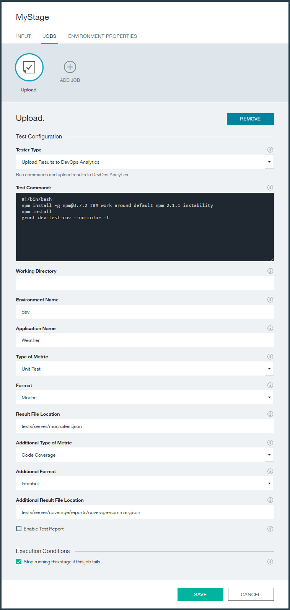

---

copyright:
  years: 2016
lastupdated: "2016-11-11"

---

{:new_window: target="_blank"}
{:shortdesc: .shortdesc}
{:screen: .screen}
{:codeblock: .codeblock}
{:pre: .pre}

# Integrating {{site.data.keyword.DRA_short}} with {{site.data.keyword.deliverypipeline}}
{: #toolchain_configure_pipeline}

After you add {{site.data.keyword.DRA_full}} to a toolchain and define the policies it monitors, you must then integrate {{site.data.keyword.DRA_short}} with your pipeline.
{:shortdesc}

<!--##Configuring the {{site.data.keyword.deliverypipeline}}

{: #toolchain_integration}
To use {{site.data.keyword.DRA_short}}, add it to any toolchain that uses the {{site.data.keyword.deliverypipeline}}.

1. In {{site.data.keyword.Bluemix_notm}}, on the **Toolchains** tab, open a toolchain.

2. On the toolchain's Overview page, click the add (+) button.

3. In the Tool Integrations section, select **{{site.data.keyword.DRA_short}}**.

4. Click **Create Integration**.

5. In your toolchain, click the {{site.data.keyword.deliverypipeline}} tile. You can configure {{site.data.keyword.DRA_short}} in any number of pipelines.-->

## Preparing pipeline stages for {{site.data.keyword.DRA_short}}
{: #toolchain_pipeline_props}

You must create several environment properties in each pipeline stage that contains build or deploy jobs:

1. Click **Stage Configuration** and then **Configure stage**.

2. Click **ENVIRONMENT PROPERTIES**.

3. Add the following three text properties, and then save the changes to the stage:

<table><thead>
<tr>
<th>Environment property</th>
<th>Description</th>
</tr>
</thead><tbody>
<tr>
<td><code>LOGICAL_APP_NAME</code></td>
<td>The name of the app as it appears on {{site.data.keyword.DRA_short}} dashboards. </td>
</tr>
<tr>
<td><code>LOGICAL_ENV_NAME</code></td>
<td>The name of the environment that the app is running in. This property is used to categorize the app in {{site.data.keyword.DRA_short}} dashboards.</td>
</tr>
<tr>
<td><code>BUILD_PREFIX</code></td>
<td>A prefix that is added to builds as shown on {{site.data.keyword.DRA_short}} dashboards.</td>
</tr>
</tbody></table>

## Updating test jobs for {{site.data.keyword.DRA_short}}
{: #toolchain_pipeline_upload}

To get started, retrieve the setup information from a test job.

1. On the stage that contains a test job, click the **Stage Configuration** icon . Click **Configure Stage**.
2. Create a job. For the job type, select **Test**.
3. Select a test job that uses the Simple tester type and copy the information that is in the **Test Command** and **Working Directory** fields to an editor. You need that information later.
4. From the same Simple test job, change the tester type by selecting **Advanced Tester**.
5. In the **Test Command** field, paste the commands that you copied from the **Test Command** field of the Simple test job.
6. In the **Working Directory** field, paste the path that you copied from the **Working Directory** field of the Simple test job.
7. Complete the remaining fields to upload test results for a particular test type. If you want to upload results for a second test type in the same job, also complete the fields that are prefixed with *Additional*.

 * Type of Metric
 * Format
 * Result File Location
8. Click **Save** to return to the pipeline.

The values for the **Type of Metric** and **Result File Location** fields must match the correct format:

<table><thead>
<tr>
<th>Type of metric</th>
<th>Supported formats</th>
</tr>
</thead><tbody>
<tr>
<td>Functional Verification Test</td>
<td>Mocha, JUnit</td>
</tr>
<tr>
<td>Unit Test</td>
<td>Mocha, JUnit, Karma/Mocha</td>
</tr>
<tr>
<td>Code Coverage</td>
<td>Istanbul, Blanket.js</td>
</tr>
</tbody></table>

*Figure 1* shows a test job that is configured to run unit tests, upload the results in Mocha format, and upload the code coverage results in Istanbul format.

*Figure 1. Upload results to DevOps Analytics*

## Defining {{site.data.keyword.DRA_short}} gates in the pipeline
{: #toolchain_pipeline_gates}

{{site.data.keyword.DRA_short}} gates check whether your test results comply with the defined policy. If the policy is not met, the {{site.data.keyword.DRA_short}} gate fails. Usually, gates are placed at the end of each stage of your pipeline. This location is ideal to check the quality of the build against your policy to ensure that it is safe to promote from one environment to another. However, you can put gates anywhere in the pipeline where you want a specific criterion to be checked.

1. On a stage, click the **Stage Configuration** icon  and click **Configure Stage**.
2. Click **Add Job**. For the job type, select **Test**.
3. Enter a name for the new job, such as *Gate (Unit Test)*.
4. For tester type, select **{{site.data.keyword.DRA_short}} Gate**.
5. Specify the environment name. Make sure that this value matches what was defined in your [environment properties](#toolchain_pipeline_props).
6. Define the policy name that is to be checked at this gate.

 This name must exactly match one of the policy names that you defined. You can specify only policies that are defined in the same {{site.data.keyword.Bluemix_notm}} organization as your toolchain.

7. Optional: To make a gate function in advisory mode, clear the **Stop running this stage if this job fails** check box. In advisory mode, {{site.data.keyword.DRA_short}} completes the same policy analysis at the gate and generates reports, but if a failure occurs, the pipeline is not stopped.
8. Click **Save** to return to the pipeline.
9. Set up gates for all of your {{site.data.keyword.DRA_short}} policies by repeating these steps.

*Figure 2. DevOps Analytics gate*

After your pipeline is configured, start to use {{site.data.keyword.DRA_short}}. For instructions, see [Running the Delivery Pipeline](./pipeline_decision_reports.html#toolchain_reports).
