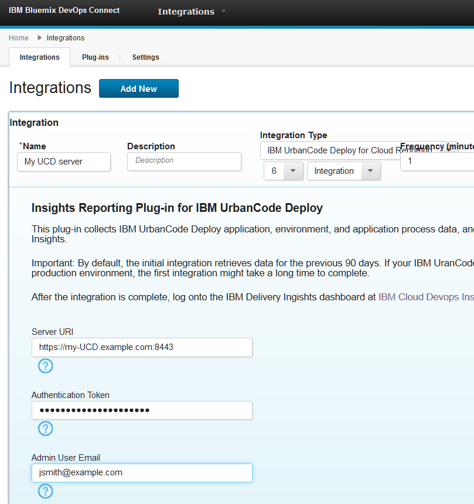

---

copyright:
  years: 2017
lastupdated: "2017-03-14"

---

{:new_window: target="_blank"}
{:shortdesc: .shortdesc}
{:screen: .screen}
{:codeblock: .codeblock}
{:pre: .pre}

# Connecting IBM UrbanCode Deploy servers to Delivery Insights
{: #connect_ucd}

To see data from an IBM UrbanCode Deploy server in Delivery Insights, you must install a patch on the server and then connect that server to DevOps Connect.
{:shortdesc}

## Before you begin

- See the [prerequisites](uc_insights_prereqs.html), including setting up an instance of DevOps Connect.
- Your IBM UrbanCode Deploy server must be at version 6.2 or later.

## Procedure

1. Install the patch into your IBM UrbanCode Deploy server. All versions of IBM UrbanCode Deploy require a patch to communicate with DevOps Connect. 
  1. Download the correct patch for your version of IBM UrbanCode Deploy by going to the following page and downloading the correct patch:
  [http://public.dhe.ibm.com/software/products/UrbanCode/plugins/ucsync/patches/ibmucd/](http://public.dhe.ibm.com/software/products/UrbanCode/plugins/ucsync/patches/ibmucd/)

  1. Extract the file. It contains one or more patch files that you must add to the server.

  1. Stop the server. See [Starting and stopping the server](https://www.ibm.com/support/knowledgecenter/SS4GSP_6.2.3/com.ibm.udeploy.install.doc/topics/run_server.html).

  1. Put the patch files in the <code><em>application_data</em>/patches</code> folder, where <code><em>application_data</em></code> is the server application data folder. The default application data folder is `/opt/ibm-ucd/server/appdata` on Linux and `C:\Program Files\ibm-ucd\server\appdata` on Windows. On high-availability systems, the application data folder is always on a shared network drive that each server can access.

  1. Optional: While the server is stopped, to increase performance of the data import from this server, run the following SQL commands on the database:  
  ```create index rt_cpr_submitted_time on MyUCDDatabase.rt_app_process_request(submitted_time);```  
  ```create index rt_cpr_submitted_time on MyUCDDatabase.rt_comp_process_request(component_id, submitted_time);```  
  Use the name of your database for `MyUCDDatabase`.
  <!-- Ross says that this will not be necessary for versions 6.2.4.1 and later if he gets his code changes in. -->

  1. Start the server. 

    **Note:** You might need to wait longer than you typically do for the IBM UrbanCode Deploy server to start. If the server does not eventually start, or is not working correctly, delete the patch files and restart the server. The patch files do not permanently affect the server.

1. Some versions of IBM UrbanCode Deploy require an additional patch for the server to connect to DevOps Connect. If you are using IBM UrbanCode Deploy version 6.2 through 6.2.1.2, you must install the following additional patch on the server:
  1. Download the patch:  [http://public.dhe.ibm.com/software/products/UrbanCode/plugins/ucsync/patches/ibmucd/ucd-6.2.1.1-WI149200-CLI-Updates-for-UCSync.jar](http://public.dhe.ibm.com/software/products/UrbanCode/plugins/ucsync/patches/ibmucd/ucd-6.2.1.1-WI149200-CLI-Updates-for-UCSync.jar).
  1. Stop the server.
  1. Put the patch file in the <code><em>application_data</em>/patches</code> folder.
  1. Start the server.

1. Create an integration between DevOps Connect and the IBM UrbanCode Deploy server:  
  **Important:** The first time that the integration runs, DevOps Connect retrieves data for the previous 90 days. If you have a large amount of deployment data, this process can take a long time. To retrieve data for less than 90 days, see [Troubleshooting](uc_insights_connect_ucd.html#troubleshooting).
  1. In IBM UrbanCode Deploy, create an authentication token. See [Tokens](https://www.ibm.com/support/knowledgecenter/SS4GSP_6.2.3/com.ibm.udeploy.admin.doc/topics/security_token.html).
  1. In DevOps Connect, click **Integrations**, and then click **Add New**.
  1. Specify a name and description for the integration. The default location of DevOps Connect is `https://hostname:8443/`, where `hostname` is the host name of the system that hosts DevOps Connect.
  1. From the **Integration Type** list, select **IBM UrbanCode Deploy for Cloud Reporting**.
  1. In the **Server URI** field, enter the public URL of the IBM UrbanCode Deploy server, such as `https://my_UCD.example.com:8447`.
  1. In the **Authentication Token** field, enter or paste the authentication token that was generated by IBM UrbanCode Deploy.
  1. In the **Admin User** field, enter a comma-separated list of IBMids to give access to the DevOps Connect interface.
  1. Optional: Click **Run Integration** to run the integration immediately. By default, integrations run every minute.
  1. Click **Save**.

  

Now your data is synchronized with Delivery Insights. You can now create and view reports that are based on this data.

## Troubleshooting
{: #troubleshooting}

If many application and component process requests are stored in your IBM UrbanCode Deploy server database, errors can occur during the retrieval process. A message similar to the following text is recorded in the server output log:

`ORA-01652: unable to extend temp segment by 128 in tablespace TEMP`

To work around this behavior, edit the `plugin.properties` file for the plug-in to reduce the number of days worth of data to retrieve. The `plugin.properties` file is in the `~/.ibm/cloud-sync/plugins/settings/reporting-ucd-plugin/` directory on the computer where you installed DevOps Connect. Edit the following line to remove the number sign (#) and to reduce the number of days:

`#numDaysToRetrieve=90`

For example, change the line to the following text to retrieve only the previous 30 days worth of data:

`numDaysToRetrieve=30`

Save the file, and then run the integration again. Check the server logs to ensure that the error no longer occurs.
