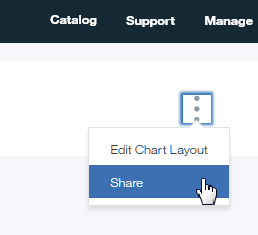

---

copyright:
  years: 2017
lastupdated: "2017-03-14"

---

{:new_window: target="_blank"}
{:shortdesc: .shortdesc}
{:screen: .screen}
{:codeblock: .codeblock}
{:pre: .pre}

# Creating, editing, and sharing reports
{: #uc_insights_creating}

You can create as many Delivery Insights reports as you need to organize your metrics. You can also share reports with people within your Bluemix organization (org).
{:shortdesc}

## Creating reports

To create a report, open {{site.data.keyword.DRA_short}}, click **Delivery Insights > Reports**, and then click **Add Report**. 

From within the report, you can add cards to the **Metrics** section, filter the activity under **Recent application activity**, and add charts to the **Report Details** section. Each chart in the **Report Details** section is individually filterable and customizable. To see the raw data behind a chart, at the top right of the chart, click the chart Settings button and then click **Report Data**.

To change the order of the charts, at the top right of the page, click the Settings button and then click **Edit Chart Layout**. Then you can drag and drop the charts to set the order on the report.

## Sharing reports
By default, only you can see your Delivery Insights reports. You can share the report with other users in your Bluemix org. To share a report with someone in your Bluemix org, open the report and then at the top right of the report, click the Settings button and then click **Share**.  

.

## Creating audit reports

Audit reports show a complete list of all activity that meets the filters that you set, as a PDF. To create an audit report, click **Delivery Insights > Create Audit Report**. Then, specify the information for the report, including a name. Also, set the context for the report, such as for an application, a logical environment, or an environment on an IBM UrbanCode Deploy server (a physical environment). From there, select the data to show in the report and click **Create**. 