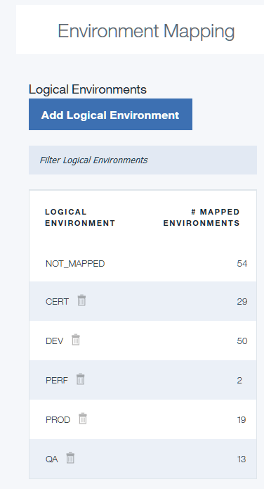
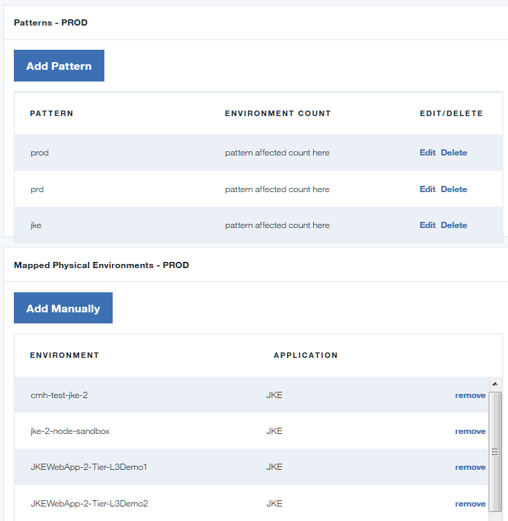

---

copyright:
  years: 2017
lastupdated: "2017-03-14"

---

{:new_window: target="_blank"}
{:shortdesc: .shortdesc}
{:screen: .screen}
{:codeblock: .codeblock}
{:pre: .pre}

# Mapping environments to reports
{: #uc_insights_mapping}

The information you see in Delivery Insights is grouped by *logical environments*, which are collections of IBM UrbanCode Deploy environments (also called *physical environments*). You can group your environments into logical environments in any way that makes sense for your organization.
{:shortdesc}

## Logical environments

Delivery Insights groups your IBM UrbanCode Deploy environments into one or more logical environments. This way, you can collect environments into groups that make sense to you and your organization. For example, if you have several production environments for several applications, you can group all of those environments into a single logical environment and combine metrics for all of those environments into a single production environment dashboard. Mapping happens by search string, so you can group environments in any way that makes sense for your IBM UrbanCode Deploy servers.

## Default logical environments

By default, your reports include logical environments that match IBM UrbanCode Deploy environments by using strings. For example, all environments with "dev" in the name are mapped to the DEV logical environment, and all environments with "prod" in the name are mapped to the PROD logical environment.

## Mapping environments to logical environments

You can manually map physical environments to logical environments, or you can use patterns to associate physical environments with logical environments dynamically.

To map physical environments to logical environments using a pattern, follow these steps:

1. In {{site.data.keyword.DRA_short}}, click **Delivery Insights > Map Environments**.
1. Click an existing logical environment or click **Add Logical Environment**.
1. In the settings for the logical environment, under **Patterns**, click **Add Pattern**.
1. Specify a pattern for environment names. You can use the asterisk (*) as a wildcard. For example, the pattern `env` matches the environments `env1`, `env2`, and `env`.
1. Verify that the logical environment contains the environments that you want.

To map environments to logical environments manually, click **Add Manually** and select the environments to add or remove.

Now that you have mapped environments to logical environments, you can see report information aggregated by those logical environments.