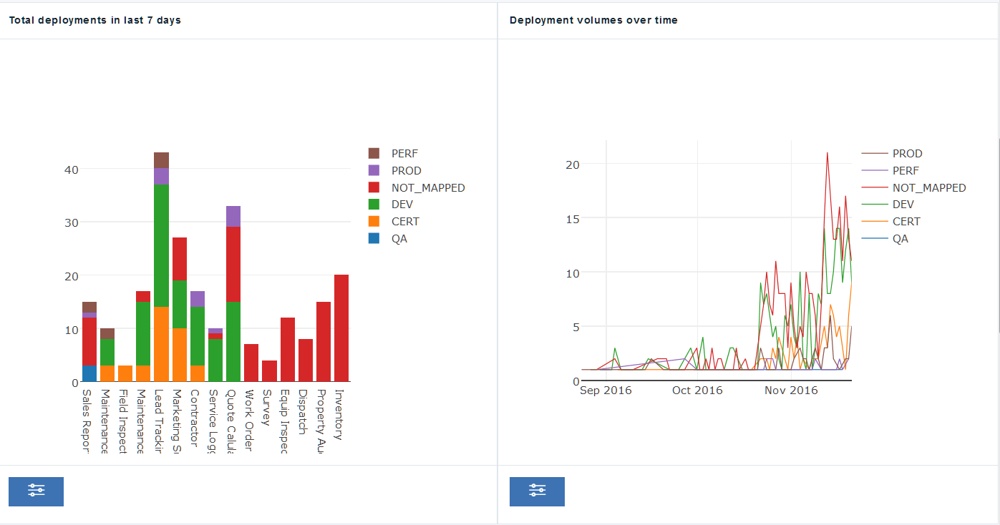
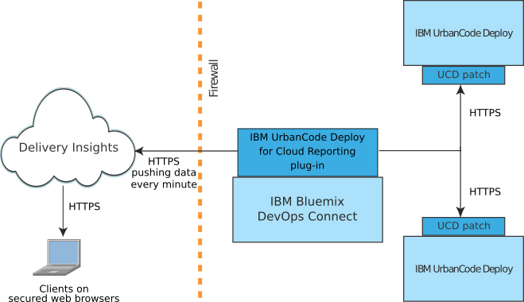

---

copyright:
  years: 2017
lastupdated: "2017-03-31"

---

{:new_window: target="_blank"}
{:shortdesc: .shortdesc}
{:screen: .screen}
{:pre: .pre}

# Integrating DevOps Insights with IBM UrbanCode Deploy - overview
{: #uc_insights_overview}

Delivery Insights, a part of {{site.data.keyword.DRA_short}}, shows deployment statistics, metrics, and other information about your IBM UrbanCode Deploy installation. For example, it can show charts of deployment duration, successes, and failures, all sorted by logically grouped environments.
{:shortdesc}

If you do not have a toolchain or {{site.data.keyword.DRA_short}}, you must set up {{site.data.keyword.DRA_short}} first:
1. From the {{site.data.keyword.Bluemix}} catalog, click **{{site.data.keyword.DRA_short}}**, select a pricing plan, and click **Create**.
1. Click the **Manage** tab and then under **Start with Delivery Insights for UrbanCode**, click **Start Here**. In the background, Delivery Insights creates a toolchain for your organization. Open toolchains are collections of tool integrations, and in this case, IBM UrbanCode Deploy and {{site.data.keyword.DRA_short}} are part of your toolchain. For more information about toolchains, see [Working with toolchains](../ContinuousDelivery/toolchains_working.html).
1. On the **Delivery Insights Setup** page, follow the steps to set up DevOps Connect and connect your IBM UrbanCode Deploy servers.
<!--  1. Set up a system to run DevOps Connect. See [prerequisites](uc_insights_prereqs.html).
  1. Download DevOps Connect, which is provided in a runnable JAR file.
  1. Copy the script from the **Delivery Insights Setup** page and run it. This command starts DevOps Connect with a token that allows it to connect to your organization on {{site.data.keyword.Bluemix}}.
  1. Connect your IBM UrbanCode Deploy servers to DevOps connect. See [Connecting IBM UrbanCode Deploy servers to Delivery Insights](uc_insights_connect_ucd.html). -->

If you already have a toolchain, follow these steps to add Delivery Insights:
1. If you do not already have the {{site.data.keyword.DRA_short}} tool, add it to your toolchain.
1. On your toolchain, click the {{site.data.keyword.DRA_short}} tool.
1. On the **Delivery Insights Setup** page, follow the steps to set up DevOps Connect and connect your IBM UrbanCode Deploy servers.

After you have set up Delivery Insights and DevOps Connect, you can show data from IBM UrbanCode Deploy servers in Delivery Insights. See [Connecting IBM UrbanCode Deploy servers to Delivery Insights](uc_insights_connect_ucd.html).

<!-- 
For questions or issues, see the [questions forum](https://developer.ibm.com/answers/?community=urbancode).
--> 

Some of the information that you can see on Delivery Insights includes:

- Statistics about deployment, including deployment duration and deployment volume over time.
- Statistics about deployment failure rate by application and environment.
- Statistics about component deployment, including failure rate, deployment time, and duration.

## Systems overview

The topology for Delivery Insights includes one or more on-premise installations of IBM UrbanCode Deploy <!-- (and optionally IBM UrbanCode Release) --> and the DevOps Connect utility.

The following diagram shows a typical installation of these systems.

- An installation of **IBM UrbanCode Deploy** provides the information about successful and failed deployments for the metrics. IBM UrbanCode Deploy requires a patch to communicate with IBM Bluemix DevOps Connect.

<!--
- **IBM UrbanCode Release** is an optional part of the topology. You can use the environment mappings in IBM UrbanCode Release to set logical environments for reports.

-->

- **IBM Bluemix DevOps Connect**, formerly the IBM UrbanCode Sync Utility, coordinates communication between on-premise installations of IBM UrbanCode Deploy <!-- and IBM UrbanCode Release --> and IBM-hosted services such as UrbanCode Insights. DevOps Connect uses secure HTTPS communication to the on-premise servers and token authentication to provide data to UrbanCode Insights.

  DevOps Connect requires plug-ins to connect to the other systems in the topology.

- **Delivery Insights**, part of {{site.data.keyword.DRA_short}}, provides metrics about deployment activity on IBM UrbanCode Deploy, including deployment times and failure rates according to groups of environments. Authorization is controlled by {{site.data.keyword.Bluemix}} accounts.
