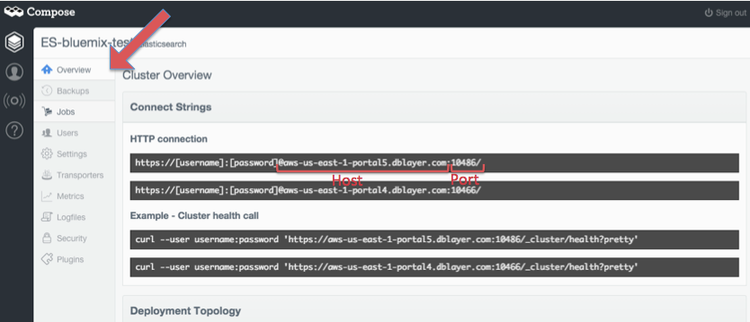

{:shortdesc: .shortdesc}
{:new_window: target="_blank"}

# Getting started with Elasticsearch by Compose

Elasticsearch combines the power of a full text search engine with the indexing strengths of a JSON document database to create a powerful tool for rich data analysis on large volumes of data. With Elasticsearch your searching can be scored for exactness letting you dig through your data set for those close matches and near misses which you could be missing.
{:shortdesc} 

### Setting up credentials for Elasticsearch by Compose:
In order to sign-in to Compose’s Elasticsearch through Bluemix, you will need the following credentials: 

- Username
- Password
- Host
- Port

The instructions below will show you where to find these credentials on the Compose platform:
1. Sign-in to your Compose account. On the dashboard, 'Deployments' will be automatically selected. Under Elasticsearch, select the deployment that you would like to get the credentials for.  
2. Select the 'Users' icon on the left hand navigation and select 'Add User'.
3. Create a username and password, be sure to write them down so you can reference them later. 
4. Select the 'Overview' icon on the left hand navigation. Under 'Connect Strings' you will see host and port listed under HTTP connection.

*Figure 1. Compose dashboard*

# rellinks
## general 
* [Welcome Compose Blog](http://cloudant.com/blog/welcome-compose/){:new_window}
* [Elasticsearch Deployments Docs](http://docs.compose.io/getting-started/elasticsearch-deployments.html){:new_window}
