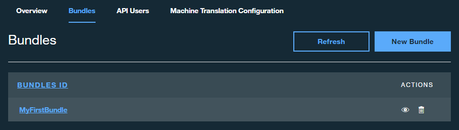
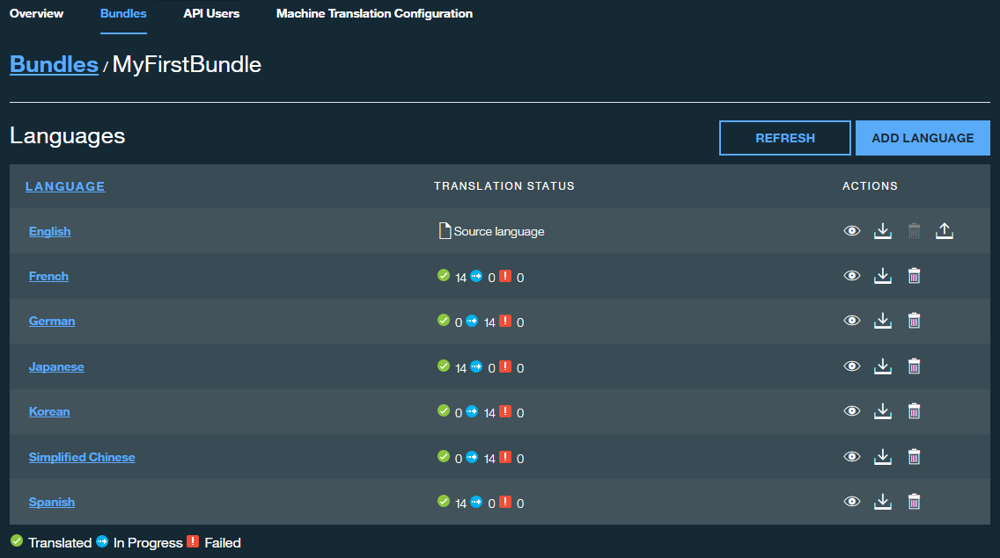

---
copyright:
  years: 2015, 2017
lastupdated: "2016-08-30"

---

{:new_window: target="_blank"}
{:shortdesc: .shortdesc}
{:screen:.screen}
{:codeblock:.codeblock}


# Working with bundles
{: #globalizationpipeline_workingwithbundles}

*Last updated: 30 August 2016*
{: .last-updated}

Each bundle you create contains the key value pairs from your resource file and the complete set of translations that have been generated.
{:shortdesc}

The resource files you upload can be of any of the following formats and must contain content in the form of key/value pairs that represent the UI strings from your app.


* File type: *Java™ Properties files (.properties)*<br>
Example:
```js
logout=Logout 
back=Back 
examples=Menu 
home=Home 
web=Web 
enterprise=Enterprise 
extra=Resources 
about=About 
settings=Settings 
help=Help 
support=Support 
topics=Topics 
appExitMsg=Are you sure you want to quit the application?
```
* File type: *AMD I18N (.js)*<br>
Example:
```js
define({
    "root": {
       logout: "Logout",
       back: "Back",
       examples: "Menu",
       home: "Home",
       web: "Web",
       enterprise: "Enterprise",
       extra: "Resources",
       about: "About",
       settings: "Settings",
       help: "Help",
       support: "Support",
       topics: "Topics",
       appExitMsg: "Are you sure you want to quit the application?"
    }
});
``` 
* File type: *JSON (.json)*<br>
Example:
```js
{
  "logout": "Logout",
  "back": "Back",
  "examples": "Menu",
  "home": "Home",
  "web": "Web",
  "enterprise": "Enterprise",
  "extra": "Resources",
  "about": "About",
  "settings": "Settings",
  "help": "Help",
  "support": "Support",
  "topics": "Topics",
  "appExitMsg": "Are you sure you want to quit the application?"
}
``` 

In addition, a resource file must also adhere to these guidelines:
* Each key can be a maximum of 255 characters.
* Each value can be a maximum of 8191 characters.
* Each bundle can contain a maximum of 500 key / value pairs.


## Translating a bundle
{: #globalizationpipeline_translatingabundle}

Only uploaded resource files will be translated. You can upload a resource file when [creating a bundle](index.html#globalizationpipeline_creatingbundles) or [modifying with bundle details](bundles.html#globalizationpipeline_modifyingbundles).

After you upload a resource file, you can  translate its contents into any of the languages provided by the default machine translation engine. Optionally you can choose an alternative machine translation engine as described in the [Machine translation configuration](managing_translations.html#globalizationpipeline_service_to_service) section. The default engine supports the following target languages

<table>
<thead>
<tr>
<th>Target languages</th>
</tr>
</thead>
<tbody>
<tr>
<td>Chinese (Simplified)</td>
</tr>
<tr>
<td>Chinese (Traditional)</td>
</tr>
<tr>
<td>French</td>
</tr>
<tr>
<td>German</td>
</tr>
<tr>
<td>Italian</td>
</tr>
<tr>
<td>Japanese</td>
</tr>
<tr>
<td>Korean</td>
</tr>
<tr>
<td>Portuguese (Brazilian)</td>
</tr>
<tr>
<td>Spanish</td>
</tr>
</tbody>
</table>

**Note:** {{site.data.keyword.GlobalizationPipeline_short}}'s default machine translation engine only provides support for English as a source language. However, alternative machine translation engines available for configuration within {{site.data.keyword.GlobalizationPipeline_short}} support the translation of other non-English source languages/language pairs.

As you create bundles, they are added to the **Bundles** tab to make them easily accessible. From there, additional tasks can be performed on your translations.


## Selecting a bundle to work with
{: #globalizationpipeline_selectingabundle}

1. Click the **Bundles** tab to view all of the bundles that you have created.
2. Click a **Bundle ID** from the list to see more details about that bundle, or click the **View the bundles detail** icon 	in the Actions column.



After you select a bundle to work with, you can view the status of its translations, add or remove languages, edit the translations, or provide updates to the resource file.

If you no longer need a bundle, you can delete it from the **Bundles** tab. All translations that are associated with the bundle are also deleted.

## Modifying bundle details
{: #globalizationpipeline_modifyingbundles}

When you open a bundle you can view all of the details about it. All of the target languages that are in the bundle are listed, along with the current translation status for each.



The status for each language in the bundle can be In Progress, Failed, or Translated:

| Status | Description |
|--------|-------------|
| In Progress | Machine translation is still in progress. |
| Failed | An error occurred while the resource file was being translated into the target language. |
| Translated | The translation to the target language is complete. |

You can update the resource file that the bundle uses, add a target language to a bundle, delete a target language from a bundle, and download the generated translations for a target language.

### Updating the resource file used by the bundle

1. Next to the source language, click the **Upload resources** icon  in the Actions column.
2. Click **Browse** and select the new resource file to upload.
3. Select the type of resource file that you are uploading
 * Java Properties file
 * AMD I18N
 * JSON
4. Click **Update** to upload the new resource file.

The key/value pairs that are in the new or updated resource file are synchronized with the values that were already uploaded. Only content that is new or changed will be translated.

### Adding a target language to a bundle

1. Click the **Add Language** button.
2. All available target languages are shown. Select the languages to add to the bundle.

Translation for the selected languages will begin immediately.

### Deleting a target language from a bundle

When you delete a target language from a bundle, you remove the target language and all associated translations from the project. In the Actions column of the target language to remove, click the **Remove this target language** icon .

### Downloading the generated translations for a target language

{{site.data.keyword.GlobalizationPipeline_short}} provides several ways to incorporate the translation for a target language into your application. You can download the translation as a resource file and include it in your application build. You can also reference the translation dynamically from {{site.data.keyword.GlobalizationPipeline_short}} using one of the open source [SDKs](https://github.com/IBM-Bluemix/gp-common). 

<!-- For information on {{site.data.keyword.GlobalizationPipeline_full}} SDKs, see <link>. -->

To download the translation as a resource file: 

1. In the **Actions** column of the target or source language to download, click the **Download the translations** icon .
2. Select a file format.
3. Click **Download**.
