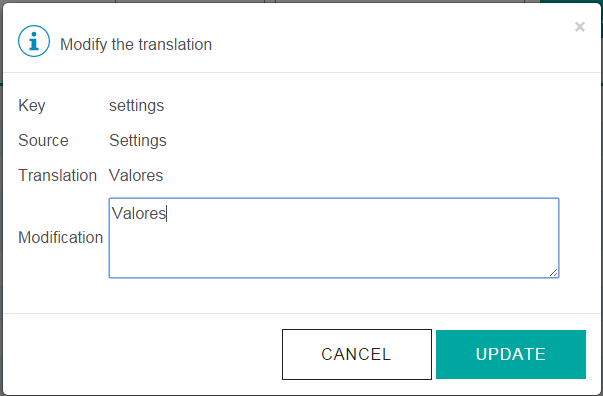
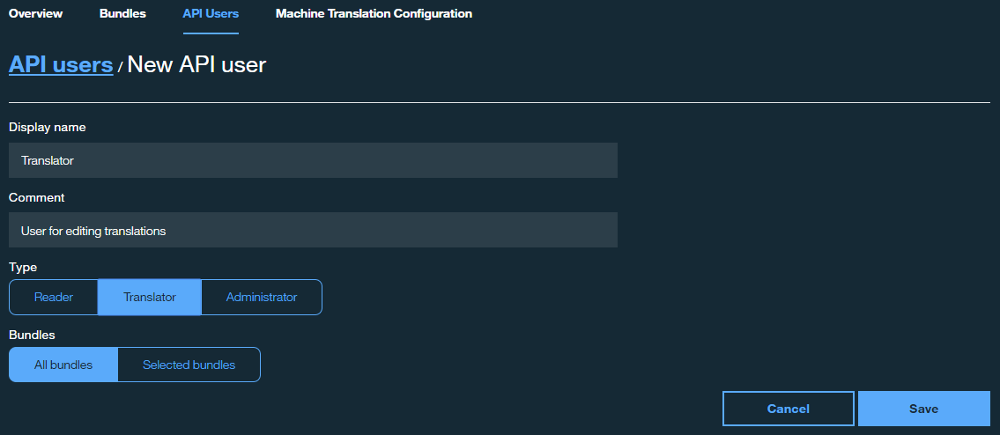

---

copyright:
  years: 2015, 2016

---

{:new_window: target="_blank"}
{:shortdesc: .shortdesc}
{:screen:.screen}
{:codeblock:.codeblock}

# Managing translations
{: #globalizationpipeline_managingtranslations}

*Last updated: 30 March 2016*

Once you have created bundles and started generating translations for your application, the machine generated content can be used as is or further modified.  This section explains how to perform human post-translation editing and also how you can assign user roles and access restrictions to the people that will need to access to your translations.
{:shortdesc}

## Viewing and editing translations
{: #globalizationpipeline_translations}

The {{site.data.keyword.GlobalizationPipeline_short}} service provides human post-translation editing capabilities. A native speaker or someone who is familiar with any of the target languages can make edits to the generated translations. You can edit to improve the quality of the translation or to substitute preferred wording. For example, you might want to overwrite the translation of a product name.

To view and edit the translations for a target language:

1. From the **Bundle details** page, select a target language or click the **View the translations** icon  from the Actions column.
2. The translations are presented in a table that shows key, source, and translation information.
 * **Key:** Represents an attribute in the source file that has an associated value.
 * **Source:** Represents a translatable string that was included in the uploaded source file.
 * **Translation:** Represents the translated version of a source value.
3. In the Actions column, click the **Modify the translation** icon  to edit a machine-translated value.
4. Edit the translation and click **Update** to update the original translated value with your edit.

 

***Tip:*** When you work with large bundles that include many translatable keys, finding a particular value might be difficult. On the target language translation page, you can search the keys, source, translations, or all three within a target language.

 

## Adding users
{: #globalizationpipeline_users}

Managing the translations of your app can involve many different user roles. As a result, you might need to provide access to your bundles to various user roles. However, you might not want to grant those roles the same permissions. When you create roles within the {{site.data.keyword.GlobalizationPipeline_short}} service, you can provide varying degrees of access for multiple users depending on the tasks that they need to do.

| Role type | View translations? | Edit translations? | Modify bundle information? |
|-----------|--------------------|--------------------|----------------------------|
| Reader | Yes | No | No |
| Translator | Yes | Yes | No |
| Administrator | Yes | Yes | Yes |

If you create more users, you can restrict their access to one or more specific bundles, or grant them access to see all of the available bundles.

To create a user for your {{site.data.keyword.GlobalizationPipeline_short}} service:

1. On the {{site.data.keyword.GlobalizationPipeline_short}} dashboard, click the **Users** tab.
2. Click **New User**.
3. Type a **display name** and **comment** to describe the new user.
4. Choose a **type** for the new user.
5. Click the bundles that the new user can access.
6. Click **Save**.

A user ID and password are generated and displayed. Copy and save those credentials; after you close the window, you cannot access them again.
