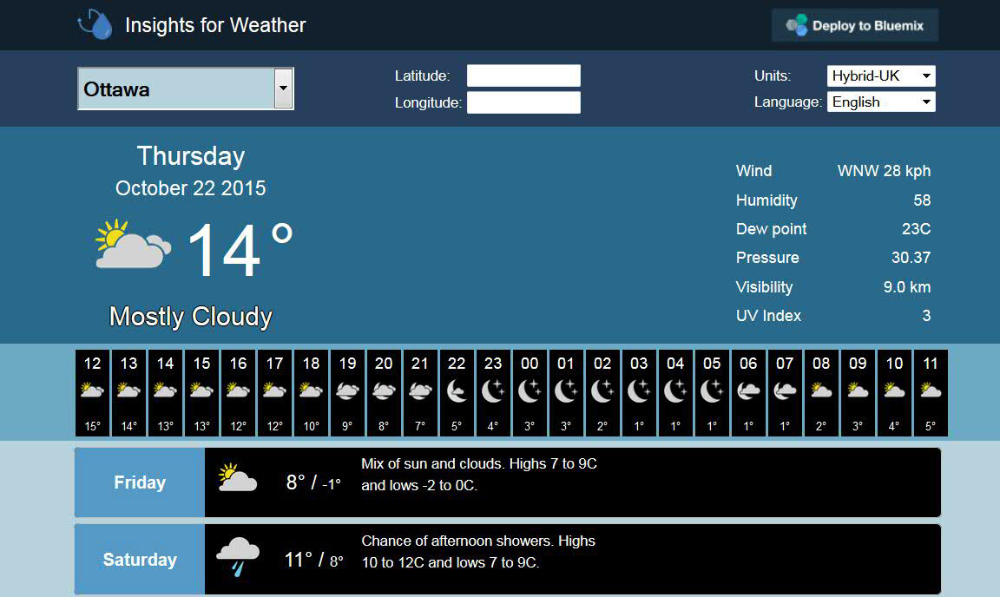

---

copyright:
  years: 2015, 2016

---

{:new_window: target="_blank"}
{:shortdesc: .shortdesc}
{:screen:.screen}
{:codeblock:.codeblock}

# Beispiele
{: #tutorials_samples}

*Letzte Aktualisierung: 6. April 2016*

Lernen Sie anhand der folgenden Beispiele, wie Sie den Service Insights for Weather verwenden können.
{: shortdesc}

## Demo: Insights for Weather
{: #insights_weather_demo}

Im Rahmen des Insights for Weather-Service
können Sie zum Anzeigen von Wetterdaten eine Beispielanwendung verwenden.
Sie können auf die Anwendung
zugreifen, wenn Sie zu [http://insights-for-weather-demo.mybluemix.net/](http://insights-for-weather-demo.mybluemix.net/) navigieren.
Die Anwendung wird in Ihrem Browser geöffnet
und Sie werden gefragt, ob Sie der App Ihren aktuellen Standort mitteilen möchten.

Über die Beispielanwendung können Sie die aktuellen Wetterbedingungen für Ihren Standort anzeigen.



Außerdem können Sie sich eine stündliche Wettervorhersage für die nächsten 24 Stunden
und die tägliche Wettervorhersage für die nächsten 10 Tage ansehen.
Wenn Sie den Cursor
über die einzelnen Gebiete im Beispiel bewegen, werden die Ergebnisse des API-Aufrufs
im JSON-Format angezeigt, einschließlich der Metadaten, mit denen die Daten abgerufen wurden.

Klicken Sie in der Demoanwendung auf **In Bluemix bereitstellen**, um eine geklonte Version der Anwendung zu erstellen, oder klicken Sie auf die Option zum Klonen der App direkt vom GitHub ([clone the app directly from GitHub](https://github.com/IBM-Bluemix/insights-for-weather-demo)).

## Abrufen einer 10-Tage-Standardvorhersage
{: #getting_ten_day_forecast}

Sie können in Ihrer Anwendung eine `GET`-Operation ausgeben, um die 10-Tage-Vorhersagedaten abzurufen.
Mit der folgenden `GET`-Anforderung können Sie beispielsweise die 10-Tage-Vorhersage für Ottawa, ON, Kanada abrufen:

```
GET https://<username>:<password>@twcservice.mybluemix.net:443/api/weather/v2/forecast/daily/10day?units=m&geocode=45.42%2C75.69&language=en-US
}
```

Die Werte für `username` und `password`
sind für Ihre Anwendung und Serviceinstanz eindeutig.
Sie finden diese Informationen in den Umgebungsvariablen `VCAP_SERVICES`.

Der Service gibt Antworten im JSON-Format zurück. Wenn die Antwort erfolgreich ist,
wird der Statuscode 200 zurückgegeben.
Ist die Antwort nicht erfolgreich, wird ein Fehlercode zurückgegeben.

Der Hauptteil der Antwort enthält Metadaten und ein Array täglicher Vorhersagen für jeden der nächsten 10 Tage.
Die Metadaten können beispielsweise die folgenden Daten enthalten:

```
{
  "metadata": {
    "language": "en-US",
    "transaction_id": "1443712484194:-1546029161",
    "version": "1",
    "latitude": 45.42,
    "longitude": 75.69,
    "units": "m",
    "expire_time_gmt": 1443714284,
    "status_code": 200
  },
  "forecasts": [
  ]
}
```

Jede tägliche Vorhersage enthält allgemeine Informationen, die sich auf den 24-Stunden-Zeitraum
für den angegebenen Wochentag (`dow`) beziehen.
Die tägliche Vorhersage kann beispielsweise die folgenden Daten enthalten:

```
    {
      "class": "fod_long_range_daily",
      "expire_time_gmt": 1443714284,
      "fcst_valid": 1444525200,
      "fcst_valid_local": "2015-10-11T07:00:00+0600",
      "num": 11,
      "max_temp": 14,
      "min_temp": 4,
      "torcon": null,
      "stormcon": null,
      "blurb": null,
      "blurb_author": null,
      "lunar_phase_day": 28,
      "dow": "Sunday",
      "lunar_phase": "Waning Crescent",
      "lunar_phase_code": "WNC",
      "sunrise": "2015-10-11T07:07:25+0600",
      "sunset": "2015-10-11T18:19:57+0600",
      "moonrise": "2015-10-11T05:17:47+0600",
      "moonset": "2015-10-11T17:40:49+0600",
      "qualifier_code": null,
      "qualifier": null,
      "narrative": "Times of sun and clouds. Highs 13 to 15C and lows 3 to 5C.",
      "qpf": 0,
      "snow_qpf": 0,
      "snow_range": "",
      "snow_phrase": "",
      "snow_code": "",
      "night": {
      },
      "day": {
      }
    }
```

Alle täglichen Vorhersagen enthalten jeweils einen Nachtteil und einen Tagesteil für den angegebenen Wochentag.
Beispielsweise können beide dieser Teile die folgenden Vorhersagedaten enthalten:

```
      "night": {
        "fcst_valid": 1444568400,
        "fcst_valid_local": "2015-10-11T19:00:00+0600",
        "day_ind": "N",
        "thunder_enum": 0,
        "daypart_name": "Sunday night",
        "long_daypart_name": "Sunday night",
        "alt_daypart_name": "Sunday night",
        "thunder_enum_phrase": "No thunder",
        "num": 21,
        "temp": 4,
        "hi": 10,
        "wc": 3,
        "pop": 10,
        "icon_extd": 2900,
        "icon_code": 29,
        "wxman": "wx1650",
        "phrase_12char": "P Cloudy",
        "phrase_22char": "Partly Cloudy",
        "phrase_32char": "Partly Cloudy",
        "subphrase_pt1": "Partly",
        "subphrase_pt2": "Cloudy",
        "subphrase_pt3": "",
        "precip_type": "precip",
        "rh": 65,
        "wspd": 10,
        "wdir": 98,
        "wdir_cardinal": "E",
        "clds": 40,
        "pop_phrase": "",
        "temp_phrase": "Low 4C.",
        "accumulation_phrase": "",
        "wind_phrase": "Winds E at 10 to 15 km/h.",
        "shortcast": "Partly cloudy",
        "narrative": "A few clouds. Low 4C. Winds E at 10 to 15 km/h.",
        "qpf": 0,
        "snow_qpf": 0,
        "snow_range": "",
        "snow_phrase": "",
        "snow_code": "",
        "vocal_key": "D22:DA05:X3000300044:S300042:TL4:W04R02",
        "qualifier_code": null,
        "qualifier": null,
        "uv_index_raw": 0,
        "uv_index": 0,
        "uv_warning": 0,
        "uv_desc": "Low",
        "golf_index": null,
        "golf_category": ""
      },
```

## Abrufen einer 24-Stunden-Standardvorhersage
{: #getting_twenty_four_hour_forecast}

Sie können in Ihrer Anwendung eine `GET`-Operation ausgeben, um die 24-Stunden-Vorhersagedaten abzurufen.
Mit der folgenden `GET`-Anforderung können Sie beispielsweise die 24-Stunden-Vorhersage für Ottawa, ON, Kanada abrufen:

```
GET https://<username>:<password>@twcservice.mybluemix.net:443/api/weather/v2/forecast/hourly/24hour?units=m&geocode=45.42%2C75.69&language=en-US
```

Der Hauptteil der Antwort enthält Metadaten und ein Array stündlicher Vorhersagen für jede der nächsten 24 Stunden. Die Metadaten können beispielsweise die folgenden Daten enthalten:

```
{
  "metadata": {
    "language": "en-US",
    "transaction_id": "1443722945280:-1956318185",
    "version": "1",
    "latitude": 45.42,
    "longitude": 75.69,
    "units": "m",
    "expire_time_gmt": 1443723545,
    "status_code": 200
  },
  "forecasts": [
  ]
}
```

Jede stündliche Vorhersage enthält allgemeine Informationen, die sich auf die Stunde beziehen, die durch `num` angegeben ist. Die stündliche Vorhersage kann beispielsweise die folgenden Daten enthalten:

```
    {
      "class": "fod_short_range_hourly",
      "expire_time_gmt": 1443723545,
      "fcst_valid": 1443726000,
      "fcst_valid_local": "2015-10-02T01:00:00+0600",
      "num": 1,
      "day_ind": "N",
      "temp": 12,
      "dewpt": 1,
      "hi": 12,
      "wc": 11,
      "feels_like": 11,
      "icon_extd": 3100,
      "wxman": "wx1550",
      "icon_code": 31,
      "dow": "Friday",
      "phrase_12char": "Clear",
      "phrase_22char": "Clear",
      "phrase_32char": "Clear",
      "subphrase_pt1": "Clear",
      "subphrase_pt2": "",
      "subphrase_pt3": "",
      "pop": 0,
      "precip_type": "rain",
      "qpf": 0,
      "snow_qpf": 0,
      "rh": 48,
      "wspd": 15,
      "wdir": 208,
      "wdir_cardinal": "SSW",
      "gust": null,
      "clds": 17,
      "vis": 16.1,
      "mslp": 1018.6,
      "uv_index_raw": 0,
      "uv_index": 0,
      "uv_warning": 0,
      "uv_desc": "Low",
      "golf_index": null,
      "golf_category": "",
      "severity": 1
    },
```

## Abrufen aktueller Bedingungen
{: #current_conditions}

Sie können in Ihrer Anwendung eine `GET`-Operation ausgeben, um die aktuellen Wetterbedingungen abzurufen.
Mit der folgenden `GET`-Anforderung können Sie die aktuellen Bedingungen für Ottawa, ON, Kanada abrufen:

```
GET https://<username>:<password>@twcservice.mybluemix.net:443/api/weather/v2/observations/current?units=m&geocode=45.42%2C75.69&language=en-US
```

Der Hauptteil der Antwort enthält Metadaten und die aktuellen Beobachtungsdaten.
Die Metadaten können beispielsweise die folgenden Daten enthalten:

```
{
  "metadata": {
    "language": "en-US",
    "transaction_id": "1443724606672:1993259329",
    "version": "1",
    "latitude": 45.42,
    "longitude": 75.69,
    "units": "m",
    "expire_time_gmt": 1443725206,
    "status_code": 200
  },
  "observation": {
  }
}
```

Die Beobachtungsdaten enthalten allgemeine Informationen und Werte, die auf der angegebenen Maßeinheit basieren. Die aktuellen Bedingungen können beispielsweise die folgenden Daten enthalten,
wenn die Maßeinheit als metrische Einheit angegeben wurde:

```
  "observation": {
    "class": "observation",
    "expire_time_gmt": 1443725206,
    "obs_time": 1443724606,
    "obs_time_local": "2015-10-02T00:36:46+0600",
    "wdir": 210,
    "icon_code": 33,
    "icon_extd": 3300,
    "sunrise": "2015-10-02T06:55:47+0600",
    "sunset": "2015-10-02T18:36:42+0600",
    "day_ind": "N",
    "uv_index": 0,
    "uv_warning": 0,
    "wxman": "wx1550",
    "obs_qualifier_code": null,
    "ptend_code": 2,
    "dow": "Friday",
    "wdir_cardinal": "SSW",
    "uv_desc": "Low",
    "phrase_12char": "Fair",
    "phrase_22char": "Fair",
    "phrase_32char": "Fair",
    "ptend_desc": "Falling",
    "sky_cover": "Partly Cloudy",
    "clds": "FEW",
    "obs_qualifier_severity": null,
    "vocal_key": "OT53:OX3300",
    "metric": {
      "wspd": 13,
      "gust": null,
      "vis": 16.09,
      "mslp": 1018.7,
      "altimeter": 1018.63,
      "temp": 12,
      "dewpt": 3,
      "rh": 54,
      "wc": 11,
      "hi": 12,
      "temp_change_24hour": -16,
      "temp_max_24hour": 19,
      "temp_min_24hour": 6,
      "pchange": -1.02,
      "feels_like": 11,
      "snow_1hour": 0,
      "snow_6hour": 0,
      "snow_24hour": 0,
      "snow_mtd": null,
      "snow_season": null,
      "snow_ytd": null,
      "snow_2day": null,
      "snow_3day": null,
      "snow_7day": null,
      "ceiling": null,
      "precip_1hour": 0,
      "precip_6hour": 0,
      "precip_24hour": 0,
      "precip_mtd": null,
      "precip_ytd": null,
      "precip_2day": null,
      "precip_3day": null,
      "precip_7day": null,
      "obs_qualifier_100char": null,
      "obs_qualifier_50char": null,
      "obs_qualifier_32char": null
    }
  }
```


