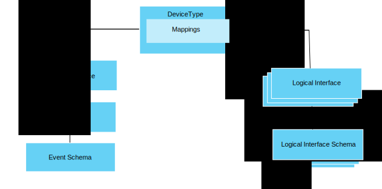

---

copyright:
years: 2016, 2017
lastupdated: "2017-07-19"

---

{:new_window: target="\_blank"}
{:shortdesc: .shortdesc}
{:screen: .screen}
{:codeblock: .codeblock}
{:pre: .pre}

# Getting started with data management
{: #im_example}

Use the following steps to help you to configure the resources that you need to start using the data management feature.

For details about the API, see the [{{site.data.keyword.iot_full}} HTTP REST API ](https://docs.internetofthings.ibmcloud.com/apis/swagger/v0002/state-mgmt.html){:new_window} documentation.

**Tip:** For more detailed information about each of the steps, see the example scenarios or use the links to go directly to a specific step in the step-by-step guide. [Step-by-step guide: A detailed example about how to work with devices through a common interface](ga_im_index_scenario.html#scenario) walks you through the steps to create a device type logical interface for heterogeneous thermometer devices.

## Before you begin
To start using the data management feature, you must have at least one [device registered with](ga_im_index_scenario.html#step14) and sending data to {{site.data.keyword.iot_short_notm}}.  

The following diagram shows a logical view of how the resources that you need to configure fit together:

## Steps

1. 	Define the incoming state properties.  
Define the incoming state properties that you want your logical interface to make available to your applications.  
<dl>
<dd>
<ol>
<li>[Create a draft event schema file](ga_im_index_scenario.html#step1). The event schema file is a local .JSON file that defines the structure and format of an inbound event.
<li>[Create a draft event schema resource for your event type](ga_im_index_scenario.html#step2). The event schema resource is a programmatic construct that is used by {{site.data.keyword.iot_short_notm}}.
<li>[Create a draft event type that references the event schema](ga_im_index_scenario.html#step3). The event type is used by {{site.data.keyword.iot_short_notm}} to map one or more event schema resources to a physical interface.
<li>[Create a draft physical interface](ga_im_index_scenario.html#step7).
<li>[Add the event type to the draft physical interface](ga_im_index_scenario.html#step8).
<li>[Update the draft device type to connect the draft physical interface](ga_im_index_scenario.html#step9).
