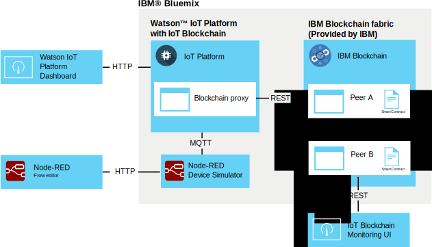

---

copyright:
  years: 2016, 2017
lastupdated: "2017-02-17"

---

{:new_window: target="\_blank"}
{:shortdesc: .shortdesc}
{:screen: .screen}
{:codeblock: .codeblock}
{:pre: .pre}

# {{site.data.keyword.iot_short_notm}} blockchain integration
{: #gettingstartedtemplate}

{{site.data.keyword.iot_short_notm}} blockchain integration enables IoT devices to provide data to blockchain transactions, which stores the data in the blockchain's immutable ledger and uses it in the business rules that are implemented in the blockchain's smart contracts.
{:shortdesc}

The platform takes device data in its native MQTT format, maps it to the data format that is required by the blockchain's smart contract, and passes it to a blockchain fabric to store in the blockchain ledger. A blockchain fabric is the collection of peer and certification nodes that make up an instance of {{site.data.keyword.blockchainfull}} and Hyperledger.

## Blockchain integration architecture  
{: #architecture}

A generic {{site.data.keyword.iot_short_notm}} blockchain integration environment consists of the following components:
- One or more devices that produces data that you want to write into a blockchain ledger.
- {{site.data.keyword.Bluemix_notm}} organization:
 - {{site.data.keyword.iot_short_notm}} service with IoT blockchain integration enabled.
 - {{site.data.keyword.blockchainfull_notm}} or Hyperledger fabric with one or more smart contracts deployed.
- Local environment:
 - IoT Blockchain Monitoring UI

For information about the setup and requirements for an extended environment for producing and deploying smart contracts, see  [Developing smart contracts for {{site.data.keyword.iot_short_notm}} blockchain integration](blockchain/dev_blockchain.html).  

The following diagram illustrates the general {{site.data.keyword.iot_short_notm}} blockchain integration environment.

## Before you begin
{: #byb}

- Get an overview of {{site.data.keyword.iot_short_notm}}, how it relates to the general blockchain concept, and what it can do for you at [{{site.data.keyword.iot_short_notm}} ](http://www.ibm.com/blockchain/){: new_window} on IBM.com.
- [Enable {{site.data.keyword.iot_short_notm}} blockchain integration](reference/extensions/index.html#blockchain) for your organization.
- Connect devices that produce data that you want to write to the blockchain ledger.  
Follow the instructions in the [Connecting devices](iotplatform_task.html) topic to connect your devices.
- Install the Monitoring UI.
The Monitoring UI is used to verify the connection between {{site.data.keyword.iot_short_notm}} and the blockchain fabric. Follow the instructions in the Monitoring UI readme document that is available in the [Blockchain Monitoring UI ](https://github.com/ibm-watson-iot/blockchain-samples/tree/master/applications/monitoring_ui){: new_window} GitHub directory.

### Using the IBM basic scenario to get started quickly

To quickly get started with testing {{site.data.keyword.iot_short_notm}} blockchain integration, you can connect to an IBM-provided fabric and map a Node-RED sample device to the IBM-provided sample contract.  The steps required for this scenario are labeled **IBM basic scenario** in this topic.  
**Important:** Be aware that the IBM-provided sample blockchain ledger and all its data is visible to all users of the sample blockchain. Do not store any sensitive information in the IBM-provided sample blockchain. In addition, sample fabrics that support the sample and trade lane contracts are subject to change, including the connection info for each peer. The connection details are provided in the [IoT Blockchain Connection Info ](https://www.ibm.com/developerworks/community/wikis/home?lang=en#!/wiki/W7a44a0e604d9_4a90_89b7_0a2bdbe81b00/page/Blockchain%20Fabric%20Connections){: new_window} wiki page in the Watson IoT Blockchain community.

The IBM-provided basic {{site.data.keyword.iot_short_notm}} blockchain integration environment consists of the following components:
- {{site.data.keyword.Bluemix_notm}}:
 - {{site.data.keyword.iot_short_notm}} service with IoT blockchain integration enabled
 - Optional: Node-RED application running IoT device simulator  
 **Note:** The device simulator can also be deployed in a local Node-RED environment.
- Local environment:
 - Node.js
 - IoT Blockchain Monitoring UI
- IBM provided:
 - Optional: {{site.data.keyword.iot_short_notm}} fabric with a pre-deployed simple smart contract.

The following architecture diagram illustrates the components that are required for this sample scenario.

**IBM basic scenario:** Create a Node-RED device simulator by following the instructions in the [Creating and connecting a Node-RED device simulator](nodereddevice_sample.html) topic. For blockchain integration, use the blockchain device-specific node information when you import the node data. The node information is available in the [Node-RED Device Simulator ](https://www.ibm.com/developerworks/community/wikis/home?lang=en#!/wiki/W7a44a0e604d9_4a90_89b7_0a2bdbe81b00/page/Node-RED%20Device%20Simulator){: new_window} wiki page in the Watson IoT Blockchain Community. If needed, contact your IBM blockchain contact to get access to the community.

## Connect to a blockchain fabric
{: #getting_started}  
Because {{site.data.keyword.iot_short_notm}} blockchain integration is enabled, you can now connect to blockchain fabrics that are hosted by {{site.data.keyword.blockchainfull_notm}} or the Linux Foundation Hyperledger.

To connect to a blockchain fabric:
1. From the {{site.data.keyword.iot_short_notm}} dashboard, select **Extensions**.
2. In the **Extensions** page, in the Blockchain tile, click **Setup**.
3. In the **Extensions** page, in the Blockchain tile, click **Setup**, or click  if you already have fabrics linked, and then enter the fabric information.
 1. In the **Fabric** tab, enter a name to identify the fabric in {{site.data.keyword.iot_short_notm}}, then click **Next**.   
 2. In the **Peer** tab, enter the peer information:  
<table>
<thead>
<tr>
<th>Parameter</th>
<th>Value</th>
</tr>
</thead>
<tbody>
<tr>
<td>Name</td>
<td>Enter a name to identify the peer in {{site.data.keyword.iot_short_notm}}.</td>
</tr>
<tr>
<td>Host</td>
<td>The `api_host` address for the Validating Peer 1 server</td>
</tr>
<tr>
<td>Port</td>
<td>The `api_port` number<ul><li>Use port 80 if your implementation does not use TLS.</li><li>Use port 443 if your implementation uses TLS.</li></ul></td>
</tr>
<tr>
<td>User ID</td>
<td>The `username` string for the user that was used to register the smart contract with the blockchain. You also use this user ID when you later configure the Simple UI.</td>
</tr>
<tr>
<td>Secret Key</td>
<td>The `secret` string for the user</td>
</tr>
<tr>
<td>Use TLS</td>
<td>On or Off Use Transport Layer Security to encrypt the communication between {{site.data.keyword.iot_short_notm}} and the contract in the fabric. The default port numbers are set by the deployed {{site.data.keyword.iot_short_notm}} instance that you are connecting to.</td>
</tr></tbody>
</table>  
 3. Click **Finish**.
3. In the Configure blockchain section, click **Done** to save the fabric information.

**IBM basic scenario:** To connect to the IBM-provided fabric, use the connection details for the Sample Contract that are provided in the [IoT Blockchain Connection Info ](https://www.ibm.com/developerworks/community/wikis/home?lang=en#!/wiki/W7a44a0e604d9_4a90_89b7_0a2bdbe81b00/page/Blockchain%20Fabric%20Connections){: new_window} wiki page in the Watson IoT Blockchain community. If needed, contact your IBM blockchain contact to get access to the community.

## Map device data to smart contracts
{: #map_device_properties}

To write device data to the blockchain ledger, you must first map the device properties for a device type to the parameters that are defined by the smart contract.

To map device data to a contract:
 1. From the {{site.data.keyword.iot_short_notm}} dashboard, click  in the menu side bar.
 3. Click **Map Device Data**.
 4. Select the device type for which you want to store device data in the blockchain.
 5. Enter the event name for the events that you want to store.  
 **Tip:** The default event name for the sample  Node-RED blockchain device is obc. To find the event types for a device, from the {{site.data.keyword.iot_short_notm}} dashboard, select **Devices** and click the device name to open the device details page. Scroll down to the **Sensor Information** section to see a list of the available events and data points for the device. You can change the event name that the Node-RED device publishes by updating the Topic field in the Publish to IoT mqtt out node.  
 6. Click **Next**.
 6. Select the fabric instance that you created earlier.
 7. Enter a contract name and the contract ID.  
<table>
<thead>
<tr>
<th>Parameter</th>
<th>Comment</th>
</tr>
</thead>
<tbody>
<tr>
<td>Contract name</td>
<td>A name that is used to identify the contract in {{site.data.keyword.iot_short_notm}}.</td>
</tr>
<tr>
<td>Contract ID</td>
<td>The unique 128-character ID of the mapped contract.   **Important:** The contract that you map must at a minimum support the following methods:
- updateAsset
- readAssetSchemas  </td>
</tr>
</tbody>
</table>
**IBM basic scenario:** The sample pre-deployed smart contract lets you map device data points to certain contract attributes to store the data point values in the blockchain ledger. Use the sample contract to test device data mapping before you try the more advanced trade lane contracts or write your own contracts. The contract ID is provided in the [IoT Blockchain Connection Info ](https://www.ibm.com/developerworks/community/wikis/home?lang=en#!/wiki/W7a44a0e604d9_4a90_89b7_0a2bdbe81b00/page/Blockchain%20Fabric%20Connections){: new_window} wiki page in the Watson IoT Blockchain community. If needed, contact your IBM blockchain contact to get access to the community.

 8. Create a route to map device properties to contract parameters.  
 The parameters that are available in the contract are imported. For each parameter, enter a corresponding event property.  
 **Important:** Do not include the `d.` that is prepended to the data point in the device message.
 **IBM basic scenario:** If you are using the IBM-provided contracts, map the following parameters that are listed in the [Data mapping ](https://www.ibm.com/developerworks/community/wikis/home?lang=en#!/wiki/W7a44a0e604d9_4a90_89b7_0a2bdbe81b00/page/Data%20Mapping){: new_window} wiki page in the Watson IoT Blockchain community. If needed, contact your IBM blockchain contact to get access to the community.
 9. In the summary page, verify that all information was entered correctly.
 10. The device data to contract mapping is displayed in the Blockchain page.

Congratulations, you are now up and running!

## Test drive the IBM-provided sample smart contract
{: #test_simple}

If you are connected to the IBM-provided fabric and mapped your device data to the sample contract, you can test the end-to-end data flow from the device to the blockchain ledger. Use the IoT Blockchain Monitoring UI to view the blockchain activity and data for your assets.  
**Tip:** If the Monitoring UI is not yet installed in your local environment, you can install it now. Follow the instructions in the Monitoring UI readme document that is available in the [Blockchain Monitoring UI ](https://github.com/ibm-watson-iot/blockchain-samples/tree/master/applications/monitoring_ui){: new_window} GitHub directory.  
1. Configure the Monitoring UI to connect to {{site.data.keyword.iot_short_notm}}.  
 In the Monitoring UI, click **CONFIGURATION** to configure the Monitoring UI connection:
 <table>
<thead>
<tr>
<th>Parameter</th>
<th>Comment</th>
</tr>
</thead>
<tbody>
<tr>
<td>API Host and Port</td>
<td>The host and port for the {{site.data.keyword.iot_short_notm}} REST API that is prepended with `http://`. Use the  `api_host` address and `api_port` number. </td>
</tr>
<tr>
<td>Chaincode ID</td>
<td>The contract ID is a 128-character alphanumeric string that corresponds with the Contract ID entry.  
**Important:** When you cut and paste the chaincode ID, make sure that no spaces are included in the ID. If the ID is incorrectly entered, the the blockchain ledger entries are displayed, but the asset search function does not work.
</td>
</tr>
<tr>
<td>Secure Context</td>
<td>This parameter is required for connecting to {{site.data.keyword.iot_short_notm}} instances on Bluemix. Use the secureContext entry.  
**Important:** The secureContext should be an authorized user of the fabric, defined when you created the fabric.
</td>
</tr>
</tbody>
</table>
**IBM basic scenario:** To configure the Monitoring UI to connect to basic or trade lane contracts, use the connection details that are provided in the [IoT Blockchain Connection Info ](https://www.ibm.com/developerworks/community/wikis/home?lang=en#!/wiki/W7a44a0e604d9_4a90_89b7_0a2bdbe81b00/page/Blockchain%20Fabric%20Connections){: new_window} wiki page in the Watson IoT Blockchain community. If needed, contact your IBM blockchain contact to get access to the community.
2. In the Node-RED flow editor, click the button on the CON123 node to inject device data, have it sent as a message to {{site.data.keyword.iot_short_notm}}, and written to the {{site.data.keyword.iot_short_notm}} ledger by the simple contract.   
**Tip:** To get a continual data flow, double-click the inject node, set the Repeat parameter to `interval`, and configure an appropriate interval, such as every 1 minute.
3. In the Monitoring UI, verify that device data is displayed as expected in the blockchain blocks.  
  1. Verify that blocks are added to the chain when you inject data from the device.  
  **Important:** Do not use the browser's Refresh button to refresh the Monitoring UI. The UI automatically refreshes every few seconds. Using the browser's Refresh button resets the UI settings to their default values, and you must reconfigure the Monitoring UI to see your contract blockchain.
  2. To see the latest ledger information for your asset, in the Asset ID search field, enter the ID of your asset, and click **SUBMIT**. Example: `CON123`  
  To see blockchain data for more than one asset that uses the same contract, enter that asset name and click **SUBMIT**. Click **RESET** to start over.  
  **Tips:**
    - Turning on the Poll for changes feature will ensure that the UI continuously polls for any changes to the asset being observed / monitored and refreshes the data as soon as a change is committed in the blockchain.
    - The default assetID for the blockchain device is "CON123". If you modified the device message or updated the assetID in the Node-RED device simulator, you can look up the assetID in {{site.data.keyword.iot_short_notm}}. Go to the **Devices** page and click your device to open the device details page. Scroll down to the **Sensor Information** section to see a list of the data points for the device. Use the value for the `d.assetID` data point for your assetID.

## Next steps  
{: #next_steps}  
You have now installed and configured a basic IoT blockchain integrated {{site.data.keyword.iot_short_notm}} environment. In this minimal scenario, the basic smart contract lets you write device data to the blockchain ledger to create an indelible device data history. Now that you completed these initial steps and tested the simple contract, you can try the more advanced trade lane sample contract and write your own contracts.    

Instructions for these more advanced steps are provided in the [Developing smart contracts for {{site.data.keyword.iot_short_notm}} blockchain integration](blockchain/dev_blockchain.html) topic.
