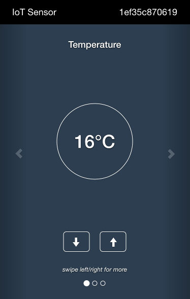
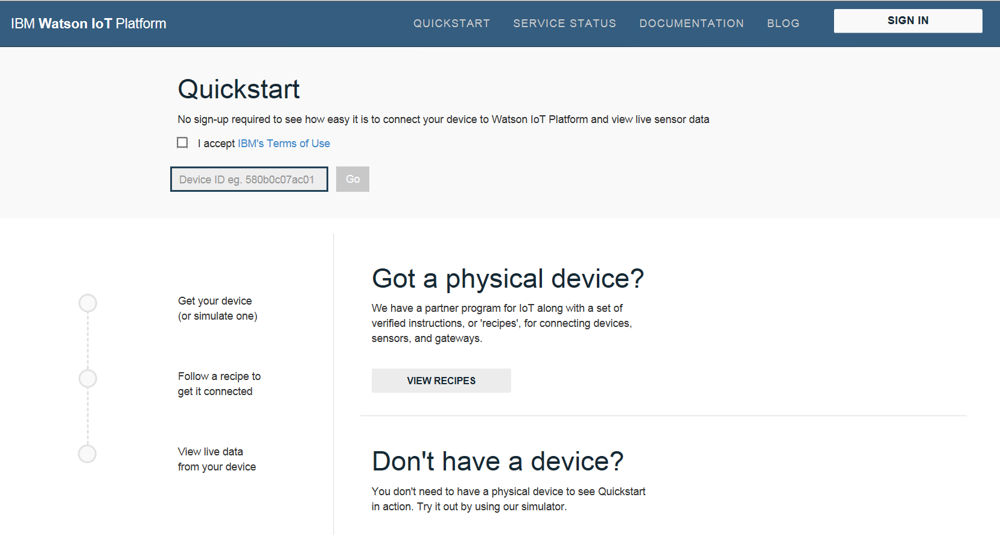

---

copyright:
  years: 2015, 2016

---

{:new_window: target="_blank"}
{:shortdesc: .shortdesc}
{:screen: .screen}
{:codeblock: .codeblock}
{:pre: .pre}

# Quickstart
{: #quickstart}


[Quickstart](https://quickstart.internetofthings.ibmcloud.com/#/) is an open sandbox that you can use to quickly connect your devices to the {{site.data.keyword.iot_full}}. If your devices support the MQTT messaging protocol, they can be easily connected to Quickstart.

There are many examples and tutorials available in [DeveloperWorks Recipes](https://developer.ibm.com/recipes/) that explain how you can connect different devices to the Quickstart service, for example, see the following recipes:

- [OpenBlocks IoT BX1G](https://developer.ibm.com/recipes/tutorials/openblocks-iot-bx1g-for-iot-foundation-quickstart/)
- [Reactive Blocks](https://developer.ibm.com/recipes/tutorials/reactive-blocks-and-java-to-iot-foundation-part-1-quickstart/)


## Simulated devices
{: #simulated_devices}

In addition to the Quickstart recipes and tutorials, a browser-based simulated device for mobile devices is a available for your to use to connect any device with a web browser to the Quickstart service. Open the following URL on a mobile phone or tablet in your favorite browser:

```
http://quickstart.internetofthings.ibmcloud.com/iotsensor.

```

This will launch a browser-based simulated device connecting to the {{site.data.keyword.iot_short_notm}}.


When you connect to the simulated device URL on a mobile device, a browser-based simulated device that is connected to the {{site.data.keyword.iot_short_notm}} is started. There are three sensors that you can control by using the following UI controls that are available:

- Temperature
- Humidity
- Object temperature




## Data visualization
{: #data_visualization}

To visualize the data that is generated from your mobile device, ensure that the simulated device is running on your mobile device, and then launch the Quickstart application. Enter the 12 character device ID for the device, which is displayed in the upper right-hand corner of the UI.



As you adjust the sensor values in your simulated device, you can see the data from your device visualized in real time within the Quickstart application, as outlined in the following screen capture:


## Mosquitto demonstration
{: #mosquitto_demonstration}

[Mosquitto](http://mosquitto.org/) is a cross platform open source MQTT client that you can use to experiment with the {{site.data.keyword.iot_short_notm}} service. After you have installed the Mosquitto client, pick an `<applicationId>` and a `<deviceId>` that have a good chance to be unique (otherwise your experiment will clash with someone else running through this same demonstration).

**Note:** There are a couple of restrictions you must consider when deciding on these IDs:
 -   Maximum length of 36 characters
 -   Must comprise only alpha-numeric characters (`a-z`, `A-Z`, `0-9`) and the following special characters:
     -   dash (`-`)
     -   underscore (`_`)
     -   dot (`.`)

With your `<applicationId>` and `<deviceId>` ready, the first thing you want to do is create a connection representing your application using `mosquitto_sub`. Using examples of `<applicationId>` = myApplicationId and `<deviceId>` = myDeviceId, as outlined in the following sample:

```
    [user@host ~]$ mosquitto_sub -h quickstart.messaging.internetofthings.ibmcloud.com -p 1883 -i "a:quickstart:myApplicationId" -t iot-2/type/mosquitto/id/myDeviceId/evt/helloworld/fmt/json

```

Leave that process running, it is now time to turn your attention towards creating your device. We will connect a device of type `mosquitto` and send two events to the service using `mosquitto_pub`:

```
    [user@host ~]$ mosquitto_pub -h quickstart.messaging.internetofthings.ibmcloud.com -p 1883 -i "d:quickstart:mosquitto:myDeviceId" -t iot-2/evt/helloworld/fmt/json -m "{\"helloworld\": 1}"
    [user@host ~]$ mosquitto_pub -h quickstart.messaging.internetofthings.ibmcloud.com -p 1883 -i "d:quickstart:mosquitto:myDeviceId" -t iot-2/evt/helloworld/fmt/json -m "{\"helloworld\": 2}"
```
Returning to your application terminal you should see the two events that you published almost instantly:

```
   [user@host ~]$ mosquitto_sub -h quickstart.messaging.internetofthings.ibmcloud.com -p 1883 -i "a:quickstart:myApplicationId" -t iot-2/type/mosquitto/id/myDeviceId/evt/helloworld/fmt/json
    {"helloworld": 1}
    {"helloworld": 2}
```

That’s all there is to it. You have successfully connected a device and an application to the {{site.data.keyword.iot_short_notm}} over MQTT, sent an event from the device to the service and recieved that event in your application.
