---

copyright:
  years: 2015, 2016

---

{:new_window: target="_blank"}
{:shortdesc: .shortdesc}
{:screen: .screen}
{:codeblock: .codeblock}
{:pre: .pre}


# Register
{: #reg-index}

Registering for an account on the {{site.data.keyword.iot_full}} and connecting your first device is simple and can take less than 10 minutes to complete.


## Create a Bluemix account
{: #create-bluemix}

First you will need to [register for a Bluemix account](https://console.ng.bluemix.net/registration/). After you verify your e-mail address, the empty dashboard displays in the Bluemix UI, as outlined in the following screen capture:

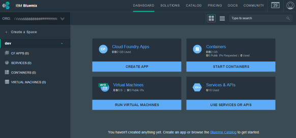

## Choose a region
{: #choose-region}

Now, before you go any further you need to consider data sovereignty and make a decision as to which of the available regions you want to register your service instance with. Currently the {{site.data.keyword.iot_short_notm}} is available in two regions:

-   United Kingom
-   United States

**Note:** Data sovereignty is the concept that information which has been converted and stored in binary digital form is subject to the laws of the country in which it is located.

The region that your {{site.data.keyword.iot_short_notm}} instance will be provisioned in is  determined by the Bluemix region that you are using. You can switch Bluemix regions from the controls in the top right corner of the Bluemix dashboard. You can also identify the region that is currently set for your account from the construction of the Bluemix URL in your browser, as follows:

-   United Kingdom: console.**eu-gb**.bluemix.net
-   United States: console.**ng**.bluemix.net

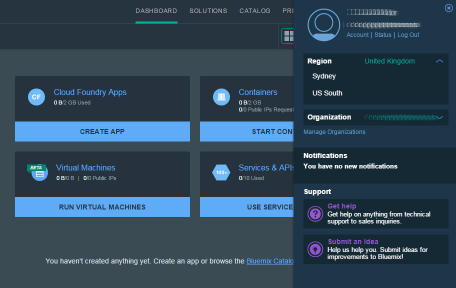

## Provision a {{site.data.keyword.iot_short_notm}} service instance
{: #provision-service-instance}

From anywhere within the Bluemix dashboard, click **catalog** in the top navigation. All of the available services on Bluemix are displayed.

1.  To filter out all the other services, type `Internet of Things` into the search box at the top of the page.
2.  Go to the **Watson IoT platform** service tile, and click **View More**.
3.  Enter a name for your service instance or accept the default name.
4.  Click **Create**.

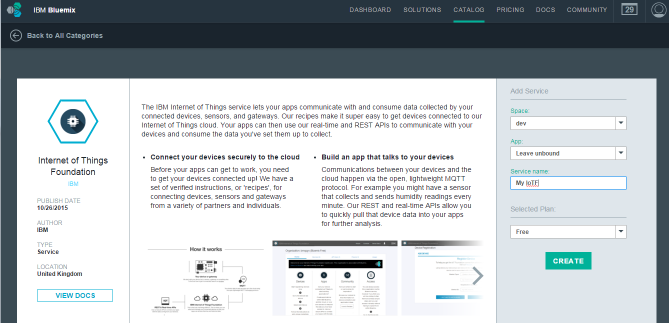

After a short delay, your organization on the {{site.data.keyword.iot_short_notm}} is created.

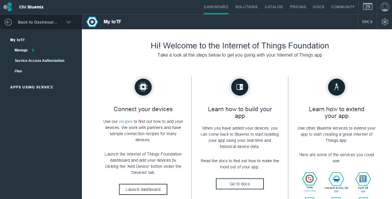

## Additional setup and experimentation
{: #additional-setup}

You can set up and configure your {{site.data.keyword.iot_short_notm}} instance from the dashboard. To open the dashboard, go to your {{site.data.keyword.iot_short_notm}} service instance in Bluemix, and then click **Launch Dashboard**.

### Configure access

When you first register your account, your access to the dashboard is provided through a 24 hour access token that is generated by Bluemix when you clicked `Launch Dashboard`. When your access token expires, you must return to Bluemix and relaunch the dashboard. Alternatively, you can promote your user account as a permanent member of the organization, which is the first step to configuring access.

In the navigation menu, select `Access` and then `Guests`. You should see both the e-mail address that you signed up to Bluemix with and the expiration date for your session. Click the `Promote` button to set yourself up as a permanent member of the organization. Your ID then disappears from the list, and from this point displays under `Access > Members`.


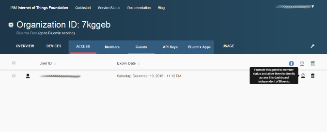


### Connect an application

Applications require an `API key` to connect to the service. To configure the API key, navigate to `Access > API Keys`, and then click `Generate API Key`. Take a note of your `API Key` and `Authentication Token` values as you will need them shortly.

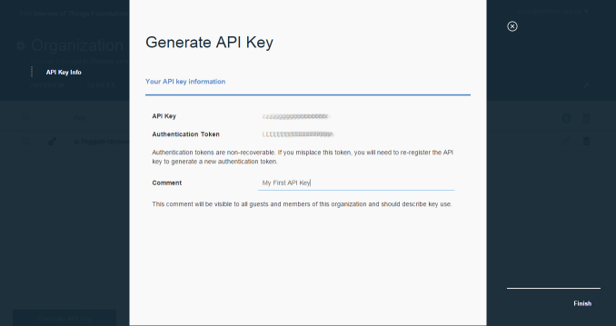

Now we have an API key we want to run an application, the simpler the better.

**Note:** While the {{site.data.keyword.iot_short_notm}} includes client library support for multiple languages, the following getting started tutorial uses [Python]( https://www.python.org/downloads/) instead. If you do not have Python installed, install the latest version of the {{site.data.keyword.iot_short_notm}} Python client library by using the following pip command:

```
[root@host ~]# pip install ibmiotf
```

Next, create a really simple application that can connect by using the API key that you created in the previous step, as outlined in the following example:

```
import signal
import time
import sys
import json
import ibmiotf.application

def myEventCallback(myEvent):
  print("%-33s%-32s%s: %s" % (myEvent.timestamp.isoformat(), myEvent.device, myEvent.event, json.dumps(myEvent.data)))

def interruptHandler(signal, frame):
  client.disconnect()
  sys.exit(0)


options = {
  "org": "<INSERT_ORGANIZATION_ID>",
  "id": "MyFirstApplication",
  "auth-method": "apikey",
  "auth-key": "<INSERT_API_KEY>",
  "auth-token": "<INSERT_AUTH_TOKEN>"
}

try:
  client = ibmiotf.application.Client(options)
  client.connect()
except Exception as e:
  print(str(e))
  sys.exit()

print("(Press Ctrl+C to disconnect)")
client.deviceEventCallback = myEventCallback
client.subscribeToDeviceEvents()

while True:
  time.sleep(1)
```

When you launch the application, you will see nothing overly exciting.

```
[user@host ~]$ python test.py
(Press Ctrl+C to disconnect)
2015-12-19 00:04:28,827   ibmiotf.application.Client  INFO    Connected successfully: a:abc123:MyFirstApplication
```

### Connect a device

Before you can register a device you must first define a device type. A `device type` is intended to represent a group of devices that are identical. It can be useful to think of the `device type` as analogous to a model in the traditional model:serial identification scheme. While your application is running, return to your the dashboard of your {{site.data.keyword.iot_short_notm}} instance, and navigate to `Devices > Device Types`. Click `Create Type` and then enter `python-sample` as the name. All of the fields are optional, so you can skip the rest of the device type options.

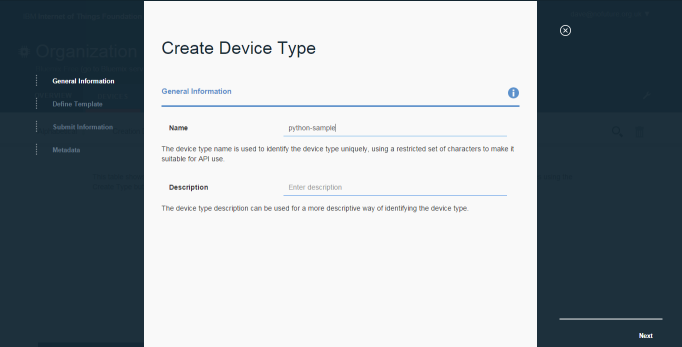

Now it’s time to register a device of this type, navigate to `Devices > Browse` and click `Add Device`. Select the `python-sample` device type that we just created and click `Next`.  On the second panel enter a device ID of “MyFirstDevice” and click `Next` to continue through the guided creation process until you reach the `Add` button.

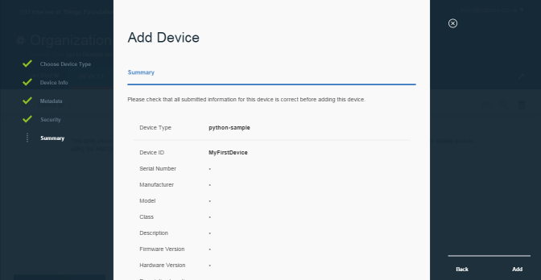

After you click `Add`, your device is registered and you are promoted to generate an `authentication token` for the device.

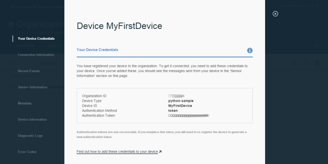

We’re now going to take that authentication token and write a totally minimal device client in python.

```
import time
import sys
import ibmiotf.application
import ibmiotf.device

deviceOptions = {
  "org": "<INSERT_ORG_ID>",
  "type": "python-sample",
  "id": "MyFirstDevice",
  "auth-method": "token",
  "auth-token": "<INSERT_AUTH_TOKEN>"
}

try:
  deviceCli = ibmiotf.device.Client(deviceOptions)
except Exception as e:
  print("Caught exception connecting device: %s" % str(e))
  sys.exit()

deviceCli.connect()
for x in range (0,10):
  data = { 'hello' : 'world', 'x' : x}
  deviceCli.publishEvent("greeting", "json", data)
  time.sleep(1)

deviceCli.disconnect()
```

When executed the device code will generate 10 events, as outlined in the following exaple:


  ```
    [user@host ~]$ python device.py
    2015-12-19 00:34:57,675   ibmiotf.device.Client      INFO    Connected successfully: d:abc123:python-sample:MyFirstDevice
    2015-12-19 00:35:07,678   ibmiotf.device.Client      INFO    Disconnected from the IBM Internet of Things Foundation
    2015-12-19 00:35:07,678   ibmiotf.device.Client      INFO    Messages published : 10, life: 11s, rate: 1/1.08s
    2015-12-19 00:35:07,678   ibmiotf.device.Client      INFO    Messages received  : 0, life: 11s, rate: 1/0.00s
    2015-12-19 00:35:07,679   ibmiotf.device.Client      INFO    Closed connection to the IBM Internet of Things Foundation
```

  If you return to the terminal where your application is running, you can see the application receiving and processing events from your device in real time.

  ```
  [user@host ~]$ python test.py
  (Press Ctrl+C to disconnect)
  2015-12-19 00:34:27,865   ibmiotf.application.Client  INFO    Connected successfully: a:abc123:MyFirstApplication
  2015-12-19T00:34:57.687199+00:00 python-sample:MyFirstDevice     greeting: {"hello": "world", "x": 0}
  2015-12-19T00:34:58.770336+00:00 python-sample:MyFirstDevice     greeting: {"hello": "world", "x": 1}
  2015-12-19T00:34:59.686953+00:00 python-sample:MyFirstDevice     greeting: {"hello": "world", "x": 2}
  2015-12-19T00:35:00.687080+00:00 python-sample:MyFirstDevice     greeting: {"hello": "world", "x": 3}
  2015-12-19T00:35:01.687707+00:00 python-sample:MyFirstDevice     greeting: {"hello": "world", "x": 4}
  2015-12-19T00:35:02.687834+00:00 python-sample:MyFirstDevice     greeting: {"hello": "world", "x": 5}
  2015-12-19T00:35:04.393050+00:00 python-sample:MyFirstDevice     greeting: {"hello": "world", "x": 6}
  2015-12-19T00:35:04.688588+00:00 python-sample:MyFirstDevice     greeting: {"hello": "world", "x": 7}
  2015-12-19T00:35:05.689215+00:00 python-sample:MyFirstDevice     greeting: {"hello": "world", "x": 8}
  2015-12-19T00:35:06.688842+00:00 python-sample:MyFirstDevice     greeting: {"hello": "world", "x": 9}
  ```

Return to the {{site.data.keyword.iot_short_notm}} dashboard, and scroll down to `Device Events`. All of the events that you just submitted are listed in a table.

  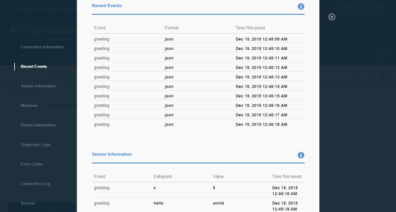

You can also examine the content of any event by selecting the item in the table.

  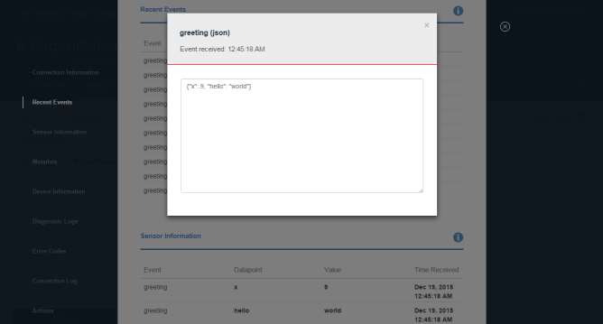
