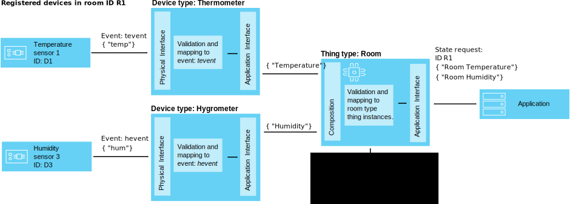

---

copyright:
years: 2016, 2017
lastupdated: "2017-04-10"

---

{:new_window: target="\_blank"}
{:shortdesc: .shortdesc}
{:screen: .screen}
{:codeblock: .codeblock}
{:pre: .pre}

# Using interfaces to map device data (Beta)
{: #im_index}

Application interfaces extend the [device type](#resources) concept to better control the data that flows through {{site.data.keyword.iot_short_notm}} and to provide a device-agnostic view of IoT data.
{:shortdesc}.

**Important:** The interface mapping feature is a beta feature. Ongoing beta updates as well as the final release might include changes that are incompatible with the current version. It is strongly recommended that beta features are not used in production applications until the final release. To receive additional information and provide feedback on this beta, you can [register for the Information Management Beta program ](https://www.ibm.com/software/support/trial/cst/forms/nomination.wss?id=7050){:new_window}.

## Overview
{: #overview}

Use application interfaces to create shared abstractions of devices and things to improve reuse and maintenance and to manage the complexities of an IoT ecosystem while keeping the application insulated from data change. Application interfaces are decoupled from the variability in the message data that devices communicate to {{site.data.keyword.iot_short_notm}}.

Through application interfaces applications can access the currect state of devices and things. The state consists of a set of state properties that are defined by the application interface. As devices send state change events, the most recent values of these properties are stored in {{site.data.keyword.iot_short_notm}} and are made available to the application on request by using an HTTP API.

By using application interfaces, you can:
- Map state properties to event message data
- Define the data structure that you prefer
- Define more than one representation or view of the device state
- Subscribe to device states or query them at any time through an HTTP API

Some common use cases for application interfaces include:
- Providing your application developers consistent interfaces to access event-driven device data in a REST-like manner.
- Normalizing data from devices of different makes or models that publish data in different formats.
- Combining event data from several different device types to model any given IoT thing.
- Modifying and converting data formats to fit your application model.  

For interfaces API documentation (beta), see [{{site.data.keyword.iot_short_notm}} HTTP REST API  ](https://docs.internetofthings.ibmcloud.com/apis/swagger/v0002-beta/info-mgmt-beta.html){: new_window}.   

## Examples
{: #examples}
The following interface examples illustrate two possible solutions.

### Example 1: Mapping heterogeneous temperature sensors to an application interface
{: #device-type-example}
In this example, we create an application interface that provides homogeneous temperature state data in one format, no matter what the actual device event message payload format is. TemperatureSensor1 publishes a Celsius temperature reading of `{ "t" : 34.5 }` to {{site.data.keyword.iot_short_notm}}. TemperatureSensor2 publishes a Fahrenheit temperature reading of `{ "temp" : 72.55 }`. The temperature readings are published as separate events.

For a detailed end-to-end scenario that describes this example, see [Application interface scenario 1](im_index_scenario.html).

As part of the application interface data flow you can perform calculations on incoming data to normalize these readings into a consistent form for processing. This means that you do not need to write your application to understand or convert different temperature scales. The application receives a single, normalized state and uses the **temperature** state property instead of the device specific **t** and **temp** properties.

### Example 2: Mapping multiple climate devices to one thing type application interface
{: #thing-type-example}  
In this example, we expand on the device type example by adding a set of humidity sensors in the form of separate hygrometer devices. By using a thing type application interface, we can seamlessly merge data from separate device types into one application interface that represents all devices and sensors in a room. An application can now get the collected climate data for a room by connecting to the room thing application interface.

For a detailed end-to-end scenario that describes this example, see [Application interface scenario 2](im_index_scenario_thing.html).

Temperature sensor 1 and Humidity sensor 3 publish environmental data that is collected in room R1. The temperature and humidity sensor data is separately mapped to two device type application interfaces, one for the thermometer device type and one for the hygrometer device type per the previous example. We now create a thing type called Room and instantiate two room thing instances (R1 and R2).

We can now set up a composition that includes the thermometer and hygrometer application interfaces and then map the correct environmental sensors to each of the room instances, for example, D1 and D3 mapped to R1. The end-user application can now request the state of a specific room thing ID and get the room temperature and humidity states without having to know about the underying device infrastructure.

## Definitions and resources
{: #resources}

The following diagrams illustrates the logical mapping between devices and applications on {{site.data.keyword.iot_short_notm}} when using application interfaces.

### Concepts

Concepts                        | Description       
------------- | ------------- | -------------  
Event | Events are the mechanism by which devices publish data to {{site.data.keyword.iot_short_notm}}. The device controls the content of the event and assigns a name for each event that it sends.
Property | Data carrying part of a device event payload.
State | The latest value of a mapped state property.
Composition                         | A logical construct that defines the application interfaces that are associated with a thing type. The composition is specified by a thing type schema.   

### Information management resources
You can manage the resources by using REST APIs. For information about the REST APIs, see the [{{site.data.keyword.iot_short_notm}} HTTP REST API](https://docs.internetofthings.ibmcloud.com/swagger/info-mgmt-beta.html) documentation.

Type Resources                        | Description       
------------- | ------------- | -------------  
Event type                         | A programmatic construct that connects a physical interface to an event schema.  **Important:** For the beta, all inbound events to be used in an application interface must be in JSON format.   
Device type                         |  A programmatic construct that lets you group devices that share characteristics or behaviors. In interface mapping the device type is extended to include one physical interface for a device and one or more application interfaces that are used to retrieve the device state.  For more information, see the "Identifiers and device types" section in the [Device Model](../reference/device_model.html#id_and_device_types) topic.
Thing type                         | A programmatic construct that represents a collection of one or more separate device types, thing types, or both.  **Important:** The beta supports three levels of thing type application interface nesting.
Schema resources                         |  Programmatic constructs that define the data structure of the device type physical interfaces, the thing type composition, and the outgoing application interfaces. The following [JSON Schemas ](http://json-schema.org/){:new_window} are used: <ul><li>*Event schemas* define the structure of the events that are published to {{site.data.keyword.iot_short_notm}} by a device. Each event schema defines the structure of one inbound event and is associated with one event type. <li>*Thing type schemas* define the application interfaces that act as input sources by a thing type. Each thing type schema defines the structure of one or more thing type application interfaces.<li>*Application interface schemas* define the structure of the [device state](#key_concepts) that is stored on {{site.data.keyword.iot_short_notm}}</ul>.

Interface resources                        | Description       
------------- | ------------- | -------------  
Application interface | A programmatic construct that your applications can connect to or subscribe to to see the state of a device or a thing. The application interface is defined by an application interface schema that shapes the structure of the state data that is stored as the device or thing state. The state is updated in response to inbound state events. An application interfaces associated with a device type can have one physical interface as input. An application interface that is associated with a thing type can have one or more application interfaces as input.

Instance resources                        | Description       
------------- | ------------- | -------------  
Device                         | A programmatic construct that represents an asset, system, or component that is registered with {{site.data.keyword.iot_short_notm}} and sends IoT data in the form of events.  
Thing                         | A programmatic construct that logically represents unique instance of a thing type. A thing instance serves the same purpose as a registered device of a device type.

Supporting resources                        | Description       
------------- | ------------- | -------------  
Physical interface                         | A programmatic construct that defines the event types and associated device properties that are associated with a single device type and that is associated with one or more event types. The physical interface is defined by event schemas.   
Mappings                         | A programmatic construct that defines how properties that are associated with inbound events are mapped to properties that are defined on an application interface.  **Important:** At least one application interface must be associated with a device type before any mappings can be defined.

## High-level workflow
{: #workflow}

Use the following steps to help you to configure the resources that you need to start mapping your device data by using interfaces.

For details about the API, see the [{{site.data.keyword.iot_short_notm}} HTTP REST API ](https://docs.internetofthings.ibmcloud.com/swagger/info-mgmt-beta.html){:new_window} documentation.

**Tip:** For more detailed information about each of the steps, see the example scenarios or use the links to go directly to a specific step in the example scenario. [Example scenario 1](im_index_scenario.html#scenario) walks you through the steps to create a device type application interface for heterogeneous thermometer devices and [Example scenario 2](im_index_scenario_thing.html#scenario) builds further by describing how to build an application interface that lets you consume data from two different climate device types conflated into a room type thing.

The process for creating and consuming application interfaces differ somewhat depending on if you are creating an application interface that is associated with a device type or with a thing type.

### Before you begin
To create an application interface associated with a device type you must have [at least one device registered with {{site.data.keyword.iot_short_notm}}](im_index_scenario.html#step14) and sending events with state properties.  
To create an application interface associated with a thing type you must have at least one application interface associated with a device type created.

### Steps

1. 	Define the incoming state properties.  
First define the incoming state properties that you want your application interface to make available to your applications.  
Depending on the application interface that you are creating, do one of two things:
<dl>
<dt>Device type: Create a physical interface.</dt>
<dd>
<ol>
<li>[Create an event schema file](im_index_scenario.html#step1). The event schema file is a local .JSON file that defines the structure and format of an inbound event.
<li>[Create an event schema resource for your event type](im_index_scenario.html#step2). The event schema resource is a programmatic construct that is used by {{site.data.keyword.iot_short_notm}}.
<li>[Create an event type that references the event schema](im_index_scenario.html#step3). The event type is used by {{site.data.keyword.iot_short_notm}} to map one or more event schema resources to a physical interface.
<li>[Create a physical interface](im_index_scenario.html#step7).
<li>[Add the event type to the physical interface](im_index_scenario.html#step8).
<li>[Add your physical interface to your device type](im_index_scenario.html#step9).
</ol>
</dd>
<dt>Thing type: Define a composition.</dt>
<dd>
<ol>
<li>[Create a composition schema file](im_index_scenario_thing.html#crt_composition_file).  
A thing type composition schema file is a local .JSON file that defines the composition of the thing type by pointing to existing application interfaces.
<li>[Create the composition schema resource](im_index_scenario_thing.html#crt_composition_resource).  
Upload the local .JSON file to {{site.data.keyword.iot_short_notm}}.
<li>[Create a thing type](im_index_scenario_thing.html#crt_thing_type).   A thing type serves the same purpose as a device type in that it represents a class of things.
</ol>
</dd>
</dl>
4. 	Create the application interface.
 1. 	Create an application interface schema file for the [device type](im_index_scenario.html#step4) or [thing type](im_index_scenario_thing.html#crt_ai_schema_file).  
An application interface schema file is a local .JSON file that defines the device state that is made available to your applications.
 2. 	Create an application interface schema resource for the [device type](im_index_scenario.html#step5) or [thing type](im_index_scenario_thing.html#crt_ai_schema_resource).
 3.	Create an application interface for the [device type](im_index_scenario.html#step6) or [thing type](im_index_scenario_thing.html#crt_thing_ai).
 4.	Add the application interface to the [device type](im_index_scenario.html#step10) or [thing type](im_index_scenario_thing.html#add_thing_ai).
5. 	Define the mappings for the [device type](im_index_scenario.html#step11) or [thing type](im_index_scenario_thing.html#define_Thing_type_mappings).   
Mappings to map inbound properties to properties in the application interface.
6. 	Deploy the configuration that is associated with the [device type](im_index_scenario.html#step15) or [thing type](im_index_scenario_thing.html#deploy_Thing_config).
7. 	**Thing type:** [Create a thing type instance](im_index_scenario_thing.html#create_Thing_instances).
8. 	Check that the state of the [device](im_index_scenario.html#step13) or  [thing](im_index_scenario_thing.html#verify_Thing_state) updates.  
Verify that your subscriptions show the updated device data or that updated device data is returned by using a REST-call.
