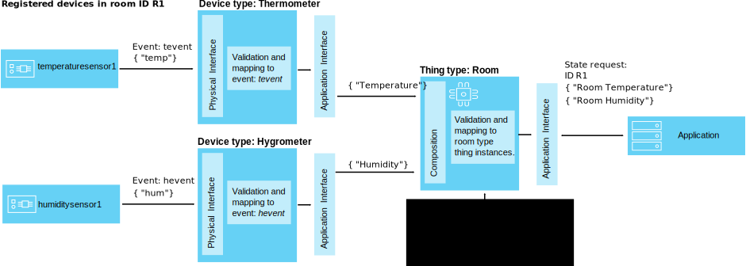

---

copyright:
years: 2016, 2017
lastupdated: "2017-04-11"

---

{:new_window: target="\_blank"}
{:shortdesc: .shortdesc}
{:screen: .screen}
{:codeblock: .codeblock}
{:pre: .pre}

# Application interface scenario 2 (Beta)
{: #scenario}

The application interface is used to remove the requirement for the application to understand how a device or thing is configured. For example, you might measure the temperature of a room by using a single device, or you might calculate the room temperature by taking the average reading of a number of devices. The application requires information on the state of a room or rooms, one component of which is a temperature property. It does not matter how the temperature value that is received by the application is calculated.

In this scenario, temperature sensors and humidity sensors publish environmental data that is collected in two meeting rooms. The temperature and humidity sensor data is separately mapped to two device type application interfaces, one for the thermometer device type and one for the hygrometer device type. A thing type called *RoomType* is then created, along with two room thing instances: *meetingroom1* and *meetingroom2*.

This scenario sets up a composition that includes the thermometer and hygrometer application interfaces and then maps the correct environmental sensors to each of the room instances, for example, *temperatureSensor1* and *humiditySensor1* are mapped to *meetingroom1*.

## Pre-requisites
{: #pre_req}

This scenario builds on the previous [Application interface scenario 1](im_index_scenario).

Before you continue, make sure that you:
- Use the same {{site.data.keyword.iot_short_notm}} organization instance and an API key or token for that organization. For more information about API keys and tokens, see [HTTP REST API for applications](../applications/api.html#authentication).
- Created two application interfaces, one for a temperature sensor and one for a humidity sensor. For information about configuring an application interface for a temperature sensor, see [Device type application interface scenario](../information_management/im_index_scenario).

## About this task
{: #about}

In {{site.data.keyword.iot_short_notm}}, a thing can consist of a number of devices and things. A thing type defines how instances of a thing are composed. An application interface can be
associated with a thing type. This association defines the structure of the state that is generated for a thing type instance. Mappings are used to define how properties from the aggregated
devices and things are mapped to properties on a thing state.

In this scenario, two temperature sensors and two humidity sensors publish events to {{site.data.keyword.iot_short_notm}}. One temperature sensor and one humidity sensor are in meeting room 1 of an office block. The other temperature and humidity sensor are in meeting room 2.



A thing type called *RoomType* is used to define how instances of rooms are composed. An application interface is associated with the *RoomType* and defines that inbound events are mapped to a single reading that shows both temperature and humidity. This single reading is the thing state. Mappings are used to define how properties from the temperature and humidity sensors are mapped to this thing state. When a new reading is published by these sensors, the value of the property that is associated with the thing state is changed.

The following four devices are included:

Device/Type | Event | Event Payload/Property
------------- |  ------------- | -------------
*temperatureSensor1*/Thermometer (meetingroom1) | `iot-2/evt/`*`tevt`*`/fmt/json` | `{ “t” : 34.5 }`/ **temperature1**
*temperatureSensor2*/Thermometer (meetingroom2) | `iot-2/evt/`*`tempevt`*`/fmt/json` | `{ “temp” : 34.5 }`/ **temperature2**  
*humiditySensor1*/Hygrometer (meetingroom1) | `iot-2/evt/`*`hevt`*`/fmt/json` | `{  “h” : "75%" }`/ **humidity1**
*humiditySensor2*/Hygrometer (meetingroom2) |`iot-2/evt/`*`humevt`*`/fmt/json` | `{  “hum” : "75%"}`/ **humidity2**

The thing type application interface represents the thing state in the following structure:
```
{
  “temperature” : <current temperature value in Celsius>
  "humidity" : <current humidity value>
  }
```

<!--
The code that is used in this example is available in the updated {{site.data.keyword.iot_short_notm}} [[Python library ](https://github.com/ibm-watson-iot/iot-python){: new_window} in GitHub, in the **thingDataTransform** sample.
-->  

Use the following example scenario to set up your own interfaces environment.  

## If needed, add a device type and a device  
{: #add_device}  
In this scenario, two device types and four device instances are used. Device instances *temperatureSensor1* and *temperatureSensor2* are associated with device type *Thermometer*. Device instances *humiditySensor1* and *humiditySensor2* are associated with device type *Hygrometer*.

For information about using REST APIs to add a device type, see the [{{site.data.keyword.iot_short_notm}} HTTP REST API](https://docs.internetofThings.ibmcloud.com/swagger/v0002.html#!/Device_Types) documentation.  

## Step 1: Create a composition schema file.  
{: #crt_composition_file}  
Create a composition schema file that references the device application interface identifiers for each temperature and humidity device type.  

The following example shows how to create a composition schema file that is called *Room Type Schema*.  
```
{
   "$schema": "http://json-schema.org/draft-04/schema#",
   "type" : "object",
   "title" : "Room Type Schema",
   "description" : "JSON Schema that defines the structure of the Room Thing Type.",
   "properties" : {
       "temperatureSensor": {
           "description": "The temperature sensor device",
           "$applicationInterfaceRef": "58c135e352faff0001198a89"
       },
       "humiditySensor": {
           "description": "The humidity sensor device",
           "$applicationInterfaceRef": "58c135ea52faff0001678f06"
       }
   },
   "required" : [
       "temperatureSensor",
       "humiditySensor"
   ]
}
```
**Tip:** Use the “required” parameter to mark one or more properties as required. Required properties must be included in a device message for Watson IoT Platform to update the device state with the device data. A message that does not include the required property is not processed.   
**Note:** The schema identifier that is generated when you create a thing type schema file must be specified when you create your thing type.  

## Step 2: Create a composition schema resource.  
{: #crt_composition_resource}  

Create the schema resouce by uploading the thing type schema file that was generated in the previous step.  
Upload the thing type schema file by using the following API:  
```
POST /schemas
```  
The following parameters are required:  
<table>
<tr>
<th>	Parameter	</th><th>	Description	</th>
</tr>
<tr>
<td>	name	</td><td>	Provide a name for the composition schema that you are creating.	</td>
</tr>
<tr>
<td>	schemaFile	</td><td>	Path to the local composition schema JSON file.	</td>
</tr>
</table>

For more details, see the [{{site.data.keyword.iot_short_notm}} HTTP REST API](https://docs.internetofthings.ibmcloud.com/apis/swagger/v0002-beta/info-mgmt-beta.html#!/Schemas) documentation.  

<!-- The following example shows how to use Python to create the thing type schema resource:  
```python
roomTypeSchemaFile = open(schemasDir + "roomType.json", "r");
roomTypeSchema = roomTypeSchemaFile.read();
roomTypeSchemaFile.close();
"roomTypeSchemaId", result = api.createSchema("Room Type Schema", "roomType.json", roomTypeSchema)
```  -->

## Step 3: Create a thing type  
{: #crt_thing_type}  

Thing types are used to model thing instances. A thing type must be created in an organization before a thing instance can be created. For this scenario, create one thing type.  
The schema that is associated with a thing type defines the type of objects that are aggregated together to make an instance of a thing. The thing type must reference the thing type schema resource that you created in the previous step.  
Create a thing type by using the following API:
```
POST /thing/types
```
The following parameters are required:  
<table>
<tr><th>Parameter</th><th>Description</th></tr>
<tr><td>Id</td><td>Provide an ID for the thing type that you are creating.</td></tr>
<tr><td>name</td><td>Provide a name for the thing type that you are creating.</td></tr>
<tr><td>schemaId</td><td>The id created for the composition schema resource.</td></tr>
</table>

For more details, see the [{{site.data.keyword.iot_short_notm}} HTTP REST API](https://docs.internetofthings.ibmcloud.com/apis/swagger/v0002-beta/info-mgmt-beta.html#!/Thing_Types) documentation.  

<!-- The following example shows how to use Python to create a thing type that is called *RoomType*.
```python
result = api.createThingType(thingType, "RoomType", "roomTypeSchemaId", "The Room Thing type")

```  -->

## Step 4: Create an application interface schema file  
{: #crt_ai_schema_file}
In your application interface, you can define the structure of the data that is stored as the thing state. For this scenario, create an application interface that defines temperature and humidity properties. Associate the application interface with the thing type *RoomType* by referencing the application interface identifier that is generated when you create the application interface resource.  
The following example shows how to create an application interface schema file that is called *RoomType Schema*.
```
{
   "$schema": "http://json-schema.org/draft-04/schema#",
   "type" : "object",
   "title" : "RoomType Schema",
   "description" : "JSON Schema that defines the canonical room state structure",
   "properties" : {
       "temperature" : {
           "description" : "Temperature in degrees celsius",
           "type" : "number",
           "minimum" : -273.15,
           "default" : 0.0
       },
       "humidity" : {
           "description" : "Percentage humidity",
           "type" : "number",
           "minimum" : 0,
           "maximum" : 100,
           "default" : 0.0
       }
   },
   "required" : [
       "temperature",
       "humidity"
   ]
}
```  
## Step 5: Create an application interface schema resource.  
{: #crt_ai_schema_resource}  
Upload the application interface schema file that you created in the previous step to create an application interface schema resource for your thing type by using the following API:  
```
POST /schemas
```  
The following parameters are required:  
<table>
<tr>
<th>Parameter</th><th>Description</th>
</tr>
<tr>
<td>name</td><td>Provide a name for the application interface schema that you are creating.</td>
</tr>
<tr>
<td>schemaFile</td><td>Path to the local application interface schema JSON file.</td>
</tr>
</table>  

For more details, see the [{{site.data.keyword.iot_short_notm}} HTTP REST API](https://docs.internetofthings.ibmcloud.com/apis/swagger/v0002-beta/info-mgmt-beta.html#!/Schemas) documentation.  

<!-- The following example shows how to use Python to create the thing type application interface schema resource:  
```python
roomSchemaFile = open(schemasDir + "room.json", "r");
roomSchema = roomSchemaFile.read();
roomSchemaFile.close();
"roomSchemaId", result = api.createSchema("Room Schema", "room.json", roomSchema)
```  -->

Use the schema identifier to add the application interface schema resource to the application interface for your thing type.  

## Step 6: Create an application interface for the thing type.  
{: #crt_thing_ai}  
The application interface must reference the application interface schema resource that you created in the previous step.  
To create an application interface, use the following API:  
```
POST /applicationinterfaces
```  
The following parameters are required:  
<table>
<tr>
<th>	Parameter	</th><th>	Description	</th>
</tr>
<tr>
<td>	name	</td><td>	Provide a name for the application interface that you are creating.	</td>
</tr>
<tr>
<td>	description	</td><td>	Provide a description of the application interface.	</td>
</tr>
<tr>
<td>	schemaId	</td><td>	Path to the local application interface schema JSON file.	</td>
</tr>
</table>  

For more details, see the [{{site.data.keyword.iot_short_notm}} HTTP REST API](https://docs.internetofthings.ibmcloud.com/apis/swagger/v0002-beta/info-mgmt-beta.html#!/Application_Interfaces) documentation.  
Use the schema identifier that was returned in the previous response to add the application interface schema to the application interface.  

<!-- The following example shows how to use Python to create an application interface:  
```python
"applicationInterfaceId", result = api.createApplicationInterface("IRoom", "roomSchemaId")
```  -->

Use the application interface identifier to add your application interface to your device type. You also use this identifier to map an inbound device event to a property that is defined by the application interface.  

## Step 7: Add the application interface to the thing type.  
{: #add_thing_ai}  
To add an application interface to a thing type, use the following API:  
```
POST /thing/types/{thingtypeId}/applicationinterfaces
```  
The following parameters are required:  
<table>
<tr>
<th>	Parameter	</th><th>	Description	</th>
</tr>
<tr>
<td>	id	</td><td>	The id created for the thing type.	</td>
</tr>
<tr>
<td>	name	</td><td>	Provide a name for the application interface that you are creating.	</td>
</tr>
<tr>
<td>	schemaId	</td><td>	The id created for the application interface resource.	</td>
</tr>
<tr>
<td>	refs/schema	</td><td>	The path to the application interface resource. Typically: /schemas/*schemaId*	</td>
</tr>
</table>  

For more details, see the [{{site.data.keyword.iot_short_notm}} HTTP REST API](https://docs.internetofthings.ibmcloud.com/apis/swagger/v0002-beta/info-mgmt-beta.html#!/Thing_Types) documentation.  
In this scenario, the application interface is associated with thing type *RoomType*.

<!-- The following example shows how to use Python to add the thing application interface to the thing type *RoomType*:  
```python
result = api.addApplicationInterfaceToThingType(RoomType, "applicationInterfaceId", "roomSchemaId")
``` -->

## Step 8: Define mappings
{: #define_Thing_type_mappings}

Define the mappings for the thing type that describe how to map properties from the state of the aggregated devices or things to the properties that are defined on the thing type application interface.

To map events, use the following API:  
```
POST /thing/types/{thingtypeId}/mappings
```  

The following parameters are required:  
<table>
<tr>
<th>	Parameter	</th><th>	Description	</th>
</tr>
<tr>
<td>	applicationInterfaceId	</td><td>	The id created for the application interface.	</td>
</tr>
<tr>
<td>	propertyMappings	</td><td>	A valid JSON structure that maps properties defined for the application interface with the properties of the device event payload.	</td>
</tr>
</table>  

For more details, see the [{{site.data.keyword.iot_short_notm}} HTTP REST API](https://docs.internetofthings.ibmcloud.com/apis/swagger/v0002-beta/info-mgmt-beta.html#!/Thing_Types) documentation.

<!--  The following example shows how to use Python to add a mapping to thing type *RoomType*:

```python
mappings = {
     "humiditySensor": {
       "humidity": "$event.humidity"
     },
     "temperatureSensor": {
       "temperature": "$event.temperatureC"
     }
 }

 result = api.addMappingsToThingType(thingType, "applicationInterfaceId", mappings)
``` -->

The following example shows a sample propertyMappings parameter entry:

```
{
  "applicationInterfaceId": "58dd849752faff0001638851",
  "propertyMappings": {
       "humiditySensor": {
         "humidity": "$event.humidity"
       },
       "temperatureSensor": {
         "temperature": "$event.temperatureC"
       }
   }
}
```

The *humiditySensor* is defined in the thing schema. The "$event.humidity" is defined in the application interface schema with the identifier "58c135ea52faff0001678f06".
The *temperatureSensor* is defined in the thing schema. The "$event.temperatureC" is defined in the application interface schema with the identifier "58c135e352faff0001198a89".

## Step 9: Deploy the configuration that is associated with the thing type  
{: #deploy_Thing_config}   
Deploy configuration that is related to thing state update for each thing type. This configuration includes schemas, application interfaces, and mappings.

You must deploy the thing type configuration before you can create any instances of the thing type.

To deploy your thing type configuration, use the following API:

```
PATCH /thing/types/{thingtypeId}
```
For more details, see the [{{site.data.keyword.iot_short_notm}} HTTP REST API](https://docs.internetofthings.ibmcloud.com/apis/swagger/v0002-beta/info-mgmt-beta.html#!/Device_Types) documentation.

<!-- The following example shows how to use Python to deploy your configuration for thing type *Room*:

```python
result = api.deployThingTypeConfiguration(thingType)
``` -->

## Step 10: Create an instance of a thing type
{: #create_Thing_instances}

A thing is an instance of a thing type. A thing enables you to aggregate one or more instances of a device or thing together into a single object.

To create a thing, use the following API:

```
POST /thing/types/{thingTypeId}/things
```

The following parameters are required:  
<table>
<tr>
<th>	Parameter	</th><th>	Description	</th>
</tr>
<tr>
<td>	typeId	</td><td>		The the id of the thing type that you created earlier.</td>
</tr>
<tr>
<td>	thingId	</td><td>	Provide a name for the thing instance that you are creating.	</td>
</tr>
</table>

For more details, see the [{{site.data.keyword.iot_short_notm}} HTTP REST API](https://docs.internetofthings.ibmcloud.com/apis/swagger/v0002-beta/info-mgmt-beta.html#!/Things) documentation.

In this scenario, we need to create two thing instances that are of thing type *RoomType*. One thing instance is called *meetingroom1* and the other thing instance is called *meetingroom2*.

<!-- The following example shows how to use Python to create a thing instance that is called *meetingroom1*. *meetingroom1* is associated with the *temperatureSensor1* and *humiditySensor1* device instances.

```python
thingId = "meetingroom1"
 meetingroom1AggregatedObjects = {
   "temperatureSensor": {
     "type": "device",
     "typeId": "TemperatureSensor",
     "id": "temperatureSensor1"
   },
   "humiditySensor": {
     "type": "device",
     "typeId": "HumiditySensor",
     "id": "humiditySensor1"
   }
 }
 result = api.createThing(thingType, thingId, "Meeting Room 1", "The big meeting room!!!", aggregatedObjects = meetingroom1AggregatedObjects)
``` -->

The thing identifier that is created is used in the URL of the POST method that is called to add a temperature event to the thing application interface.

<!-- The following example shows how to use Python to create a thing instance that is called *meetingroom2*. *meetingroom2* is associated with the *temperatureSensor2* and *humiditySensor2* device instances.

```python
thingId = "meetingroom2"
   meetingroom2AggregatedObjects = {
    "temperatureSensor": {
      "type": "device",
      "typeId": "TemperatureSensor",
      "id": "temperatureSensor2"
    },
    "humiditySensor": {
      "type": "device",
      "typeId": "HumiditySensor",
      "id": "humiditySensor2"
    }
  }
result = api.createThing(thingType, thingId, "Meeting Room 2", "The little meeting room!!!", aggregatedObjects = meetingroom2AggregatedObjects)  
``` -->

## Step 11: Verify that mapped device events are published to the application interface  
{: #publish_event}  
Publish the following events for devices that are aggregated into the thing *meetingroom1*:  
 - a temperature event from *temperatureSensor1* on topic `iot-2/evt/tevt/fmt/json`  
 - a humidity event from *humiditySensor1* on topic `iot-2/evt/hevt/fmt/json`  
Publish the following events for devices that are aggregated into the thing *meetingroom2*:  
 - a temperature event from *temperatureSensor2* on topic `iot-2/evt/tempevt/fmt/json`  
 - a humidity event from *humiditySensor2* on topic `iot-2/evt/humevt/fmt/json`  
For information about publishing an inbound event from a device, see [MQTT connectivity for applications](../applications/mqtt.html#publishing_device_events).  

## Step 12: Check that the state of the thing is changed.  
{: #verify_Thing_state}  
To check the thing state, use the following API:  
```
GET /thing/types/{thingTypeId}/things/{thingId}/state/{applicationInterfaceId}
```  

The following parameters are required:  
<table>
<tr>
<th>Parameter	</th><th>	Description</th>
</tr>
<tr>
<td>thingtypeId	</td><td>The thing type ID</td>
</tr>
<tr>
<td>thingId	</td><td>	The thing ID.</td>
</tr>
<tr>
<td>applicationInterfaceId</td><td>The id created for the application interface.</td>
</tr>
</table>  

For more details, see the [{{site.data.keyword.iot_short_notm}} HTTP REST API](https://docs.internetofthings.ibmcloud.com/apis/swagger/v0002-beta/info-mgmt-beta.html#!/Thing_Types) documentation.  

<!-- The following example shows how to use Python to retrieve the current state of *meetingroom1* by referencing the identifier of the application interface that was created:  
```python
result = api.getThingStateForApplicationInterface("RoomType", "meetingroom1", applicationInterfaceId)
```  
The following example shows how to use Python to retrieve the current state of *meetingroom2* by referencing the identifier of the application interface that was created:  
```python
result = api.getThingStateForApplicationInterface("RoomType", "meetingroom2", applicationInterfaceId)
``` -->
