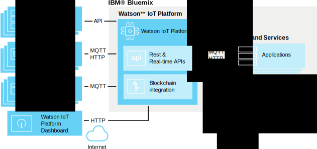

---

copyright:
  years: 2016

---

{:new_window: target="_blank"}
{:shortdesc: .shortdesc}
{:screen: .screen}
{:codeblock: .codeblock}
{:pre: .pre}

# About {{site.data.keyword.iot_short_notm}}
{: #about_iotplatform}

{{site.data.keyword.iot_full}} provides powerful application access to IoT devices and data to help you rapidly compose analytics applications, visualization dashboards, and mobile IoT apps.
{:shortdesc}

{{site.data.keyword.iot_short_notm}} allows you to perform powerful device management operations, and store and access device data, connect a wide variety of devices and gateway devices. {{site.data.keyword.iot_short_notm}} provides secure communication to and from your devices by using MQTT and TLS.

## Architecture of the {{site.data.keyword.iot_short_notm}}
{: #watsoniotplatform_architecture}

The {{site.data.keyword.iot_short_notm}} communicates with your applications and devices by using the {{site.data.keyword.iot_short_notm}} API and the {{site.data.keyword.iot_short_notm}} messaging protocol. The {{site.data.keyword.iot_short_notm}} dashboard connects as a front-end user interface to simplify operations within the platform. Device data can be stored or used with analytics solutions.

## Important concepts in the {{site.data.keyword.iot_short_notm}}
{: #watsoniotplatform_importantconcepts}

### Organizations

When you register with the {{site.data.keyword.iot_short_notm}}, you are given an organization ID. Your organization ID is a unique six character identifier for your account. Organizations ensure that your data is only accessible by your devices and applications. After registration, devices and API keys are bound to a single organization. When an application connects to the service by using an API key, it will register to the organization that is associated with the API key that is used.

For your security, it is impossible for cross-organization communication. The only way to transmit data between two organizations is to create an application within each organization that will communicate with applications in the other organization.

### Devices

A device can be anything that has a connection to the Internet and that can push data into the cloud. However, devices cannot communicate directly with other devices, instead devices accept commands from applications, and send events to applications. Devices in the {{site.data.keyword.iot_short_notm}} are identified by a unique authentication token. Devices must be registered before they can connect to the {{site.data.keyword.iot_short_notm}}.

The {{site.data.keyword.iot_short_notm}} recognizes two classes of device; **managed devices** and **unmanaged devices**.

**Managed devices** are defined as devices that contain a device management agent. A device management agent is a set of logic that allows the device to interact with the {{site.data.keyword.iot_short_notm}} Device Management service by using the Device Management Protocol. Managed devices can perform device management operations, including location updates, firmware downloads and updates, reboots, and factory resets.

**Unmanaged devices** are all devices without a device management agent. Unmanaged devices can connect to the {{site.data.keyword.iot_short_notm}} and send and receive events and commands, but they cannot send device management requests or perform device management operations.

### Gateways

Gateways are specialized devices that have the combined capabilities of an application and a device, which allows them to serve as access points for other devices. Devices that cannot connect directly to the Internet can access the {{site.data.keyword.iot_short_notm}} service by first connecting to the gateway device.

Gateways must be registered before they can connect to the service.

### Applications

An application is anything that has a connection to the Internet and interacts with data from devices and control the behavior of those devices. Applications identify themselves with the {{site.data.keyword.iot_short_notm}} by using an API key and a unique application ID. Unlike devices, individual applications do not need to register before they can connect to the {{site.data.keyword.iot_short_notm}}. However, they must use a valid API key that has been previously registered.

### Events

Events are the mechanism by which devices publish data to the {{site.data.keyword.iot_short_notm}}. Devices control the content of their messages, and assign a name for each event that is sent. The {{site.data.keyword.iot_short_notm}} uses the credentials that are attached to each event received to determine which device sent the event. This architecture prevents devices from impersonating one another.

Applications can process events in real time, and see the source of the event and the data contained in the event. Applications must be configured to define which devices and events they subscribe to.

### Commands

Commands are the mechanism by which applications communicate with devices. Only applications can send commands, and the commands are sent to specific devices. The device must determine which action to take on receipt of any given command. Devices can be designed to listen for any command or to subscribe to a specified list of commands.
