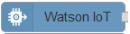

---

copyright:
  years: 2015, 2016, 2017
lastupdated: "2016-09-01"

---

{:new_window: target="_blank"}
{:shortdesc: .shortdesc}
{:screen: .screen}
{:codeblock: .codeblock}
{:pre: .pre}

# {{site.data.keyword.iot_short_notm}} mithilfe von Node-RED entwickeln
{: #dev_nodered}

Node-RED ist ein grafisch orientiertes Tool, dass Sie zum Entwickeln von Anwendungen, Geräten und Gateways in {{site.data.keyword.iot_full}} verwenden können. Node-RED bietet Funktionen für neue und interessante Möglichkeiten, Verbindungen zu Hardwaregeräten, APIs und Onlineservices herzustellen. Node-RED baut auf Node.js auf und nutzt das große Ökosystem aus Knotenmodulen, um ein Tool bereitzustellen, das viele unterschiedliche Systeme integrieren kann.
{:shortdesc}

IBM stellt Node-RED-Knoten bereit, um Sie beim Verbinden Ihrer Geräte, Gateways und Anwendungen mit {{site.data.keyword.iot_short_notm}} zu unterstützen und um IoT-Lösungen schnell zu erstellen.

## Watson IoT Node   
{: #watson_iot_node}  

Watson IoT Node ist ein Knotenpaar, mit dem Sie Ihre Geräte oder Gateways mit {{site.data.keyword.iot_short_notm}} verbinden können. Geräte oder Gateways können diese Knoten verwenden, um Ereignisse zu senden und Befehle von der Anwendung zu empfangen.

Weitere Informationen zu Watson IoT Node finden Sie in den folgenden Ressourcen:

- [Watson IoT Node unter GitHub](https://github.com/ibm-watson-iot/iot-nodered/tree/master/node-red-contrib-ibm-watson-iot)
- [Watson IoT Node-Dokumentation](https://www.npmjs.com/package/node-red-contrib-ibm-watson-iot)

## IBM IoT App Node  
{: #watson_app_node}  

IBM IoT App Node ist ein Knotenpaar, mit dem Sie Ihre Anwendungen mit {{site.data.keyword.iot_short_notm}} verbinden können. Anwendungen können die Knoten verwenden, um Geräteereignisse zu empfangen und um Befehle zurück an das Gerät zu senden.

Weitere Informationen zu IBM IoT App Node finden Sie in den folgenden Ressourcen:

- [IBM IoT App Node unter GitHub](https://github.com/ibm-watson-iot/iot-nodered/tree/master/node-red-contrib-scx-ibmiotapp)
- [IBM IoT App Node-Dokumentation](http://flows.nodered.org/node/node-red-contrib-scx-ibmiotapp)

## Weitere Informationen und Beispiele   
{: #more_info}

Verwenden Sie als Hilfe bei den ersten Schritten folgende Beispielanleitungen:
- [Einführung in {{site.data.keyword.iot_short_notm}} mithilfe von Node-RED](https://developer.ibm.com/recipes/tutorials/getting-started-with-watson-iot-platform-using-node-red/)
- [Raspberry Pi als Gerät mithilfe von Node-RED mit {{site.data.keyword.iot_short_notm}} verbinden](https://developer.ibm.com/recipes/tutorials/deploy-watson-iot-node-on-raspberry-pi/)

Weitere Informationen finden Sie auch in [Apps mit Node-RED Starter erstellen](https://console.ng.bluemix.net/docs/starters/Node-RED/nodered.html#nodered).
