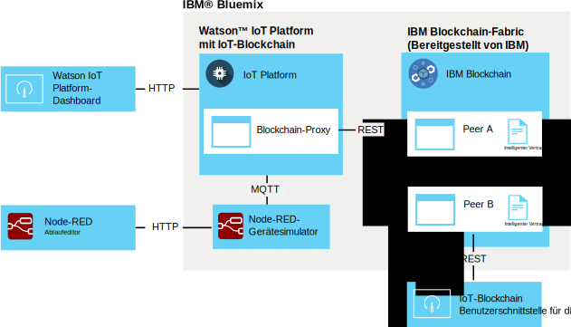

---

copyright:
  years: 2016, 2017
lastupdated: "2016-12-08"

---

{:new_window: target="\_blank"}
{:shortdesc: .shortdesc}
{:screen: .screen}
{:codeblock: .codeblock}
{:pre: .pre}

# {{site.data.keyword.iot_short_notm}}-Blockchain-Integration
{: #gettingstartedtemplate}

Durch die {{site.data.keyword.iot_short_notm}}-Integration von Blockchain ist es möglich, dass IoT-Geräte Daten für Blockchain-Transaktionen bereitstellen; dadurch werden die Daten im nicht veränderbaren Blockchain-Konto gespeichert und in den Geschäftsregeln verwendet, die in den intelligenten Blockchain-Verträgen implementiert sind.
{:shortdesc}

Die Plattform akzeptiert Gerätedaten im nativen MQTT-Format, ordnet sie dem für die intelligenten Verträge von Blockchain erforderlichen Datenformat zu und übergibt sie an ein Blockchain-Fabric, damit sie im Blockchain-Konto gespeichert werden. Ein Blockchain-Fabric ist eine Sammlung von Peer- und Zertifizierungsknoten, die eine Instanz von {{site.data.keyword.blockchainfull}} und Hyperledger bilden.

## Architektur der Blockchain-Integration  
{: #architecture}

Eine generische {{site.data.keyword.iot_short_notm}}-Umgebung für die Blockchain-Integration besteht aus den folgenden Komponenten:
- Mindestens ein Gerät, das Daten generiert, die Sie in ein Blockchain-Konto schreiben möchten.
- {{site.data.keyword.Bluemix_notm}}-Organisation:
 - {{site.data.keyword.iot_short_notm}}-Service mit aktivierter IoT-Blockchain-Integration.
 - {{site.data.keyword.blockchainfull_notm}}- oder Hyperledger-Fabric mit mindestens einem bereitgestellten intelligenten Vertrag.
- Lokale Umgebung:
 - IoT-Blockchain-Benutzerschnittstelle für die Überwachung

Weitere Informationen zur Einrichtung und zu den Anforderungen für eine erweiterte Umgebung, die zum Erstellen und Bereitstellen von intelligenten Verträgen verwendet werden soll, finden Sie in [Intelligente Verträge für die {{site.data.keyword.iot_short_notm}}-Integration mit Blockchain entwickeln](blockchain/dev_blockchain.html).  

Das folgende Diagramm veranschaulicht die allgemeine Umgebung für die {{site.data.keyword.iot_short_notm}}-Integration mit Blockchain.

## Vorbereitende Schritte
{: #byb}

- Verschaffen Sie sich bei IBM.com eine Übersicht über {{site.data.keyword.iot_short_notm}}, über dessen Beziehung zum allgemeinen Blockchain-Konzept und was es für Sie in [{{site.data.keyword.iot_short_notm}}](http://www.ibm.com/blockchain/) ausführen kann.
- [Aktivieren Sie die {{site.data.keyword.iot_short_notm}}-Blockchain-Integration](reference/extensions/index.html#blockchain) für Ihre Organisation.
- Stellen Sie eine Verbindung für Geräte her, die Daten erzeugen, die Sie in das Blockchain-Konto schreiben möchten.  
Folgen Sie den Anweisungen im Abschnitt [Geräte verbinden](iotplatform_task.html), um für Ihre Geräte eine Verbindung herzustellen.
- Installieren Sie die Benutzerschnittstelle für die Überwachung.
Mit der Benutzerschnittstelle für die Überwachung wird die Verbindung zwischen {{site.data.keyword.iot_short_notm}} und dem Blockchain-Fabric überprüft. Folgen Sie den Anweisungen im Readme-Dokument der Benutzerschnittstelle für die Überwachung, das im GitHub-Verzeichnis der [Blockchain-Benutzerschnittstelle für die Überwachung](https://github.com/ibm-watson-iot/blockchain-samples/tree/master/applications/monitoring_ui) verfügbar ist.

### IBM Basisszenario für einen schnellen Start

Um schnell mit dem Testen der {{site.data.keyword.iot_short_notm}}-Integration mit Blockchain zu starten, können Sie eine Verbindung zu einem von IBM bereitgestellten Fabric herstellen und dem von IBM bereitgestellten Beispielvertrag ein Node-RED-Beispielgerät zuordnen.  Die für dieses Szenario erforderlichen Schritte werden in diesem Abschnitt als **IBM Basisszenario** bezeichnet.  
**Wichtig:** Beachten Sie, dass das von IBM bereitgestellte Blockchain-Beispielkonto und alle zugehörigen Daten für alle Benutzer des Blockchain-Beispielkontos sichtbar sind. Speichern Sie in dem von IBM bereitgestellten Blockchain-Beispielkonto keine sensiblen Informationen. Darüber hinaus sind bei Beispielfabrics, die das Beispiel unterstützen, sowie bei Trade Lane-Verträgen einschließlich der Verbindungsinformationen für die einzelnen Peers Änderungen vorbehalten. Die Verbindungsdetails stehen in der Watson IoT-Blockchain-Community auf der Wikiseite [Informationen zu IoT-Blockchain-Verbindung](https://www.ibm.com/developerworks/community/wikis/home?lang=en#!/wiki/W7a44a0e604d9_4a90_89b7_0a2bdbe81b00/page/Blockchain%20Fabric%20Connections) zur Verfügung.

Die von IBM bereitgestellte grundlegende Umgebung für die {{site.data.keyword.iot_short_notm}}-Integration mit Blockchain besteht aus den folgenden Komponenten:
- {{site.data.keyword.Bluemix_notm}}:
 - {{site.data.keyword.iot_short_notm}}-Service mit aktivierter IoT-Blockchain-Integration
 - Optional: Node-RED-Anwendung, die einen IoT-Gerätesimulator ausführt
   
 **Hinweis:** Der Gerätesimulator kann auch in einer lokalen Node-RED-Umgebung implementiert sein.
- Lokale Umgebung:
 - Node.js
 - IoT-Blockchain-Benutzerschnittstelle für die Überwachung
- Von IBM bereitgestellt:
 - Optional: {{site.data.keyword.iot_short_notm}}-Fabric mit einem einfach gehaltenen intelligenten Vertrag, der vorimplementiert ist.

Das folgende Architekturdiagramm veranschaulicht die für dieses Beispielszenario erforderlichen Komponenten.

**IBM Basisszenario:** Erstellen Sie einen Node-RED-Gerätesimulator, indem Sie den Anweisungen im Abschnitt [Node-RED-Gerätesimulator erstellen und verbinden](nodereddevice_sample.html) folgen. Verwenden Sie für eine Blockchain-Integration beim Importieren der Knotendaten die für Blockchain-Geräte spezifischen Knoteninformationen. Die Knoteninformationen stehen auf der Wikiseite [Node-RED Device Simulator](https://www.ibm.com/developerworks/community/wikis/home?lang=en#!/wiki/W7a44a0e604d9_4a90_89b7_0a2bdbe81b00/page/Node-RED%20Device%20Simulator) der Watson IoT-Blockchain-Community zur Verfügung. Wenden Sie sich gegebenenfalls an Ihren IBM Ansprechpartner für Blockchain, um Zugang zu der Community zu erhalten.

## Verbindung zu Blockchain-Fabric herstellen
{: #getting_started}  
Da die {{site.data.keyword.iot_short_notm}}-Blockchain-Integration aktiviert ist, können Sie nun eine Verbindung zu Blockchain-Fabrics herstellen, die von {{site.data.keyword.blockchainfull_notm}} oder Linux Foundation Hyperledger gehostet werden.

So stellen Sie die Verbindung zu einem Blockchain-Fabric her:
1. Wählen Sie im {{site.data.keyword.iot_short_notm}}-Dashboard die Option **Erweiterungen** aus.
2. Klicken Sie auf der Seite **Erweiterungen** der Kachel 'Blockchain' auf **Einrichten**.
3. Klicken Sie auf der Seite **Erweiterungen** der Kachel 'Blockchain' auf **Einrichten** oder klicken Sie auf , falls bereits Fabrics verbunden sind, und geben Sie die Fabric-Informationen ein.
 1. Geben Sie auf der Registerkarte **Fabric** einen Namen ein, um das Fabric in {{site.data.keyword.iot_short_notm}} anzugeben, und klicken Sie anschließend auf **Weiter**.   
 2. Geben Sie auf der Registerkarte **Peer** die Peerinformationen ein.  
<table>
<thead>
<tr>
<th>Parameter</th>
<th>Wert</th>
</tr>
</thead>
<tbody>
<tr>
<td>Name</td>
<td>Geben Sie einen Namen ein, um den Peer in {{site.data.keyword.iot_short_notm}} anzugeben.</td>
</tr>
<tr>
<td>Host</td>
<td>Die Adresse `api_host` für den Server des überprüfenden Peers 1.</td>
</tr>
<tr>
<td>Port</td>
<td>Die Nummer `api_port`.<ul><li>Verwenden Sie Port 80, wenn Ihre Implementierung kein TLS verwendet.</li><li>Verwenden Sie Port 443, wenn Ihre Implementierung TLS verwendet.</li></ul></td>
</tr>
<tr>
<td>Benutzer-ID</td>
<td>Die Zeichenfolge `username` (Benutzername) für den Benutzer, die zum Registrieren des intelligenten Vertrags bei Blockchain verwendet wurde. Sie verwenden diese Benutzer-ID auch, wenn Sie später die einfache Benutzerschnittstelle konfigurieren (Simple UI).</td>
</tr>
<tr>
<td>Geheimer Schlüssel</td>
<td>Die Zeichenfolge `secret` für den Benutzer.</td>
</tr>
<tr>
<td>TLS verwenden</td>
<td>An oder Aus Verwenden Sie Transport Layer Security, um die Kommunikation zwischen {{site.data.keyword.iot_short_notm}} und dem Vertrag im Fabric zu verschlüsseln. Die Standardportnummern werden durch die bereitgestellte {{site.data.keyword.iot_short_notm}}-Instanz festgelegt, zu der Sie eine Verbindung herstellen.</td>
</tr></tbody>
</table>  
 3. Klicken Sie auf **Fertigstellen**.
3. Klicken Sie im Abschnitt zum Konfigurieren von Blockchain auf **Fertig**, um die Fabric-Informationen zu speichern.

**IBM Basisszenario:** Verwenden Sie zum Herstellen einer Verbindung zu dem von IBM bereitgestellten Fabric die Verbindungsdetails für den Beispielvertrag, die auf der Wikiseite [IoT-Blockchain-Verbindungsinformationen](https://www.ibm.com/developerworks/community/wikis/home?lang=en#!/wiki/W7a44a0e604d9_4a90_89b7_0a2bdbe81b00/page/Blockchain%20Fabric%20Connections) der Watson IoT-Blockchain-Community zur Verfügung stehen. Wenden Sie sich gegebenenfalls an Ihren IBM Ansprechpartner für Blockchain, um Zugang zu der Community zu erhalten.

## Gerätedaten intelligenten Verträgen zuordnen
{: #map_device_properties}

Um Gerätedaten in das Blockchain-Konto zu schreiben, müssen Sie zuerst die Geräteeigenschaften für einen Gerätetyp den Parametern zuordnen, die durch den intelligenten Vertrag definiert sind.

Gehen Sie wie folgt vor, um Gerätedaten einem Vertrag zuzuordnen:
 1. Klicken Sie im {{site.data.keyword.iot_short_notm}}-Dashboard in der seitlichen Menüleiste auf .
 3. Klicken Sie auf **Gerätedaten zuordnen**.
 4. Wählen Sie den Gerätetyp aus, für den Sie Gerätedaten in Blockchain speichern wollen.
 5. Geben Sie den Ereignisnamen für die Ereignisse ein, die Sie speichern möchten.  
 **Tipp:** Der standardmäßige Ereignisname für das Node-RED-Blockchain-Beispielgerät lautet 'obc'. Um die Ereignistypen für ein Gerät zu finden, wählen Sie im {{site.data.keyword.iot_short_notm}}-Dashboard die Option **Geräte** aus und klicken Sie auf den Gerätenamen, um die Seite mit den Gerätedetails zu öffnen. Blättern Sie abwärts zum Abschnitt **Sensorinformationen**, um eine Liste der verfügbaren Ereignisse und Datenpunkte für das Gerät anzuzeigen. Sie können den Ereignisnamen ändern, den das Node-RED-Gerät publiziert, indem Sie das Feld 'Topic' im MQTT-Ausgangsknoten 'Publish to IoT' aktualisieren.  
 6. Klicken Sie auf **Weiter**.
 6. Wählen Sie die Fabric-Instanz aus, die Sie zuvor erstellt haben.
 7. Geben Sie einen Vertragsnamen und die Vertrags-ID ein.  
<table>
<thead>
<tr>
<th>Parameter</th>
<th>Kommentar</th>
</tr>
</thead>
<tbody>
<tr>
<td>Vertragsname</td>
<td>Ein Name, der verwendet wird, um den Vertrag in {{site.data.keyword.iot_short_notm}} anzugeben.</td>
</tr>
<tr>
<td>Vertrags-ID</td>
<td>Die eindeutige Zeichenfolge des zugeordneten Vertrags mit 128 Zeichen.   **Wichtig:** Der Vertrag, den Sie zuordnen, muss mindestens folgende Methoden unterstützen:
- updateAsset
- readAssetSchemas  </td>
</tr>
</tbody>
</table>
**IBM Basisszenario:** Der vorimplementierte intelligente Beispielvertrag lässt zu, dass Sie Datenpunkte des Geräts zu bestimmten Vertragsattributen zuordnen, um die Datenpunktwerte im Blockchain-Konto zu speichern. Verwenden Sie den Beispielvertrag, um die Zuordnung von Gerätedaten zu testen, bevor Sie versuchen, die erweiterten Trade Lane-Verträge zu verwenden oder eigene Verträge zu schreiben. Die Vertrags-ID wird auf der Wikiseite [IoT-Blockchain-Verbindungsinformationen](https://www.ibm.com/developerworks/community/wikis/home?lang=en#!/wiki/W7a44a0e604d9_4a90_89b7_0a2bdbe81b00/page/Blockchain%20Fabric%20Connections) der Watson IoT-Blockchain-Community zur Verfügung gestellt. Wenden Sie sich gegebenenfalls an Ihren IBM Ansprechpartner für Blockchain, um Zugang zu der Community zu erhalten. Erstellen Sie eine Route, um Geräteeigenschaften zu Vertragsparametern zuzuordnen.  
 Die im Vertrag verfügbaren Parameter werden importiert. Geben Sie für jeden Parameter eine entsprechende Ereigniseigenschaft ein.  
 **Wichtig:** Schließen Sie nicht das Zeichen `d.` ein, das dem Datenpunkt in der Gerätenachricht vorangestellt ist.
 **IBM Basisszenario:** Ordnen Sie bei Verwendung der von IBM bereitgestellten Verträge folgende Parameter zu, die auf der Wikiseite [Datenzuordnung](https://www.ibm.com/developerworks/community/wikis/home?lang=en#!/wiki/W7a44a0e604d9_4a90_89b7_0a2bdbe81b00/page/Data%20Mapping) der Watson IoT-Blockchain-Community zur Verfügung stehen. Wenden Sie sich gegebenenfalls an Ihren IBM Ansprechpartner für Blockchain, um Zugang zu der Community zu erhalten.
 9. Überprüfen Sie auf der Übersichtsseite, dass alle Informationen ordnungsgemäß eingegeben wurden.
 10. Die Zuordnung der Gerätedaten zum Vertrag wird auf der Blockchain-Seite angezeigt.

Glückwunsch - alles ist betriebsbereit!

## Testlauf für das von IBM bereitgestellte Beispiel für einen intelligenten Vertrag ausführen
{: #test_simple}

Wenn eine Verbindung zu dem von IBM bereitgestellten Fabric besteht und Sie Ihre Gerätedaten dem Beispielvertrag zugeordnet haben, können Sie testen, ob der Datenfluss vom Gerät zum Blockchain-Konto durchgängig ist. Verwenden Sie die IoT-Blockchain-Benutzerschnittstelle für die Überwachung, um die Blockchain-Aktivität und die Daten für Ihre Assets anzuzeigen.  
**Tipp:** Wenn die Benutzerschnittstelle für die Überwachung noch nicht in Ihrer lokalen Umgebung installiert ist, können Sie sie jetzt installieren. Folgen Sie den Anweisungen im Readme-Dokument der Benutzerschnittstelle für die Überwachung, das im GitHub-Verzeichnis der [Blockchain-Benutzerschnittstelle für die Überwachung](https://github.com/ibm-watson-iot/blockchain-samples/tree/master/applications/monitoring_ui) verfügbar ist.  
1. Konfigurieren Sie die Benutzerschnittstelle für die Überwachung, um eine Verbindung zu {{site.data.keyword.iot_short_notm}} herzustellen.  
 Klicken Sie in der Benutzerschnittstelle für die Überwachung auf die Option für **Konfiguration**, um die Verbindung für die Benutzerschnittstelle für die Überwachung zu konfigurieren:
 <table>
<thead>
<tr>
<th>Parameter</th>
<th>Kommentar</th>
</tr>
</thead>
<tbody>
<tr>
<td>API-Host und -Port</td>
<td>Der Host und der Port für die {{site.data.keyword.iot_short_notm}}-REST-API, der `http://` vorangestellt ist. Verwenden Sie die Adresse `api_host` und die Nummer `api_port`. </td>
</tr>
<tr>
<td>Chaincode-ID</td>
<td>Die Vertrags-ID ist eine alphanumerische Zeichenfolge aus 128 Zeichen, die dem Eintrag für die Vertrags-ID entspricht.  
**Wichtig:** Wenn Sie die Chaincode-ID ausschneiden und einfügen, müssen Sie sicherstellen, dass in der ID keine Leerzeichen enthalten sind. Wenn die ID falsch eingegeben wird, werden die Einträge des Blockchain-Kontos angezeigt, aber die Suchfunktion für Assets funktioniert nicht.
</td>
</tr>
<tr>
<td>Sicherer Kontext</td>
<td>Dieser Parameter ist für das Herstellen einer Verbindung zu {{site.data.keyword.iot_short_notm}}-Instanzen in Bluemix erforderlich. Verwenden Sie den Eintrag 'secureContext'.  
**Wichtig:** 'secureContext' sollte ein berechtigter Benutzer des Fabrics sein, der beim Erstellen des Fabrics definiert wurde.
</td>
</tr>
</tbody>
</table>
**IBM Basisszenario:** Um die Benutzerschnittstelle für die Überwachung für das Herstellen einer Verbindung zu Basis- oder Trade Lane-Verträgen zu konfigurieren, verwenden Sie die Verbindungsdetails, die auf der Wikiseite [IoT-Blockchain-Verbindungsinformationen](https://www.ibm.com/developerworks/community/wikis/home?lang=en#!/wiki/W7a44a0e604d9_4a90_89b7_0a2bdbe81b00/page/Blockchain%20Fabric%20Connections) der Watson IoT-Blockchain-Community zur Verfügung stehen. Wenden Sie sich gegebenenfalls an Ihren IBM Ansprechpartner für Blockchain, um Zugang zu der Community zu erhalten. Klicken Sie im Node-RED-Ablaufeditor auf die Schaltfläche auf dem Knoten CON123, um Gerätedaten einzufügen, sie als Nachricht an {{site.data.keyword.iot_short_notm}} zu senden und sie über den einfachen Vertrag in das {{site.data.keyword.iot_short_notm}}-Konto zu schreiben.   
**Tipp:** Um einen fortlaufenden Datenfluss zu erhalten, doppelklicken Sie auf den Einfügeknoten, legen Sie für den Parameter 'repeat' die Einstellung `interval` fest und konfigurieren Sie für das Intervall eine entsprechende Länge, beispielsweise '1 Minute'.
3. Überprüfen Sie in der Benutzerschnittstelle für die Überwachung, dass Gerätedaten in den Blockchain-Blöcken wie erwartet angezeigt werden.  
  1. Überprüfen Sie, dass beim Einfügen von Daten, die vom Gerät stammen, der Kette (Chain) Blöcke hinzugefügt werden.  
  **Wichtig:** Verwenden Sie zur Aktualisierung der Benutzerschnittstelle für die Überwachung nicht die Schaltfläche für Aktualisierung des Browsers. Die Benutzerschnittstelle wird nach jeweils wenigen Sekunden automatisch aktualisiert. Bei Verwendung der Schaltfläche für Aktualisierung des Browsers werden die Benutzerschnittstelleneinstellungen auf die Standardwerte zurückgesetzt und Sie müssen die Benutzerschnittstelle für die Überwachung erneut konfigurieren, um die Blockchain für Verträge anzuzeigen.
  2. Um die neuesten Kontoinformationen für Ihr Asset anzuzeigen, geben Sie im Suchfeld für Asset-IDs die ID Ihres Assets ein und klicken Sie auf die Option zum **Übergeben**. Beispiel: `CON123`  
  Zum Anzeigen von Blockchain-Daten für mehrere Assets, die denselben Vertrag verwenden, geben Sie den Assetnamen ein und klicken Sie auf die Option zum **Übergeben**. Klicken Sie auf **Zurücksetzen**, um neu zu beginnen.  
  **Tipps:**
    - Durch Einschalten der Funktion für Abfragen von Änderungen (Poll for changes) wird sichergestellt, dass die Benutzerschnittstelle fortlaufend Abfragen nach Änderungen des Assets ausführt, das beobachtet/überwacht wird, und die Daten aktualisiert, sobald in Blockchain eine Änderung festgeschrieben wird.
    - Der Standardwert für 'assetID' des Blockchain-Geräts lautet 'CON123'. Wenn Sie die Gerätenachricht geändert haben oder die Asset-ID (assetID) im Node-RED-Gerätesimulator aktualisiert haben, können Sie die Asset-ID in {{site.data.keyword.iot_short_notm}} suchen. Wechseln Sie zur Seite **Geräte** und klicken Sie auf Ihr Gerät, um die Seite mit den Gerätedetails zu öffnen. Blättern Sie abwärts zum Abschnitt **Sensorinformationen**, um eine Liste der Datenpunkte für das Gerät anzuzeigen. Verwenden Sie als Asset-ID (assetID) den Wert für den Datenpunkt `d.assetID`.

## Nächste Schritte  
{: #next_steps}  
Sie haben nun eine grundlegende {{site.data.keyword.iot_short_notm}}-Umgebung mit IoT-Blockchain-Integration installiert und konfiguriert. In diesem Mindestszenario lässt der intelligente Basisvertrag zu, dass Sie Gerätedaten in das Blockchain-Konto schreiben, um ein unlöschbares Gerätedatenprotokoll zu erstellen. Nachdem Sie nun diese ersten Schritte abgeschlossen und den einfach gehaltenen Vertrag getestet haben, können Sie es mit dem Beispiel für einen erweiterten Trade Lane-Vertrag versuchen und eigene Verträge schreiben.    

Anweisungen zu diesen weiterführenden Schritten finden Sie im Abschnitt [Intelligente Verträge für die {{site.data.keyword.iot_short_notm}}-Blockchain-Integration entwickeln](blockchain/dev_blockchain.html).
