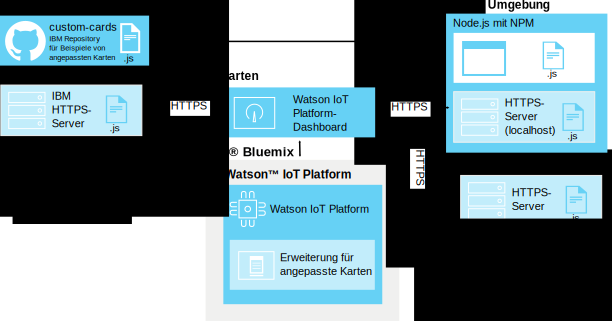
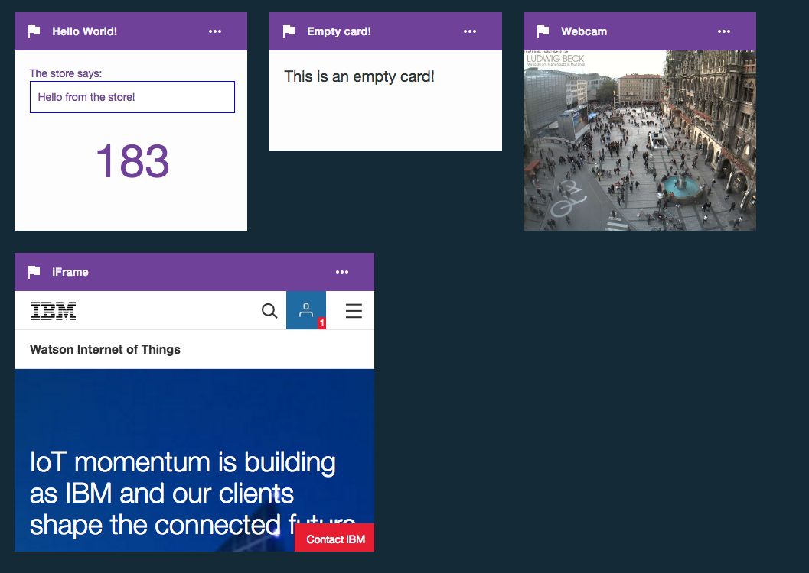

---

copyright:
  years: 2016, 2017
lastupdated: "2016-10-13"

---

{:new_window: target="\_blank"}
{:shortdesc: .shortdesc}
{:screen: .screen}
{:codeblock: .codeblock}
{:pre: .pre}

# Angepasste Karten
{: #custom_cards}

Verwenden Sie angepasste Karten, um Ihre Daten im Internet der Dinge stärker als durch die in {{site.data.keyword.iot_full}} bereitgestellten generischen Karten möglich zu visualisieren.
{:shortdesc}

## Architektur
{: #architecture}  

Angepasste Karten werden von Ihnen erstellt und mithilfe Ihres eigenen HTTP-Server-Repositorys für angepasste Karten implementiert.  Auf diesen Server wird mithilfe des Browsers eines Benutzers zugegriffen, während der Browser {{site.data.keyword.iot_short_notm}}-Dashboards anzeigt und verarbeitet. {{site.data.keyword.iot_short_notm}} verwaltet die Browserverbindung über die Erweiterung für angepasste Karten, stellt jedoch selbst keine Verbindung zum Server für angepasste Karten her.

Der Browser, der {{site.data.keyword.iot_short_notm}}-Dashboards ausführt, ruft alle erforderlichen Ressourcen direkt vom Server für angepasste Karten ab. Die angepassten Karten werden im Dialog zum Hinzufügen von Karten angeboten und in den benutzererstellten Boards angezeigt, die Ihre Benutzer konfiguriert haben.

Zum Aktivieren einer zentralisierten Versionssteuerung mithilfe des Kartenservers wird der Code der angepassten Karten clientseitig nicht zwischengespeichert. Wenn eine angepasste Karte nicht mehr verfügbar ist oder wenn der Kartenserver nicht erreichbar ist, wird ein Platzhalter verwendet, um ein konsistentes Dashboard-Layout beizubehalten.

**Tipp:** Zum Testen des Features für angepasste Karten ohne Einrichten einer eigenen Entwicklungsumgebung können Sie mithilfe der folgenden Webadresse eine Verbindung zu dem von IBM bereitgestellten Server für Beispiele von angepassten Karten herstellen: `https://customcards.mybluemix.net`

Zum Erstellen Ihrer Karten müssen Sie eine auf Node.js basierende lokale Entwicklungsumgebung einrichten und Beispielkarten aus dem von IBM bereitgestellten GitHub-Repository für angepasste Karten importieren. Nach dem Erstellen der Karten implementieren Sie das Kartenpaket auf einem sicheren Web-Server (HTTPS), mit dem Sie anschließend die {{site.data.keyword.iot_short_notm}}-Erweiterung für angepasste Karten verlinken.   

**Tipp:** Sie können den integrierten Node.js-Web-Server für das erstmalige Testen und die Fehlerbehebung Ihrer Karten verwenden; für jegliche Art der Implementierung Ihrer Karten in einer Produktionsumgebung sollten Sie jedoch einen geschützten und gut verwalteten Web-Server verwenden.

 

## Sicherheit
{: #security}

Für den JavaScript-Code, mit dem Sie Ihre Karten auf Ihrem Server für angepasste Karten implementieren möchten, bestehen keine Einschränkungen. Mit Javascript-Code in angepassten Karten kann auf alle in einem Browser enthaltenen Informationen zugegriffen werden, genau wie dies bei allen anderen Karten möglich ist, die im Dashboard ausgeführt werden.  Stellen Sie sicher, dass der Code für den Browser zum Anzeigen und Verarbeiten der angepassten Karten vom richtigen Server für angepasste Karten bereitgestellt wird.

Der Code der Karten wird in Ihrer {{site.data.keyword.iot_short_notm}}-Browsersitzung genau so ausgeführt, wie er geschrieben wurde. Darüber hinaus wird die Verbindung zum Server für angepasste Karten hergestellt, ohne dass für den Server für angepasste Karten Berechtigungsnachweise bereitgestellt werden. Der Browser eines Benutzers kann eine Verbindung zu jedem konfigurierten Server für angepasste Karten herstellen.

Es ist wichtig, dass Sie zum Bereitstellen von angepassten Karten für die Dashboards Ihrer Benutzer nur bekannte und geschützte Server für angepasste Karten konfigurieren.   

Weitere Informationen dazu, wie Sie Ihren Server für angepasste Karten schützen können, finden Sie in [Sicherheit für angepasste Karten](../reference/security/custom_cards_server.html).

Anhand der folgenden Schritte durchlaufen Sie den Prozess für das Herstellen einer Verbindung zu einem Test-Kartenserver, für das Implementieren von Beispielkarten auf Ihrem eigenen Kartenserver und schließlich für das Erstellen Ihrer eigenen Karten und deren Implementierung auf Ihrem Server.

## Schritt 1: {{site.data.keyword.iot_short_notm}} mit dem Server für Beispielkarten verbinden.
{: #connect-to-sample}  

Zum Testen des Features für angepasste Karten mit {{site.data.keyword.iot_short_notm}} können Sie eine Verbindung zum Server für Beispiele von angepassten Karten herstellen. Der Beispielserver enthält einen Satz generischer Karten, die auch als Vorlagen zum Erstellen Ihrer eigenen Karten verfügbar sind.

Gehen Sie wie folgt vor, um eine Verbindung zum Server für Beispiel von angepassten Karten herzustellen:
1. Melden Sie sich beim {{site.data.keyword.iot_short_notm}}-Dashboard als Benutzer mit Verwaltungsrechten an.
2. Aktivieren Sie die experimentellen Features.  
Angepasste Karten werden zurzeit als experimentelles Feature angeboten.  
**Wichtig:** Die experimentelle Erweiterung für angepasste Karten muss über eine Browsersitzung aktiviert werden. Kartenpakete und Verbindungen für angepasste Karten werden in Ihrer {{site.data.keyword.iot_short_notm}}-Organisation nicht global gemeinsam genutzt.
 1. Wechseln Sie zu **Einstellungen**.
 2. Überprüfen Sie im Abschnitt für experimentelle Features, ob die Option zum Aktivieren experimenteller Features aktiviert ist.
2. Stellen Sie eine Verbindung zum Beispielserver her.
 2. Wechseln Sie zu der Option für die **Erweiterungen**.
 3. Klicken Sie auf **Erweiterung hinzufügen** und wählen Sie die Erweiterung **Angepasste Karten** aus.
 4. Klicken Sie auf der Kachel **Angepasste Karte** auf **Einrichten**.
 5. Klicken Sie im Abschnitt für die Konfiguration von angepassten Karten auf **Hinzufügen** und geben Sie im Serverfeld die sichere URL (HTTPS) für den Server für Kartenbeispiele ein.  
Wenn Sie eine Verbindung zu Ihrem eigenen Server herstellen, geben Sie die URL dieses Servers ein.    
**Tipp:** Die URL des IBM Servers für Kartenbeispiele lautet: `https://customcards.mybluemix.net`  
 6. Klicken Sie auf **Zertifikat abrufen**, um eine Verbindung zum Server für angepasste Karten herzustellen und die Informationen zum Sicherheitszertifikat für den Server abzurufen.  
 **Wichtig:** Verwenden Sie die Zertifikatsinformationen, um zu überprüfen, ob Sie wirklich eine Verbindung zu dem bekannten und geschützten Server für angepasste Karten herstellen.
 4. Klicken Sie auf **Fertig**, um die Serververbindung hinzuzufügen.
5. Erstellen Sie eine neue Karte, die auf den Beispielkarten basiert.
 1. Wechseln Sie im {{site.data.keyword.iot_short_notm}}-Dashboard zu **Boards**.
 2. Klicken Sie auf **Neues Board erstellen**.  
 Füllen Sie das Dialogfeld 'Neues Board erstellen' aus. Informationen finden Sie in [Boards und Karten erstellen](../data_visualization.html#visualizing_data).
 3. Öffnen Sie das neue Board.
 4. Klicken Sie auf **Neue Karte hinzufügen**.  
 5. Blättern Sie abwärts zu **Angepasste Karten** und wählen Sie eine der Beispielkarten aus.  
 Führen Sie den Prozess zum Erstellen einer Karte aus. Informationen finden Sie in [Boards und Karten erstellen](../data_visualization.html#visualizing_data).  

 Ihre neue angepasste Karte ist nun in Ihrem neuen Board vorhanden.  
 

Glückwunsch, Sie haben eine Verbindung zum Server für angepasste Karten hergestellt und einem Ihrer Boards eine angepasste Karte hinzugefügt. Im nächsten Schritt richten Sie einen eigenen Kartenserver ein und Sie erstellen mithilfe der Beispielkarte 'HelloWorld' Ihre erste eigene Karte.

## Schritt 2: Kartenserver einrichten und Beispielkarte 'HelloWorld' implementieren.
{: #create-hello-world}

Als Vorbereitung auf die Entwicklung von angepassten Karten können Sie eine lokale Umgebung für die Entwicklung angepasster Karten einrichten und die Beispielkarte 'HelloWorld' testweise implementieren.

Folgen Sie den detaillierten Anweisungen in der Readme-Datei zum [Repository 'custom-cards'](https://github.com/ibm-watson-iot/custom-cards/blob/master/README.md), um einen Server für angepasste Karten zu erstellen und die Beispielkarten von IBM zu implementieren.

Zu dem Prozess gehören folgende allgemeine Schritte:
1. Stellen Sie sicher, dass in Ihrer lokalen Entwicklungsumgebung Node.js mit Paketmanager für den NPM-Knoten vorhanden ist.  
Informationen zur Installation von Node.js finden Sie einschließlich der Download-Links hier: https://nodejs.org
2. Richten Sie einen HTTP-Server ein, auf dem Ihr Paket für angepasste Karten gehostet werden soll.    
  - Für den Zugriff auf das Verzeichnis, in dem der Inhalt aus angepassten Karten auf dem Server bereitgestellt werden soll, dürfen keine Berechtigungsnachweise erforderlich sein.
  - Der Server muss das HTTPS-Protokoll verwenden.
  - Der Server muss Cross-Origin Resource Sharing-Verbindungen (CORS) unterstützen.  
**Tipp:** Zum Testen und für den Machbarkeitsnachweis können Sie den integrierten Node.js-Beispielserver verwenden, der so konfiguriert ist, dass er diese Bedingungen erfüllt.
3. Erstellen Sie Ihr eigenes Repository.
Spalten Sie das Beispielrepository für angepasste Karten unter https://github.com/ibm-watson-iot/custom-cards auf und klonen Sie es.
4. Erstellen Sie Ihr eigenes Framework aus Modulen und Karten.
Angepasste Karten sind in Modulen organisiert. Richten Sie für die HelloWorld-Karte ein neues Modul ein.
5. Referenzieren Sie die neue Karte.
Das Paket mit angepassten Karten kann mehrere Module enthalten. Sie müssen in der Haupt-Paketdatei auf Ihr neues Modul verweisen.
6. Registrieren Sie Ihr Modul.
Damit Ihre Karte in den Boards Ihrer {{site.data.keyword.iot_short_notm}}-Organisation zur Verfügung steht, müssen Sie die Konfigurationsdetails zur Karte in der Datei `DashboardConfig.json` hinzufügen.
7. Erstellen Sie Ihr Kartenpaket.
Verwenden Sie Gulp, um eine automatisierte Build-Engine einzurichten.
8. Implementieren Sie Ihr Kartenpaket auf Ihrem Kartenserver.  
Bevor Sie Ihre Karten in {{site.data.keyword.iot_short_notm}} verwenden können, müssen Sie das Kartenpaket auf Ihrem HTTP-Server für angepasste Karten implementieren.  
**Tipp:** Sie können während der Verarbeitung neue Karten hinzufügen oder veraltete Karten entfernen, indem Sie das Kartenpaket erneut auf dem Kartenserver implementieren.
9. Verknüpfen Sie Ihren Kartenserver mit {{site.data.keyword.iot_short_notm}}.
Verknüpfen Sie Ihren neu implementierten Server für angepasste Karten mit {{site.data.keyword.iot_short_notm}}.  
**Tipp:** Da Ihr Server für angepasste Karten eine vollständige Replik des Servers für Kartenbeispiele sein kann, werden Ihnen in Ihrer Umgebung möglicherweise Duplikatkarten angezeigt. Entfernen Sie die Verbindung zum Server für Kartenbeispiele, um nur die Karten von Ihrem Server für angepasste Karten anzuzeigen.
 1. Wechseln Sie zu der Option für die **Erweiterungen**.
 2. Klicken Sie auf der Kachel **Angepasste Karte** auf das Zahnradsymbol, um die Konfiguration zu aktualisieren.
 4. Klicken Sie im Abschnitt für die Konfiguration von angepassten Karten auf **Hinzufügen** und geben Sie im Serverfeld die sichere URL (HTTPS) für Ihren Server für angepasste Karten ein.  
**Wichtig:** Überprüfen Sie, ob Sie eine Verbindung zu dem richtigen bekannten und geschützten Server für angepasste Karten herstellen.
4. Klicken Sie auf **Fertig**, um die Serververbindung hinzuzufügen.
10. Die angepasste HelloWorld-Karte kann nun zusammen mit Ihren Boards verwendet werden.

Gut! Sie haben erfolgreich einen Kartenserver eingerichtet und Ihre erste Beispielkarte implementiert. Glückwunsch! Eigentlich sind angepasste Karten jedoch dafür gedacht, dass Sie Karten und Boards genau nach Ihren Wünschen einrichten können. Nun ist der Zeitpunkt gekommen, Beispiele zu ändern, um eigene Karten zu erstellen.

## Schritt 3: Eigene angepasste Karten erstellen und implementieren.
{: #create-your-own-cards}
Nach der Konfiguration und Überprüfung der HelloWorld-Karte können Sie die angepassten Karten erweitern und eigene erstellen.

Das Beispielrepository für angepasste Karten enthält folgende Beispielkarten:
- HelloWorld  
Eine einfache Karte, die das Basisbeispiel 'Hello World' bereitstellt.
- Empty  
Eine leere Karte, die die Infrastruktur für eine Karte enthält. Verwenden Sie diese Karte als Vorlage, wenn Sie eine Karte völlig neu erstellen.
- Webcam  
Eine einfache Webcam-Karte. Konfigurieren Sie die Karte mit einer Webcam-URL und legen Sie die Bildwiederholfrequenz fest.
- iFrame  
Eine einfache iFrame-Karte, die Sie verwenden können, um eine beliebige sichere Webseite (HTTPS) in Ihr Board zu integrieren.

Mit den folgenden allgemeinen Schritten wird eine neue Karte erstellt:

**Tipp:** Detaillierte Schritte finden Sie im Beispielrepository für angepasste Karten in [Readme-Datei 'Creating custom cards...'](https://github.com/ibm-watson-iot/custom-cards/blob/master/README.md).
1. Erstellen Sie Ihr eigenes Kartenmodul.
 1. Verwenden Sie als Vorlage für Ihr Modul eines der Module für Beispielkarten.
 2. Aktualisieren Sie alle Instanzen des Modulnamens in den Dateinamen und dem Dateiinhalt Ihres neuen Moduls.  
 Ersetzen Sie beispielsweise `HelloWorld` in allen Instanzen des Dateinamens und des Dateiinhalts durch Ihren Modulnamen.
2. Referenzieren Sie das neue Modul in der Datei 'Modules.jsx'.
3. Registrieren Sie das neue Modul in der Datei 'DashboardConfig.json'.
4. Aktualisieren Sie den Code der angepassten Karte entsprechend Ihren Anforderungen an die Karte.
4. Erstellen Sie das Kartenpaket.  
Je nach Ihrem Setup ist der Erstellungsprozess möglicherweise automatisch (unter Verwendung von Gulp) oder Sie müssen die Erstellung manuell auslösen.
3. Implementieren Sie die neue Karte.  
Wenn Sie einen externen Server für angepasste Karten verwenden, müssen Sie nun das Paket auf dem Server implementieren.  

Sie haben Ihre erste angepasste Karte erstellt und auf Ihrem Server für angepasste Karten implementiert. Die Karte kann nun in Ihrer {{site.data.keyword.iot_short_notm}}-Organisation verwendet werden.
