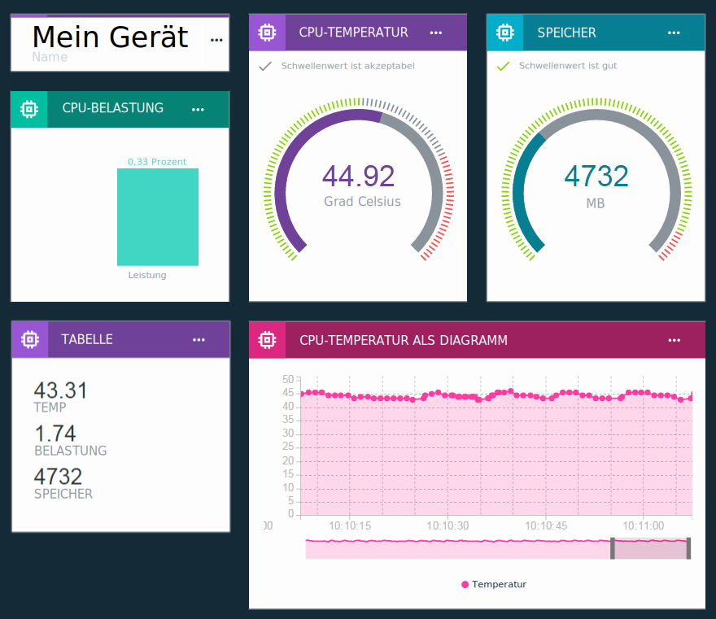

---

copyright:
  years: 2016, 2017
lastupdated: "2017-01-10"

---

{:new_window: target="\_blank"}
{:shortdesc: .shortdesc}
{:screen: .screen}
{:codeblock: .codeblock}
{:pre: .pre}

# Echtzeitdaten mithilfe von Boards und Karten visualisieren
{: #boards_and_cards}

Erstellen Sie Boards und Karten, um eigene Dashboards zu erstellen und gemeinsam zu nutzen, die Ihre Gerätedaten in Echtzeit visualisieren.
{:shortdesc}

Mithilfe von Boards und Karten können Sie Datasetwerte, die von mindestens einem Gerät stammen, grafisch darstellen, um eine schnelle Übersicht bereitzustellen und das Verständnis der Daten zu verbessern. Erstellen Sie Boards und fügen Sie Karten hinzu, die Daten als unbearbeitete Zahlen, Echtzeit-Grafiken, Messanzeigen und anderes anzeigen. Fügen Sie Ihren Boards Mitglieder hinzu, um die Boards mit anderen Benutzern in Ihrer Organisation gemeinsam zu nutzen. Ordnen Sie die Karten an und fügen Sie Trennlinien für den erklärenden Text hinzu, um Ihre Präsentation zu optimieren.  

Sie können den Standardsatz der von IBM bereitgestellten Karten durch das [Erstellen eigener angepasster Karten](custom_cards/custom-cards.html) erweitern.

## Standardboards
{: #default_boards}
Das {{site.data.keyword.iot_full}}-Dashboard weist folgende Standardboards auf:

|Boardname | Beschreibung |  
|:---|:---|  
|Nutzungsübersicht  | Zeigt Nutzungsstatistiken für Ihre Organisation an. Listet Gerätetypen und verarbeitete Daten auf.
|Regelbasierte Analyse | Zeigt die für Ihre Organisation geltenden Regeln an. Zusätzliche Karten listen ausgelöste Alerts, zugeordnete Geräte, Geräteeigenschaften und Alertinformationen auf. |  
|Gerätebezogene Analyse | Zeigt die mit Ihrer Organisation verbundenen Geräte an. Zusätzliche Karten zeigen Alerts für ausgewählte Geräte, Informationen zu einem ausgewählten Gerät, Geräteeigenschaften und Alertinformationen an. |
|Risiko- und Sicherheitsmanagement | Zeigt Karten, die den allgemeinen Sicherheitsstatus zusammenfassen. Systembediener und Sicherheitsanalysten können Details zu Konformität, Verbindungsstatus für Geräte, Ursachen von Verbindungsfehlern und Geräten, die durch eine Blacklist oder Whitelist blockiert und zugelassen sind, anzeigen.  Über die Karte für die Verbindungskonformität kann der Benutzer einen Drilldown auf einen detaillierten Bericht zu nicht konformen Geräten durchführen und den Bericht nach Excel exportieren. |

Sie können diese Boards aktualisieren, indem Sie Karten hinzufügen, aktualisieren und entfernen.

**Tipp:** Um ein Standardboard in den ursprünglichen Zustand zurückzusetzen, können Sie es löschen. Das Board wird anschließend mit den ursprünglichen Karten erneut erstellt.

## Boards und Karten erstellen
{: #visualizing_data}

{{site.data.keyword.iot_short_notm}} stellt ein integriertes Dashboard bereit, das Sie zum Anzeigen der Echtzeitdaten verwenden können, die von Ihrem Gerät zurückgegeben werden. Die Seite 'Überblick' zeigt Nutzungsinformationen zu Ihrer {{site.data.keyword.iot_short_notm}}-Organisation an, wie beispielsweise Daten und verbrauchter Speicherplatz. Um die Echtzeitdaten zu einem Gerät beim Empfangen anzuzeigen, fügen Sie dieser Seite gerätespezifische Karten hinzu.

Gehen Sie wie folgt vor, um einem Board eine gerätespezifische Karte hinzuzufügen:
1. Wählen Sie im {{site.data.keyword.iot_short_notm}}-Dashboard die Option **Boards** aus.
2. Wählen Sie ein Board aus, für das Sie über Bearbeitungsrechte verfügen, oder erstellen Sie ein neues Board.
3. Klicken Sie im Board auf **Neue Karte hinzufügen**.
2. Blättern Sie im Feld für die Bearbeitung der Karte für die generische Visualisierung abwärts bis zum Abschnitt 'Geräte'.
3. Wählen Sie einen Visualisierungstyp aus.
**Tipp:** Wählen Sie als Basiskonfiguration **Generische Visualisierung** aus. Sie können den Kartentyp später ändern.
Klicken Sie auf **Mehr anzeigen**, um eine vollständige Liste der Kartentypen anzuzeigen.
4.	Wählen Sie mindestens eine Datenquelle für die Karte aus und klicken Sie auf **Weiter**, um mindestens ein Dataset hinzuzufügen.
 1.	Bennen Sie das Dataset mit einem eindeutigen Namen.
 2. Wählen Sie ein Ereignis aus, das den Datenpunkt enthält, den Sie anzeigen möchten.
 3.	Wählen Sie die Eigenschaft aus, die den Datenpunkt darstellt.
 4.	Wählen Sie den Typ, die Einheit, die Genauigkeit und die minimalen und maximalen Werte für den Datenpunkt aus.  
 Nach Beenden können Sie auf **Neues Dataset** klicken, um weitere Datasets hinzuzufügen, oder Sie können auf **Weiter** klicken.
5.	Wählen Sie die Visualisierung aus.  
Wählen Sie den Typ und die Größe der Visualisierung aus, die Sie verwenden möchten.  Einige Kartentypen haben weitere Einstellungen.
<dl>
<dt>Nutzung</dt>
<dd>
<table>
<thead>
<tr>
<th>Typ</th>
<th>Angezeigte Daten</th>
</tr>
</thead>
<tbody>
<tr>
<td>Gerätetypen</td>
<td>Ein Kreisdiagramm, das die Anzahl der Geräte pro Gerätetyp anzeigt.</td>
</tr><tr>
<td>Übertragene Daten</td>
<td>Für Ihre Organisation geltende Nutzungsstatistiken für übertragene Daten.</td>
</tr>
</tbody>
</table>
</dd>
<dt>Basis</dt>
<dd>
<table>
<thead>
<tr>
<th>Typ</th>
<th>Angezeigte Daten</th>
</tr>
</thead>
<tbody>
<tr>
<td>Trennzeichen</td>
<td>Eine horizontale Trennlinie zum Strukturieren und Gruppieren von Karten im Board.</td>
</tr>
</tbody>
</table>
</dd>
<dt>Geräte</dt>
<dd><table>
<thead>
<tr>
<th>Typ</th>
<th>Angezeigte Daten</th>
</tr>
</thead>
<tbody>
<tr>
<td>Generische Visualisierung</td>
<td>Der Wert mindestens eines Datasets.  **Tipp:** Zum Anzeigen von bis zu drei Datenpunkten in einer kleinen Tabelle wählen Sie die große Widgetgröße aus.  </td>
</tr>
<tr>
<td>Echtzeitdiagramm</td>
<td>Mindestens ein Dataset in einem Echtzeitdiagramm, in dem geblättert werden kann. Verwenden Sie das Menü 'Einstellungen', um den Datenbereich und die Aufbewahrungsdauer, die Darstellung und die Funktionsweise sowie weitere Einstellungen für die Diagramme festzulegen. </td>
</tr>
<tr>
<td>Balkendiagramm</td>
<td>Datasetwerte in beschrifteten Balken. Mit dem Menü 'Einstellungen' können Sie zwischen der horizontalen oder vertikalen Richtung hin- und herschalten.</td>
</tr>
<tr>
<td>Ringdiagramm</td>
<td>Mindestens ein Dataset in einer kreisförmigen Darstellung.</td>
</tr>
<tr>
<td>Wert</td>
<td>Der unaufbereitete Wert mindestens eines Datasets.</td>
</tr>
<tr>
<td>Messanzeige</td>
<td>Als Messanzeige angezeigter Wert eines Datasets. Sie können Schwellenwerte für die Anzeige der Werte 'gut', 'akzeptabel' und 'kritisch' des Datasets konfigurieren. Mit dem Menü 'Einstellungen' können Sie für die Messanzeige optional Schwellenwerte für den unteren, mittleren und oberen Datenbereich festlegen.  </td>
</tr>
</tbody>
</table>
</dd>
<dt>Analyse</dt>
<dd>
<table>
<thead>
<tr>
<th>Typ</th>
<th>Angezeigte Daten</th>
</tr>
</thead>
<tbody>
<tr>
<td>Geräteinformationen</td>
<td>Zeigt Basisinformationen für ein einzelnes Gerät an.</td>
</tr>
<tr>
<td>Alertinformationen</td>
<td>Zeigt Basisinformationen für einen einzelnen Alert an.</td>
</tr>
<tr>
<td>Geräteliste</td>
<td>Eine Liste für die Überwachung mehrerer Geräte.</td>
</tr>
<tr>
<td>Alerts</td>
<td>Eine Liste der für ein Gerät aufgetretenen Alerts.</td>
</tr>
<tr>
<td>Regeln</td>
<td>Eine Liste der Regeln, die Alerts aufweisen.</td>
</tr>
<tr>
<td>Geräteeigenschaften</td>
<td>Zeigt bestimmte Eigenschaften für mindestens ein Gerät an.</td>
</tr>
<tr>
<td>Alle Geräteeigenschaften</td>
<td>Zeigt alle Eigenschaften für mindestens ein Gerät an.</td>
</tr>
<tr>
<td>Gerätezuordnung</td>
<td>Zeigt für mehrere Geräte die Position in einer Liste an.</td>
</tr>
</tbody>
</table>
</dd>
</dl>

6. Geben Sie die Datenquelle der Karte an.  
Je nach dem von Ihnen ausgewählten Kartentyp stammen die auf einer Karte angezeigten Daten möglicherweise von einem Gerät oder von einer anderen Karte. Wählen Sie als Datenquelle ein bestimmtes Gerät, eine Geräteliste oder eine Alertlistenkarte aus und klicken Sie auf **Weiter**.
7. Nur Karten für Gerätetypen: Fügen Sie mindestens ein Dataset hinzu, das in der Karte angezeigt werden soll.   
 1. Klicken Sie auf **Verbindung für Dataset herstellen**, um eine Eigenschaft hinzuzufügen, die in der Karte angezeigt werden soll.
 2. Benennen Sie das Dataset.
 3. Geben Sie das Ereignis ein, für das Eigenschaften angezeigt werden sollen, oder wählen Sie eins aus.
 4. Geben Sie die anzuzeigende Eigenschaft ein oder wählen Sie sie aus.
 5. Geben Sie den Typ der Eigenschaft an und legen Sie optional die Einheit, die Genauigkeit sowie den Mindest- und den Maximalwert für die Eigenschaft fest.  
 6. Klicken Sie auf **Weiter**.
7. Wählen Sie die Größe der Darstellung.   
Bei bestimmten Kartentypen können Sie auf **Einstellungen** klicken, um zusätzliche Details für die Visualisierung zu konfigurieren. Klicken Sie auf **Weiter**.
7. Geben Sie einen Titel und eine Beschreibung für die Karte ein, wählen Sie optional ein Farbschema aus und klicken Sie anschließend auf **Übergeben**, um die Karte zu erstellen.
7.	Positionieren Sie abschließend die neue Karte in Ihrem Board, indem Sie sie an eine gute Position ziehen.  

Sehr gut! Sie können nun die Echtzeitdaten Ihres Geräts anzeigen.

Eine Beschreibung der einzelnen Schritte zum Anzeigen von Echtzeitgerätedaten finden Sie in der Anleitung [Boards & Karten im neuen Watson IoT-Dashboard konfigurieren](https://developer.ibm.com/recipes/tutorials/configuring-the-cards-in-the-new-watson-iot-dashboard/).
