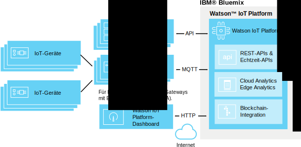

---

copyright:
  years: 2016, 2017
lastupdated: "2017-02-17"

---

{:new_window: target="\_blank"}
{:shortdesc: .shortdesc}
{:screen: .screen}
{:codeblock: .codeblock}
{:pre: .pre}

# Edge Analytics
{: #edge_analytics}

Mit Edge Analytics verschieben Sie den regelauslösenden Prozess der Analyse von der Cloud in ein für Edge Analytics aktiviertes Gateway, das den Gerätedatenverkehr zur Cloud stark reduzieren könnte, indem die Analyseverarbeitung gerätenah ausgeführt wird.
{:shortdesk}

Geräte senden ihre Daten an ein für Edge Analytics aktiviertes Gateway, in dem die Daten von Edge Analytics-Regeln geparst werden. Je nach Ihrer Regel und deren Aktion können kritische Daten und Alerts an {{site.data.keyword.iot_full}} gesendet werden, einen Alert im Gateway auslösen oder sie werden in eine Textdatei geschrieben, die für das Gateway lokal erreichbar ist.

Das folgende Diagramm veranschaulicht die allgemeine Architektur einer {{site.data.keyword.iot_full}}-Umgebung mit Edge Analytics.

## Vorbereitende Schritte
{: #byb}

Bevor Sie mit der Erstellung von Edge-Regeln und -Aktionen beginnen:
- Stellen Sie sicher, dass Ihr Gateway mit {{site.data.keyword.iot_short}} verbunden ist und dass Gerätedaten übertragen werden. Weitere Informationen finden Sie in [Gateways verbinden](gateways/dashboard.html).
- Installieren Sie Edge Analytics Agent (EAA) in Ihrem Gateway. Informationen finden Sie in [Edge Analytics-Agent installieren](gateways/dashboard.html#edge).   **Tipp:** Für EAA aktivierte Gateways stellen EAA-Diagnosedaten in Form von Gerätenachrichten von Gateways zur Verfügung. Informationen finden Sie in [Diagnosemesswerte des Edge Analytics-Agenten](#eaa_metrics).
- Stellen Sie sicher, dass die Geräteeigenschaften, die Sie als Bedingungen in Ihren Regeln verwenden möchten, Schemas zugeordnet sind. Weitere Informationen finden Sie in [Geräte verbinden](iotplatform_task.html) und [Schemas erstellen](im_schemas.html).
- Lesen Sie die Edge Analytics-Anleitungen.  
Ihr Anleitungsportal enthält einige Anleitungen, in denen die erforderlichen Schritte zum Ausführen von IBM Edge Analytics beschrieben sind. Diese Anleitungen beschreiben die Vorgehensweise zum Installieren und Konfigurieren von IBM Edge Analytics Agent auf einem Gerät, das auf dem Fundament von Apache Edgent aufbaut, um Analyseprozesse in der Nähe einer IoT-Datenquelle auszuführen.
 - Die Anleitung [Einführung in Edge Analytics in IBM Watson IoT Platform ](https://developer.ibm.com/recipes/tutorials/getting-started-with-edge-analytics-in-watson-iot-platform/){: new_window} bildet den Anfang dieser Reihe. Diese Anleitung beschreibt das Einrichten von Cisco DSA Platform auf einem Laptop System- und einem Raspberry Pi 3-Gerät, das Installieren und Konfigurieren von IBM Edge Analytics Agent zum Herstellen einer Verbindung zu {{site.data.keyword.iot_short}}, das Installieren und Konfigurieren von System DS Link zum Herstellen einer Verbindung zu Edge Gateway unter {{site.data.keyword.iot_short}} als angeschlossenes Gerät, das Definieren und Aktivieren der Edge-Regel auf dem Edge-Gateway und das Verwalten der Edge-Regel mit {{site.data.keyword.iot_short}}.
 - Als Beispiel für die innovative Verwendung von Edge Analytics veranschaulicht die Anleitung [Alerts und Geräteaktionen mit Edge Analytics in IBM Watson IoT Platform verarbeiten ](https://developer.ibm.com/recipes/tutorials/handling-alerts-and-device-actions-with-edge-analytics-in-ibm-watson-iot-platform/){: new_window} die Vorgehensweise zum Erstellen eines eigenen DS-Links für die Datenübertragung von einem verbundenen Arduino Uno-Gerät auf ein Raspberry Pi 3-Gerät. Darüber hinaus veranschaulicht diese Anleitung die Datenfilterung und die Verarbeitung lokaler Geräteaktionen als Teil des Edge-Regelalerts.

## Edge-Regeln und -Aktionen verwalten  
{: #managing_rules}

Edge-Regeln werden mithilfe des Folgenden verwaltet:
- Das Dashboard **Regeln** wird zum Erstellen und Bearbeiten von Cloud- und Edge-Regeln und -Aktionen für Ihre Geräte und Gateways verwendet.
- Das Board **Edge-Regel-Gateways** wird zum Aktivieren, Inaktivieren, Aktualisieren und Entfernen einer Edge-Regel in Ihren Gateways verwendet. Für den Zugriff auf das Board 'Edge-Regel-Gateways' klicken Sie im Dashboard 'Regeln' für die Edge-Regel, die Sie verwalten möchten, auf **Regel verwalten**. Weitere Informationen finden Sie in [Edge-Regeln für Ihre Gateways aktivieren, inaktivieren und verwalten](#manage).

Verwenden Sie folgende Boards, um eine Übersicht der Edge-Regeln und -Alerts zu erhalten, die für Ihre über ein Gateway verbundenen Geräte ausgelöst wurden:

|Boardname | Beschreibung |  
 |:---|:---|  
  |Regelbasierte Analyse | Zeigt die für Ihre Organisationen geltenden Regeln einschließlich Edge-Regeln an. Zusätzliche Karten listen weitergeleitete Edge-Alerts, zugeordnete Geräte, Geräteeigenschaften und weitergeleitete Edge-Alertinformationen auf. |  
 |Gerätebezogene Analyse | Zeigt die mit Ihrer Organisation verbundenen Geräte an. Zusätzliche Karten zeigen weitergeleitete Alerts für ein ausgewähltes Edge-Gerät, Informationen zu einem ausgewählten Gerät, Geräteeigenschaften und weitergeleitete Alertinformationen an. |

Weitere Informationen zu den standardmäßigen Analyseboards finden Sie in [Echtzeitdaten mithilfe von Boards und Karten visualisieren](data_visualization.html#default_boards).

## Edge-Regeln erstellen
{: #rules}

Edge-Regeln sind bedingungsbasierte Entscheidungspunkte, die gerätebezogene Echtzeitdaten und vordefinierte Schwellenwerte oder andere Eigenschaftsdaten abgleichen, um eine Edge-Aktion auszulösen, wenn eine Bedingung erfüllt wird.

**Wichtig:** Bevor Sie Regeln für einen Gerätetyp erstellen können, müssen Sie ein Schema für den Gerätetyp erstellen. Informationen finden Sie in [Schemas für Gerätetypen erstellen](im_schemas.html).

Gehen Sie wie folgt vor, um eine Regel zu erstellen:
1. Wechseln Sie im {{site.data.keyword.iot_short}}-Dashboard zu **Regeln**.
2. Klicken Sie auf **Edge-Regel erstellen**, benennen Sie die Regel und ordnen Sie Ihr eine Beschreibung zu, wählen Sie einen Edge-Gerätetyp aus, für den die Regel gelten soll, und klicken Sie anschließend auf **Weiter**.  
3. Richten Sie die Regellogik ein.  
Fügen Sie mindestens eine IF-Bedingung hinzu, um sie als Auslöser für die Regel zu verwenden.  
Sie können Bedingungen in parallelen Reihen hinzufügen, um sie als OR-Bedingungen anzuwenden, oder Sie können Bedingungen in sequenziellen Spalten hinzufügen, um sie als AND-Bedingungen anzuwenden.  
**Hinweis:** Damit eine Geräteeigenschaft als Eingabe für eine Regel ausgewählt werden kann, muss die Eigenschaft einem Schema zugeordnet werden. Weitere Informationen finden Sie in [Schemas erstellen](im_schemas.html).  

**Wichtig:** Um eine Bedingung auszulösen, die zwei Eigenschaften vergleicht, oder um mindestens zwei Eigenschaftsbedingungen auszulösen, die sequenziell durch AND verbunden sind, müssen die auslösenden Datenpunkte in dieselbe Gerätenachricht eingeschlossen werden. Wenn die Daten in mehr als einer Nachricht empfangen werden, werden die Bedingung oder die sequenziellen Bedingungen nicht ausgelöst.  

**Beispiele:**  
Eine einfache Regel kann einen Alert auslösen, wenn ein Parameterwert größer als ein angegebener Wert ist:
  
`temp>80`  
Eine komplexere Regel kann zu einem Auslösen führen, wenn eine Übereinstimmung mit einer Kombination aus Schwellenwerten auftritt:
  
`temp>60 AND capacity>50`   

4. Konfigurieren Sie für Ihre Regel Anforderungen für bedingte Auslöser.  
Zum Steuern der Anzahl von Alerts und Aktionen, die für eine Regel in einem bestimmten Zeitraum ausgelöst werden, können Sie für Ihre Regel Anforderungen für bedingte Auslöser konfigurieren.  
**Wichtig:** Das bedingte Auslösen gilt für jede Bedingung in der Regel. Wenn beispielsweise für eine Regel mithilfe von OR fünf unterschiedliche parallele Bedingungen festgelegt wurden, wird für den Zähler des bedingten Auslösers jede Bedingung, die als 'true' erkannt wird, gezählt.
Gehen Sie wie folgt vor, um für eine Regel das bedingte Auslösen festzulegen:
 1. Klicken Sie im Regeleditor auf den Standardlink **Jedes Mal auslösen, wenn Bedingungen erfüllt sind**, um das Dialogfeld 'Anforderung für Häufigkeit festlegen' zu öffnen.
 2. Wählen Sie den bedingten Auslöser, den Sie in Ihrer Regel verwenden wollen, aus und konfigurieren Sie ihn.
 <ul>
 <li>Jedes Mal auslösen, wenn Bedingungen erfüllt sind</li>
 <li>Auslösen, wenn Bedingungen N-mal in M *Zeiteinheit* erfüllt sind</li>
 </ul>  
 Eine detailliertere Beschreibung der bedingten Auslöser finden Sie in [Bedingtes Auslösen für Regeln](cloud_analytics.html#conditional "Bedingtes Auslösen - Übersicht") im Abschnitt zu Cloud Analytics.
5. Erstellen Sie mindestens eine Aktion, die auftritt, wenn die Regelbedingungen erfüllt sind, oder wählen Sie eine Aktion aus.  
Weitere Informationen zu Edge-Aktionen finden Sie in [Edge-Aktionen erstellen](#edge_actions "Edge-Aktionen erstellen").   
 Beispiel: Eine Aktion kann darin bestehen, Gerätedaten an die Cloud zu senden oder ein Alert an eine lokale Datei zu schreiben.
3. **Optional:** Wählen Sie für die Regel eine Alertpriorität aus.  
 Die Priorität wird zum Klassifizieren der Alerts verwendet, die im Board **Regelbasierte Analyse** angezeigt werden. Die Standardpriorität ist 'Niedrig'.
6. Wenn Sie mit Ihrer Regel zufrieden sind, klicken Sie auf **Speichern**.

Ihre Regel wird erstellt und zum Dashboard 'Durchsuchen' hinzugefügt. Über das Board **Edge-Regel-Gateways**, das sich öffnet, können Sie die Regel nun [aktivieren](#manage).

## Edge-Aktionen erstellen
{: #edge_actions}

Sie können Aktionen direkt im Regeleditor erstellen oder die Aktionen auf der Registerkarte 'Aktionen' erstellen und die Aktionen anschließend auswählen, wenn Sie Ihre Regeln erstellen.

Gehen Sie wie folgt vor, um auf der Registerkarte 'Aktionen' eine Aktion zu erstellen:
1. Wechseln Sie im {{site.data.keyword.iot_short}}-Dashboard zu **Regeln**.
2. Wählen Sie im Dashboard 'Regeln' die Registerkarte **Aktionen** aus.
2. Klicken Sie auf **Aktion erstellen**, benennen Sie die Aktion, ordnen Sie ihr eine Beschreibung zu und wählen Sie einen Aktionstyp aus; klicken Sie anschließend auf **Weiter**.  
Edge Analytics unterstützt zwei Aktionstypen:
<dl>
<dt>Ereignis an Cloud weiterleiten</dt>  
<dd>Das Geräteereignis wird an {{site.data.keyword.iot_short}} gesendet, wo es in Boards und Karten sowie mit Cloud Analytics-Regeln verwendet werden kann. Informationen finden Sie in [Integration mit Cloud Analytics](#integrate_with_cloud_analytics).    
**Tipp:** Verwenden Sie die Cloud-Aktion zum Weiterleiten von Ereignissen zum Reduzieren der Menge von Gerätedaten, die an die Cloud gesendet werden, indem die weniger wichtigen Informationen direkt beim Gateway-Gerät herausgefiltert werden. </dd>
<dt>Alert</dt>  
<dd>Alerts werden im Gateway-Gerät erstellt.</dd>
</dl>
3. Geben Sie die für den von Ihnen ausgewählten Aktionstyp erforderlichen Parameter an.  
<dl>
<dt>Ereignis an Cloud weiterleiten</dt>  
<dd>Wählen Sie die Ereignisdaten aus, die an die Cloud weitergeleitet werden sollen, und geben Sie den Ereignisnamen an, der in der Nachricht verwendet werden soll.  
**Tipp:** Beim Einrichten von Boards und Karten und beim Erstellen von Regeln für Cloud Analytics können Sie das Ereignis und Eigenschaften verwenden. 
Sie können:
 <ul>
 <li>Alle Geräteeigenschaften und virtuellen Eigenschaften einschließen
 <li>Nur schemadefinierte Eigenschaften und virtuelle Eigenschaften einschließen  
 </ul>
 </dd>
<dt>Alert</dt>  
<dd>Geben Sie eine Alertnachricht an und wählen Sie mindestens ein Ziel für den Alert aus.
 <ul>
 <li>An Cloud weiterleiten  
 Der Alert wird an {{site.data.keyword.iot_short}} weitergeleitet, wo er in den Boards 'Regelbasierte Analyse' und 'Gerätebezogene Analyse' angezeigt wird.
 <li>An den Gateway-Broker publizieren
Der Alert wird an den Gateway-Broker publiziert. Durch die Brokerkonfiguration ist festgelegt, wie der Alert für einen Benutzer zugänglich gemacht wird.
 <li>In einer lokalen Textdatei speichern
Der Alert wird an die auf dem Gateway-Server vorhandene lokale Textdatei *IBMEdgeAnalyticsAlerts.csv* angehängt.
 </ul>
 </dd>
</dl>
4. Klicken Sie auf **OK**, um die neue Aktion zu erstellen.

Die Aktion steht nun im Regeleditor zur Verfügung.

## Edge-Regeln für Ihre Gateways aktivieren, inaktivieren und verwalten
{: #manage}

Damit eine Regel Aktionen auslöst, müssen Sie sie zunächst für mindestens ein Gateway aktivieren. Zum Aktivieren, Inaktivieren, Aktualisieren und Entfernen einer Edge-Regel für Ihre Gateways verwenden Sie das Board **Edge-Regel-Gateways**.

Gehen Sie wie folgt vor, um eine Edge-Regel zu aktivieren:
1. Klicken Sie im Dashboard 'Regeln' auf die Schaltfläche **Regel verwalten**, die zu der Edge-Regel gehört, die Sie verwalten möchten.  
Über das Board **Edge-Regel-Gateways**, das sich öffnet, wird Ihnen eine Liste aller verbundenen und für EAA aktivierten Gateways angezeigt. Der Regelstatus für Gateways, bei dem keine Regel hochgeladen und aktiviert ist, lautet *Ohne*.
2. Suchen Sie das Gateway, für das Sie die Regel aktivieren möchten, und wählen Sie im Menü in der Spalte 'Operation auswählen' die Option **Aktivieren** aus.  
Die Edge-Regel wird in das Gateway hochgeladen. Wenn das Hochladen beendet und die Regel aktiv ist, ändert sich der Regelstatus in **Aktiv**.  

Die Regel ist nun für das Gateway aktiv und die konfigurierten Aktionen werden ausgelöst, wenn die Regelbedingungen erfüllt sind.

**Tipp:** Um Regeln für mehrere Gateways zu verwalten, können Sie in der Spaltenüberschrift für das Gateway das Feld für die Auswahl aller vorhandenen Optionen auswählen. Wählen Sie alle Gateways ab, die Sie nicht einschließen möchten, und wählen Sie anschließend im Menü **Operation auswählen** im oberen Teil der Spalte desselben Namens eine Operation aus.

Zusätzlich zum Aktivieren einer Regel können Sie für Ihre Gateways folgende Regelverwaltungsoperationen ausführen:

Operation | Beschreibung
--- | ---
Aktivieren | Lädt die Regel für die ausgewählten Gateways hoch und aktiviert sie. Als Regelstatus wird *Aktiv* festgelegt.
Inaktivieren | Inaktiviert die Regel für die ausgewählten Gateways. Die Regel verbleibt im Gateway und kann bei Bedarf reaktiviert werden. Als Regelstatus wird *Inaktiv* festgelegt.
Aktualisieren | Lädt eine aktualisierte Version der Regel in die ausgewählten Gateways hoch. Verwenden Sie die Operation, um ein Gateway auf den neuesten Stand zu bringen, wenn der Regelstatus für das Gateway *Aktiv (Älter)* lautet. Als Regelstatus wird *Aktiv* festgelegt.
Entfernen | Entfernt die Regel aus den ausgewählten Gateways. Der Regelstatus für das Gateway wird auf *Ohne* zurückgesetzt.

## Integration mit Cloud Analytics
{: #integrate_with_cloud_analytics}

Verwenden Sie die durch die Edge-Regel ausgelösten Aktionen, die auf dem für EAA aktivierten Gateway ausgeführt werden, um die an die Cloud fließenden Daten zu filtern und vom Gateway generierte Alerts zur Verwendung mit {{site.data.keyword.iot_short}}-Boards und -Karten an die Cloud weiterzuleiten.  

Sie können auch {{site.data.keyword.iot_short}} für die Ausführung von Cloud Analytics für Gerätedaten verwenden, die vom Gateway an die Cloud gesendet werden. Wenn Sie in Ihrer Edge-Regel die Aktion `Ereignis an Cloud weiterleiten` verwenden, kann die erstellte Nachricht als Eingabe für eine Cloud Analytics-Regel verwendet werden, so als wenn das Gerät, das die Daten zum Auslösen der Edge-Regel bereitgestellt hat, mit {{site.data.keyword.iot_short}} direkt verbunden wäre.

Weitere Informationen zur Vorgehensweise beim Erstellen von Regeln und Aktionen für Cloud Analytics finden Sie in [Cloud Analytics](cloud_analytics.html).

## Diagnosemesswerte des Edge Analytics-Agenten
{: #eaa_metrics}

Ein verbundenes und für EAA aktiviertes Gateway sendet Diagnoseinformationen als Gerätenachrichten des Ereignistyps `gateway_xv-monitor-event`.   **Tipp:** Sie können [Cloud Analytics](cloud_analytics.html)-Regeln verwenden, um Alertaktionen (beispielsweise E-Mail-Benachrichtigungen) zu konfigurieren, die auf den Diagnosewerten basieren, die von dem für EAA aktivierten Gateway zurückgesendet wurden. Sie können beispielsweise eine Regel erstellen, die Sie benachrichtigt, wenn der Wert für `SystemLoad` einen bestimmten Schwellenwert überschreitet.

Gehen Sie wie folgt vor, um Informationen zum Status des Gateways anzuzeigen:
1. Wählen Sie im {{site.data.keyword.iot_short}}-Dashboard in der seitlichen Menüleiste die Option **Geräte** aus.
2. Klicken Sie auf Ihr Gateway-Gerät, um die Seite mit den Gerätedetails zu öffnen.
3. Greifen Sie auf die Diagnoseinformationen des Gateways zu:  
 - Lesen Sie den Abschnitt **Kürzliche Ereignisse**, in dem Sie eine Liste der Nachrichten finden, die kürzlich vom Gateway gesendet wurden.
 - Lesen Sie den Abschnitt **Diagnoseprotokolle**, in dem Sie Gateway-Warnungen und weitere Diagnosenachrichten finden.
 - Lesen Sie den Abschnitt **Sensorinformationen**, in dem Sie detaillierte Diagnoseinformationen zum Gateway finden. In der folgenden Tabelle werden die verschiedenen Eigenschaften beschrieben, die in den Gerätenachrichten des Gateways enthalten sein können.

 Eigenschaft | Beschreibung
 --- | ---
 `MsgInCount` |Die Anzahl der an den Edge Analytics-Agenten (EAA) gesendeten Nachrichten.
 `MsgInRate` | Die geschätzte Anzahl von Nachrichten pro Sekunde, die in der vergangenen Minute an den Edge Analytics-Agenten gesendet wurden.  
 `LastHeartBeat` | Die Zeitmarke in Millisekunden des Zeitpunkts, an dem die letzte Heartbeatnachricht generiert wurde. Mindestens alle 10 Sekunden wird eine Heartbeatnachricht generiert.
 `CurrentTimestamp` | Die Zeitmarke in Millisekunden des Zeitpunkts, an dem die aktuelle Überwachungsnachricht generiert wurde.
 `IsAlive` | Diese Eigenschaft hat den Wert '0', wenn der Unterschied zwischen `LastHeartBeat` und `CurrentTimestamp` größer als 20 Sekunden ist.
 `BytesOutCount` | Die Anzahl der Nachrichtenbyte, die vom EAA an {{site.data.keyword.iot_short}} gesendet werden.
 `BytesOutRate` | Die geschätzte Anzahl der Nachrichtenbyte pro Sekunde, die vom EAA in der vergangenen Minute an {{site.data.keyword.iot_short}} gesendet wurden.
 `BytesInCount` | Die Anzahl der Nachrichtenbyte, die von {{site.data.keyword.iot_short}} an den EAA gesendet wurden.
 `BytesInRate` | Die geschätzte Anzahl der Nachrichtenbyte pro Sekunde, die in der vergangenen Minute von {{site.data.keyword.iot_short}} an den EAA gesendet wurden.
 `RuleBytesInCount` |Die Anzahl der Nachrichtenbyte, die an die Basis der EAA-Regelengine gesendet wurden.   **Hinweis:** Falls für einen Gerätetyp keine Regel festgelegt wurde, werden Nachrichten für diesen Gerätetyp nicht an die Basis der Regelengine gesendet.
 `RuleBytesInRate` | Die geschätzte Anzahl von Nachrichtenbyte pro Sekunde, die in der vergangenen Minute an die Basis der EAA-Regelengine gesendet wurden.
 `MsgOutCount` | Die Anzahl der Nachrichten, die vom Edge Analytics-Agenten (EAA) an {{site.data.keyword.iot_short}} gesendet wurden.
 `MsgOutRate` | Die geschätzte Anzahl von Nachrichtenbyte pro Sekunde, die in der vergangenen Minute vom Edge Analytics-Agenten (EAA) an {{site.data.keyword.iot_short}} gesendet wurden.
 `MsgReducePercent` | Die prozentuale Differenz zwischen eingehenden und ausgehenden Nachrichten.  Für die Berechnung wird folgende Formel verwendet: `(msgIn - msgOut) / msgIn`
`BytesReducePercent` | Die prozentuale Differenz zwischen eingehenden und ausgehenden Byte.  Für die Berechnung wird folgende Formel verwendet: `(bytesIn - bytesOut) / bytesIn`
`MsgRateReduce` | Die prozentuale Differenz zwischen der eingehenden und der ausgehenden Nachrichtenrate.  Für die Berechnung wird folgende Formel verwendet: `(msgInRate - msgOutRate) / msgInRate`
`BytesRateReduce` | Die prozentuale Differenz zwischen eingehenden und ausgehenden Nachrichtenbyte.  Für die Berechnung wird folgende Formel verwendet: `(bytesInRate - bytesOutRate) / bytesInRate`
`SystemLoad` | Die aktuelle Systembelastung des Systems, auf dem der Edge Analytics-Agent (EAA) ausgeführt wird. **Hinweis:** Die CPU-Rate wird nur gesendet, wenn auf dem System, auf dem der Edge Analytics-Agent ausgeführt wird, der Befehl `mpstat` vorhanden ist. Andernfalls wird die durchschnittliche Systembelastung der vergangenen Minute gesendet.  'Die durchschnittliche Systembelastung ist die für einen bestimmten Zeitraum geltende durchschnittliche Summe der Anzahl von ausführbaren Entitäten, die sich in der Warteschlange für die verfügbaren Prozessoren befinden, und der Anzahl von ausführbaren Entitäten, die auf den verfügbaren Prozessen aktiv sind. Es hängt vom Betriebssystem ab, wie die durchschnittliche Last berechnet wird; es handelt sich in der Regel jedoch um einen geglätteten zeitabhängigen Durchschnitt. Wenn die durchschnittliche Last nicht verfügbar ist, wird ein negativer Wert zurückgegeben. ' - Javadoc für *ManagementFactory.getOperatingSystemMXBean*.
 `FreeMemory` | Die Anzahl der Byte des freien Speichers für die Java™ Virtual Machine (JVM), auf der der Edge Analytics-Agent (EAA) ausgeführt wird.
 `MemoryUsed` | Die Anzahl der Byte des JVM-Speichers, die vom Edge Analytics-Agenten (EAA) verwendet wird.
 `InQueueSize` | Die Anzahl der Nachrichten, die zur Verarbeitung durch den Edge Analytics-Agenten in die Warteschlange gestellt wurden.
 `RuleNumber` | Die Anzahl der definierten Regeln in der Basis der Regelengine.
 `ProcessorNumber` | Für Debugzwecke. Die Anzahl der definierten Prozessoren in der Basis der Regelengine.  **Hinweis:** Ein Prozessor ist die minimale Ausführungseinheit in der Basis der Regelengine.
 `DataPointsInWindow` | Die Gesamtzahl der Datenpunkte, die im Zeitfenster gepuffert werden. Die Bytegröße eines Datenpunkts ist je nach seinem Datentyp unterschiedlich. Die Größe eines Datenpunkts mit dem Format 'float' oder 'int' beträgt beispielsweise 8 Byte, während die Größe eines Datenpunkts mit dem Typ 'string' abhängig von seiner Länge unterschiedlich ist.  In den meisten Fällen können Sie die Speicherbelegung des Zeitfensters mithilfe der folgenden Formel schätzen: `DataPointsInWindow * 8`.

## Edge Analytics-Community
{: #eaa_community}

Sie können das Edge Analytics SDK von der [Seite der IBM Edge Analytics-Community](https://www.ibm.com/developerworks/community/groups/service/html/communitystart?communityUuid=3df173af-0c21-4b9c-9fd1-e8e5561ef460&ftHelpTip=true) herunterladen. Das SDK umfasst die SDK-JAR-Datei, Javadoc, Beispielcode, Links zu Anleitungen und Readme-Dateien. In der Community können Sie außerdem Videos zur Einführung in Edge Analytics ansehen; im Communityforum können Sie Fragen stellen.
