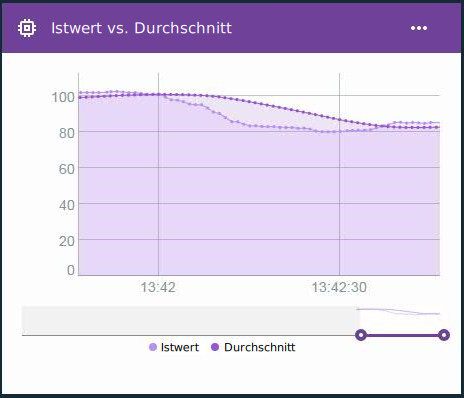

---

copyright:
  years: 2016, 2017
lastupdated: "2016-12-12"

---

{:new_window: target="blank"}
{:shortdesc: .shortdesc}
{:screen:.screen}
{:codeblock:.codeblock}
{:pre: .pre}

# Erweiterte Berechnungen für virtuelle Edge-Eigenschaften
{: #im_vir_calculations}

Erweitern Sie die Basisberechnungen für virtuelle Eigenschaften durch vordefinierte Edge Analytics-Formeln.
{:shortdesc}

**Wichtig:** Die erweiterten Berechnungen geben Eigenschaftsdatenpunkte nur zurück, wenn die Daten für die ausgewählte Eigenschaft von einem Gerät stammen, das mit einem Gateway verbunden ist, auf dem ein Edge Analytics-Agent installiert ist. Eine Edge-Regel kann diese virtuelle Eigenschaft direkt verwenden. Um die Eigenschaft mit einer Cloud-Regel zu verwenden, muss eine Edge-Regel den Datenpunkt mithilfe der Aktion 'An Cloud weiterleiten' an die Cloud senden. Weitere Informationen finden Sie in [Edge Analytics-Agent installieren](gateways/dashboard.html#edge).

Beispiel: Verwenden Sie die erweiterten virtuellen Datenpunkte in einer Kurvendiagrammkarte, um Datentrends ohne Spitzenwerte darzustellen.   
 

## Erweiterte Formeln
{: #advanced}

Zu den Optionen für erweiterte Berechnungen gehören die folgenden Formeln:

**Tipp:** Für manche dieser Formeln können Sie optional einen Zeitraum oder eine Anzahl von Datenpunkten als Geltungsbereich auswählen. Wenn die zugehörigen Daten mit gleichbleibender Häufigkeit fließen, kann die Verwendung eines Zeitraums hilfreich sein. Wenn die Daten sporadisch oder in ungleichmäßigen Abständen erfasst werden, ist es sinnvoller, eine Datenpunktanzahl zu verwenden, da das Zeitfenster kaum vorhersagbar ist.

<table>
<thead>
<tr>
<th>Formel</th>
<th>Beschreibung</th>
<th>Verwendung</th>
</tr>
</thead>
<tbody>
<tr>
<td>Durchschnitt</td>
<td>Gibt den Durchschnittswert für eine Eigenschaft über eine Anzahl kürzlich erfasster Datenpunkte oder über einen nahen Zeitraum zurück.  
Eingabe:
<ul>
<li>Eigenschaft
 <li>Die Länge eines Zeitraums oder die Anzahl von Datenpunkten in Form einer ganzen Zahl größer als 0.</ul></td>
 <td>Die Formel für den Durchschnitt (AVG) stellt einen Durchschnittswert der Datenpunkte in einem ständig wechselnden (gleitenden) Zeitfenster bereit.    Verwenden Sie die Formel für den Durchschnitt mit einer Regel, um das Auslösen von Fehlalarmen für verrauschte Daten zu vermeiden, die isolierte Spitzenwerte enthalten.  Verwenden Sie eine Kurvendiagrammkarte, um Datentrends ohne Spitzenwerte darzustellen.  
</td>
</tr>
<tr>
<td>Gleitender z-Faktorwert</td>
<td>Gibt die Differenz in Standardabweichungseinheiten zwischen dem Datenpunktwert und dem mittleren Datenpunktwert in Bezug auf eine Anzahl von Datenpunkten oder einen nahen Zeitraum zurück.   
Eingabe:
<ul>
<li>Eigenschaft
<li>Die Länge des Zeitraums oder die Anzahl der Datenpunkte in Form einer ganzen Zahl größer als 0.</ul></td>
<td>Der gleitende z-Faktorwert eines Datenpunkts gibt den Umfang einer Anomalie für den Datenpunktwert im Vergleich zum kürzlichen Durchschnittswert an. Ein höherer absoluter z-Faktorwert bedeutet, dass der aktuelle Wert des Datenpunkts von vorherigen durchschnittlichen Datenpunktwerten abweicht.
  Verwenden Sie die Formel für den gleitenden z-Faktorwert mit einer Regel zum Auslösen von Alerts für schnelle Änderungen, wenn die Datenpunktwerte vom kürzlichen Durchschnitt abweichen (und nicht, wenn der Datenpunkt einen bestimmten Wert überschreitet).
  Verwenden Sie eine Kurvendiagrammkarte, um Schwankungen in Ihren Daten als Kurve für die Häufigkeit und das Ausmaß der Standardabweichungen darzustellen.
</td>
</tr>
<tr>
<td>Exponentielle Glättung</td>
<td>Gibt den Durchschnittswert für eine Eigenschaft innerhalb der verfügbaren erfassten Datenpunkte zurück. Dabei werden ältere Eigenschaftswerte exponentiell weniger stark gewichtet als neuere Werte. Die Gewichtung wird durch den Glättungsfaktor bestimmt. Dabei führt ein größerer Wert zu einer stärkeren Gewichtung kürzlich erfasster Werte und zu einer schwächeren Gewichtung älterer Werte.  
Zusätzlich kann ein optionaler Neigungsfaktor verwendet werden, um Datentrends zu berücksichtigen. Die Formel für exponentielle Glättung der Werte ermöglicht kürzere Reaktionszeiten bei Datenänderungen als die Formel für gleitenden Durchschnitt.  
Eingabe:
<ul>
<li>Eigenschaft
<li>Glättungsfaktor, dargestellt als eine Zahl größer als 0 und kleiner als 1.  
<li>Optional: Neigung, dargestellt als eine Zahl größer als 0 und kleiner als 1.  
 **Tipp:** Wenn nicht bekannt ist, ob die erfassten Daten Trends aufweisen, beginnen Sie mit dem Neigungsfaktor 0,5(.5). Sie können den Faktor entsprechend Ihren Ergebnissen anpassen.
 </ul></td>  
 <td>Das Anwenden der exponentiellen Glättung auf einen Datenpunkt ergibt einen Durchschnitt mit einer geringeren Gewichtung für ältere Werte (im Unterschied zum Definieren eines begrenzten Zeitraums). Dabei können Sie die Gewichtung entfernter (älterer) Werte durch das Festlegen eines höheren Glättungswerts begrenzen.
  Verwenden Sie die Formel für exponentielle Glättung mit einer Regel, um das Auslösen von Fehlalarmen für verrauschte Daten mit isolierten Spitzenwerten zu vermeiden, indem Sie anstelle einer Teilmenge alle verfügbaren Daten verwenden.
  Verwenden Sie eine Kurvendiagrammkarte, um Datentrends ohne Spitzenwerte darzustellen. </td>
</tr>
<tr>
<td>Bereichsbezogene Glättung</td>
<td>Gibt den Durchschnittswert für eine Eigenschaft auf der Basis eines Datenpunktbereichs an, dessen Mitte der aktuelle Datenpunkt ist.  
Bei der bereichsbezogenen Glättung wird eine konfigurierte Anzahl von Datenpunktwerten verwendet, die vor und nach dem aktuellen Datenpunkt angeordnet sind, um den geglätteten Wert zu ermitteln. Bei der Berechnung der bereichsbezogenen Glättung werden alle Datenpunktwerte gleich gewichtet.  
Eingabe:
<ul>
<li>Eigenschaft
<li>Die Anzahl der vorangehenden und nachfolgenden Datenpunkte (halbe Breite) in Form einer ganzen Zahl größer als 0.
</ul></td>
<td>Das Anwenden der bereichsbezogenen Glättung auf einen Datenpunkt liefert einen Durchschnittswert für die Datenpunkte in einem ständig wechselnden (gleitenden) Zeitfenster, in dessen Mitte der Datenpunkt liegt, der von Interesse ist.   **Wichtig:** Entsprechend den Werten für Datenhäufigkeit und halbe Breite sind die zurückgegebenen Datenpunkte mehr oder weniger stark verzögert. Beispiel: Wenn für die halbe Breite der Wert `5` festgelegt ist und die Daten mit einer Häufigkeit von einer Nachricht pro Sekunde eintreffen, sind die zurückgegebenen virtuellen Datenpunkte um fünf Sekunden verzögert.  Verwenden Sie die Formel für bereichsbezogene Glättung mit einer Regel, um das Auslösen von Fehlalarmen für verrauschte Daten zu vermeiden, die isolierte Spitzenwerte enthalten.**Wichtig:** Berücksichtigen Sie beim Erstellen Ihrer Regeln die Verzögerung für Datenpunkte.  Verwenden Sie eine Kurvendiagrammkarte, um Datentrends ohne Spitzenwerte darzustellen. </td>
</tr>
<tr>
<td>Gaußsche Glättung</td>
<td>Gibt den Durchschnittswert für eine Eigenschaft auf der Basis eines Bereichs mit Datenpunkten zurück, dessen Mitte der aktuelle Datenpunkt ist. Dabei werden Eigenschaftswerte, die weiter vom aktuellen Datenpunkt entfernt sind, exponentiell geringer gewichtet als Datenpunkte, die sich näher am aktuellen Datenpunkt befinden.  
Eingabe:
<ul>
<li>Eigenschaft
<li>Die Anzahl der vorangehenden und nachfolgenden Datenpunkte (halbe Breite) in Form einer ganzen Zahl größer als 0.
</ul></td>
<td>Das Anwenden der gaußschen Glättung auf einen Datenpunkt liefert einen gewichteten Durchschnittswert für Datenpunkte in einem ständig wechselnden (gleitenden) Zeitfenster, in dessen Mitte der Datenpunkt liegt, der von Interesse ist. Datenpunkte, die weiter von dem betreffenden Datenpunkt entfernt liegen, werden beim Berechnen des Durchschnitts geringer gewichtet.  **Wichtig:** Entsprechend den Werten für Datenhäufigkeit und halbe Breite sind die zurückgegebenen Datenpunkte mehr oder weniger stark verzögert. Beispiel: Wenn für die halbe Breite der Wert `5` festgelegt ist und die Daten mit einer Häufigkeit von einer Nachricht pro Sekunde eintreffen, sind die zurückgegebenen virtuellen Datenpunkte um fünf Sekunden verzögert.  Verwenden Sie die Formel für gaußsche Glättung mit einer Regel, um das Auslösen von Fehlalarmen für verrauschte Daten zu vermeiden, die isolierte Spitzenwerte enthalten.**Wichtig:** Berücksichtigen Sie beim Erstellen Ihrer Regeln die Verzögerung für Datenpunkte.  Verwenden Sie eine Kurvendiagrammkarte, um Datentrends ohne Spitzenwerte darzustellen. </td>
</tr>
</tbody>
</table>  
