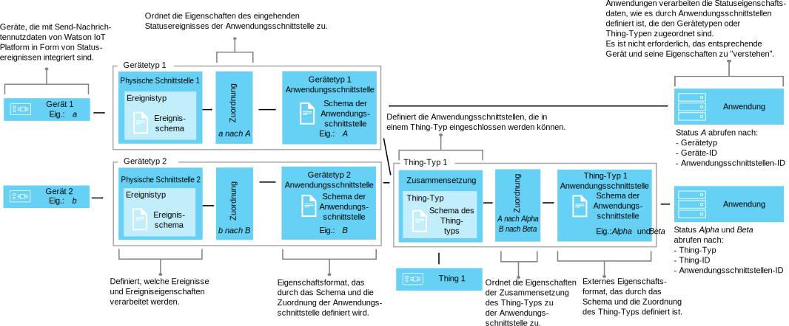

---

copyright:
years: 2016, 2017
lastupdated: "2017-04-25"

---

{:new_window: target="\_blank"}
{:shortdesc: .shortdesc}
{:screen: .screen}
{:codeblock: .codeblock}
{:pre: .pre}

# Gerätedaten mithilfe von Schnittstellen zuordnen (Beta)
{: #im_index}

Anwendungsschnittstellen erweitern das Konzept der [Gerätetypen](#resources), um die Daten besser zu steuern, die {{site.data.keyword.iot_short_notm}} durchlaufen, um eine geräteunabhängige Sicht der IoT-Daten bereitzustellen.
{:shortdesc}

**Wichtig:** Bei der Funktion der Schnittstellenzuordnung handelt es sich um eine Beta-Funktion. Fortlaufende Beta-Aktualisierungen sowie das endgültige Release können Änderungen enthalten, die mit der aktuellen Version nicht kompatibel sind. Es wird daher dringend empfohlen, dass Beta-Funktionen in Produktionsanwendungen erst mit der Einführung des endgültigen Release verwendet werden. Um weitere Informationen zu erhalten und Feedback zu diesem Beta zu geben, können Sie sich [für das Information Management Beta-Programm registrieren](https://www.ibm.com/software/support/trial/cst/forms/nomination.wss?id=7050){:new_window}.

## Übersicht
{: #overview}

Verwenden Sie Anwendungsschnittstellen zum Erstellen gemeinsam genutzter Abstraktionen von Geräten und Dingen, um die Wiederverwendung und Wartung zu verbessern und die komplexen Aspekte eines IoT-Ökosystems zu verwalten, jedoch gleichzeitig Anwendungen vor Datenänderungen zu schützen. Anwendungen werden von der Variabilität in den Nachrichtendaten entkoppelt, die Geräte an {{site.data.keyword.iot_short_notm}} übertragen.

Über Anwendungsschnittstellen können Anwendungen auf den aktuellen Status von Geräten und Dingen zugreifen. Der Status setzt sich aus einer Reihe von Statuseigenschaften zusammen, die durch die Anwendungsschnittstelle definiert sind. Wenn Geräte Statusänderungsereignisse senden, werden die aktuellen Werte dieser Eigenschaften in {{site.data.keyword.iot_short_notm}} gespeichert und der Anwendung bei Bedarf über eine HTTP-API zur Verfügung gestellt.

Durch die Verwendung von Anwendungsschnittstellen können Sie:
- Statuseigenschaften zu Ereignisnachrichtendaten zuordnen
- Die von Ihnen bevorzugte Datenstruktur definieren
- Mehr als eine Darstellung oder Ansicht des Gerätestatus definieren
- Gerätestatusangaben subskribieren oder diese jederzeit über eine HTTP-API abfragen

Nachfolgend finden Sie einige gängige Anwendungsfälle für Anwendungsschnittstellen:
- Bereitstellung konsistenter Schnittstellen für Ihre Anwendungsentwickler für den Zugriff auf ereignisgesteuerte Gerätedaten in einer REST-ähnlichen Form.
- Normalisierung von Daten von Geräten unterschiedlicher Marken oder Modelle, die Daten in unterschiedlichen Formaten publizieren.
- Kombinieren von Ereignisdaten aus mehreren unterschiedlichen Gerätetypen zum Modellieren bestimmter IoT-Dinge.
- Ändern und Konvertieren von Datenformaten entsprechend Ihrem Anwendungsmodell.  

Eine Dokumentation zu APIs für Schnittstellen (Beta) finden Sie in der Veröffentlichung zur [{{site.data.keyword.iot_short_notm}} HTTP-REST-API  ](https://docs.internetofthings.ibmcloud.com/apis/swagger/v0002-beta/info-mgmt-beta.html){: new_window}.   

## Beispiele
{: #examples}
Die folgenden Schnittstellenbeispiele veranschaulichen zwei mögliche Lösungsansätze.

### Beispiel 1: Heterogene Temperatursensoren zu einer Anwendungsschnittstelle zuordnen
{: #device-type-example}
In diesem Beispiel wird eine Anwendungsschnittstelle erstellt, die homogene Temperaturstatusdaten in einem Format unabhängig vom tatsächlichen Format der Ereignisnachrichtennutzdaten des Geräts bereitstellt. "Temperatursensor 1" gibt einen Temperaturmesswert in Celsius von `{ "t" : 34.5 }` an {{site.data.keyword.iot_short_notm}} aus. "Temperatursensor 2" gibt einen Temperaturmesswert in Fahrenheit von `{ "temp" : 72.55 }` aus. Die Temperaturmesswerte werden als separate Ereignisse ausgegeben.

Ein umfassendes Szenario, das dieses Beispiel beschreibt, finden Sie in [Anwendungsschnittstelle - Szenario 1](im_index_scenario.html).

Als Teil des Anwendungsschnittstellendatenflusses können Sie Berechnungen für eingehende Daten durchführen, um diese Messwerte in einem konsistenten Format für die Verarbeitung zu normalisieren. Dies bedeutet, dass Sie Ihre Anwendung nicht so schreiben müssen, dass sie verschiedene Temperaturskalen verstehen oder konvertieren muss. Die Anwendung empfängt einen einzelnen normalisierten Status und verwendet die Statuseigenschaft **temperature** anstelle der gerätespezifischen Eigenschaften **t** und **temp**.

### Beispiel 2: Mehrere Klimageräte zu einer Anwendungsschnittstelle für 'Ding'-Typen zuordnen
{: #thing-type-example}  
In diesem Beispiel wird das Beispiel mit den Gerätetypen erweitert, indem eine Gruppe von Feuchtigkeitssensoren in Form von separaten Hygrometer-Geräten hinzugefügt wird. Durch die Verwendung einer Anwendungsschnittstelle für einen 'Ding'-Typ können Daten von unterschiedlichen Gerätetypen in einer Anwendungsschnittstelle zusammengeführt werden, die alle Geräte und Sensoren in einem Raum darstellt. Eine Anwendung kann nun die erfassten Klimadaten für einen Raum erhalten, indem sie eine Verbindung zu der Anwendungsschnittstelle des Raum-'Dings' herstellt.

Ein umfassendes Szenario, das dieses Beispiel beschreibt, finden Sie in [Anwendungsschnittstelle - Szenario 2](im_index_scenario_thing.html).

Temperatursensor 1 und Feuchtigkeitssensor 3 publizieren Umgebungsdaten, die in Raum R1 erfasst werden. Die Daten des Temperatur- und des Feuchtigkeitssensors werden separat zwei Anwendungsschnittstellen für den Gerätetyp zugeordnet: einer für den Gerätetyp Thermometer und einer anderen für den Gerätetyp Hygrometer (siehe vorheriges Beispiel). Nun wird ein 'Ding'-Typ namens 'Raum' erstellt und es werden zwei 'Ding'-Instanzen des Typs 'Raum' (R1 und R2) instanziiert.

Es kann nun eine Zusammensetzung eingerichtet werden, die die Anwendungsschnittstellen für Thermometer und Hygrometer umfasst. Die richtigen Umgebungssensoren werden dann den einzelnen Raum-Instanzen zugeordnet, z. B. werden D1 und D2 zu R1 zugeordnet. Die Endbenutzeranwendung kann nun den Status einer 'Ding'-ID für einen bestimmten Raum anfordern und die Statusangaben für Raumtemperatur und Raumfeuchtigkeit erhalten, ohne dabei die zugrunde liegende Geräteinfrastruktur kennen zu müssen.

## Definitionen und Ressourcen
{: #resources}

Die folgenden Diagramme veranschaulichen die logische Zuordnung zwischen Geräten und Anwendungen in {{site.data.keyword.iot_short_notm}} bei der Verwendung von Anwendungsschnittstellen.

### Konzepte

Konzepte                        | Beschreibung       
------------- | ------------- | -------------  
Ereignis | Ereignisse sind der Mechanismus, über den Geräte Daten in {{site.data.keyword.iot_short_notm}} publizieren. Das Gerät steuert den Inhalt des Ereignisses und ordnet jedem Ereignis, das von ihm gesendet wird, einen Namen zu.
Eigenschaft | Daten, die einen Teil der Ereignisnutzdaten eines Geräts tragen.
Status | Der aktuelle Wert einer zugeordneten Statuseigenschaft.
Zusammensetzung                         | Ein logisches Konstrukt, das die Anwendungsschnittstellen definiert, die einem 'Ding'-Typ zugeordnet sind. Die Zusammensetzung wird durch das Schema eines 'Ding'-Typs angegeben.   

### Informationsmanagementressourcen
Sie können die Ressourcen über REST-APIs verwalten. Informationen zu den REST-APIs finden Sie in der Dokumentation zur [{{site.data.keyword.iot_short_notm}} HTTP-REST-API](https://docs.internetofthings.ibmcloud.com/swagger/info-mgmt-beta.html).

Typressourcen                        | Beschreibung       
------------- | ------------- | -------------  
Ereignistyp                         | Ein programmgesteuertes Konstrukt, das eine physische Schnittstelle mit einem Ereignisschema verbindet.  **Wichtig:** Für die Betaversion müssen alle eingehenden Ereignisse, die in einer Anwendungsschnittstelle verwendet werden, im JSON-Format vorliegen.   
Gerätetyp                         |  Ein programmgesteuertes Konstrukt, mit dem Sie Geräte gruppieren können, die gemeinsame Merkmale haben oder gleiches Verhalten zeigen. Bei der Schnittstellenzuordnung wird der Gerätetyp so erweitert, dass er eine physische Schnittstelle für ein Gerät und mindestens eine Anwendungsschnittstelle enthält, über die der Gerätestatus abgerufen wird.  Weitere Informationen hierzu finden Sie im Abschnitt zu IDs und Gerätetypen im Thema zu den [Gerätemodellen](../reference/device_model.html#id_and_device_types).
'Ding'-Typ                         | Ein programmgesteuertes Konstrukt, das eine Gruppe von einem oder mehreren separaten Gerätetypen, 'Ding'-Typen oder beiden darstellt.  **Wichtig:** Die Betaversion unterstützt drei Ebenen der Verschachtelung von Anwendungsschnittstellen für 'Ding'-Typen.
Schemaressourcen                         |  Programmgesteuerte Konstrukte, die die Datenstruktur der physischen Schnittstellen für Gerätetypen, die Zusammensetzung von 'Ding'-Typen und die ausgehenden Anwendungsschnittstellen definieren. Die folgenden [JSON-Schemas ](http://json-schema.org/){:new_window} werden verwendet: <ul><li>*Ereignisschemas* definieren die Struktur der Ereignisse, die in {{site.data.keyword.iot_short_notm}} von einem Gerät publiziert werden. Jedes Ereignisschema definiert die Struktur für ein eingehenden Ereignis und ist einem Ereignistyp zugeordnet. <li>*Schemas für 'Ding'-Typen* definieren die Anwendungsschnittstellen, die von einem 'Ding'-Typ als Eingabequelle verwendet werden. Jedes dieser Schemas gibt die Struktur von einer oder mehreren Anwendungsschnittstellen für 'Ding'-Typen an.<li>*Anwendungsschnittstellenschemas* definieren die Struktur des [Gerätestatus](#key_concepts), der auf {{site.data.keyword.iot_short_notm}} gespeichert wird.</ul>.

Schnittstellenressourcen                        | Beschreibung       
------------- | ------------- | -------------  
Anwendungsschnittstelle | Ein programmgesteuertes Konstrukt, mit dem Ihre Anwendungen eine Verbindung herstellen oder das sie subskribieren können, um den Status eines Geräts oder eines Dings zu ermitteln. Die Anwendungsschnittstelle wird durch ein Anwendungsschnittstellenschema definiert, das die Struktur der Statusdaten festlegt, die als Geräte- oder 'Ding'-Status gespeichert werden. Der Status wird als Antwort auf eingehende Statusereignisse aktualisiert. Eine einem Gerätetyp zugeordnete Anwendungsschnittstelle kann eine physische Schnittstelle als Eingabe haben. Eine Anwendungsschnittstelle, die einem 'Ding'-Typ zugeordnet ist, kann eine oder mehrere Anwendungsschnittstellen als Eingabe haben.

Instanzressourcen                        | Beschreibung       
------------- | ------------- | -------------  
Gerät                         | Ein programmgesteuertes Konstrukt, das ein Asset, ein System oder eine Komponente darstellt, das/die für {{site.data.keyword.iot_short_notm}} registriert ist und IoT-Daten in Form von Ereignissen sendet.  
Ding                         | Ein programmgesteuertes Konstrukt, das in logischer Form eine eindeutige Instanz eines 'Ding'-Typs darstellt. Eine 'Ding'-Instanz dient demselben Zweck wie ein registriertes Gerät eines Gerätetyps.

Unterstützende Ressourcen                        | Beschreibung       
------------- | ------------- | -------------  
Physische Schnittstelle                         | Ein programmgesteuertes Konstrukt, das die Ereignistypen und zugehörigen Geräteeigenschaften definiert, die einem einzelnen Gerätetyp zugeordnet sind. Die physische Schnittstelle wird durch Ereignisschemas festgelegt.   
Zuordnungen                         | Ein programmgesteuertes Konstrukt, das definiert, wie Eigenschaften, die eingehenden Ereignissen zugeordnet sind, Eigenschaften zugewiesen werden, die für eine Anwendungsschnittstelle festgelegt sind.  **Wichtig:** Bevor Zuordnungen festgelegt werden können, muss mindestens eine Anwendungsschnittstelle einem Gerätetyp zugeordnet sein.

## Allgemeiner Workflow
{: #workflow}

Die folgenden Schritte sollen Sie beim Konfigurieren der erforderlichen Ressourcen unterstützen, die zum Zuordnen Ihrer Gerätedaten mithilfe von Schnittstellen erforderlich sind.

Details zur API finden Sie in der Dokumentation zur [{{site.data.keyword.iot_short_notm}}-HTTP-REST-API ](https://docs.internetofthings.ibmcloud.com/swagger/info-mgmt-beta.html){:new_window}.

**Tipp:** Nähere Informationen zu den einzelnen Schritten finden Sie in den Beispielszenarios. Über die entsprechenden Links können Sie auch direkt zu einem bestimmten Schritt in dem Beispielszenario gelangen. [Beispielszenario 1](im_index_scenario.html#scenario) führt Sie durch die Schritte zum Erstellen einer Anwendungsschnittstelle für Gerätetypen für heterogene Thermometergeräte. [Beispielszenario 2](im_index_scenario_thing.html#scenario) geht noch weiter, indem beschrieben wird, wie eine Anwendungsschnittstelle erstellt wird, über die Sie Daten von zwei unterschiedlichen Klimagerätetypen verarbeiten können, die in einem Ding namens 'Raumtyp' zusammengeführt sind.

Je nachdem, welchem Typ (Gerät oder 'Ding') eine von Ihnen erstellte Anwendungsschnittstelle zugeordnet ist, ist der Prozess zum Erstellen und Konsumieren von Anwendungsschnittstellen ein wenig anders.

### Vorbereitende Schritte
Um eine Anwendungsschnittstelle zu erstellen, die einem Gerätetyp zugeordnet ist, muss [mindestens ein Gerät für {{site.data.keyword.iot_short_notm}}](im_index_scenario.html#step14) registriert sein und Ereignisse mit Statuseigenschaften senden.  
Um eine Anwendungsschnittstelle zu erstellen, die einem 'Ding'-Typ zugeordnet ist, muss mindestens eine Anwendungsschnittstelle mit einem erstellten Gerätetyp verbunden sein.

### Schritte

1. 	Definieren Sie die eingehenden Statuseigenschaften.  
Legen Sie zuerst die eingehenden Statuseigenschaften fest, die von Ihrer Anwendungsschnittstelle für Anwendungen zur Verfügung gestellt werden sollen.  
Führen Sie je nachdem, welche Anwendungsschnittstelle Sie erstellen, eine der beiden folgenden Aktionen durch:
<dl>
<dt>Gerätetyp: Erstellen Sie eine physische Schnittstelle.</dt>
<dd>
<ol>
<li>[Erstellen Sie eine Ereignisschemadatei](im_index_scenario.html#step1). Bei der Ereignisschemadatei handelt es sich um eine lokale .JSON-Datei, in der die Struktur und das Format eines eingehenden Ereignisses definiert ist.
<li>[Erstellen Sie eine Ereignisschemaressource für Ihren Ereignistyp](im_index_scenario.html#step2). Das Ereignisschema ist ein programmgesteuertes Konstrukt, das von {{site.data.keyword.iot_short_notm}} verwendet wird.
<li>[Erstellen Sie einen Ereignistyp, der das Ereignisschema referenziert](im_index_scenario.html#step3). Der Ereignistyp wird von {{site.data.keyword.iot_short_notm}} verwendet, um eine oder mehrere Ereignisschemaressourcen zu einer physischen Schnittstelle zuzuordnen.
<li>[Erstellen Sie eine physische Schnittstelle](im_index_scenario.html#step7).
<li>[Fügen Sie den Ereignistyp zu der physischen Schnittstelle hinzu](im_index_scenario.html#step8).
<li>[Fügen Sie die physische Schnittstelle zu Ihrem Gerätetyp hinzu](im_index_scenario.html#step9).
</ol>
</dd>
<dt>'Ding'-Typ: Definieren Sie eine Zusammensetzung.</dt>
<dd>
<ol>
<li>[Erstellen Sie eine Zusammensetzungsschemadatei](im_index_scenario_thing.html#crt_composition_file).  
Eine Zusammensetzungsschemadatei eines 'Ding'-Typs ist eine lokale JSON-Datei, die die Zusammensetzung des 'Ding'-Typs definiert, indem sie auf vorhandene Anwendungsschnittstellen verweist.
<li>[Erstellen Sie eine Zusammensetzungsschemaressource](im_index_scenario_thing.html#crt_composition_resource).  
Laden Sie die lokale JSON-Datei auf {{site.data.keyword.iot_short_notm}} hoch.
<li>[Erstellen Sie einen 'Ding'-Typ](im_index_scenario_thing.html#crt_thing_type).   Ein 'Ding'-Typ dient demselben Zweck wie ein Gerätetyp, indem er eine Klasse von Dingen darstellt.
</ol>
</dd>
</dl>
4. 	Erstellen Sie eine Anwendungsschnittstelle.
 1. 	Erstellen Sie eine Anwendungsschnittstellenschemadatei für den [Gerätetyp](im_index_scenario.html#step4) oder ['Ding'-Typ](im_index_scenario_thing.html#crt_ai_schema_file).  
Bei einer Anwendungsschnittstellenschemadatei handelt es sich um eine lokale JSON-Datei, die den Gerätestatus angibt, der Ihren Anwendungen zur Verfügung gestellt wird.
 2. 	Erstellen Sie eine Anwendungsschnittstellenschemaressource für den [Gerätetyp](im_index_scenario.html#step5) oder ['Ding'-Typ](im_index_scenario_thing.html#crt_ai_schema_resource).
 3.	Erstellen Sie eine Anwendungsschnittstelle für den [Gerätetyp](im_index_scenario.html#step6) oder ['Ding'-Typ](im_index_scenario_thing.html#crt_thing_ai).
 4.	Fügen Sie die Anwendungsschnittstelle zum [Gerätetyp](im_index_scenario.html#step10) oder ['Ding'-Typ](im_index_scenario_thing.html#add_thing_ai) hinzu.
5. 	Definieren Sie die Zuordnungen für den [Gerätetyp](im_index_scenario.html#step11) oder ['Ding'-Typ](im_index_scenario_thing.html#define_Thing_type_mappings).   
Zuordnungen zum Zuweisen von eingehenden Eigenschaften zu Eigenschaften in der Anwendungsschnittstelle.
6. 	Implementieren Sie die Konfiguration, die dem [Gerätetyp](im_index_scenario.html#step15) oder ['Ding'-Typ](im_index_scenario_thing.html#deploy_Thing_config) zugeordnet ist.
7. 	**'Ding'-Typ:** [Erstellen Sie eine Instanz des 'Ding'-Typs](im_index_scenario_thing.html#create_Thing_instances).
8. 	Stellen Sie sicher, dass der Status des [Geräts](im_index_scenario.html#step13) oder [Dings](im_index_scenario_thing.html#verify_Thing_state) aktualisiert wird.  
Überprüfen Sie, ob Ihre Subskriptionen die aktualisierten Gerätedaten enthalten oder aktualisierte Gerätedaten mithilfe eines REST-Aufrufs zurückgegeben werden.
