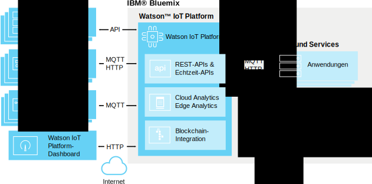

---

copyright:
  years: 2016, 2017
lastupdated: "2017-02-3"

---

{:new_window: target="\_blank"}
{:shortdesc: .shortdesc}
{:screen: .screen}
{:codeblock: .codeblock}
{:pre: .pre}

# Informationen zu {{site.data.keyword.iot_short_notm}}
{: #about_iotplatform}

{{site.data.keyword.iot_full}} bietet einen leistungsfähigen Anwendungszugriff auf IoT-Geräte und -Daten bereit, um Sie bei der schnellen Erstellung von Analyseanwendungen, Visualisierungsdashboards und mobilen IoT-Apps zu unterstützen.
{:shortdesc}

{{site.data.keyword.iot_short_notm}} ermöglicht Ihnen die Ausführung leistungsfähiger Gerätemanagementoperationen sowie die Speicherung von und den Zugriff auf Gerätedaten und das Herstellen von Verbindungen für eine große Auswahl von Geräten und Gateway-Geräten. {{site.data.keyword.iot_short_notm}} bietet durch die Verwendung von MQTT und TLS eine sichere Kommunikation mit Ihren Geräten.

## Architektur von {{site.data.keyword.iot_short_notm}}
{: #watsoniotplatform_architecture}

**Wichtig:** Die Analysefunktionen stammen aus dem {{site.data.keyword.iotrtinsights_full}}-Service und werden zusammengeführt. Wenn Ihre {{site.data.keyword.iot_short_notm}}-Organisation als Datenquelle für eine vorhandene {{site.data.keyword.iotrtinsights_short}}-Instanz verwendet wird, sind Cloud Analytics und Edge Analytics erst aktiviert, wenn die vorhandenen {{site.data.keyword.iotrtinsights_short}}-Instanzen migriert wurden. Verwenden Sie weiterhin das {{site.data.keyword.iotrtinsights_short}}-Dashboard für Ihre Analysevorhaben, bis die Migration abgeschlossen ist. Weitere Informationen finden Sie im [Blog zu IBM Watson IoT Platform ](https://developer.ibm.com/iotplatform/2016/04/28/iot-real-time-insights-and-watson-iot-platform-a-match-made-in-heaven/){: new_window} in IBM developerWorks und in den Dashboards Ihrer bestehenden {{site.data.keyword.iotrtinsights_short}}-Instanz.  

{{site.data.keyword.iot_short_notm}} kommuniziert mithilfe der {{site.data.keyword.iot_short_notm}}-API und des {{site.data.keyword.iot_short_notm}}-Nachrichtenprotokolls mit Ihren Anwendungen und Geräten. Das {{site.data.keyword.iot_short_notm}}-Dashboard stellt Verbindungen als Front-End-Benutzerschnittstelle bereit, um Operationen innerhalb der Plattform zu vereinfachen. Gerätedaten können zusammen mit Analyselösungen gespeichert oder verwendet werden.

## Wichtige Konzepte in {{site.data.keyword.iot_short_notm}}
{: #watsoniotplatform_importantconcepts}

### Organisationen

Wenn Sie sich bei {{site.data.keyword.iot_short_notm}} registrieren, erhalten Sie eine Organisations-ID. Ihre Organisations-ID ist eine aus sechs Zeichen bestehende eindeutige ID für Ihr Konto. Durch Organisationen wird sichergestellt, dass nur Ihre Geräte und Anwendungen auf Ihre Daten zugreifen können. Nach der Registrierung sind Geräte- und API-Schlüssel an eine einzelne Organisation gebunden. Wenn eine Anwendung eine Verbindung zum Service über einen API-Schlüssel herstellt, wird sie bei der Organisation registriert, die dem verwendeten API-Schlüssel zugeordnet ist.

Aus Gründen Ihrer Sicherheit ist es unmöglich, zwischen Organisationen zu kommunizieren. Die einzige Möglichkeit, Daten zwischen zwei Organisationen zu übertragen, besteht darin, innerhalb jeder der Organisationen eine Anwendung zu erstellen, die mit Anwendungen in der anderen Organisation kommuniziert.

### Geräte

Ein Gerät kann alles sein, das eine Verbindung zum Internet hat und das für Daten eine Push-Operation in die Cloud durchführen kann. Geräte können jedoch nicht direkt mit anderen Geräten kommunizieren, stattdessen akzeptieren Geräte Befehle von Anwendungen und senden Ereignisse an Anwendungen. Geräte in {{site.data.keyword.iot_short_notm}} werden durch ein eindeutiges Authentifizierungstoken angegeben. Geräte müssen registriert werden, bevor für sie eine Verbindung zu {{site.data.keyword.iot_short_notm}} hergestellt werden kann.

{{site.data.keyword.iot_short_notm}} erkennt zwei Klassen von Geräteklassen, **verwaltete Geräte** und **nicht verwaltete Geräte**.

**Verwaltete Geräte** sind als Geräte definiert, die über einen Gerätemanagementagenten verfügen. Ein Gerätemanagementagent ist eine Logikeinheit, die es dem Gerät ermöglicht, über das Gerätemanagementprotokoll mit dem {{site.data.keyword.iot_short_notm}}-Gerätemanagementservice zu interagieren. Verwaltete Geräte können Gerätemanagementoperationen einschließlich von Positionsaktualisierungen, Firmware-Downloads und Aktualisierungen, Neustarts und Zurücksetzen auf Werkseinstellungen ausführen.

**Nicht verwaltete Geräte** sind alle Geräte, die keinen Gerätemanagementagenten haben. Nicht verwaltete Geräte können eine Verbindung zu {{site.data.keyword.iot_short_notm}} herstellen und Ereignisse und Befehle senden und empfangen, aber sie können keine Gerätemanagementanforderungen senden oder Gerätemanagementoperationen ausführen.

### Gateways

Gateways sind spezialisierte Geräte, die über die kombinierten Funktionen einer Anwendung und eines Gerätes verfügen, wodurch sie als Zugriffspunkt für andere Geräte dienen können. Geräte, die keine direkt Verbindung zum Internet herstellen können, können auf den {{site.data.keyword.iot_short_notm}}-Service zugreifen, indem Sie zunächst eine Verbindung zum Gateway herstellen.

Gateways müssen registiert werden, bevor Sie eine Verbindung zum Service herstellen können.

### Anwendungen

Eine Anwendung ist alles, was eine Verbindung zum Internet hat und mit Daten von Geräten interagiert und das Verhalten dieser Geräte steuert. Anwendungen identifizieren sich bei {{site.data.keyword.iot_short_notm}} mithilfe eines API-Schlüssels und einer eindeutigen Anwendungs-ID. Anders als Geräte müssen Anwendungen nicht registriert werden, bevor sie eine Verbindung zu {{site.data.keyword.iot_short_notm}} herstellen. Sie müssen jedoch einen gültigen API-Schlüssel verwenden, der zuvor registriert wurde.

### Ereignisse

Ereignisse sind der Mechanismus, über den Geräte Daten in {{site.data.keyword.iot_short_notm}} publizieren. Geräte steuern den Inhalt ihrer Nachrichten und ordnen für jedes gesendete Ereignis einen Namen zu. {{site.data.keyword.iot_short_notm}} verwendet die an jedes empfangene Ereignis angehängten Berechtigungsnachweise, um festzustellen, von welchem Gerät das Ereignis gesendet wurde. Diese Architektur verhindert, dass Geräte die Identität eines anderen Geräts annehmen.

Anwendungen können Ereignisse in Echtzeit verarbeiten und zeigen die Quelle des Ereignisse und die im Ereignis enthaltenen Daten an. Anwendungen müssen konfiguriert werden, um zu definieren, welche Geräte und Ereignisse sie subskribieren.

### Befehle

Befehle sind der Mechanismus, über den Anwendungen mit Geräten kommunizieren. Befehle können nur von Anwendungen gesendet werden und sie werden an bestimmte Geräte gesendet. Das Gerät muss ermitteln, welche Aktion bei Empfang eines Befehls ausgeführt werden soll. Geräte können so entworfen werden, dass sie für alle Befehle empfangsbereit sind oder dass sie eine bestimmte Liste mit Befehlen subskribieren.
