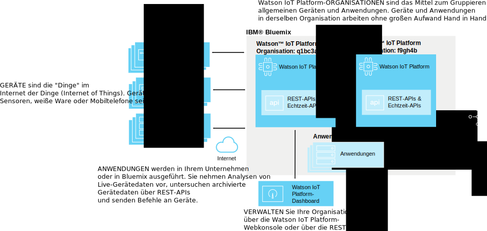
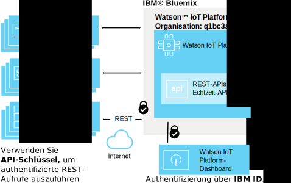
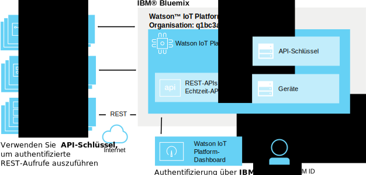
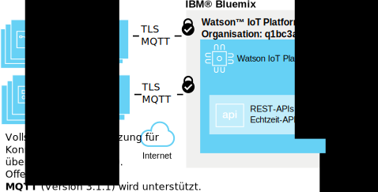
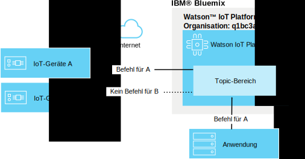
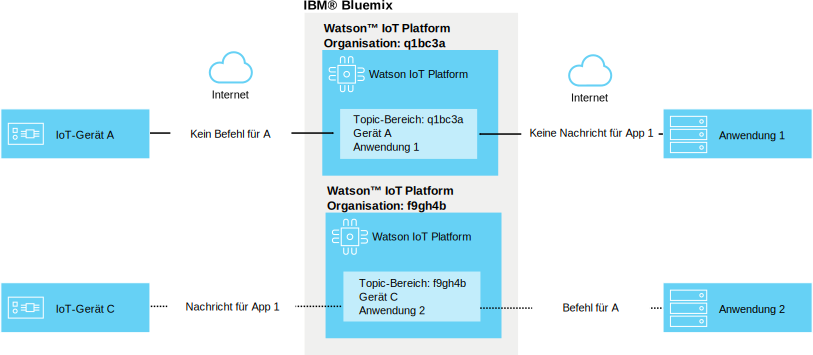

---

copyright:
  years: 2016, 2017
lastupdated: "2017-03-17"

---

{:new_window: target="blank"}
{:shortdesc: .shortdesc}
{:screen: .screen}
{:codeblock: .codeblock}
{:pre: .pre}

# {{site.data.keyword.iot_short_notm}}-Sicherheit
{: #sec-index}

In {{site.data.keyword.iot_full}}, das in der Cloud gehostet wird, ist Sicherheit als wichtiger Aspekt der Architektur integriert.
{: shortdesc}

Im folgenden Dokument werden einige häufig gestellte Fragen zum Schutz der Daten Ihrer Organisation beantwortet, wobei der Schwerpunkt auf bestimmten Bereichen liegt:

* Konformität: externe Standards, die Benchmarks für Sicherheit festlegen.
* Authentifizierung: Sicherstellung der Identität von Benutzern, Geräte oder Anwendungen, die auf die Informationen Ihrer Organisation zugreifen.
* Berechtigung: Sicherstellung, dass Benutzer, Geräte und Anwendungen die Berechtigung zum Zugriff auf die Informationen Ihrer Organisation haben.
* Verschlüsselung: Sicherstellung, dass Daten nur von berechtigten Personen gelesen und nicht abgefangen werden können.

## {{site.data.keyword.iot_short_notm}} und {{site.data.keyword.Bluemix_notm}}
{: #iot-bluemix-sec}

{{site.data.keyword.iot_short_notm}} wird innerhalb der {{site.data.keyword.Bluemix_notm}}-Plattform ausgeführt und gründet sich in Bezug auf Zugriff und Konnektivität daher sowohl auf {{site.data.keyword.Bluemix_notm}} als auch auf {{site.data.keyword.BluSoftlayer_full}}. Durch die Abhängigkeit von {{site.data.keyword.Bluemix_notm}} und {{site.data.keyword.BluSoftlayer}} ist die Sicherheit und Zuverlässigkeit von {{site.data.keyword.Bluemix_notm}} und {{site.data.keyword.BluSoftlayer}} wichtig für Benutzer von {{site.data.keyword.iot_short_notm}}.

Weitere Details zur Sicherheit von {{site.data.keyword.Bluemix_notm}} finden Sie in [Sicherheit der {{site.data.keyword.Bluemix_notm}}-Plattform](index.html#platform-security).

## Einhaltung von Sicherheitsbestimmungen in {{site.data.keyword.iot_short_notm}}
{: #compliance}  
   
{{site.data.keyword.iot_short_notm}} wurde durch den ISO-Standard 27001 (ISO - International Organization for Standardization) zertifiziert, der Best Practices für Prozesse des Sicherheitsmanagements für Informationen definiert. Der ISO-Standard 27001 gibt Anforderungen für die Erstellung, Implementierung und Dokumentierung von Information Security Management Systems (ISMS) sowie Anforderungen an die Implementierung von Sicherheitsmaßnahmen an, die auf die Bedürfnisse der einzelnen Organisationen abgestimmt sind. Die Familie der ISO-27000-Standards umfasst einen Prozess zur Skalierung des Risikos und der Bewertung von Assets, der das Ziel verfolgt, die Vertraulichkeit, Integrität und Verfügbarkeit der Informationen zu sichern, die in geschriebener, mündlicher oder elektronischer Form vorliegen.

{{site.data.keyword.iot_short_notm}} wird von einer außenstehenden Sicherheitsfirma geprüft und erfüllt alle Anforderungen von ISO 27001: ISO 27001:2013-Registrierungszertifikat für {{site.data.keyword.iot_short_notm}}.

## {{site.data.keyword.iot_short_notm}}-Terminologie
{: #terminology}

## Wie wird das IoT-Informationsmanagement innerhalb Ihrer Organisation geschützt?
{: #secure-org}

Die browserbasierte grafische Benutzerschnittstelle (GUI) und die REST-APIs laufen unter HTTPS; durch ein von DigiCert signiertes Zertifikat können Sie ganz sicher sein, dass tatsächlich eine Verbindung zu {{site.data.keyword.iot_short_notm}} hergestellt wird. Zugriff auf die webbasierte grafische Benutzerschnittstelle wird über Ihre IBM ID oder {{site.data.keyword.Bluemix_notm}} {{site.data.keyword.ssoshort}} authentifiziert. Für die Verwendung von REST-APIs ist ein API-Schlüssel erforderlich, der über die grafische Benutzerschnittstelle generiert wird; dies können Sie verwenden, um für Ihre Organisation authentifizierte REST-API-Aufrufe auszuführen.

## Wie werden die Berechtigungsnachweise für Ihre Geräte und Anwendungen gesichert?
{: #secure-credentials}

Zu dem Zeitpunkt, an dem Geräte registriert oder API-Schlüssel generiert werden, wird das Authentifizierungstoken zufalls- und hashverschlüsselt. Dies bedeutet, dass die Berechtigungsnachweise nicht aus den Systemen wiederhergestellt werden können, auch nicht in dem wenig anzunehmenden Fall, dass {{site.data.keyword.iot_short_notm}} kompromittiert würde.

Die Identifikationsdaten von Geräten und API-Schlüssel können einzeln widerrufen werden, wenn diese kompromittiert wurden.

## Wie stellen wir sicher, dass Ihre Geräte eine sichere Verbindung zu {{site.data.keyword.iot_short_notm}}?
{: #secure-device-connection}

Geräte werden über eine Client-ID und/oder das Authentifizierungstoken verbunden, das generiert wird, wenn die Geräte Ihrer Plattform hinzugefügt werden. MQTT wird verwendet, um plattform- und sprachübergreifend eine einfache Interoperabilität zu ermöglichen. {{site.data.keyword.iot_short_notm}} unterstützt Konnektivität über TLS Version 1.2.

Weitere Informationen zu den Anforderungen für TLS und Cipher-Suite finden Sie im Abschnitt [TLS-Anforderungen](connect_devices_apps_gw.html#tls_requirements) in der Dokumentation `Verbindungen für Anwendungen, Geräte und Gateways in Watson IoT Platform`.

Sie können Zertifikate und Sicherheitsrichtlinien verwenden, um die Geräteverbindungssicherheit zu verbessern. Sicherheitsrichtlinien können so eingerichtet werden, dass unverschlüsselte Verbindungen möglich sind, nur TLS-Verbindungen zulässig sind oder Geräte sich mit clientseitigen Zertifikaten authentifizieren müssen. Mit Blacklists können Geräte angegeben werden, mit den eine Verbindung nicht zulässig ist. In Whitelists können Sie bestimmte Geräte für die Verbindung zulassen. Weitere Informationen zur erweiterten Sicherheit finden Sie in [Risiko- und Sicherheitsmanagement](RM_security.html).

## Wie verhindern wir, dass es zwischen Geräten Datenlecks gibt?
{: #prevent-leak-devices}

Es werden sichere Nachrichtenmuster verwendet. Nach erfolgter Authentifizierung sind Geräte nur dazu berechtigt, auf einem eingeschränkten Topic-Bereich zu publizieren und diesen zu subskribieren:

* '/iot-2/evt/<Ereignis-ID>/fmt/<Format_Zeichenfolge>'
* '/iot-2/cmd/<Befehls-ID>/fmt/<Format_Zeichenfolge>'

Alle Geräte arbeiten mit dem selben Topic-Bereich. Die Authentifizierungsnachweise, die vom Client bereitgestellt werden, geben vor, auf welchem Gerät dieser Topic-Bereich durch Watson {{site.data.keyword.iot_short_notm}} platziert wird.  Dadurch wird verhindert, dass Geräte die Identität von anderen Geräten annehmen können.

Die einzige Möglichkeit, die Identität eines anderen Geräts anzunehmen, besteht darin, dass man kompromittierte Sicherheitsberechtigungsnachweise für das Gerät erhält.

Anwendungen können sowohl Ereignis- als auch Befehls-Topics subskribieren und darauf publizieren, und zwar für alle Geräte in der Organisation. Anwendungen können Daten aus vielen Geräte gleichzeitig analysieren und können darüber hinaus Geräte simulieren oder als Proxy für sie fungieren, zusätzlich zur Bildung der ergänzenden Rolle einer Vollduplexübertragungsschleife.

## Wie verhindern wir, dass es zwischen Organisationen Lecks aus IoT-Daten gibt?
{: #prevent-leak-org}

Der Topic-Bereich, in dem Geräte und Anwendungen operieren, befindet sich bereichsorientiert innerhalb einer einzigen Organisation. Nach der Authentifizierung wandelt {{site.data.keyword.iot_short_notm}} die Topic-Struktur um, und zwar unter Verwendung einer Organisations-ID, die auf der Clientauthentifizierung basiert. Dadurch wird es unmöglich, dass Daten einer Organisation von einer anderen Organisation abgerufen werden können.

# Zugehörige Links
{: #rellinks}
## Zugehörige Links
{: #general}
* [Einführung in {{site.data.keyword.iot_short_notm}}](https://console.ng.bluemix.net/docs/services/IoT/index.html)
* [{{site.data.keyword.Bluemix_notm}} - Sicherheit ](https://console.ng.bluemix.net/docs/security/index.html#security){:new_window}
* [{{site.data.keyword.Bluemix_notm}} - Plattformsicherheit ](https://console.ng.bluemix.net/docs/security/index.html#platform-security){:new_window}
* [{{site.data.keyword.Bluemix_notm}} - Einhaltung von Sicherheitsbestimmungen](https://console.ng.bluemix.net/docs/security/index.html#compliance){:new_window}
* [{{site.data.keyword.BluSoftlayer}} - Sicherheit ](http://www.softlayer.com/security){:new_window}
* [{{site.data.keyword.BluSoftlayer}} - Compliance ](http://www.softlayer.com/compliance){:new_window}
