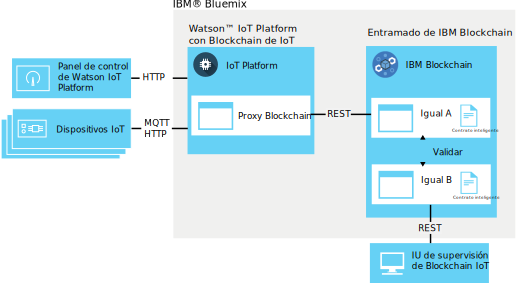
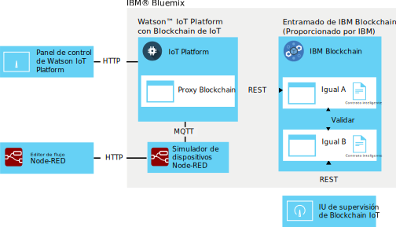

---

copyright:
  years: 2016, 2017
lastupdated: "2016-12-08"

---

{:new_window: target="\_blank"}
{:shortdesc: .shortdesc}
{:screen: .screen}
{:codeblock: .codeblock}
{:pre: .pre}

# Integración de blockchain de {{site.data.keyword.iot_short_notm}}
{: #gettingstartedtemplate}

La integración de blockchain de {{site.data.keyword.iot_short_notm}} permite a los dispositivos IoT proporcionar datos a transacciones de blockchain, que almacena los datos en el libro mayor inmutable de blockchain y lo utiliza en las reglas empresariales que se implementan en los contratos inteligentes de blockchain.
{:shortdesc}

La plataforma toma datos de dispositivo en su formato MQTT nativo, los correlaciona con el formato de datos que requiere el contrato inteligente de blockchain, y los pasa a su entramado de blockchain para almacenar en el libro mayor de blockchain. Un entramado de blockchain es la colección de iguales y nodos de certificación que componen una instancia de {{site.data.keyword.blockchainfull}} e Hyperledger.

## Arquitectura de integración de blockchain  
{: #architecture}

Un entorno de integración de blockchain de {{site.data.keyword.iot_short_notm}} genérico consta de los siguientes componentes:
- Uno o varios dispositivos que producen datos que desea grabar en un libro mayor de blockchain.
- Organización de {{site.data.keyword.Bluemix_notm}}:
 - Servicio de {{site.data.keyword.iot_short_notm}} con la integración de blockchain de IoT habilitada.
 - {{site.data.keyword.blockchainfull_notm}} o entramado de Hyperledger con uno o varios contratos inteligentes desplegados.
- Entorno local:
 - IU de supervisión de blockchain de IoT

Para obtener información sobre la configuración y los requisitos para un entorno ampliado para producir y desplegar contratos inteligentes, consulte [Desarrollo de contratos inteligentes para la integración de blockchain de {{site.data.keyword.iot_short_notm}}](blockchain/dev_blockchain.html).  

El diagrama siguiente ilustra el entorno de integración de blockchain de {{site.data.keyword.iot_short_notm}} general.

## Antes de empezar
{: #byb}

- Obtenga una visión general de {{site.data.keyword.iot_short_notm}}, de cómo se relaciona con el concepto de blockchain general, y de lo que puede hacer por usted en [{{site.data.keyword.iot_short_notm}}](http://www.ibm.com/blockchain/) en IBM.com.
- [Habilite Integración de blockchain de {{site.data.keyword.iot_short_notm}}](reference/extensions/index.html#blockchain) para la organización.
- Conectar dispositivos que generan datos que desea grabar en el libro mayor de blockchain.  
Siga las instrucciones del tema [Conectando dispositivos](iotplatform_task.html) para conectar los dispositivos.
- Instalar la IU de supervisión.
El IU de supervisión se utiliza para verificar la conexión entre {{site.data.keyword.iot_short_notm}} y el entramado de blockchain. Siga las instrucciones del documento readme de IU de supervisión que está disponible en el directorio de GitHub de [IU de supervisión de blockchain](https://github.com/ibm-watson-iot/blockchain-samples/tree/master/applications/monitoring_ui).

### Utilización del caso de ejemplo básico de IBM para empezar rápidamente

Para comenzar rápidamente con la prueba de la integración de blockchain de {{site.data.keyword.iot_short_notm}}, puede conectarse a un entramado proporcionado por IBM y correlacionar un dispositivo de prueba Node-RED en el contrato de ejemplo proporcionado por IBM.  Los pasos necesarios para este caso de ejemplo se etiquetan como **Caso de ejemplo básico de IBM** en este tema.  
**Importante:** Tenga en cuenta que el libro mayor de blockchain de ejemplo proporcionado por IBM y todos sus datos están visibles para todos los usuarios del blockchain de ejemplo. No almacene información confidencial en el blockchain de ejemplo proporcionado por IBM. Además, los entramados de ejemplo que dan soporte a los contratos de ejemplo y de rutas comerciales están sujetos a cambios, entre los que se incluye la información de conexión para cada igual. Los detalles de la conexión se proporcionan en la página de wiki [Información de conexión de blockchain de IoT](https://www.ibm.com/developerworks/community/wikis/home?lang=en#!/wiki/W7a44a0e604d9_4a90_89b7_0a2bdbe81b00/page/Blockchain%20Fabric%20Connections) de la comunidad de Watson IoT Blockchain.

El entorno de integración de blockchain de {{site.data.keyword.iot_short_notm}} básico proporcionado por IBM consta de los siguientes componentes:
- {{site.data.keyword.Bluemix_notm}}:
 - Servicio de {{site.data.keyword.iot_short_notm}} con la integración de blockchain de IoT habilitada
 - Opcional: Aplicación de Node-RED que ejecuta el simulador de dispositivos de IoT
   
 **Nota:** El simulador de dispositivos también puede desplegarse en un entorno de Node-RED local.
- Entorno local:
 - Node.js
 - IU de supervisión de blockchain de IoT
- Proporcionado por IBM:
 - Opcional: Entramado de {{site.data.keyword.iot_short_notm}} con un contrato inteligente simple predesplegado.

El diagrama de arquitectura siguiente ilustra los componentes necesarios para este caso de ejemplo.

**Caso de ejemplo básico de IBM:** Cree un simulador de dispositivos de Node-RED siguiendo las instrucciones del tema [Creación y conexión de un simulador de dispositivos de Node-RED](nodereddevice_sample.html). Para la integración de blockchain, utilice la información de nodos específicos del dispositivo de blockchain al importar los datos del nodo. La información de nodos está disponible en la página de wiki [Simulador de dispositivos de Node-RED](https://www.ibm.com/developerworks/community/wikis/home?lang=en#!/wiki/W7a44a0e604d9_4a90_89b7_0a2bdbe81b00/page/Node-RED%20Device%20Simulator) en la comunidad de Watson IoT Blockchain. Si es necesario, póngase en contacto con el blockchain de IBM para obtener acceso a la comunidad.

## Conectar a una estructura de blockchain
{: #getting_started}  
Dado que está habilitada la integración de blockchain de {{site.data.keyword.iot_short_notm}}, ahora puede conectarse a entramados de blockchain alojados por {{site.data.keyword.blockchainfull_notm}} o el Linux Foundation Hyperledger.

Para conectar a una estructura de blockchain:
1. Desde el panel de instrumentos de {{site.data.keyword.iot_short_notm}}, seleccione **Extensiones**.
2. En la página **Extensiones**, en el mosaico de Blockchain, pulse **Configuración**.
3. En la página **Extensiones**, en el mosaico de Blockchain, pulse **Configuración** o pulse  si ya tiene estructuras enlazadas y especifique la información de la estructura.
 1. En el separador **Estructura**, escriba un nombre que identifique la estructura en {{site.data.keyword.iot_short_notm}} y pulse **Siguiente**.   
 2. En el separador **Similar**, especifique la información del similar:  
<table>
<thead>
<tr>
<th>Parámetro</th>
<th>Valor</th>
</tr>
</thead>
<tbody>
<tr>
<td>Nombre</td>
<td>Especifique un nombre para identificar el similar en {{site.data.keyword.iot_short_notm}}.</td>
</tr>
<tr>
<td>Host</td>
<td>La dirección `api_host` para el servidor Validating Peer 1</td>
</tr>
<tr>
<td>Puerto</td>
<td>El número `api_port`<ul><li>Utilice el puerto 80 si su implementación no utiliza TLS.</li><li>Utilice el puerto 443 si la implementación utiliza TLS.</li></ul></td>
</tr>
<tr>
<td>ID de usuario</td>
<td>La serie `nombre de usuario` para el usuario utilizado para registrar el contrato inteligente con el blockchain. También puede utilizar este ID de usuario al configurar posteriormente la IU simple.</td>
</tr>
<tr>
<td>Clave secreta</td>
<td>La serie `secreta` para el usuario</td>
</tr>
<tr>
<td>Utilizar TLS</td>
<td>Encendido o Apagado Utilice Transport Layer Security para cifrar la comunicación entre {{site.data.keyword.iot_short_notm}} y el contrato en el entramado. Los números de puerto predeterminados los establece la instancia de {{site.data.keyword.iot_short_notm}} desplegada a la que se está conectando.</td>
</tr></tbody>
</table>  
 3. Pulse **Finalizar**.
3. En la sección Configurar blockchain, pulse **Listo** para guardar la información de la infraestructura.

**Caso de ejemplo básico de IBM:** Para conectarse al entramado proporcionado por IBM, utilice los detalles de conexión para el Contrato de ejemplo que se proporciona en la página de wiki [Información de conexión de blockchain de IoT](https://www.ibm.com/developerworks/community/wikis/home?lang=en#!/wiki/W7a44a0e604d9_4a90_89b7_0a2bdbe81b00/page/Blockchain%20Fabric%20Connections) de la comunidad Watson IoT Blockchain. Si es necesario, póngase en contacto con el blockchain de IBM para obtener acceso a la comunidad.

## Correlacionar datos de dispositivo con contratos inteligentes
{: #map_device_properties}

Para grabar datos de dispositivo al libro mayor de blockchain, debe correlacionar en primer lugar las propiedades del dispositivo para un tipo de dispositivo a los parámetros definidos por el contrato inteligente.

Para correlacionar los datos de dispositivo a un contrato:
 1. En el panel de control de {{site.data.keyword.iot_short_notm}}, pulse  en la barra lateral del menú.
 3. Pulse **Correlacionar datos de dispositivo**.
 4. Seleccione el tipo de dispositivo para el que desea almacenar datos de dispositivos en el blockchain.
 5. Especifique el nombre de suceso para los sucesos que desea almacenar.  
 **Consejo:** El nombre de suceso predeterminado para el dispositivo de blockchain de Node-RED de ejemplo es obc. Para encontrar los tipos de suceso para un dispositivo, seleccione, desde el panel de control de {{site.data.keyword.iot_short_notm}}, **Dispositivos** y pulse el nombre de dispositivo para abrir la página de detalles de dispositivo. Desplácese hacia abajo en la sección **Información de sensor** para ver una lista de los sucesos y de los puntos de datos disponibles para el dispositivo. Puede cambiar el nombre de suceso que publica el dispositivo Node-RED actualizando el campo Tema en el nodo de salida Publish to IoT mqtt.  
 6. Pulse **Siguiente**.
 6. Seleccione la instancia de entramado que ha creado anteriormente.
 7. Especifique un nombre de contrato y el ID de contrato.  
<table>
<thead>
<tr>
<th>Parámetro</th>
<th>Comentario</th>
</tr>
</thead>
<tbody>
<tr>
<td>Nombre de contrato</td>
<td>Un nombre que se utiliza para identificar el contrato en {{site.data.keyword.iot_short_notm}}.</td>
</tr>
<tr>
<td>ID de contrato</td>
<td>El ID de 128 caracteres exclusivo del contrato correlacionado.   **Importante:** El contrato que correlacione debe dar soporte como mínimo a los métodos siguientes:
- updateAsset
- readAssetSchemas  </td>
</tr>
</tbody>
</table>
**Caso de ejemplo básico de IBM:** El contrato inteligente predesplegado de ejemplo permite correlacionar puntos de datos de dispositivos a determinados atributos de contrato para almacenar los valores de punto de datos en el libro mayor de blockchain. Utilice el contrato de ejemplo para probar la correlación de datos de dispositivos antes de probar los contratos de rutas comerciales más avanzados o escribir sus propios contratos. El ID de contrato se proporciona en la página de wiki [Información de conexión de blockchain de IoT](https://www.ibm.com/developerworks/community/wikis/home?lang=en#!/wiki/W7a44a0e604d9_4a90_89b7_0a2bdbe81b00/page/Blockchain%20Fabric%20Connections) en la comunidad Watson IoT Blockchain. Si es necesario, póngase en contacto con el blockchain de IBM para obtener acceso a la comunidad.

 8. Crear una ruta para correlacionar propiedades de dispositivos para parámetros de contrato.  
 Los parámetros disponibles en el contrato se importan. Para cada parámetro, especifique una propiedad de sucesos correspondiente.  
 **Importante:** No incluya el `d.` que se añade previamente al punto de datos en el mensaje de dispositivos.
 **Caso de ejemplo básico de IBM:** Si está utilizando los contratos proporcionados por IBM, correlacione los siguientes parámetros que se listan en la página de wiki [Correlación de datos](https://www.ibm.com/developerworks/community/wikis/home?lang=en#!/wiki/W7a44a0e604d9_4a90_89b7_0a2bdbe81b00/page/Data%20Mapping) en la comunidad Watson IoT Blockchain. Si es necesario, póngase en contacto con el blockchain de IBM para obtener acceso a la comunidad.
 9. En la página de resumen, verifique que toda la información se ha especificado correctamente.
 10. Los datos de dispositivo para la correlación de contrato se muestran en la página de Blockchain.

Enhorabuena, ya está en ejecución.

## Probar el contrato inteligente de ejemplo proporcionado por IBM
{: #test_simple}

Si está conectado al entramado proporcionado por IBM y ha correlacionado los datos de dispositivos al contrato de ejemplo, puede probar el flujo de datos de extremo a extremo desde el dispositivo al libro mayor de blockchain. Utilice la IU de supervisión de Blockchain de IoT para ver la actividad de blockchain y los datos para los activos.  
**Consejo:** Si la IU de supervisión todavía no se ha instalado en el entorno local, puede instalarla ahora. Siga las instrucciones del documento readme de IU de supervisión que está disponible en el directorio de GitHub de [IU de supervisión de blockchain](https://github.com/ibm-watson-iot/blockchain-samples/tree/master/applications/monitoring_ui).  
1. Configurar la IU de supervisión para conectarse a {{site.data.keyword.iot_short_notm}}.  
 En la IU de supervisión, pulse **CONFIGURATION** para configurar la conexión de IU de supervisión:
 <table>
<thead>
<tr>
<th>Parámetro</th>
<th>Comentario</th>
</tr>
</thead>
<tbody>
<tr>
<td>Host y puerto de API</td>
<td>El host y el puerto para la API REST de {{site.data.keyword.iot_short_notm}} que se antepone a `http://`. Utilice la dirección `api_host` y el número `api_port`. </td>
</tr>
<tr>
<td>ID de Chaincode</td>
<td>El ID de contrato es una serie alfanumérica de 128 caracteres que se corresponde con la entrada de ID de contrato.  
**Importante:** Al cortar y pegar la ID de chaincode, asegúrese de que no se incluyan espacios en el ID. Si el ID no está correctamente especificado, se mostrarán las entradas de libro mayor de blockchain, pero la función de búsqueda de activos no funciona.
</td>
</tr>
<tr>
<td>Contexto seguro</td>
<td>Este parámetro es necesario para conectarse a instancias de {{site.data.keyword.iot_short_notm}} en Bluemix. Utilice la entrada de secureContext.  
**Importante:** El secureContext debe ser un usuario autorizado del entramado, definido al crear el entramado.
</td>
</tr>
</tbody>
</table>
**Caso de ejemplo básico de IBM:** Para configurar la IU de supervisión para conectarse a los contratos básicos o de rutas comerciales, utilice los detalles de conexión que se proporcionan en la página de wiki [Información de conexión de blockchain de IoT](https://www.ibm.com/developerworks/community/wikis/home?lang=en#!/wiki/W7a44a0e604d9_4a90_89b7_0a2bdbe81b00/page/Blockchain%20Fabric%20Connections) en la comunidad Watson IoT Blockchain. Si es necesario, póngase en contacto con el blockchain de IBM para obtener acceso a la comunidad.
2. En el editor de flujo Node-RED, pulse el botón en el nodo CON123 para inyectar los datos del dispositivo, haga que el contrato simple los envíe como un mensaje a {{site.data.keyword.iot_short_notm}}, y que los escriba en el libro mayor de {{site.data.keyword.iot_short_notm}}.   
**Consejo:** Para obtener un flujo de datos continuo, efectúe una doble pulsación en el nodo de inyección, establezca el parámetro Repeat en `interval`, y configure un intervalo adecuado, como por ejemplo cada minuto.
3. En la IU de supervisión, verifique que se visualicen los datos de dispositivos tal como se espera en los bloques de blockchain.  
  1. Verifique que los bloques se añaden a la cadena al inyectar datos desde el dispositivo.  
  **Importante:** No utilice el botón Renovar del navegador para renovar la IU de supervisión. La IU se renueva automáticamente cada pocos segundos. El uso del botón Renovar del navegador restablece los valores de la IU a sus valores predeterminados, y debe volver a configurar la IU de supervisión para ver la blockchain de contrato.
  2. Para ver la información de libro mayor más reciente para el activo, especifique, en el campo de búsqueda ID de activo, el ID del activo, y pulse **SUBMIT**. Ejemplo: `CON123`  
  Para ver los datos de blockchain para más de un activo que utilice el mismo contrato, especifique el nombre del activo y pulse **SUBMIT**. Pulse **RESET** para volver a empezar.  
  **Consejos:**
    - Activar la característica Sondear para cambios asegurará que la IU sondee continuamente los cambios al activo observado / supervisado y renueva los datos tan pronto como se ha confirmado un cambio en el blockchain.
    - El assetID predeterminado para el dispositivo de blockchain es "CON123". Si ha modificado el mensaje del dispositivo o ha actualizado el assetID en el simulador de dispositivos de Node-RED, puede buscar el assetID en {{site.data.keyword.iot_short_notm}}. Vaya a la página **Dispositivos** y pulse el dispositivo para abrir la página de detalles del dispositivo. Desplácese hacia abajo a la sección **Información del sensor** para ver una lista de los puntos de datos para el dispositivo. Utilice el valor para el punto de datos `d.assetID` para el assetID.

## Pasos siguientes  
{: #next_steps}  
Ahora ha instalado y configurado un entorno de {{site.data.keyword.iot_short_notm}} integrado de blockchain de IoT básico. En este caso de ejemplo mínimo, el contrato inteligente básico permite grabar datos de dispositivos en el libro mayor de blockchain para crear un historial de datos de dispositivos indeleble. Ahora que ha completado estos pasos iniciales y que ha probado el contrato simple, puede probar el contrato de ejemplo de rutas comerciales más avanzado y grabar sus propios contratos.    

Las instrucciones para estos pasos más avanzados se proporcionan en el tema [Desarrollo de contratos inteligentes para la integración de blockchain de {{site.data.keyword.iot_short_notm}}](blockchain/dev_blockchain.html).
