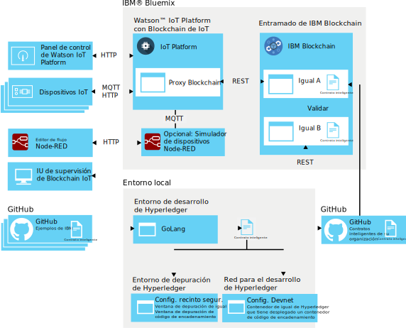

---

copyright:
  years: 2016, 2017
lastupdated: "2017-03-14"

---

{:new_window: target="\_blank"}
{:shortdesc: .shortdesc}
{:screen: .screen}
{:codeblock: .codeblock}
{:pre: .pre}


# Desarrollo de contratos inteligentes para la integración de blockchain de {{site.data.keyword.iot_short_notm}}
{: #iotblockchain_link}

Utilice {{site.data.keyword.blockchainfull}} y el entorno de desarrollo de Hyperledger para crear y probar sus propios contratos inteligentes que derivan de contratos de ejemplo proporcionados por IBM.
{:shortdesc}

Desarrolle y despliegue los contratos inteligentes en forma de ejecutables de chaincode Golang. Utilice la integración de blockchain de {{site.data.keyword.iot_short_notm}} para desencadenar las actualizaciones de contratos y la ejecución lógica de negocio con datos de sucesos de dispositivos y grabe un nuevo estado de libro mayor en el blockchain para cada transacción.

Un entorno de desarrollo de integración de blockchain de {{site.data.keyword.iot_short_notm}} consta de los componentes siguientes:

- Organización de {{site.data.keyword.Bluemix_notm}}:
  - Servicio de {{site.data.keyword.iot_short_notm}} con la integración de blockchain de IoT habilitada
  - Entramado de {{site.data.keyword.blockchainfull_notm}}
  - Aplicación Node-RED que ejecuta el simulador de dispositivos de IoT  

**Nota:** También puede utilizar un entorno de Node-RED desplegado de forma local para ejecutar el simulador.

- Entorno local:
  - Entorno de desarrollo de hyperledger para desarrollar y probar el chaincode de contrato inteligente. El entorno incluye GoLang.
  - IU de supervisión de blockchain
- Entorno de GitHub:
  - Repositorio de GitHub proporcionado por IBM para los contratos inteligentes de ejemplo
  - Repositorio de GitHub para desplegar contratos inteligentes en el entramado de {{site.data.keyword.blockchainfull_notm}}

El diagrama siguiente ilustra el entorno de desarrollo de integración de blockchain de {{site.data.keyword.iot_short_notm}}:


## Antes de empezar

{: #byb}

Obtenga una visión general de {{site.data.keyword.blockchainfull_notm}}, de cómo se relaciona con el concepto de blockchain general, y de lo que puede hacer por usted:
- [{{site.data.keyword.blockchainfull_notm}} ](http://www.ibm.com/blockchain/){: new_window} en IBM.com.
- [DOCS de {{site.data.keyword.blockchainfull_notm}}](https://console.ng.bluemix.net/docs/services/blockchain/index.html): Iniciación al servicio de {{site.data.keyword.blockchainfull_notm}}.
- [Documentación de SDK para Node.js de HFC {{site.data.keyword.blockchainfull_notm}} con API ](https://github.com/hyperledger/fabric/tree/v0.6/docs/API){: new_window}: Una visión general de la API de {{site.data.keyword.blockchainfull_notm}}.
- [{{site.data.keyword.blockchainfull_notm}} para desarrolladores ](http://www.ibm.com/blockchain/for_developers.html){: new_window}: Una visión general de cómo blockchain se adapta a su entorno de desarrollo que incluye recorridos con código y demostraciones en directo que se despliegan para ejecutarse en  {{site.data.keyword.Bluemix_notm}}.

## Contratos inteligentes de muestra

{: #samples}

Hay disponibles varios contratos de ejemplo para su descarga desde [https://github.com/ibm-watson-iot/blockchain-samples ](https://github.com/ibm-watson-iot/blockchain-samples){: new_window}. Puede utilizar los contratos de ejemplo como base para desarrollar sus propios casos de uso en el chaincode desplegable:

|Contrato de ejemplo |Descripción |
|:---|:---|
|[Basic: Simple Contract ](https://github.com/ibm-watson-iot/blockchain-samples/tree/master/contracts/basic/simple_contract){: new_window} | Una versión simplificada del contrato avanzado que le permite realizar un seguimiento y almacenar los datos de activos de dispositivos en el blockchain
|[Advanced: IoT Generic Sample Contract ](https://github.com/ibm-watson-iot/blockchain-samples/tree/master/contracts/advanced/iot_sample_contract){: new_window} | Un contrato de ejemplo avanzado con muchas características y un toque de **ruta comercial** en su modelo y comportamiento de datos|


## Configure el entorno de {{site.data.keyword.blockchainfull_notm}}

{: #configure_environment}
Antes de empezar a desplegar y probar los contratos inteligentes, debe configurar su propio entorno de blockchain.

**Nota:** La integración de blockchain de {{site.data.keyword.iot_short_notm}} da soporte a la conexión a los entramados de {{site.data.keyword.blockchainfull_notm}} y de Hyperledger. Los ejemplos siguientes se basan en el uso de {{site.data.keyword.blockchainfull_notm}}.

1. Cree y configure el entramado de {{site.data.keyword.blockchainfull_notm}}.
La integración de blockchain de {{site.data.keyword.iot_short_notm}} requiere que el entramado de {{site.data.keyword.blockchainfull_notm}} gestione el libro mayor de blockchain, los contratos inteligentes y la infraestructura de blockchain general. La integración de blockchain de {{site.data.keyword.Bluemix_notm}} utiliza {{site.data.keyword.blockchainfull_notm}} para gestionar las cadenas. Si tiene acceso a un entorno de {{site.data.keyword.blockchainfull_notm}} existente, puede utilizarlo. Si no, debe crear una instancia de {{site.data.keyword.blockchainfull_notm}} desde el [catálogo](https://console.ng.bluemix.net/catalog/services/blockchain/) de {{site.data.keyword.Bluemix_notm}}.

  1. Desde el panel de control de cuentas de {{site.data.keyword.Bluemix_notm}}, pulse **Utilizar servicios o API**.
  2. Localice la sección Servicios de aplicación del catálogo de servicio y seleccione **Blockchain**.  
   **Consejo:** Pulse [aquí](https://console.ng.bluemix.net/catalog/services/blockchain/) para ir directamente a la página de servicio de {{site.data.keyword.blockchainfull_notm}}.
  3. En la página de servicio de {{site.data.keyword.blockchainfull_notm}}, verifique las selecciones de Añadir servicio:  
    - Espacio: Si tiene más espacio del `dev` predeterminado, verifique que está desplegando el servicio en el espacio previsto.
    - App: Dejar sin enlazar.
    - Nombre de servicio: Opcionalmente, cambie el nombre de servicio a algo que sea fácil de recordar. Este nombre se muestra en el mosaico {{site.data.keyword.blockchainfull_notm}} del panel de control de {{site.data.keyword.Bluemix_notm}}.
    - Plan seleccionado: Seleccione el plan gratuito. El plan gratuito proporciona dos iguales de validación y una entidad emisora de certificados.
  4. Pulse **Crear** para desplegar {{site.data.keyword.blockchainfull_notm}} en {{site.data.keyword.Bluemix_notm}}.  
  El blockchain se despliega con dos nodos iguales inicialmente. Puede añadir más nodos según sea necesario.

4. Enlace {{site.data.keyword.iot_short_notm}} al servicio {{site.data.keyword.blockchainfull_notm}}  
    Para grabar en blockchain desde {{site.data.keyword.iot_short_notm}}, primero debe enlazar los servicios.
     1. En {{site.data.keyword.Bluemix_notm}}, vaya al Panel de control.
     2. Seleccione el espacio en el que ha desplegado {{site.data.keyword.blockchainfull_notm}}.
     3. Pulse el enlace **Blockchain** en **Servicios**.
     4. Pulse el separador **Credenciales de servicio**.
     5. Seleccione un conjunto de credenciales de servicio o pulse **Nueva credencial** para crear un nuevo conjunto de credenciales de servicio y para proporcionarles un nombre descriptivo, como por ejemplo "IoT-Platform-integration".
     6. En las credenciales de servicio formateadas por JSON, tome nota de los parámetros siguientes:  
      - Información de iguales: `api_host` y `api_port_tls`
      - Información de usuario de tipo 1 (cliente): `username` y `secret`  

      Ejemplo de credenciales de servicio:
     ```json
     {
      "peers": [
      {
        "discovery_host": "fa68cbcbfcec4726932e53e2fa4f3afc-vp0.us.blockchain.ibm.com",
        "discovery_port": 30003,
        "api_host": "fa68cbcbfcec4726932e53e2fa4f3afc-vp0.us.blockchain.ibm.com",
        "api_port_tls": 5003,
        "api_port": 5003,
        "event_host": "fa68cbcbfcec4726932e53e2fa4f3afc-vp0.us.blockchain.ibm.com",
        "event_port": 31003,
        "type": "peer",
        "network_id": "fa68cbcbfcec4726932e53e2fa4f3afc",
        "container_id": "e33f08f85988bf57ccfcf34ccdb80d72489e5bfb46786b570e1a74a6679f804e",
        "id": "fa68cbcbfcec4726932e53e2fa4f3afc-vp0",
        "api_url": "http://fa68cbcbfcec4726932e53e2fa4f3afc-vp0.us.blockchain.ibm.com:5003"
    },
       ...
      ],
      "users": [
      {
        "enrollId": "user_type1_0",
        "enrollSecret": "63c58806d6",
        "affiliation": "group1",
        "username": "user_type1_0",
        "secret": "63c58806d6"
      },
       ...
       ]
      }
     }
     ```  
     **Importante:** El usuario que ha seleccionado no debe estar registrado previamente con un igual distinto al igual seleccionado.
     7. Pulse **Volver al Panel de control** para volver al panel de instrumentos de {{site.data.keyword.Bluemix_notm}}.
     8. Seleccione el espacio en el que ha desplegado {{site.data.keyword.iot_short_notm}}.
     9. Pulse el enlace **{{site.data.keyword.iot_short_notm}}** en **Servicios**.
     10. Pulse **Launch** para abrir el panel de control de {{site.data.keyword.iot_short_notm}}.
     11. En el panel de control de {{site.data.keyword.iot_short_notm}}, seleccione **Extensiones** en la barra lateral del menú.
     12. En la página **Extensiones**, en el mosaico de Blockchain, pulse **Configuración** o pulse  si ya tiene estructuras enlazadas.
     13. En la sección Configurar blockchain, pulse **Añadir estructura** y escriba la información de la infraestructura.
    **Nota:** La integración de blockchain debe estar habilitada para añadir entramados. Para obtener más información, consulte [Blockchain](../reference/extensions/index.html#blockchain) en el tema Integraciones de servicio externas.
    1. En el separador **Estructura**, escriba un nombre que identifique la estructura en {{site.data.keyword.iot_short_notm}} y pulse **Siguiente**.   
    2. En el separador **Similar**, especifique la información del similar:  
   <table>
   <thead>
   <tr>
   <th>Parámetro</th>
   <th>Valor</th>
   </tr>
   </thead>
   <tbody>
   <tr>
   <td>Nombre</td>
   <td>Especifique un nombre para identificar el similar en {{site.data.keyword.iot_short_notm}}.</td>
   </tr>
   <tr>
   <td>Host</td>
   <td>La dirección `api_host` para el servidor Validating Peer 1</td>
   </tr>
   <tr>
   <td>Puerto</td>
   <td>El número `api_port_tls`</td>
   </tr>
   <tr>
   <td>ID de usuario</td>
   <td>La serie `nombre de usuario` para el usuario utilizado para registrar el contrato inteligente con el blockchain. También puede utilizar este ID de usuario al configurar posteriormente la IU simple.</td>
   </tr>
   <tr>
   <td>Clave secreta</td>
   <td>La serie `secreta` para el usuario</td>
   </tr>
   <tr>
   <td>Utilizar TLS</td>
   <td>Encendido o Apagado</br>Utilice Transport Layer Security para cifrar la comunicación entre {{site.data.keyword.iot_short_notm}} y el contrato en el entramado. TLS debe estar habilitado al conectarse a un entramado {{site.data.keyword.blockchainfull_notm}}.</td>
   </tr></tbody>
   </table>  
    3. Pulse **Finalizar**.
     3. En la sección Configurar blockchain, pulse **Listo** para guardar la información de la infraestructura.    

La tabla de la estructura se llena con la nueva conexión de estructura.  

## Crear, probar y desplegar los contratos inteligentes
{: #test_contracts}

Ahora puede crear su propio chaincode de contrato inteligente en GoLang, probarlo en el entorno de recinto de pruebas y desplegarlo y probarlo en su propio entramado de {{site.data.keyword.blockchainfull_notm}}.

1. Crear un proyecto de GitHub para almacenar su chaincode de contrato inteligente.  
Los contratos inteligentes que desea desplegar deben estar en un repositorio público de GitHub. Para obtener más información, consulte https://github.com/.
2.  Configurar un entorno de desarrollo de Hyperledger local y un entorno de pruebas.  
Para desarrollar y probar su propio chaincode antes de desplegarlo en {{site.data.keyword.blockchainfull_notm}}, debe configurar un entorno de desarrollo local. Este entorno incluye GoLang, que se utiliza para grabar el chaincode para los contratos.
 1. Configurar el entorno de desarrollo.  
 El entorno de desarrollo incluye las herramientas que necesita para desarrollar los contratos inteligentes utilizando la compilación de chaincode en GoLang. Para obtener más información, consulte [Setting up the development environment ]( https://github.com/hyperledger/fabric/blob/master/docs/source/dev-setup/devenv.rst){: new_window} en la documentación de Hyperledger.
 2. Instalar un entorno de depuración de chaincode.   
 El entorno de depuración le proporciona las herramientas necesarias para probar y depurar los contratos inteligentes antes de desplegarlos en {{site.data.keyword.blockchainfull_notm}}. Para obtener más información, consulte [Writing, Building, and Running Chaincode in a Development Environment ](https://github.com/hyperledger/fabric/blob/master/docs/source/Setup/Chaincode-setup.rst){: new_window} en la documentación de Hyperledger.
 3. Configurar una red para el desarrollo.   
 La red para el desarrollo le proporciona un entorno más estricto, de producción, para la prueba final de los contratos inteligentes.  Utilice este entorno para la prueba final de los contratos probados y depurados antes de desplegarlos en {{site.data.keyword.blockchainfull_notm}}. Para obtener más información, consulte [Setting Up a Network ](https://github.com/hyperledger/fabric/blob/master/docs/source/Setup/Network-setup.rst){: new_window} en la documentación de Hyperledger.

3. Opcional: Descargar los contratos inteligentes de ejemplo proporcionados por IBM.  
IBM proporciona varios contratos inteligentes que puede descargar y utilizar directamente tal cual o modificarlos para que se ajusten a los objetivos de su organización.  
Para descargar los contratos de ejemplo:
 1. Vaya al repositorio Blockchain Samples GitHub en: https://github.com/ibm-watson-iot/blockchain-samples/  
 Las carpetas basic_contract_hyperledger y trade_lane_contract_hyperledger contienen, respectivamente, los contratos básicos y de rutas comerciales.
 3. Utilice `git clone` en el terminal para clonar el proyecto https://github.com/ibm-watson-iot/blockchain-samples.  
 **Consejo:** También puede descargar un archivo comprimido del proyecto pulsando **Descargar ZIP** desde la página del proyecto.

6. Crear y probar un contrato inteligente.   
 Al utilizar la integración de blockchain de {{site.data.keyword.iot_short_notm}}, puede cargar contratos inteligentes en la forma de ejecutables de chaincode en {{site.data.keyword.blockchainfull_notm}} para ejecutar la lógica empresarial en los datos de dispositivo que se graban en el blockchain. El chaincode de contrato inteligente está desarrollado en GoLang.  
 El contrato de ejemplo se centra en la grabación de datos de dispositivos de IoT para los sucesos de interés en un blockchain para compartir con terceros o para crear entradas de registro resistentes.
2. Crear los ejecutables de contrato.  
  El código de contrato se debe convertir en un ejecutable para poder desplegarlo en el blockchain.  
  **Nota:** El contrato de ejemplo (sample_contract_hyperledger) ya está generado y se puede desplegar tal cual.  
  Complete los pasos siguientes:
   1. Abra la línea de mandatos y vaya a la carpeta del contrato.
   2. Ejecute el mandato `go generate`.  
   Este mandato ejecuta cualquier mandato ‘go generate’ que exista en el código. Go generate es una herramienta del programa go que permite la generación de código de precompilación. En los contratos de ejemplo proporcionados por IBM, go generate se utiliza para crear el archivo schemas.go que describe el esquema del contrato y el archivo de contrato sample.go.  
   **Importante:** El archivo schemas.go es un componente crítico de la integración de blockchain de {{site.data.keyword.iot_short_notm}}. El archivo permite a la plataforma confirmar que el contrato cumple con la especificación de integración y permite al correlacionador ver la API de contrato a la que se pueden correlacionar los sucesos del dispositivo.
   2. Ejecute el mandato `go build`.  
   Este mandato crea un ejecutable con el mismo nombre que el nombre de la carpeta. El archivo es el ejecutable del contrato que se desplegará en el blockchain.

6. Probar el contrato inteligente en el recinto de pruebas de Hyperledger.  
  Antes de desplegar el contrato inteligente finalizado en {{site.data.keyword.blockchainfull_notm}}, puede probar y depurar el chaincode en el recinto de pruebas de Hyperledger que ha instalado como parte del entorno de desarrollo.  

6. Despliegue el chaincode del contrato inteligente en {{site.data.keyword.blockchainfull_notm}}.  
 Después de probar y verificar el contrato de forma local, puede desplegarlo en el entramado de {{site.data.keyword.blockchainfull_notm}} a probar.
  1. Cargue el contrato en el repositorio de GitHub público.  
  Por ejemplo, cargue el archivo sample.go en:  
  `http://github.com/{my organization}/{my project}/`
  2. Registre el contrato con el igual al que se ha conectado anteriormente.  
  Utilice un cliente REST como CURL o Postman para enviar la llamada de registro. Para obtener más información sobre la llamada de registro, consulte la [documentación de la API de registrador POST ](https://github.com/hyperledger/fabric/blob/v0.6/docs/API/CoreAPI.md#registrar){: new_window}. Utilice la siguiente información al registrarse:
  <ul>
  <li>URL: `http://api_host:api_port_tls/registrar`
  <li>Type: POST
  <li>Header: `Content type: application/json`
  <li>Payload:  
  ```json
   {  
        "enrollId": "{username}",      
        "enrollSecret": "{secret}"    
   }
   ```

  </ul>
  3. Despliegue el contrato en el igual.  
Para obtener más información sobre la llamada de despliegue, consulte la [documentación de la API POST/chaincode ](https://github.com/hyperledger/fabric/blob/v0.6/docs/API/CoreAPI.md#chaincode){: new_window}.  
  Utilice la siguiente información al desplegar:  
  <ul>
  <li>URL: `http://api_host:api_port_tls/chaincode`
  <li>Type: POST
  <li>Header: `Accept: application/json`
  <li>Header: `Content type:  application/json`
  <li>Payload:  
  ```
  {
    "jsonrpc": "2.0",
    "method": "deploy",
    "params": {
        "type": 1,
        "chaincodeID":{
              "path": "http://github.com/{my organization}/{my project}/sample.go"
        },
        "ctorMsg": {
            "function":"init",
            "args":["{\"version\":\"1.0\",\"nickname\":\"sample_contract\"}"]
        },
        "secureContext": "username"
    },
    "id":1234
}
  ```  
  </ul>  
  Su contrato se despliega en el entramado.  
  **Importante:** Anote el ID de contrato devuelto, que se encuentra en el formato de serie alfanumérica de 128 caracteres. Necesita el ID de contrato para correlacionar dispositivos en el contrato.  

10. Correlacionar los datos de dispositivos en el nuevo contrato inteligente.  
  Para empezar a grabar datos de dispositivos en los nuevos contratos inteligentes de blockchain, en primer lugar debe correlacionar datos de dispositivos en los contratos.  
   1. En {{site.data.keyword.Bluemix_notm}}, vaya al Panel de control.
   2. Seleccione el espacio en el que ha desplegado {{site.data.keyword.iot_short_notm}}.
   3. Pulse el servicio **{{site.data.keyword.iot_short_notm}}**.
   4. Pulse **Launch** para abrir el panel de control de {{site.data.keyword.iot_short_notm}}.
   5. Seleccione **Blockchain** pulsando  en la barra lateral del menú.
   6. Pulse **Correlacionar datos de dispositivo**.
   7. Seleccione el tipo de dispositivo para el que desea almacenar datos de dispositivos en el blockchain y el nombre de suceso para los sucesos que desea almacenar. Pulse **Siguiente**.
   8. Seleccione el nombre de entramado para el entramado que ha creado anteriormente. Pulse **Siguiente**.
   9. Escriba la información siguiente y haga clic en **Siguiente**:
     - ID de contrato: Pegar en el ID de contrato de 128 caracteres que ha guardado al desplegar el contrato.
     - Nombre de contrato: Especifique un nombre para identificar el contrato en {{site.data.keyword.iot_short_notm}}.

     **Consejo:** Para encontrar los tipos de sucesos para un dispositivo, vaya a la página **Dispositivos** y pulse el nombre de la imagen para abrir la página de detalles de dispositivos. Desplácese hacia abajo en la sección **Información de sensor** para ver una lista de los sucesos y de los puntos de datos disponibles para el dispositivo.

   11. Correlacionar las propiedades de dispositivos disponibles en los parámetros de contratos.   
   **Importante:** Verifique que el tipo de datos para cada punto de datos que correlacione se corresponda con el tipo de datos necesario por el parámetro de contrato al que lo correlaciona.  
   Por ejemplo, una propiedad de contrato como un Asset ID del tipo serie debe estar correlacionada con una propiedad del tipo serie. Los requisitos del parámetro de contrato se definen en las definiciones de `type` del go-code del contrato.  
   Por ejemplo, el contrato básico proporcionado por IBM tiene los siguientes requisitos de parámetro de contrato:  
    <ul>
    <li>  AssetID: serie
    <li>  Ubicación: Geoubicación  
    <ul>
    <li> Latitud: float64
    <li>  Longitud: float64
    </ul>
    <li>  Temperatura: float64  
    <li>  Transportista: serie   
    </ul>  
Para obtener más información sobre cómo correlacionar datos de dispositivos en contratos, consulte el [Ejemplo de correlación de datos ](https://github.com/ibm-watson-iot/blockchain-samples/wiki/Data-mapping-example){: new_window} en la wiki de ejemplos de IoT Blockchain en GitHub.
   12. En la página de resumen, verifique que la información es correcta.
   13. Los datos de dispositivos para la correlación de contrato se muestran en la página Blockchain.

7. Pruebe el contrato inteligente en {{site.data.keyword.blockchainfull_notm}}.  
Para probar el contrato inteligente, realice una prueba completa creando un dispositivo en {{site.data.keyword.iot_short_notm}}, conectando el dispositivo a {{site.data.keyword.iot_short_notm}}, configurando IoT Blockchain para conectarse al entramado de blockchain, y configurando {{site.data.keyword.iot_short_notm}} para correlacionar y almacenar los mensajes de dispositivos en el blockchain. Al utilizar la consola de {{site.data.keyword.blockchainfull_notm}}, puede ver el blockchain para ver los datos del dispositivo del libro mayor. Si el contrato da soporte a la función readAsset(), puede utilizar el IU de supervisión para ver el blockchain y ver los datos de dispositivo desde su propio caso de ejemplo almacenado de forma indeleble en un blockchain.

5. Configurar la IU de supervisión para conectarse a {{site.data.keyword.blockchainfull_notm}}.  
 **Consejo:** Si no tiene instalado el IU de supervisión en el entorno local, puede hacerlo ahora. Siga las instrucciones del documento readme de IU de supervisión que está disponible en el directorio de GitHub de [IU de supervisión de blockchain ](https://github.com/ibm-watson-iot/blockchain-samples/tree/master/applications/monitoring_ui){: new_window}.  
 Acceda a los valores de configuración pulsando el botón **CONFIGURATION**.   
 Utilice la siguiente información para conectarse a un contrato:
<table>
<thead>
<tr>
<th>Parámetro</th>
<th>Valor</th>
<th>Comentario</th>
</tr>
</thead>
<tbody>
<tr>
<td>Host y puerto de API</td>
<td>`http://peer_URL:port`</td>
<td>El host y el puerto para la API REST de {{site.data.keyword.blockchainfull_notm}}, que se antepone con `https://`. Utilice la dirección `api_host` y el número `api_port_tls`. </td>
</tr>
<tr>
<td>ID de Chaincode</td>
<td>El ID de contrato que se ha devuelto al registrar el contrato.</td>
<td>El ID de contrato es una serie alfanumérica de 128 caracteres que se corresponde con la entrada de ID de contrato.  
**Importante:** Al cortar y pegar el ID de contrato, asegúrese de que no se incluyan espacios en el ID. Si el ID está especificado de forma incorrecta, se visualizarán las entradas del libro mayor de blockchain, pero la función de búsqueda de activos no funciona.
</td>
</tr>
<tr>
<td>Contexto seguro</td>
<td>El usuario del entramado</td>
<td>Este parámetro es necesario para conectarse a instancias de {{site.data.keyword.blockchainfull_notm}} en {{site.data.keyword.Bluemix_notm}}. Utilice la entrada `secureContext`.  
**Importante:** El secureContext debería ser el `nombre de usuario` que ha utilizado para configurar el entramado.
</td>
</tr>
<tr>
<td>Número de bloques a visualizar</td>
<td>Un entero positivo. Valor predeterminado: 10</td>
<td>El número de bloques de blockchain a visualizar.
</td>
</tr>
</tbody>
</table>

3. En la IU de supervisión, verifique que su configuración funcione según lo previsto.  
Utilice los componentes de IU de supervisión para interactuar con el contrato de blockchain:  
 - Operaciones de chaincode  
 Verifique que las operaciones de chaincode específicas del contrato se puedan ejecutar según lo previsto. Por ejemplo, para el contrato Básico, verifique que la ejecución de una función `createAsset` da como resultado que se añada un activo al blockchain.
 - Cargas útiles de respuesta  
 Verifique que las respuestas de solicitud de iguales aparezcan según lo previsto al enviar solicitudes REST desde el separador Operaciones de chaincode.
 - Blockchain  
Verifique que se añaden los bloques a la cadena al inyectar datos desde un dispositivo enlazado o al utilizar el componente Operaciones de chaincode.    

## Pasos siguientes
{: #next_steps}

Ahora ha desplegado y explorado los contratos inteligentes de ejemplo proporcionados por IBM. Sin embargo, los contratos básicos y de rutas comerciales proporcionan ejemplos limitados de las muchas posibilidades que abre el chaincode de contrato inteligente bien diseñado. Ahora es el momento de experimentar y correlacionar los casos de ejemplo empresariales en contratos de chaincode en {{site.data.keyword.blockchainfull_notm}}. Ahora puede utilizar {{site.data.keyword.iot_short_notm}} con la integración de blockchain de IoT para grabar datos de dispositivo en el libro mayor de blockchain y ejecutar la lógica empresarial almacenada como contratos inteligentes en respuesta a los datos.     


Disfrute del blockchaining.
