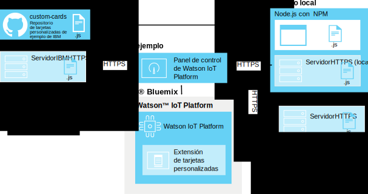

---

copyright:
  years: 2016, 2017
lastupdated: "2016-10-13"

---

{:new_window: target="\_blank"}
{:shortdesc: .shortdesc}
{:screen: .screen}
{:codeblock: .codeblock}
{:pre: .pre}

# Tarjetas personalizadas
{: #custom_cards}

Utilice tarjetas personalizadas para visualizar sus datos de Internet of Things más allá de las tarjetas genéricas que se proporcionan con {{site.data.keyword.iot_full}}.
{:shortdesc}

## Arquitectura
{: #architecture}  

Las tarjetas personalizadas las ha desarrollado usted y se han desplegado utilizando su propio repositorio de servidor HTTP de tarjetas personalizadas.  Se puede acceder a este servidor mediante el navegador de un usuario como se muestra y procesa paneles de control de {{site.data.keyword.iot_short_notm}}. {{site.data.keyword.iot_short_notm}} gestiona la conexión del navegador mediante la ampliación de las tarjetas personalizadas pero no se conecta él mismo al servidor de tarjetas personalizado.

El navegador que está ejecutando paneles de control de {{site.data.keyword.iot_short_notm}} recupera todos los recursos necesarios directamente del servidor de tarjetas personalizado. Las tarjetas personalizadas se ofrecen en el diálogo “Añadir tarjeta” y se visualizan en los paneles creados por el usuario que los usuarios han configurado.

Para habilitar el control de versiones centralizado mediante el servidor de tarjetas, el código de tarjeta personalizada no se almacena en la memoria caché en el lado del cliente. Si una tarjeta personalizada ya no está disponible o si no se puede llegar al servidor de tarjetas, se utilizará un marcador de posición para mantener un diseño de panel de control coherente.

**Consejo:** Para probar la característica de tarjetas personalizadas sin definir su propio entorno de desarrollo, puede conectarse al servidor de tarjetas personalizadas de ejemplo proporcionado por IBM en: `https://customcards.mybluemix.net`

Para compilar las tarjetas, debe configurar un entorno de desarrollo local basado en node.js e importar tarjetas de ejemplo desde el repositorio GitHub de tarjetas personalizadas proporcionado por IBM. Después de crear sus tarjetas, despliegue el paquete de tarjetas en un servidor web seguro (HTTPS) y, a continuación, enlace la extensión de tarjetas personalizadas a {{site.data.keyword.iot_short_notm}}.   

**Consejo:** Puede utilizar el servidor web node.js incorporado para la prueba inicial y la resolución de problemas de sus tarjetas, pero debe utilizar un servidor web seguro y bien administrado para cualquier despliegue de producción de sus tarjetas.

 

## Seguridad
{: #security}

No hay restricciones colocadas en el código JavaScript que pueda elegir para desplegar en las tarjetas del servidor de tarjetas personalizado. El código Javascript en las tarjetas personalizadas tiene acceso a toda la información guardada en el navegador, como cualquier otra tarjeta que se ejecute en el panel de control.  Asegúrese de que el servidor de tarjetas personalizadas correcto facilite el código al navegador para mostrar y procesar las tarjetas personalizadas.

Las tarjetas ejecutan su código en la sesión del navegador {{site.data.keyword.iot_short_notm}} exactamente como se ha escrito. Además, se crea la conexión del servidor de tarjetas personalizadas sin credenciales proporcionadas al servidor de tarjetas personalizado. Un navegador de usuarios puede conectarse a cualquier servidor de tarjetas personalizadas configurado.

Es importante que sólo configure los servidores de tarjetas personalizadas protegidos y conocidos para facilitar tarjetas personalizadas a los paneles de control de los usuarios.   

Para obtener más información sobre cómo proteger el servidor de tarjetas personalizado, consulte [Seguridad de tarjetas personalizadas](../reference/security/custom_cards_server.html).

Los pasos siguientes le guían a través del proceso de conectarse a un servidor de tarjetas de prueba, desplegando las tarjetas de ejemplo en su propio servidor de tarjetas y, finalmente, creando sus propias tarjetas y desplegándolas en el servidor.

## Paso 1: Conectar {{site.data.keyword.iot_short_notm}} al servidor de tarjetas de ejemplo.
{: #connect-to-sample}  

Para probar la característica de tarjetas personalizadas con el {{site.data.keyword.iot_short_notm}}, puede conectarse al servidor de tarjetas personalizadas de ejemplo. El servidor de ejemplo contiene un conjunto de tarjetas genéricas que también están disponibles como plantillas para la creación de sus propias tarjetas.

Para conectarse al servidor de tarjetas personalizadas de ejemplo:
1. Inicie sesión en el panel de control de {{site.data.keyword.iot_short_notm}} como usuario administrativo.
2. Habilite las características experimentales.  
Las tarjetas personalizadas se ofrecen actualmente como una característica experimental.  
**Importante:** La extensión de tarjetas personalizadas experimental debe estar habilitada por sesión de navegador. Las conexiones de tarjetas personalizadas y los paquetes de tarjetas no se comparten globalmente en la organización de {{site.data.keyword.iot_short_notm}}.
 1. Vaya a **Configuración**.
 2. En la sección Características experimentales, verifique que **Activar características experimentales** esté habilitado.
2. Conéctese al servidor de ejemplo.
 2. Vaya a **Extensiones**.
 3. Pulse **Añadir extensión** y seleccione la extensión **Tarjetas personalizadas**.
 4. En el mosaico **Tarjeta personalizada**, pulse **Configuración**.
 5. En la sección Configurar tarjetas personalizadas, pulse **Añadir** y especifique el URL seguro (HTTPS) para el servidor de tarjetas de ejemplo en el campo de servidor.  
Si se está conectando a su propio servidor, especifique el URL de dicho servidor.    
**Consejo:** El URL del servidor de tarjetas de ejemplo de IBM es: `https://customcards.mybluemix.net`  
 6. Pulse **Recuperar certificado** para conectarse al servidor de tarjetas personalizadas y recuperar la información de certificados de seguridad para el servidor.  
 **Importante:** Utilice la información de certificado para verificar que se está conectando al servidor de tarjetas personalizadas protegido y conocido.
 4. Pulse **Terminado** para añadir la conexión del servidor.
5. Cree una tarjeta nueva que se base en las tarjetas de ejemplo.
 1. En el panel de control de {{site.data.keyword.iot_short_notm}}, vaya a **Paneles**.
 2. Pulse **Crear nuevo panel**.  
 Complete el recuadro de diálogo Crear nuevo panel. Para obtener información, consulte [Creación de paneles y tarjetas](../data_visualization.html#visualizing_data).
 3. Abra el panel nuevo.
 4. Pulse **Añadir nueva tarjeta**.  
 5. Desplácese hacia abajo hasta **Tarjetas personalizadas** y seleccione una de las tarjetas de ejemplo.  
 Complete el proceso de creación de tarjetas. Para obtener información, consulte [Creación de paneles y tarjetas](../data_visualization.html#visualizing_data).  

 Su nueva tarjeta personalizada se encuentra ahora en el nuevo panel.  
 

Enhorabuena, se ha conectado a un servidor de tarjetas personalizadas y ha añadido una tarjeta personalizada a uno de los paneles. El paso siguiente consiste en configurar su propio servidor de tarjetas y crear su primera tarjeta utilizando la tarjeta de ejemplo HelloWorld.

## Paso 2: Configure un servidor de tarjetas y despliegue la tarjeta de ejemplo HelloWorld.
{: #create-hello-world}

Para prepararse para el desarrollo de tarjetas personalizadas, puede configurar el entorno de desarrollo de tarjetas personalizadas local y probar el despliegue de la tarjeta de ejemplo HelloWorld.

Para crear un servidor de tarjetas personalizado y desplegar las tarjetas de ejemplo de IBM, siga las instrucciones detalladas en el readme [repositorio de tarjetas personalizadas](https://github.com/ibm-watson-iot/custom-cards/blob/master/README.md).

El proceso implica los siguientes pasos de alto nivel:
1. Asegúrese de que el entorno de desarrollo local tenga Node.js con el gestor de paquetes de nodo npm.  
Para obtener información sobre la instalación de Node.js, incluidos los enlaces de descarga, vaya aquí: https://nodejs.org
2. Configure un servidor HTTP para que aloje el paquete de tarjetas personalizado.    
  - El directorio que sirve el contenido de tarjetas personalizadas en el servidor no debe requerir credenciales para acceder.
  - El servidor debe utilizar el protocolo HTTPS.
  - El servidor debe soportar conexiones CORS (Cross-Origin Resource Sharing).  
**Consejo:** Para la prueba del trabajo de concepto, puede utilizar el servidor node.js de ejemplo incorporado, que se configura para cumplir estos requisitos.
3. Cree su propio repositorio.
Bifurque y clone el repositorio de tarjetas personalizadas de ejemplo en: https://github.com/ibm-watson-iot/custom-cards
4. Cree su propio módulo e infraestructura de tarjetas.
Las tarjetas personalizadas se organizan en módulos. Configure un nuevo módulo de tarjeta HelloWorld.
5. Haga referencia a la nueva tarjeta.
Su paquete de tarjetas personalizadas puede contener varios módulos. Debe hacer referencia al nuevo módulo en el archivo de paquete principal.
6. Registre el módulo.
Para hacer que su tarjeta esté disponible en los paneles de la organización de {{site.data.keyword.iot_short_notm}}, debe añadir los detalles de configuración de tarjetas en el archivo `DashboardConfig.json`.
7. Compile el paquete de tarjeta.
Utilice Gulp para configurar un motor de construcción automatizado.
8. Despliegue su paquete de tarjetas en el servidor de tarjetas.  
Para poder utilizar las tarjetas en {{site.data.keyword.iot_short_notm}}, debe desplegar el paquete de tarjetas en el servidor HTTP de las tarjetas personalizadas.  
**Consejo:** Puede añadir nuevas tarjetas o eliminar tarjetas obsoletas sobre la marcha volviendo a desplegar el paquete de tarjetas en el servidor de tarjetas.
9. Enlace el servidor de tarjetas a {{site.data.keyword.iot_short_notm}}.
Enlace el servidor de tarjetas personalizadas recién desplegado a {{site.data.keyword.iot_short_notm}}.  
**Consejo:** Como el servidor de tarjetas personalizadas puede ser una réplica completa del servidor de tarjetas de ejemplo, es posible que vea tarjetas duplicadas en el entorno. Elimine la conexión del servidor de tarjetas de ejemplo para ver sólo las tarjetas del servidor de tarjetas personalizadas.
 1. Vaya a **Extensiones**.
 2. En el mosaico **Tarjeta personalizada**, pulse el icono de engranaje para actualizar la configuración.
 4. En la sección Configurar tarjetas personalizadas, pulse **Añadir** y especifique el URL seguro (HTTPS) para el servidor de tarjetas personalizado en el campo de servidor.  
**Importante:** Verifique que se está conectando al servidor de tarjetas personalizadas protegido y conocido.
4. Pulse **Terminado** para añadir la conexión del servidor.
10. La tarjeta personalizada HelloWorld ahora está disponible para utilizarse con los paneles.

Todo correcto. Ha configurado correctamente un servidor de tarjetas y ha desplegado su primera tarjeta de ejemplo. Felicidades. Sin embargo, toda la idea de las tarjetas personalizadas es permitirle configurar tarjetas y paneles exactamente como las quiere. Es hora de empezar a modificar ejemplos para crear sus propias tarjetas.

## Paso 3: Crear y desplegar sus propias tarjetas personalizadas.
{: #create-your-own-cards}
Después de configurar y verificar la tarjeta HelloWorld, puede expandir las tarjetas personalizadas y crear la suya propia.

El repositorio de la tarjeta personalizada de ejemplo incluye las siguientes tarjetas de ejemplo:
- HelloWorld  
Una tarjeta simple que proporciona un ejemplo Hello World básico.
- Vacía  
Una tarjeta vacía que contiene la infraestructura para una tarjeta. Utilice esta tarjeta como plantilla al crear una tarjeta desde cero.
- Webcam  
Una tarjeta de cámara web simple. Configure la tarjeta con un URL de webcam y establezca la frecuencia de renovación.
- iFrame  
Una tarjeta iFrame básica que puede utilizar para incorporar cualquier página web segura (HTTPS) en su panel.

Los siguientes pasos de alto nivel crean una nueva tarjeta:

**Consejo:** Para ver los pasos detallados, consulte [Readme Creación de tarjetas personalizadas](https://github.com/ibm-watson-iot/custom-cards/blob/master/README.md) en el repositorio de tarjetas personalizadas de ejemplo.
1. Cree su propio módulo de tarjetas.
 1. Utilice uno de los módulos de tarjetas de ejemplo como plantilla para el módulo.
 2. Actualice todas las instancias del nombre del módulo en los nuevos nombres de archivos y contenido de archivos del módulo.  
 Por ejemplo, sustituya `HelloWorld` por el nombre de módulo en todos los nombres de archivo e instancias de contenido de archivo.
2. Haga referencia al módulo nuevo en el archivo Modules.jsx.
3. Registre el nuevo módulo en el archivo DashboardConfig.json.
4. Actualice el código de tarjeta personalizada para que se ajuste a sus necesidades de tarjeta.
4. Compile el paquete de tarjeta.  
En función de su configuración, el proceso de construcción puede ser automático utilizando gulp, o es posible que tenga que desencadenar manualmente una compilación.
3. Despliegue la nueva tarjeta.  
Si está utilizando un servidor de tarjetas personalizadas externo, ahora debe desplegar el paquete en el servidor.  

Ha creado su primera tarjeta personalizada y la ha desplegado en el servidor de tarjetas personalizadas. La tarjeta está ahora disponible para ser utilizada en la organización {{site.data.keyword.iot_short_notm}}.
