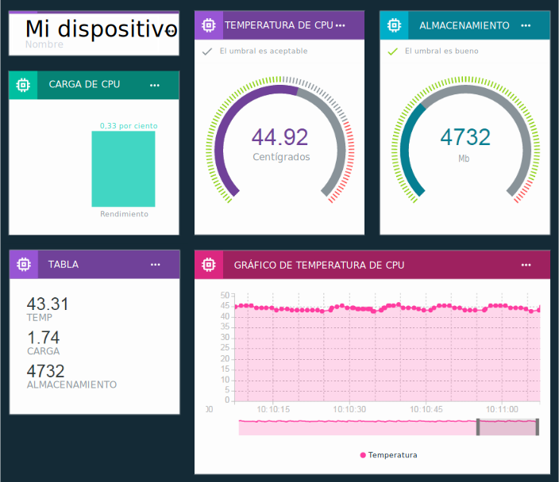

---

copyright:
  years: 2016, 2017
lastupdated: "2017-03-13"

---

{:new_window: target="\_blank"}
{:shortdesc: .shortdesc}
{:screen: .screen}
{:codeblock: .codeblock}
{:pre: .pre}

# Visualización de datos en tiempo real utilizando paneles y tarjetas
{: #boards_and_cards}

Crear tableros y tarjetas para crear y compartir sus propios paneles de instrumentos que visualizan los datos de dispositivo en tiempo real.
{:shortdesc}

Al utilizar los tableros y las tarjetas, puede visualizar gráficamente valores de conjuntos de datos de uno o varios dispositivos para proporcionar una visión general rápida y mejorar la comprensión de los datos. Cree tableros y añada tarjetas que muestren los datos como números en bruto, gráficos en tiempo real, indicadores, etc. Añada miembros a los tableros para compartirlos con otros usuarios de su organización. Organice las tarjetas y añada divisores de texto explicativo para ajustar la presentación.  

También puede expandir el conjunto predeterminado de tarjetas proporcionadas por IBM mediante la [creación de sus propias tarjetas personalizadas](custom_cards/custom-cards.html).

## Paneles predeterminados
{: #default_boards}
El panel de control de {{site.data.keyword.iot_full}} tiene los siguientes tableros predeterminados:

|Nombre del tablero | Descripción |  
|:---|:---|  
|Visión general del uso  | Muestra estadísticas de uso para su organización. Lista tipos de dispositivos y los datos que se consumen.
|Analítica centrada en las reglas | Muestra las reglas para su organización. Las alertas desencadenadas de lista de tarjetas adicionales, los dispositivos asociados, las propiedades de dispositivos y la información de alertas. |  
|Analítica centradas en los dispositivos | Muestra los dispositivos conectados a su organización. Las tarjetas adicionales muestran alertas para un dispositivo seleccionado, información para un dispositivo seleccionado, propiedades de dispositivos e información de alerta. |
|Gestión de riesgos y de seguridad | Muestra tarjetas que resumen el estado general de la seguridad. Las operaciones de sistemas y los analistas de seguridad pueden ver detalles sobre la conformidad, el estado de conexión de dispositivos, las causas de las anomalías de conexión y los dispositivos que están bloqueados o que se permiten mediante una lista negra o una lista blanca.  Desde la tarjeta de conformidad de conexión, el usuario puede acceder a un informe detallado sobre los dispositivos no conformes y puede exportar el informe a Excel. |

Puede actualizar estos tableros añadiendo, actualizando y eliminando tarjetas.

**Consejo:** Para restablecer un tablero predeterminado a su estado original, puede suprimirlo. El tablero se volverá a crear con las tarjetas originales.

## Creación de paneles y tarjetas
{: #visualizing_data}

{{site.data.keyword.iot_short_notm}} proporciona un panel de control incorporado que puede utilizar para visualizar los datos en tiempo real que está devolviendo el dispositivo. De forma predeterminada, la página Visión general muestra información de uso sobre la organización de {{site.data.keyword.iot_short_notm}}, como por ejemplo los datos y el espacio de almacenamiento que se consume. Para ver datos de dispositivos en tiempo real a medida que fluyan, añada tarjetas específicas del dispositivo a esta página.

Para añadir una tarjeta específica de dispositivo a un tablero:
1. En el panel de instrumentos de {{site.data.keyword.iot_short_notm}}, seleccione **Paneles**.
2. Seleccione un panel para el que tenga derechos de edición para crear un nuevo panel.
3. En el panel, pulse **Añadir nueva tarjeta**.
2. En el recuadro Editar tarjeta de visualización genérica, desplácese hacia abajo a la sección Dispositivos.
3. Seleccione un tipo de visualización.
**Consejo:** Seleccione **Visualización genérica** para la configuración básica. Puede cambiar el tipo de tarjeta más adelante.
Pulse **Mostrar más** para obtener la lista completa de tipos de tarjeta.
4.	Seleccione uno o varios orígenes de datos de tarjeta y, a continuación, pulse **Siguiente** para añadir uno o varios conjuntos de datos.
 1.	Otorgue al conjunto de datos un nombre de identificación.
 2. Seleccione un suceso que incluya el punto de datos que desea visualizar.
 3.	Seleccione la propiedad que representa el punto de datos.
 4.	Establezca el tipo, la unidad, la precisión y los valores mínimo y máximo para el punto de datos.  
 Cuando haya terminado, puede pulsar **Nuevo conjunto de datos** para añadir más conjuntos de datos o pulse **Siguiente**.
5.	Seleccione la visualización.  
Seleccione el tipo y el tamaño de visualización que desea utilizar.  Algunos tipos de tarjetas tienen más valores.
<dl>
<dt>Uso</dt>
<dd>
<table>
<thead>
<tr>
<th>Tipo</th>
<th>Datos que se visualizan</th>
</tr>
</thead>
<tbody>
<tr>
<td>Tipos de dispositivos</td>
<td>Un diagrama circular que muestra el número de dispositivos por tipo de dispositivo.</td>
</tr><tr>
<td>Datos transferidos</td>
<td>Las estadísticas de uso para los datos transferidos para su organización.</td>
</tr>
</tbody>
</table>
</dd>
<dt>Básico</dt>
<dd>
<table>
<thead>
<tr>
<th>Tipo</th>
<th>Datos que se visualizan</th>
</tr>
</thead>
<tbody>
<tr>
<td>Separador</td>
<td>Un separador horizontal para estructurar y agrupar tarjetas en el tablero.</td>
</tr>
</tbody>
</table>
</dd>
<dt>Dispositivos</dt>
<dd><table>
<thead>
<tr>
<th>Tipo</th>
<th>Datos que se visualizan</th>
</tr>
</thead>
<tbody>
<tr>
<td>Visualización genérica</td>
<td>El valor de uno o más conjuntos de datos.  **Consejo:** Para ver hasta tres valores de punto de datos en una tabla pequeña, elija el tamaño grande de widgets.  </td>
</tr>
<tr>
<td>Gráfico en tiempo real</td>
<td>Uno o varios conjuntos de datos en un diagrama de desplazamiento en tiempo real. Utilice el menú Valores para establecer el rango y la retención de datos, el aspecto de los gráficos, etc. </td>
</tr>
<tr>
<td>Gráfico de barras</td>
<td>Valores de conjuntos de datos en barras etiquetadas. Utilice el menú Valores para conmutar la dirección de barras horizontales o verticales.</td>
</tr>
<tr>
<td>Diagrama de anillo</td>
<td>Dos o varios conjuntos de datos en una representación circular.</td>
</tr>
<tr>
<td>Valor</td>
<td>El valor original de uno o varios conjuntos de datos.</td>
</tr>
<tr>
<td>Indicador</td>
<td>El valor de un conjunto de datos que se muestra en forma de medidor. Puede configurar la visualización de umbrales para los valores good, fair, y critical del conjunto de datos. Utilice el menú Valores para establecer opcionalmente umbrales de medidor para los rangos de datos lower, middle y upper.  </td>
</tr>
</tbody>
</table>
</dd>
<dt>Análisis</dt>
<dd>
<table>
<thead>
<tr>
<th>Tipo</th>
<th>Datos que se visualizan</th>
</tr>
</thead>
<tbody>
<tr>
<td>Información de dispositivo</td>
<td>Muestra información básica para un único dispositivo.</td>
</tr>
<tr>
<td>Información de alertas</td>
<td>Muestra información básica para una única alerta.</td>
</tr>
<tr>
<td>Lista de dispositivos</td>
<td>Una lista para supervisar varios dispositivos.</td>
</tr>
<tr>
<td>Alertas</td>
<td>Una lista de alertas para un dispositivo.</td>
</tr>
<tr>
<td>Reglas</td>
<td>Una lista de las reglas que tienen alertas.</td>
</tr>
<tr>
<td>Propiedades de dispositivo</td>
<td>Muestra propiedades específicas para uno o más dispositivos.</td>
</tr>
<tr>
<td>Todas las propiedades de dispositivo</td>
<td>Muestra todas las propiedades de uno o más dispositivos.</td>
</tr>
<tr>
<td>Correlación de dispositivo</td>
<td>Muestra la ubicación de varios dispositivos en una lista.</td>
</tr>
</tbody>
</table>
</dd>
</dl>

6. Especifique el origen de datos para la tarjeta.  
Dependiendo del tipo de tarjeta seleccionado, los datos que se visualizan en una tarjeta pueden provenir de un dispositivo o de otra tarjeta. Seleccione un dispositivo específico o una lista de dispositivos o una tarjeta de lista de alertas para el origen de datos y, a continuación, pulse **Siguiente**.
7. Sólo tarjetas de tipo de dispositivos: Añada uno o varios conjuntos de datos a visualizar en la tarjeta.   
 1. Pulse **Conectar conjunto de datos** para añadir una propiedad a visualizar en la tarjeta.
 2. Otorgue un nombre al conjunto de datos.
 3. Escriba o seleccione el suceso para el que se visualizarán propiedades.
 4. Escriba o seleccione la propiedad para mostrar.
 5. Especifique el tipo de la propiedad y, opcionalmente, la unidad del conjunto, la precisión y los valores mínimo y máximo para la propiedad.  
 6. Pulse **Siguiente**.
7. Seleccione el tamaño de presentación.   
Para determinados tipos de tarjeta, puede pulsar **Valores** para configurar detalles de visualización adicionales. Pulse **Siguiente**.
7. Proporcione un título y una descripción para la tarjeta y, opcionalmente, seleccione un esquema de color y pulse **Enviar** para crear la tarjeta.
7.	Finalmente, coloque la tarjeta nueva en el tablero arrastrándola a una buena ubicación.  

Perfecto. Ahora puede ver los datos en tiempo real del dispositivo.

Para ver instrucciones paso a paso sobre cómo visualizar datos de dispositivo en tiempo real, consulte la receta [Configuración de tableros y tarjetas en el nuevo panel de control de Watson IoT ](https://developer.ibm.com/recipes/tutorials/configuring-the-cards-in-the-new-watson-iot-dashboard/){: new_window}.
