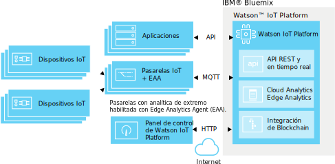

---

copyright:
  years: 2016, 2017
lastupdated: "2017-03-13"

---

{:new_window: target="\_blank"}
{:shortdesc: .shortdesc}
{:screen: .screen}
{:codeblock: .codeblock}
{:pre: .pre}

# Edge Analytics
{: #edge_analytics}

Con las analíticas de extremo, mueva el proceso de desencadenamiento de reglas de analíticas desde la nube a una pasarela habilitada para analíticas de extremo que pueden reducir drásticamente la cantidad de tráfico de datos de dispositivo en la nube haciendo que el proceso de analíticas se cierre en el dispositivo.
{:shortdesk}

Los dispositivos envían sus datos a una pasarela habilitada para analíticas de extremo donde las reglas de analíticas de extremo analizan los datos. En función de la regla y de su acción, los datos esenciales y las alertas se podrían enviar a {{site.data.keyword.iot_full}}, desencadenar una alerta en la pasarela, o grabarse en un archivo de texto local para la pasarela.

El diagrama siguiente ilustra la arquitectura general de un entorno de análisis de extremo de {{site.data.keyword.iot_full}}.

## Antes de empezar
{: #byb}

Para empezar a crear las acciones y las reglas de extremo:
- Asegúrese de que la pasarela esté conectada a {{site.data.keyword.iot_short}} y de que los datos de dispositivos se estén transmitiendo. Consulte [Conexión de pasarelas](gateways/dashboard.html) para obtener más información.
- Instale Edge Analytics Agent (EAA) en la pasarela. Para obtener información, consulte [Instalación de Edge Analytics Agent](gateways/dashboard.html#edge).   **Consejo:** Las pasarelas habilitadas por EAA proporcionan datos de diagnóstico de EAA en forma de mensajes de dispositivos de pasarela. Para obtener información, consulte [Métricas de diagnóstico de Edge Analytics Agent](#eaa_metrics).
- Asegúrese de que las propiedades de dispositivos que desea utilizar como condiciones en las reglas estén correlacionadas con esquemas. Consulte [Conexión de dispositivos](iotplatform_task.html) y [Creación de esquemas](im_schemas.html) para obtener más información.
- Revise las recetas de Edge Analytics  
En nuestro portal de recetas, hay par de recetas que muestran los pasos a seguir para trabajar con IBM Edge Analytics. En las recetas se describe claramente cómo instalar y configurar IBM Edge Analytics Agent en un dispositivo instalado sobre Apache Edgent para ejecutar analíticas sobre un origen de datos IoT.
 - La receta [Iniciación a Edge Analytics en IBM Watson IoT Platform ](https://developer.ibm.com/recipes/tutorials/getting-started-with-edge-analytics-in-watson-iot-platform/){: new_window} es la primera de esta serie. En esta receta se describe cómo configurar Cisco DSA Platform en un sistema portátil y en un dispositivo Raspberry Pi 3, cómo instalar y configurar IBM Edge Analytics Agent para que se conecte a {{site.data.keyword.iot_short}}, cómo instalar System DS Link y cómo configurarlo para que se conecte a Edge Gateway en {{site.data.keyword.iot_short}} como dispositivo conectado, cómo definir y activar la regla de extremo en Edge Gateway y cómo gestionar la regla de extremo desde {{site.data.keyword.iot_short}}.
 - Para ilustrar un caso de uso avanzado de Edge Analytics, la receta [Manejo de alertas y acciones de dispositivo con Edge Analytics en IBM Watson IoT Platform ](https://developer.ibm.com/recipes/tutorials/handling-alerts-and-device-actions-with-edge-analytics-in-ibm-watson-iot-platform/){: new_window} muestra cómo crear su propio enlace DS para transferir datos desde un dispositivo Arduino Uno conectado a un dispositivo Raspberry Pi 3. La receta también muestra cómo filtrar datos y manejar acciones de dispositivos locales como parte de la alerta de regla de extremo.

## Gestión de reglas y acciones de extremo  
{: #managing_rules}

Las reglas de extremo se gestionan utilizando lo siguiente:
- El panel de instrumentos **Reglas** se utiliza para crear y editar las acciones de reglas de extremo y de nube para los dispositivos y las pasarelas.
- El panel **Pasarelas de reglas de extremo** se utiliza para activar, desactivar, actualizar y eliminar una regla de extremo en las pasarelas. Para acceder al panel de instrumentos Pasarelas de reglas de extremo, desde el panel de instrumentos Reglas, pulse **Gestionar regla** para la regla de extremo que desee gestionar. Para obtener más información, consulte [Activación, desactivación y gestión de reglas de extremo para las pasarelas](#manage).

Para obtener una visión general de las reglas y las alertas que se han desencadenado para los dispositivos conectados a la pasarela, utilice los paneles siguientes:

|Nombre del tablero | Descripción |  
 |:---|:---|  
  |Analítica centrada en las reglas | Muestra las reglas para la organización, incluidas las reglas de extremo. Las tarjetas adicionales listan las alertas de extremo reenviadas, los dispositivos asociados, las propiedades de dispositivos y la información de alertas de extremo reenviada. |  
 |Analítica centradas en los dispositivos | Muestra los dispositivos conectados a su organización. Las tarjetas adicionales muestran alertas reenviadas para un dispositivo de extremo seleccionado, información para un dispositivo seleccionado, propiedades de dispositivos e información de alertas reenviada. |

Para obtener más información sobre los paneles de analítica predeterminados, consulte [Visualización de datos en tiempo real utilizando paneles y tarjetas](data_visualization.html#default_boards).

## Creación de reglas de extremo
{: #rules}

Las reglas de extremo son puntos de decisión basados en condición que coinciden con los datos de dispositivos en tiempo real con valores de umbral predefinidos u otros datos de propiedades para desencadenar una acción de extremo si se cumple una condición.

**Importante:** Para poder crear reglas para un tipo de dispositivo, debe crear un esquema para el tipo de dispositivo. Para obtener más información, consulte [Crear esquemas de tipo de dispositivo](im_schemas.html).

Para crear una regla:
1. En el panel de control de {{site.data.keyword.iot_short}}, vaya a **Reglas**.
2. Pulse **Crear regla de extremo**, dé un nombre a la regla, proporcione una descripción, seleccione un tipo de dispositivo de extremo al que se aplique la regla y, a continuación, pulse **Siguiente**.  
3. Configure la lógica de reglas.  
Añada una o varias condiciones IF para utilizar como desencadenantes para la regla.  
Puede añadir condiciones en filas paralelas para aplicarlas como condiciones OR, o puede añadir condiciones en columnas secuenciales para aplicarlas como condiciones AND.  
**Nota:** Para poder seleccionar una propiedad de dispositivo como entrada para una regla, la propiedad debe estar correlacionada con un esquema. Consulte [Creación de esquemas](im_schemas.html) para obtener más información.  

**Importante:** Para desencadenar una condición que compara dos propiedades o para desencadenar dos o más condiciones de propiedades que se combinan secuencialmente utilizando AND, deben incluirse los puntos de datos desencadenantes en el mismo mensaje de dispositivos. Si los datos se reciben en más de un mensaje, la condición o las condiciones secuenciales no se desencadenarán.  

**Ejemplos:**   
Una regla sencilla puede desencadenar una alerta si un valor de parámetro es mayor que un valor especificado:  
`temp>80`  
Una regla compleja puede desencadenar una alerta cuando se alcanzan una combinación de umbrales:  
`temp>60 AND capacity>50`   

4. Configure requisitos desencadenantes condicionales para la regla.  
Para controlar el número de alertas y acciones desencadenadas para una regla durante un periodo de tiempo, puede configurar los requisitos desencadenantes condicionales para la regla.  
**Importante:** El desencadenante condicional actúa en cualquier condición de la regla. Por ejemplo, si una regla tiene cinco conjuntos de condiciones paralelas distintas utilizando OR, cada condición que sea true cuenta hacia el recuento desencadenante condicional.
Para establecer el desencadenante condicional para una regla:
 1. En el editor de reglas, pulse el enlace predeterminado **Desencadenar cada vez que se cumplan las condiciones** para abrir el recuadro de diálogo de requisitos de frecuencia establecido.
 2. Seleccione y configure el desencadenante condicional que desea utilizar en la regla.
 <ul>
 <li>Desencadenar cada vez que se cumplan las condiciones</li>
 <li>Desencadenar si las condiciones se cumplen N veces en la *Unidad de tiempo* M</li>
 </ul>  
 Para obtener una descripción más detallada de los desencadenantes condicionales, consulte [Desencadenamiento de regla condicional](cloud_analytics.html#conditional "Visión general de desencadenante condicional") en la sección de analíticas de nube.
5. Cree o seleccione una o varias acciones que se producen si se cumplen las condiciones de la regla.  
Para obtener más información sobre las acciones de extremo, consulte [Creación de acciones de extremo](#edge_actions "Crear acciones de extremo").   
 Ejemplo: Una acción puede ser enviar datos de dispositivo a la nube o grabar una alerta en un archivo local.
3. **Opcional:** Seleccionar una prioridad de alerta para la regla.  
 La prioridad se utiliza para clasificar las alertas que se muestran en el tablero **Herramientas de análisis basadas en reglas**. La prioridad predeterminada es Low.
6. Cuando esté satisfecho con la regla, pulse **Guardar**.

La regla se crea y se añade al panel de instrumentos Examinar. Ahora puede [activar](#manage) la regla desde el panel **Pasarelas de reglas de extremo** que se abre.

## Creación de acciones de extremo
{: #edge_actions}

Puede crear acciones directamente en el editor de reglas o crear las acciones en el separador Acciones y, a continuación, seleccionar las acciones al crear las reglas.

Para crear una acción en el separador Acciones:
1. En el panel de control de {{site.data.keyword.iot_short}}, vaya a **Reglas**.
2. En el panel de control Reglas, seleccione el separador **Acciones**.
2. Pulse **Crear una acción**, dé un nombre y una descripción a la acción y seleccione un tipo de acción y, a continuación, pulse **Siguiente**.  
Las analíticas de extremo dan soporte a dos tipos de acciones:
<dl>
<dt>Reenviar suceso a la nube</dt>  
<dd>El suceso de dispositivo se envía a {{site.data.keyword.iot_short}}, donde se puede utilizar en paneles y tarjetas y con reglas de analíticas de nube. Para obtener información, consulte [Integración con analíticas de nube](#integrate_with_cloud_analytics).    
**Consejo:** Utilice la acción de reenvío de sucesos a la nube para reducir la cantidad de datos de dispositivo que se envían a la nube filtrando los datos menos importantes directamente en el dispositivo de pasarela. </dd>
<dt>Alerta</dt>  
<dd>Se crea una alerta en el dispositivo de pasarela.</dd>
</dl>
3. Proporcione los parámetros necesarios para el tipo de acción que ha seleccionado.  
<dl>
<dt>Reenviar suceso a la nube</dt>  
<dd>Seleccione los datos de suceso que se reenviarán a la nube y proporcione el nombre de suceso que se utilizará en el mensaje.  
**Consejo:** Puede utilizar el suceso y las propiedades al configurar tableros y tarjetas y al crear reglas analíticas en la nube. 
Puede:
 <ul>
 <li>Incluir todas las propiedades de dispositivos y las propiedades virtuales
 <li>Incluir sólo propiedades definidas por el esquema y propiedades virtuales  
 </ul>
 </dd>
<dt>Alerta</dt>  
<dd>Especifique un mensaje de alerta y seleccione como mínimo un destino para la alerta.
 <ul>
 <li>Reenviar a la nube  
 La alerta se reenvía a {{site.data.keyword.iot_short}} donde se visualiza en los tableros Analítica centrada en las reglas y Analítica centradas en los dispositivos.
 <li>Publicar en el intermediario de pasarela
 La alerta se publica en el intermediario de pasarela. La configuración de intermediario determina cómo aparece la alerta en un usuario.
 <li>Guardar en un archivo de texto local
 La alerta se añade al archivo de texto *IBMEdgeAnalyticsAlerts.csv* local en el servidor de pasarela.
 </ul>
 </dd>
</dl>
4. Pulse **Aceptar** para crear la acción nueva.

La acción ahora está disponible en el editor de reglas.

## Activación, desactivación y gestión de reglas de extremo para las pasarelas
{: #manage}

Para que una regla desencadene acciones, en primer lugar debe activarla en una o más pasarelas. Utilice el panel **Pasarelas de reglas de extremo** para activar, desactivar, actualizar y eliminar una regla de extremo en las pasarelas.

Para activar una regla de extremo:
1. Desde el panel de instrumentos Reglas, pulse el botón **Gestionar regla** para la regla de extremo que desea gestionar.  
En el panel **Pasarelas de reglas de extremo** que se abre, verá una lista de todas las pasarelas habilitadas por EAA conectadas. El estado de la regla para las pasarelas donde la regla no se actualiza ni se activa es *None*.
2. Localice la pasarela en la que desea activar la regla, y seleccione **Activar** desde el menú en la columna Seleccionar operación.  
La regla de extremo se carga en la pasarela. Cuando se haya completado la subida y la regla esté activa, el estado de la regla cambia a **Active**.  

La regla está ahora activa en la pasarela, y las acciones configuradas se desencadenarán cuando se cumplan las condiciones de la regla.

**Consejo:** Para gestionar reglas en varias pasarelas, puede seleccionar el recuadro Seleccionar todo situado junto a la cabecera de columna de Pasarela. Deseleccione las pasarelas que no desee incluir y, a continuación, escoja una operación desde el menú **Seleccionar operación** de la parte superior de la columna con el mismo nombre.

Además de activar una regla, puede realizar las siguientes operaciones de gestión de reglas en las pasarelas:

Operación | Descripción
--- | ---
Activar | Sube y activa la regla en las pasarelas seleccionadas. El estado de la regla se establece en *Active*.
Desactivar | Desactiva la regla en las pasarelas seleccionadas. La regla permanece en la pasarela y se puede volver a activar, si es necesario. El estado de la regla se establece en *Inactive*.
Actualizar | Sube una versión actualizada de la regla a las pasarelas seleccionadas. Utilice esta operación para actualizar una pasarela si el estado de la regla para la pasarela es *Active (Older)*. El estado de la regla se establece en *Active*.
Eliminar | Elimina la regla desde las pasarelas seleccionadas. El estado de la regla para la pasarela vuelve a *None*.

## Integración con Cloud Analytics
{: #integrate_with_cloud_analytics}

Utilice las acciones desencadenadas por la regla de extremo que se ejecutan en la pasarela habilitada por EAA para filtrar los datos que fluyen a la nube y para reenviar las alertas generadas por la pasarela a la nube para utilizarse con los paneles y las tarjetas de {{site.data.keyword.iot_short}}.  

También puede utilizar {{site.data.keyword.iot_short}} para realizar analíticas de nube en datos de dispositivos que se envían a la nube desde la pasarela. Si utiliza la acción `Reenviar suceso a la nube` en la regla de extremo, el mensaje creado se puede utilizar como entrada para una regla de analíticas de nube, simplemente como si el dispositivo que ha proporcionado los datos que han desencadenado la regla de extremo se hubiera conectado directamente a {{site.data.keyword.iot_short}}.

Para obtener más información sobre cómo crear reglas y acciones de analíticas de nube, consulte [Cloud Analytics](cloud_analytics.html).

## Métricas de diagnóstico de Edge Analytics Agent
{: #eaa_metrics}

Una pasarela habilitada por EAA conectada envía información de diagnóstico como mensajes de dispositivos del tipo de suceso `gateway_xv-monitor-event`.   **Consejo:** Puede utilizar las reglas de [analíticas de nube](cloud_analytics.html) para configurar acciones de alerta como por ejemplo notificaciones de correo electrónico basadas en los valores de diagnóstico que envía la pasarela habilitada por EAA. Por ejemplo, puede crear una regla para que se le envíe una alerta si la `SystemLoad` supera un umbral determinado.

Para ver información sobre el estado de la pasarela:
1. En el panel de instrumentos de {{site.data.keyword.iot_short}}, seleccione **Dispositivos** en la barra lateral del menú.
2. Pulse el dispositivo de pasarela para abrir la página de detalles del dispositivo.
3. Acceda a la información de diagnóstico de pasarela:  
 - Consulte la sección **Sucesos recientes** para ver una lista de mensajes recientes que ha enviado la pasarela.
 - Consulte la sección **Registros de diagnóstico** para ver los avisos de pasarela y otros mensajes de diagnóstico.
 - Consulte la sección **Información de sensor** para obtener información de diagnóstico detallada de la pasarela. En la tabla siguiente se describen las distintas propiedades que pueden incluirse en los mensajes de dispositivo de pasarela.

 Propiedad | Descripción
 --- | ---
 `MsgInCount` |El número de mensajes que se han enviado Edge Analytics Agent (EAA).
 `MsgInRate` | El número estimado de mensajes por segundo que se han enviado al EAA durante el último minuto.  
 `LastHeartBeat` | La indicación de fecha y hora en milisegundos cuando se ha generado el último mensaje de latido. Se genera un mensaje de latido cada 10 segundos como mínimo.
 `CurrentTimestamp` | La indicación de fecha y hora en milisegundos cuando se ha generado el mensaje de supervisión actual.
 `IsAlive` | Esta propiedad es 0 si la diferencia entre `LastHeartBeat` y `CurrentTimestamp` es mayor que 20 segundos.
 `BytesOutCount` | El número de bytes de mensajes que envía el EAA a {{site.data.keyword.iot_short}}.
 `BytesOutRate` | El número estimado de bytes de mensajes por segundo que envió el EAA a {{site.data.keyword.iot_short}} durante el último minuto.
 `BytesInCount` | El número de bytes de mensaje que ha enviado {{site.data.keyword.iot_short}} al EAA.
 `BytesInRate` | El número de bytes de mensajes estimados por segundo que ha enviado {{site.data.keyword.iot_short}} al EAA en el último minuto.
 `RuleBytesInCount` |El número de bytes de mensaje que se han enviado al núcleo de motor de reglas de EAA.   **Nota:** Si no se ha establecido una regla para un tipo de dispositivo, no se enviarán mensajes para dicho tipo de dispositivo al núcleo de motor de reglas.
 `RuleBytesInRate` | El número estimado de bytes de mensaje por segundo que se han enviado al núcleo del motor de reglas de EAA durante el último minuto.
 `MsgOutCount` | El número de mensajes que se enviado el EAA a {{site.data.keyword.iot_short}}.
 `MsgOutRate` | El número estimado de bytes de mensajes por segundos que ha enviado el EAA a {{site.data.keyword.iot_short}} durante el último minuto.
 `MsgReducePercent` | La diferencia de porcentaje entre los mensajes entrantes y salientes.  La fórmula siguiente se utiliza para el cálculo: `(msgIn - msgOut) / msgIn`
`BytesReducePercent` | La diferencia de porcentaje entre los bytes entrantes y salientes.  La fórmula siguiente se utiliza para el cálculo: `(bytesIn - bytesOut) / bytesIn`
`MsgRateReduce` | La diferencia de porcentaje entre el promedio de mensajes entrantes y salientes.  La fórmula siguiente se utiliza para el cálculo: `(msgInRate - msgOutRate) / msgInRate`
`BytesRateReduce` | La diferencia de porcentaje entre los bytes de mensajes entrantes y salientes.  La fórmula siguiente se utiliza para el cálculo: `(bytesInRate - bytesOutRate) / bytesInRate`
`SystemLoad` | La carga del sistema actual para el sistema donde se está ejecutando el EAA. **Nota:** La tasa de CPU que sólo se enviará si el mandato `mpstat` está disponible en el sistema donde se está ejecutando el EAA. De lo contrario, se enviará el promedio de carga del sistema para el último minuto.  “El promedio de carga del sistema es la suma del número de entidades ejecutables en cola para los procesadores disponibles y el número de entidades ejecutables que se ejecutan en el promedio de los procesadores disponibles durante un periodo de tiempo. El modo en que se calcula el promedio de carga es específico del sistema operativo, pero es normalmente un promedio amortiguado dependiente del tiempo. Si el promedio de carga no está disponible, se devolverá un valor negativo. ” - javadoc for *ManagementFactory.getOperatingSystemMXBean*.
 `FreeMemory` | El número de bytes de memoria libre para la máquina virtual Java™ (JVM) donde EAA se encuentra en ejecución.
 `MemoryUsed` | El número de bytes de memoria de JVM que utiliza EAA.
 `InQueueSize` | El número de mensajes que se ponen en cola para el proceso de EAA.
 `RuleNumber` | El número de reglas definidas en el núcleo del motor de reglas.
 `ProcessorNumber` | Para uso de depuración. El número de procesadores definidos en el núcleo del motor de reglas.  **Nota:** Un procesador es la unidad de ejecución mínima en el núcleo del motor de reglas.
 `DataPointsInWindow` | El número total de puntos de datos que se colocan en almacenamiento intermedio en la ventana de tiempo. El tamaño de bytes de un punto de datos difiere en función de su tipo de datos. Por ejemplo, un tamaño de punto de datos float/int es 8 bytes, mientras que un tamaño de punto de datos de serie difiere en función de su longitud.  En la mayoría de los casos, puede estimar el uso de memoria de la ventana de tiempo utilizando la fórmula siguiente: `DataPointsInWindow * 8`.

## Comunidad de Edge Analytics
{: #eaa_community}

Puede descargar el SDK de Edge Analytics desde la [página de comunidad de IBM Edge Analytics](https://www.ibm.com/developerworks/community/groups/service/html/communitystart?communityUuid=3df173af-0c21-4b9c-9fd1-e8e5561ef460&ftHelpTip=true). El SDK incluye el archivo JAR de SDK, javadoc, código de ejemplo, enlaces de recetas y archivos README. En la comunidad, también puede ver vídeos para ponerse en marcha con Edge Analytics y puede utilizar el foro de la comunidad para hacer preguntas.
