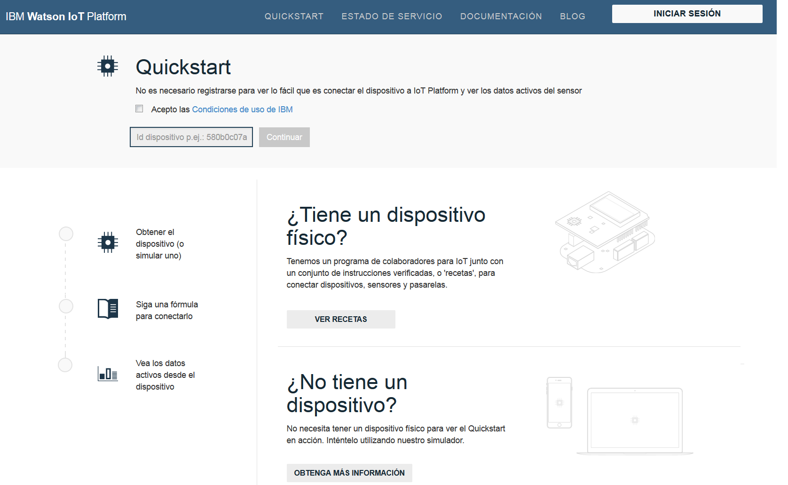

---

copyright:
  years: 2015, 2016, 2017
lastupdated: "2016-09-19"

---

{:new_window: target="_blank"}
{:shortdesc: .shortdesc}
{:screen: .screen}
{:codeblock: .codeblock}
{:pre: .pre}

# Inicio rápido

[Inicio rápido](https://quickstart.internetofthings.ibmcloud.com/#/) es un recinto de pruebas abierto que puede utilizar para conectarse rápidamente a los dispositivos en el {{site.data.keyword.iot_full}}. Si los dispositivos dan soporte al protocolo de mensajería de MQTT, se pueden conectar fácilmente a Inicio rápido.

Para obtener ejemplos, recetas y guías de aprendizaje que explican cómo puede conectar dispositivos distintos al servicio de Inicio rápido, vaya a [Recetas de DeveloperWorks](https://developer.ibm.com/recipes/), como por ejemplo:

- [OpenBlocks IoT BX1G](https://developer.ibm.com/recipes/tutorials/openblocks-iot-bx1g-for-iot-foundation-quickstart/)
- [Bloques reactivos](https://developer.ibm.com/recipes/tutorials/reactive-blocks-and-java-to-iot-foundation-part-1-quickstart/)


**Importante:** Si la instancia de {{site.data.keyword.iot_short_notm}} utiliza el servicio de Inicio rápido, las aplicaciones escalables no estarán soportadas.

## Dispositivos simulados

Además de las recetas y las guías de aprendizaje de Inicio rápido, habrá disponible un dispositivo simulado basado en navegador para dispositivos móviles para que lo utilice para conectar cualquier dispositivo con un navegador web al servicio de Inicio rápido. Para lanzar un dispositivo simulado basado en navegador que se conecta a {{site.data.keyword.iot_short}} desde un teléfono móvil o tablet, abra el URL siguiente:

```
http://quickstart.internetofthings.ibmcloud.com/iotsensor
```

Al conectarse al URL de dispositivo simulado en un dispositivo móvil, se iniciará un dispositivo simulado basado en navegador que se conecta al {{site.data.keyword.iot_short}}. Utilice los siguientes controles de IU para gestionar los sensores:

- Temperatura
- Humedad
- Temperatura del objeto


## Visualización de datos

Para ver los datos que se generan desde el dispositivo móvil, asegúrese de que el dispositivo simulado se ejecute en el dispositivo móvil y, a continuación, inicie la aplicación Inicio rápido. Especifique el ID de dispositivo de 12 caracteres para el dispositivo, que se muestra en la esquina superior derecha de la IU.



A medida que ajuste los valores del sensor en el dispositivo simulado, verá los datos del dispositivo visualizados en tiempo real dentro de la aplicación Inicio rápido, tal como se describe en la siguiente captura de pantalla:


## Demostración de Mosquitto

[Mosquitto](http://mosquitto.org/) es un cliente de MQTT de código abierto de plataforma cruzada que puede utilizar para experimentar con el servicio de {{site.data.keyword.iot_short}}. Después de instalar el cliente de Mosquitto, elija un ID de aplicación y un ID de dispositivo que sean exclusivos. Si los ID de aplicación y dispositivo no son exclusivos, la conexión de prueba puede dar lugar a un conflicto con otro usuario que está completando el mismo procedimiento de prueba de Inicio rápido.

Los valores *appId*, *type_id*, *device_type* y *device_id* no deben tener más de 36 caracteres y sólo pueden contener los siguientes caracteres:
- Caracteres alfanuméricos (a-z, A-Z, 0-9)
- Guiones ( - )
- Guiones bajos ( _ )
- Puntos ( . )

Después de definir el ID de aplicación y el ID de dispositivo, cree una conexión que represente la aplicación utilizando `mosquitto_sub`. Utilice los siguientes ejemplos de `<applicationId>` = myApplicationId y `<deviceId>` = myDeviceId:
```
    [user@host ~]$ mosquitto_sub -h quickstart.messaging.internetofthings.ibmcloud.com -p 1883 -i "a:quickstart:myApplicationId" -t iot-2/type/mosquitto/id/myDeviceId/evt/helloworld/fmt/json

```

Mientras se esté ejecutando el proceso anterior, puede crear el dispositivo. En este ejemplo, conecte un dispositivo de tipo `mosquitto` y, a continuación, envíe dos sucesos al servicio utilizando `mosquitto_pub`, tal como se describe en el código siguiente:

```
    [user@host ~]$ mosquitto_pub -h quickstart.messaging.internetofthings.ibmcloud.com -p 1883 -i "d:quickstart:mosquitto:myDeviceId" -t iot-2/evt/helloworld/fmt/json -m "{\"helloworld\": 1}"
    [user@host ~]$ mosquitto_pub -h quickstart.messaging.internetofthings.ibmcloud.com -p 1883 -i "d:quickstart:mosquitto:myDeviceId" -t iot-2/evt/helloworld/fmt/json -m "{\"helloworld\": 2}"
```
Cuando busque en el terminal de aplicaciones, se mostrarán los dos sucesos que acaba de publicar, tal como se describe en el resultado de ejemplo siguiente:

```
   [user@host ~]$ mosquitto_sub -h quickstart.messaging.internetofthings.ibmcloud.com -p 1883 -i "a:quickstart:myApplicationId" -t iot-2/type/mosquitto/id/myDeviceId/evt/helloworld/fmt/json
    {"helloworld": 1}
    {"helloworld": 2}
```

Eso es todo. Al completar el procedimiento de ejemplo de Inicio rápido, habrá:
- Conectado correctamente un dispositivo y una aplicación al {{site.data.keyword.iot_short}} a través de MQTT
- Enviado un suceso desde el dispositivo al servicio
- Recibido el suceso en la aplicación


## Enlaces relacionados

- [Inicio rápido](https://quickstart.internetofthings.ibmcloud.com)
- [Recetas de DeveloperWorks](https://developer.ibm.com/recipes)
- [OpenBlocks IoT BX1G](https://developer.ibm.com/recipes/tutorials/openblocks-iot-bx1g-for-iot-foundation-quickstart/)
- [Bloques reactivos](https://developer.ibm.com/recipes/tutorials/reactive-blocks-and-java-to-iot-foundation-part-1-quickstart/)
- [Aplicación Inicio rápido](http://quickstart.internetofthings.ibmcloud.com)
- [Mosquitto](http://mosquitto.org/)
