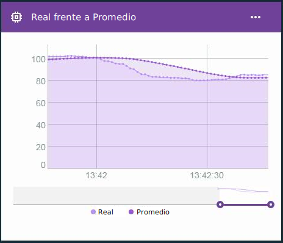

---

copyright:
  years: 2016, 2017
lastupdated: "2016-12-12"

---

{:new_window: target="blank"}
{:shortdesc: .shortdesc}
{:screen:.screen}
{:codeblock:.codeblock}
{:pre: .pre}

# Cálculos avanzados para propiedades virtuales de extremo
{: #im_vir_calculations}

Amplíe los cálculos básicos de propiedades virtuales con fórmulas analíticas de extremo preconfiguradas.
{:shortdesc}

**Importante:** Los cálculos avanzados sólo devuelven puntos de datos de propiedades si los datos para la propiedad seleccionada provienen de un dispositivo que está conectado a una pasarela que tiene Edge Analytics Agent instalado. Una regla de extremo puede utilizar esta propiedad virtual directamente. Para utilizar la propiedad con una regla de nube, una regla de extremo debe enviar el punto de datos a la nube utilizado la acción Reenviar a la nube. Para obtener más información, consulte [Instalación de Edge Analytics Agent](gateways/dashboard.html#edge).

Ejemplo: utilice los puntos de datos virtuales avanzados en una tarjeta de gráfico de líneas para visualizar tendencias de datos con los picos de datos eliminados.  
 

## Fórmulas avanzadas
{: #advanced}

Las opciones de cálculo avanzado incluyen las fórmulas siguientes:

**Consejo:** para algunas de las fórmulas tiene la opción de elegir un periodo de tiempo o un número de puntos de datos que incluir. Si se sabe que los datos fluyen con una frecuencia regular, una ventana temporal puede resultar una buena elección. Si los datos se recopilan esporádicamente o de forma poco regular, puede ser mejor utilizar número de puntos de datos, porque la ventana temporal es difícil de predecir.

<table>
<thead>
<tr>
<th>Fórmula</th>
<th>Descripción</th>
<th>Uso</th>
</tr>
</thead>
<tbody>
<tr>
<td>Average</td>
<td>Devuelve el valor medio para una propiedad a lo largo de un número de puntos de datos recientes o durante un periodo de tiempo reciente.    
Entrada:
<ul>
<li>Propiedad
 <li>Periodo de tiempo o número de puntos de datos en forma de un entero mayor que 0.</ul></td>
 <td>La fórmula AVG proporciona un valor medio de puntos de datos durante una ventana temporal que se mueve constantemente.     Utilice la fórmula Average con una regla para evitar que se activen alertas falsas basadas en datos que contienen picos aislados.    Utilice una tarjeta de gráfico de líneas para visualizar tendencias de datos con los picos de datos eliminados.  
</td>
</tr>
<tr>
<td>Moving Z-Score</td>
<td>Devuelve la diferencia en unidades de desviación estándar entre el punto de datos y el valor de punto de datos medio a lo largo de un número de puntos de datos recientes o durante un periodo de tiempo reciente.    
Entrada:
<ul>
<li>Propiedad
<li>Periodo de tiempo o número de puntos de datos en forma de un entero mayor que 0.</ul></td>
<td>El valor de Moving Z-Score de un punto de datos indica la extensión de una anomalía correspondiente al valor del punto de datos en relación con su promedio reciente. Un valor de Z-Score absoluto alto significa que el valor del punto de datos actual difiere más de los valores de los puntos de datos medios anteriores.
  Utilice la fórmula Moving Z-Score con una regla para activar alertas sobre cambios rápidos cuando los valores de puntos de datos difieren del promedio reciente en lugar de hacerlo cuando el punto de datos supera un determinado valor.
  Utilice una tarjeta de gráfico de líneas para visualizar fluctuaciones en los datos trazando la frecuencia y la magnitud de las desviaciones estándar.
</td>
</tr>
<tr>
<td>Exponential Smoothing</td>
<td>Devuelve el valor medio para una propiedad a lo largo de un número de puntos de datos recopilados disponibles, donde los valores de propiedades antiguas se ponderan exponencialmente menos que los valores más recientes. El peso se controla mediante el factor de ajuste, donde un valor mayor aporta más peso a los valores recientes y menos a los valores más antiguos.  
Puede utilizar el factor de inclinación para ajustar alguna tendencia en los datos. Los valores ajustados exponencialmente reaccionan más rápidamente ante cambios en los datos que el promedio móvil.    
Entrada:
<ul>
<li>Propiedad
<li>Factor de ajuste, como un número mayor que 0 y menor que 1.  
<li>Opcional: inclinación, como un número mayor que 0 y menor que 1.    
 **Consejo:** si no está seguro de si los datos recopilados tienen tendencias, empiece por utilizar un pendiente de 0,5. Dependiendo de los resultados, es posible que desee ajustar el factor.
 </ul></td>  
 <td>La aplicación de un ajuste exponencial a un punto de datos da lugar a un valor medio donde los valores más antiguos pesan menos cuando se calcula el promedio en lugar de cuando se define un periodo de tiempo. En su lugar, se limita el peso de los valores distantes estableciendo un factor de ajuste mayor.
  Utilice la fórmula de ajuste exponencial con una regla para evitar que se activen alertas falsas basadas en datos que contienen picos aislados utilizando todos los datos disponibles en lugar de un subconjunto.
  Utilice una tarjeta de gráfico de líneas para visualizar tendencias de datos con los picos de datos eliminados.</td>
</tr>
<tr>
<td>Box Smoothing</td>
<td>Devuelve el valor medio para una propiedad en función de un rango de puntos de datos centrados alrededor del punto de datos actual.  
Box Smoothing utiliza un número configurado de valores de puntos de datos anteriores y posteriores al punto de datos procesado actualmente para determinar su valor ajustado. En su cálculo, Box Smoothing pondera equitativamente todos los valores de puntos de datos.    
Entrada:
<ul>
<li>Propiedad
<li>Número de puntos de datos por delante y por detrás (anchura media) en forma de un entero mayor que 0.
</ul></td>
<td>La aplicación de Box Smoothing a un punto de datos devuelve un valor medio de puntos de datos durante una ventana temporal que se mueve constantemente y que se centra en el punto de datos que interesa.   **Importante:** dependiendo de la frecuencia de los datos y del valor de anchura media, los puntos de datos devueltos están más o menos retrasados. Por ejemplo, si la anchura media se establece en `5` y la frecuencia de los datos es de un mensaje por segundo, los puntos de datos virtuales devueltos estarán retrasados cinco segundos.   Utilice la fórmula Box Smoothing con una regla para evitar que se activen alertas falsas basadas en datos que contienen picos aislados. **Importante:** tenga en cuenta el retraso de los puntos de datos cuando cree las reglas.   Utilice una tarjeta de gráfico de líneas para visualizar tendencias de datos con los picos de datos eliminados.
</td>
</tr>
<tr>
<td>Gaussian Smoothing</td>
<td>Devuelve el valor medio para una propiedad en función de un rango de puntos de datos centrados alrededor del punto de datos actual, donde los valores de propiedad más alejados del punto de datos actual pesan menos exponencialmente que los valores cercanos.  
Entrada:
<ul>
<li>Propiedad
<li>Número de puntos de datos por delante y por detrás (anchura media) en forma de un entero mayor que 0.
</ul></td>
<td>La aplicación de Gaussian Smoothing a un punto de datos devuelve un valor medio ponderado de puntos de datos durante una ventana temporal que se mueve constantemente y que se centra en el punto de datos que interesa. Los puntos de datos más alejados del punto de datos que interesa tienen menos peso al calcular el promedio.   **Importante:** dependiendo de la frecuencia de los datos y del valor de anchura media, los puntos de datos devueltos están más o menos retrasados. Por ejemplo, si la anchura media se establece en `5` y la frecuencia de los datos es de un mensaje por segundo, los puntos de datos virtuales devueltos estarán retrasados cinco segundos.   Utilice la fórmula Gaussian Smoothing con una regla para evitar que se activen alertas falsas basadas en datos que contienen picos aislados. **Importante:** tenga en cuenta el retraso de los puntos de datos cuando cree las reglas.   Utilice una tarjeta de gráfico de líneas para visualizar tendencias de datos con los picos de datos eliminados.
</td>
</tr>
</tbody>
</table>  
